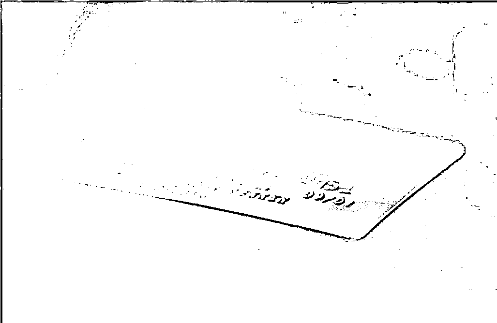

# 警惕黑中介代办信用卡陷阱！

> 原文：[`mp.weixin.qq.com/s?__biz=MzIyMDYwMTk0Mw==&mid=2247526266&idx=3&sn=4d1eead6dc14f7b4cb36dde4c7020320&chksm=97cbac42a0bc255495d2bb7d748817886db20b9871d873f03b8bbfe575f90816e046c9754a93&scene=27#wechat_redirect`](http://mp.weixin.qq.com/s?__biz=MzIyMDYwMTk0Mw==&mid=2247526266&idx=3&sn=4d1eead6dc14f7b4cb36dde4c7020320&chksm=97cbac42a0bc255495d2bb7d748817886db20b9871d873f03b8bbfe575f90816e046c9754a93&scene=27#wechat_redirect)

****“代办高额信用卡”**** 

**“测额度”“百分百批卡”**

**……**

随着信用卡的重要地位愈发凸显

市面上滋生出

**“银行卡黑中介”**这一非法组织

**黑中介打着“代办高额信用卡”的旗号，宣称是与银行有合作的专业机构，实则**利用部分消费者对银行卡知识的缺失，通过伪造收入证明、财产证明等方式，**非法帮助客户获得超过其偿还能力的授信额度，或者是办理假卡，以此骗取客户的个人信息、钱财**，对客户的信用记录、钱财造成严重损害。

为全面加强银行卡持卡人合法权益保护，深化银行卡金融知识普及，同时对银行卡持卡人正当维权的引导，近期，在中国银行业协会银行卡专业委员会的倡议下，银行业联合开展了**“方寸卡片中的金融知识”**主题宣传工作，围绕“黑中介办卡的危害”“用卡常识须知”等方面进行重点宣传，总结了不少经验。**其中，针对“黑中介办卡的危害”，近 20 家银行从黑中介办卡的性质、黑中介办卡的危害、消费者应当如何应对等方面入手，向广大消费者提示黑中介办银行卡的风险。**

****黑中介办卡的危害****

****(一)黑中介会收取高额办卡手续费****

**交通银行信用卡中心风险防范专家指出，黑中介通过精心炮制的虚假资料违规办卡，并以“与银行有合作关系，缴纳一定比例手续费即可成功办理”或“要缴纳相关费用才能使用”为由，收取高额手续费作为报酬。**

****特别提醒：**伪造信息申请信用卡属于欺诈行为，银行业历来严格打击。即使在申请过程中蒙混过关，您在将来的用卡过程中一旦被发现，也会被银行采取相应措施。**

****(二)黑中介会泄露您的个人信息****

**中信银行的宣传案例显示，李先生为办理高额信用卡，向黑中介提供了个人信息，并缴纳了额度的 10%作为佣金，但却一直没有收到信用卡。两个月后，李先生收到了银行的催收短信，才得知信用卡早已办好，但已被黑中介盗刷。**

****特别提醒：**黑中介会要求您提供身份证号码、家庭住址、联系方式、工作单位、账户信息等个人敏感信息，实施伪冒办卡、诈骗等行为，部分黑中介还会私自留存申请人的申请资料，出售给第三方。**

****(三)黑中介可能会办理假卡****

**建设银行的宣传案例显示，客户琪琳在网上看到“专业办理高额度信用卡，3 天保证出卡!”的信息，但对方却要求缴纳 500 元的材料费。琪琳缴纳钱款几天后，确实收到了一张信用卡，但却被银行告知无该卡的信息，她手上的是一张假卡。**

****特别提醒：**注意识别黑中介陷阱，特别是老年朋友切勿轻信黑中介所谓“测额度”“与银行有合作关系”“快速审批”“百分百批卡”“专业办理高额度信用卡”的虚假宣传。**

****(四)黑中介可能会影响持卡人征信记录****

**浙商银行在宣传活动中以漫画的形式展现，部分黑中介会伪造收入证明等申请材料，骗领信用卡或者对卡片进行恶意透支;冒用您的资料申请信用卡或者办理贷款，甚至是出售给他人从事非法活动，这些都会留下不良信用记录。**

****特别提醒：**征信是当今信息社会人们的第二张身份证，渗透在生活的方方面面。个人征信存在不良记录，会对贷款、出行、就业、家庭等造成不良影响。**

****遇到上述“黑中介办卡”问题应当如何应对呢？****

****(一)请您通过银行的正规渠道申请银行卡。**银行不会收取任何办卡手续费，同时会根据您的真实资信情况进行授信。**

****(二)个人信息不要泄露给黑中介**。妥善保管个人证件，注意留意相关授权权限，及时关注卡片动态。**

****(三)不轻信来历不明的电话、短信、邮件和网上的广告信息**，务必通过正规渠道了解金融信息、办理金融业务。**

****(四)多学习了解银行卡知识**，增强防范意识并妥善采取保护措施，警惕信用卡黑中介。**

****(五)**一旦遇到卡片盗刷、黑中介诈骗等情况，立**即联系银行对卡片进行挂失等处理，并及时向公安机关报案**。**

**来源：金融时报、中国人民银行、巴蜀反诈**

****

**← 向右滑动与灰产圈互动交流 →**

****