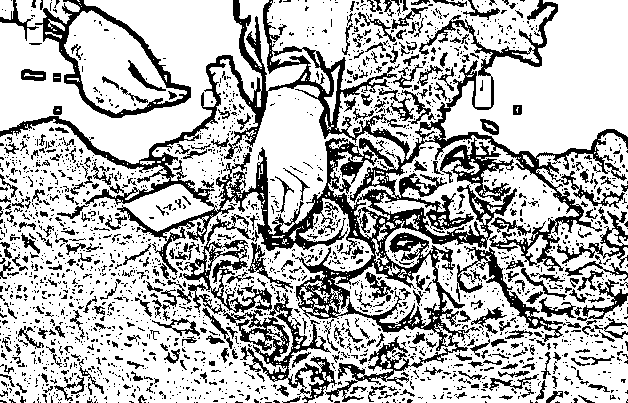

# 深扒幽暗世界的“摸金校尉”，一单 1200 万

> 原文：[`mp.weixin.qq.com/s?__biz=MzIyMDYwMTk0Mw==&mid=2247526333&idx=1&sn=884ab6b7182d7c6d2118f75075a356dc&chksm=97cbac85a0bc259380e0bfd6df6919ea4745b71094edcdbf14a1104a192041d7f520d82ee2f9&scene=27#wechat_redirect`](http://mp.weixin.qq.com/s?__biz=MzIyMDYwMTk0Mw==&mid=2247526333&idx=1&sn=884ab6b7182d7c6d2118f75075a356dc&chksm=97cbac85a0bc259380e0bfd6df6919ea4745b71094edcdbf14a1104a192041d7f520d82ee2f9&scene=27#wechat_redirect)

广袤悠久的文明、黄土深埋的古墓、与棺材为伴的珍宝……近年来，天马行空且场面恢弘的“盗墓”题材影视作品可谓大领风骚。

图源：央视纪录片《海昏候》 

与此同时，网络上对“盗墓”的话题讨论也将神秘而诡谲的“盗墓倒卖文物”黑产链条再次牵引出水面。

在巨大的利益驱使下，一波文物犯罪团伙趋之若鹜，挑战法律的底线，违法盗墓、倒卖文物。

那么，文物犯罪团伙是如何发现深埋在黄土中的宝藏？又是如何躲避法律监管，将它们送入市场获得暴利的呢？

现实版“摸金校尉”

躲藏幽暗世界中

钻研文献资料、以风水寻墓，还会运用卫星地图、地址勘探仪器等技术……这些融合了浓厚神秘色彩与高科技含量的盗墓场景，就是近期安徽公安侦破的安庆“5·31”特大盗掘、倒卖文物里，涉案团伙盗墓时的真实写照。

图源：安庆市公安局

一处土坑深挖出 61 人的“盗墓网”。 

2020 年，安庆警方在当地山上发现一处土坑，存在古墓被盗现象。随着侦查逐渐深入，一张盘根错节的“盗墓网”开始浮现。随着“挖出”的案情愈加复杂重大，该案成为安庆市近 70 年来涉案人员最多、涉案地点最广的系列盗掘古墓葬案件。

警方最终抓获犯罪嫌疑人 61 名，追缴各类文物 1696 件，查获地质勘探仪器、探钎、铁锹、雷管炸药等大量作案工具。

一处在建楼盘竟是大型古墓葬现场。

2021 年，江苏警方收到一段疑似工地盗墓的视频举报，警方赶往当地一处在建楼盘，经鉴别发现，此处即为一个被破坏的古墓葬现场，盗墓者至少已经破坏了五六十个墓葬。盗墓者通过专门的聊天群获悉哪处古墓信息，随后伪装成收废品的人出入建筑工地，伺机挖掘古墓。

经数月努力，警方追回在这个古墓葬群中被盗掘、转卖的珍贵文物。同时也将这个隐藏在该市多年的文物犯罪团伙一网打尽。

盗墓倒卖文物现象，从古至今屡禁不止。坐地生金、一本万利的暴利黑产，撩拨各路不法分子蠢蠢欲动。

顺着案件继续往下看，文物倒卖“黑产”才缓缓展开。

盗掘古墓、倒卖文物犯罪链条

团伙昼伏夜出、流窜作案

盗墓，已是一个国际化的灾难。

**联合国教科文组织的高级顾问霍顿指出，全球地上和地下的文物交易额仅次于毒品和武器交易。**

而在中国的所有流失文物中，盗墓的获得比例极大。盗掘古墓、倒卖文物已形成“探、掘、盗、销”的专业化、链条化文物犯罪链条。

盗墓团伙分工明确，一般称为“一锅儿”，其中一般分为“掌眼”“支锅”“腿子”和“下苦”四个不同的等级。

**“掌眼”**：具有找寻古墓和鉴别文物的能力，负责策划、鉴别和出售。

**“支锅”**：负责盗墓前期投入的资金、设备，以及后期工人的工资。

**“腿子”**：盗墓活动中的技术工人，成熟与经验使他们大多成为老板的亲信。

**“下苦”**：是干活的主力，要抡铲探眼，还要钻进盗洞，收入最低廉。

盗墓团伙成员预谋时间长、作案时间短，且昼伏夜出、流窜作案。虽然相互勾结，但成员并不固定，作案类似“项目制”，找到墓了再拉帮结伙。

为了盗墓成功，盗墓不仅会利用钢钎探墓等一些“传统手段”；舍得花费数万元高价租用地质勘探仪器定位地下空洞位置；甚至还会研究各种文献资料，从中寻找古墓所在地的线索。

可惜的是，若盗墓团伙把这份“用心”用在文物保护和文化研究上，或许真能有所建树。然而“心术不正”最终逃不过自取灭亡的结局。

被盗文物黑市洗白

走私出境坐地生金

文物到手后，“支锅”最关心的就是尽快找到安全稳妥又出手大方的买家。

一部分盗墓文物经黑市洗白，成了“不菲藏品”。

文物流向地下市场后，经过把关和定价，便可辗转卖出。谨慎的“支锅”一般会避开本地市场，他们在外地有自己固定合作的收购商。只要不在盗墓现场被抓到，一旦文物进入流通市场，便很难找到出自盗墓者之手的证据。

而心知肚明的收购商也会寻找下家迅速出手。经过几次转手之后，盗墓罪证便成了文物流通市场上光明正大且价值不菲的“藏品”。

另一部分贵重文物经走私出境，镀金提价。

为了隐秘而快捷地卖出文物，一部分尤其贵重的文物会被通过走私流向国外。

**倒卖速度有多快？**

据说盗出文物一小时就能出手；三天可通过两次倒手文物出境。一旦文物出关，盗墓者就可以永远逍遥法外。

当文物进入国内市场流通前，文物商和拍卖行还会用各种以假乱真的故事与传说，给文物“镀金”，既赋予了其正当来源，又提高了身价。

如此一来，被盗文物经过支锅-文物商-海外文物市场-海外拍卖行-国内拍卖市场等一系列交易流程后，合法地以天价被顶级藏家收藏。

那么，文物犯罪团伙的收益如何呢？

**盗墓的利润由墓内的文物数量与质量来决定。**

 以支锅为例，如果是一套完整的唐墓“十大件”陶俑陪葬品，支锅可以获利几百万元。单件文物则以质论价，基本可以保障上百万元的收益。

一个“掌眼”月薪可达到万元以上，而有经验的“腿子”发现一个墓坑可获得数百或上千元。

底层农民出身的“腿子”与“下苦”们的收入远无法达到最终交易额的百分之一，但由于信息、知识和社会关系的不对等，使他们难以逾越这条隐形沟壑。

珍品被损坏遭贱卖

赝品交易额达千万

随着政府监管力度日益加大，一些“支锅”通过开办小砖场、采石场等作坊式企业来掩人耳目。得手之后迅速撤退，只留下围墙内千疮百孔的地面。

令人心痛的是，盗墓使得大批珍贵文物流出中国。此外，大量精美文物因为盗墓团伙的粗暴盗掘而损坏，之后又因残破而被潦草贱卖。

图源：新华社 

而那些随葬品已被盗走的空古墓，也正成为一些人谋利的道具。

一些人专门购卖高仿文物，重新放回空古墓中再回填。警方在侦破案件中发现，部分赝品交易额甚至单件达到 1200 万以上。真古墓里挖出假文物，这样的骗局，已经屡见不鲜。

暴利驱使下，非法文物市场混乱又亢奋，暴利刺激着不法分子不顾生命安全、不顾法律底线“拼死一搏”。

近日，中央全面深化改革委员会第二十二次会议，审议通过了**《关于让文物活起来、扩大中华文化国际影响力的实施意见》，发出了提升文物改革事业新高度的重磅信号。**

**让文物活起来，当务之急要保证文物的安全****。**只有人人知法律、守法律，文物才会不再受伤和流失。若为了满足一己私欲私自盗掘墓葬，一定会面临法律的严厉制裁。

**盗墓者的铲子**

**铲断的终究是自己的归路**

**莫让利益冲昏头脑**

**亲手书写“绝命之笔”**

参考文献：

新华社《这几伙会“法术”懂技术搞学术的盗墓贼落网了！》

中央政法委长安剑《白天捡垃圾，晚上盗墓！56 座古墓被破坏》

← 向右滑动与灰产圈互动交流 →

