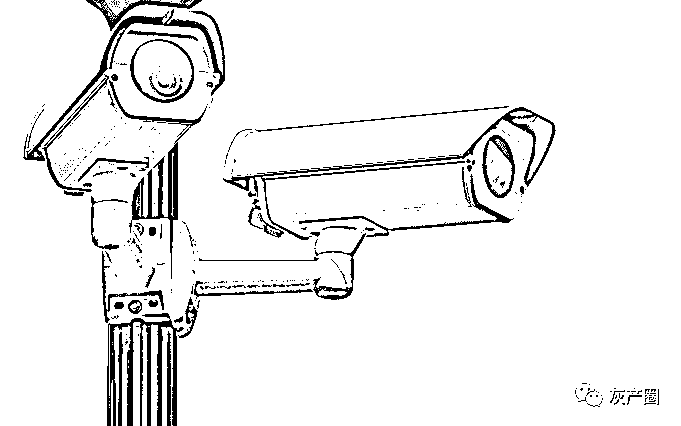
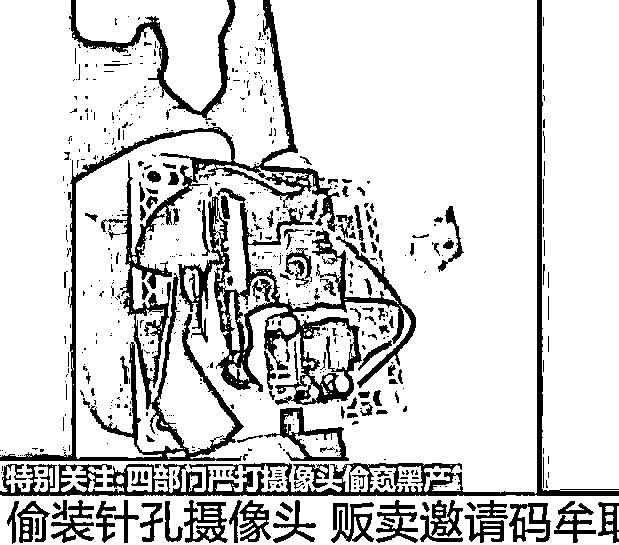

# 女子洗澡被直播浑然不知，上百人“围观”！

> 原文：[`mp.weixin.qq.com/s?__biz=MzIyMDYwMTk0Mw==&mid=2247526333&idx=2&sn=e41671739c78db0dbbcd874ee3d17908&chksm=97cbac85a0bc2593ba858e2ad5c717faba2e6f64d7e9d669983cb29bfffad21fa117c025f7a3&scene=27#wechat_redirect`](http://mp.weixin.qq.com/s?__biz=MzIyMDYwMTk0Mw==&mid=2247526333&idx=2&sn=e41671739c78db0dbbcd874ee3d17908&chksm=97cbac85a0bc2593ba858e2ad5c717faba2e6f64d7e9d669983cb29bfffad21fa117c025f7a3&scene=27#wechat_redirect)

12 月 10 日凌晨 2 点，**一位女士走进浴室脱衣服洗澡。殊不知，浴室上方的排风口处，暗藏着一个摄像头，正在运转。**

这是记者在某聊天群看到的一段偷拍直播刚开始的画面，想要继续观看就要交钱进入直播群。**当时尽管已是深夜，仍有上百人待在直播群中对这位女士“静静围观”。**

近年来，摄像头的运用越来越广泛，很多人在家中安装了摄像头。然而，这一市场被一些不法分子盯上，他们利用黑客技术破解并控制家用摄像头，将监控摄像头改装成偷拍设备，出售扫描破解摄像头软件，或将摄像头偷偷安装到宾馆房间、出租屋等场所，并将偷拍到的隐私画面进行售卖牟利。更有甚者，通过手机或改装的设备，在厕所、地铁、公交等地进行偷拍。**在某大型聊天群中，还出现售卖全国多个城市“厕拍地图”的情况。**

事实上，国家相关部门近年来一直在不断加大对偷拍及非法销售相关设备的打击力度。在法律和执法的刚性之外，不少防偷拍的技巧和软件设备应运而生。销售设备者、偷拍者与打击和防范偷拍的较量，一直在进行。

▲图片来源：央视新闻截图

设备销售由明转暗

改装定制五花八门

随着相关部门的持续打击，线下买卖针孔或微型摄像头的生意比之前收敛了不少。 

“你是想买针孔摄像头吧？这东西是违法的，不让卖，你去别的地方问也一样。”12 月 14 日，记者前往天津市某大型数码广场咨询针孔或微型摄像头销售情况，一店家这样明确回复。

随后几天，记者走访了天津市多个数码城以及街边电脑维修、监控安装等店铺，大多数店主听闻后均直接给予否定回答。

与线下销售情况不同的是，线上售卖偷拍摄像头的生意却风生水起。这桩关于偷拍的生意正在由明转暗，黑色产业链仍在暗流涌动。

在多个电商平台进行搜索后，记者发现有许多“拐着弯”售卖针孔或微型摄像头的店铺：**打火机、U 盘、带夜视功能的车钥匙、高清录像式眼镜、充电宝，甚至洗面奶、电子闹钟、剃须刀、蓝牙音箱、万年历等日常用品都被改装成摄像头成为偷拍设备。**卖家称，这些摄像头可以超长待机，还能远程监控。

有卖家告诉记者，这些“日常用品”不容易被人注意到，因为它们的基本功能不受影响，价格在几百元至两千元。

一位手机摄像头定制卖家称，改装后的手机看上去和普通手机没有差别，摄像头位置在耳机、侧面等处，即使将手机平放在桌子上，也可以清楚地拍到旁边的物品，这种手机售价一两千元。如果买家将自己的手机邮寄过去改装，只需要 120 元，**“这种改装手机主要用于地铁、楼梯、厕所等地的偷拍，很少有人发现”。**

除了售卖偷拍设备外，记者调查发现还有人出售摄像头 ID，花一两百元可以买几百个 ID。如今，很多家用摄像头密码都未作修改，采用初始默认的用户名和密码，如果有人获得这些摄像头 ID，就可以观看监控视频的实时画面。

在某聊天群中，**有的卖家宣称只需花 220 元就可以购买并观看 30 台家庭对床、家庭厕所、SPA 按摩店、更衣室、酒店的摄像头，**320 元可购买 60 台，420 元可购买 100 台。价格越高，摄像头的位置就越来越私密、越来越有针对性，甚至包括出租屋、舞蹈室、幼师休息室等地。

记者从专业人士处获知，上述卖家的“操作秘诀”是：利用监控摄像头的漏洞，针对具有弱口令的设备进行全网扫描，并使用带有手机木马的软件程序对监控摄像头进行非法越权访问，从而远程控制监控摄像头，实现在线观看和回放监控视频的功能。这种情况往往发生在用户名与密码设置简单、山寨或者小品牌产品上。

还有的卖家“躲在国外”规避风险。一位网名为“鱼先生”的卖家销售各种针孔摄像头，为了规避风险，他发展了不少负责放货的“下线”。记者花 300 元购买了一款 U 盘式针孔摄像头，结果次日被告知，负责发货的下线“可能被抓了”，但他并不担心自己被“供出来”，因为他“不在国内”。

在支付方式上，一些卖家也尽量避免直接转账支付，大多使用口令红包形式。

记者发现，除了偷拍设备外，还有一些可被用作偷拍的 App。比如“安全相机”，其拥有强大的隐秘拍摄功能，支持在用户手机锁屏以及后台运行拍摄的功能，支持无声拍照、后台摄像，而且所拍的照片或者视频全部支持私密保存。目前，该应用已在各大应用商场下架。

偷拍群体十分庞大

图片视频明码标价

究竟是哪些人在偷拍？记者卧底多个聊天群发现，目前偷拍群体已经越来越细化，且分工明确：有专门进行厕拍的，有专门拍宾馆的，还有偷拍直播的。

这些聊天群，少则数十人，多则数万人。记者加入的一个境外群有 3 万多人，每天有大量成员进群或退群。有的聊天群在售卖全国多个城市“厕拍地图”。有群主告诉记者，**他手上有全国各地大中小城市的“宝地”，很多都通过了“验证”。所谓宝地，就是便于在厕所偷拍且不容易被发现的地方；验证则是指有人在这里的厕所偷拍并上传了视频图片**。

记者注意到，这些群十分活跃，群成员分布在全国各地，许多人会在群里寻找“伙伴”一起去偷拍，或者分享“宝地”。他们偷拍的对象不只年轻女性，男性、老年人都可能成为他们的“猎物”。

据群里一位偷拍者介绍，一些小城市的县城“很适合厕所偷拍”，因为这里的老式厕所较多，门板空隙较大，而且保洁人员不会频繁打扫。“我曾进入女厕所偷拍了好几次，都没被人发现。”

记者花 50 元购买了一份某地的“厕拍地图”，**发现上面的每个地点都标注着详细的注意事项，比如“采光好，注意保洁”“外面人可以随便进，抓得不严”“上午 11 点到下午 2 点保洁不上班”等。**卖家还承诺，如果今后有更新会及时告诉记者，如果记者手里有好的厕拍“宝地”，也可以告诉他。

记者询问某群管理员得知，进入录播群需要交 200 元费用，里面包含 2016 年到近期的完整录像。直播群内，偷拍的地方不同，价格也不同，一般是 200 元至 500 元，买家可以花钱指定偷拍的地方进行直播观看；付款后，下载对方提供的软件，登录账号就可以看到指定地方的具体场景。

很多偷拍者并不是通过国内软件，而是通过国外社交软件匿名交流，大多数人通过缩写、代号、发语音等方式规避“偷拍”“针孔摄像头”等关键词。如果有资源需求，则只能通过私聊或者私信群主的方式。

还有一类专门偷拍别人走光的群体，他们通过掀裙的方式拍摄隐私部位。记者发现，该款国外社交软件目前已经累计有 9 万“粉丝”，新进群“粉丝”可以领取 100G 福利视频图片。

**偷拍的地点不限于宾馆、更衣室、厕所，还有人会借维修下水道等理由或者偷偷进入出租屋安装偷拍设备，还有专门在飞机上拍摄空乘人员、在学校拍摄学生的偷拍群。**

偷拍获得的图片或视频被用来大肆牟利。在多个聊天群内，这些图片或视频被明码标价，只要几元至几百元不等，就可以观看成百上千部“作品”；也可以一次性交纳 88 元、128 元或其他金额进入 VIP 群，不仅可以看到现在的资源，以后更新的资源也可以免费观看；如果带着自己的“原创作品”来，还可以免去入会费。

治理力度有待加大

黑产业链亟须斩断

面对隐秘而强大的偷拍产业链，对于个人来说，增强防偷拍意识、掌握防偷拍技巧至关重要。

公开资料显示，目前主要流行 4 种查找小型摄像头的反偷拍技巧：拉上窗帘，关闭灯光，用手机摄像头拍一圈寻找红光；下载各种反偷拍 App 进行检测；购买信号探测器进行检测；利用热成像仪或其他专业反偷拍设备。

记者注意到，有第三方评测机构对上述反偷拍技巧进行测评后的结果显示：由于大多数偷拍者已改用不反光也不发射红外线的摄像头，加上藏匿摄像头的地方越来越隐蔽，导致第一种防偷拍技巧基本失效。那些反偷拍 App 和信号探测器的“防偷拍”噱头更突出，实际作用不大。而热成像仪虽然效果不错，但成本很高，一个热成像仪要数千元，效果更好的反偷拍设备要数万元以上，有些摄像头还需要特定的设备才能检出。

近年来，国家相关部门一直在不断加大对偷拍及非法销售相关设备的打击力度。

我国刑法第二百八十三条规定，非法生产、销售专用间谍器材或者窃听、窃照专用器材的，处三年以下有期徒刑、拘役或者管制，并处或者单处罚金；情节严重的，处三年以上七年以下有期徒刑，并处罚金。

哪怕只是安装类似设备，也可能涉嫌触犯法律。**我国治安管理处罚法第四十二条规定，偷窥、偷拍、窃听、散布他人隐私的，处 5 日以下拘留或者 500 元以下罚款；情节较重的，处 5 日以上 10 日以下拘留，可以并处 500 元以下罚款。**

2021 年 5 月至 8 月，中央网信办会同工业和信息化部、公安部、市场监管总局，在全国范围开展摄像头偷窥黑产集中治理，公安机关共抓获犯罪嫌疑人 59 名，收缴窃听窃照器材 1500 余套。

12 月 2 日，江苏常州警方通报打掉一个摄像头偷拍背后的黑色产业链，抓获犯罪嫌疑人 37 名，遍布全国 14 个省市。

常州市经开公安分局网安大队民警陈思雨告诉记者，**对于宾馆内部安装摄像头偷拍的，按照非法使用窃听、窃照专用器材罪处理；对于单纯销售，交换家庭摄像头账号的，按照非法控制计算机信息系统罪处理。**

为治理有问题的 App，工业和信息化部近日组织对 18 家具有行业代表性的视频监控云平台开展检查，发现处置越权操作等一批高危漏洞；全面排查联网摄像头存在的安全隐患，发现 4 万多个弱口令、未授权访问、远程命令执行等摄像头漏洞，取证并处置 500 余个。

在中国政法大学传播法研究中心副主任朱巍看来，**酒店等场所的管理人，应当履行安全保障的义务。**反偷拍设备成本对消费者来说很高，但对酒店而言成本较低，酒店在开房前后可以自纠自查，在酒店中发现针孔摄像头后要对相关人士进行罚款等处罚。相关部门也应加强酒店等偷拍重灾地的保障工作检查，让针孔摄像头无所遁形。

受访专家认为，平台对微型、迷你摄像头尤其是可能用来偷拍的摄像头的上架销售，负有“应知”或“明知”的法律责任；卖家也需对此承担主要责任。如果买方购买设备后将其用作窥探他人隐私、录屏或传播出去，则要根据具体用途认定，可能承担民事或刑事责任。核心的一点是，相关设备有没有实质性的正当用途。

“平台和相关监管部门要通过关键信息筛查等方式，加强监测，斩断偷拍产业链。”朱巍说。

来源：法治日报、光明网、阻击诈骗

← 向右滑动与灰产圈互动交流 →

