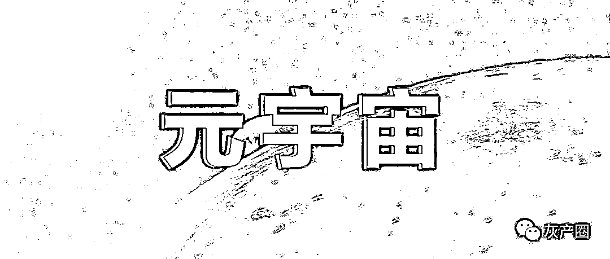
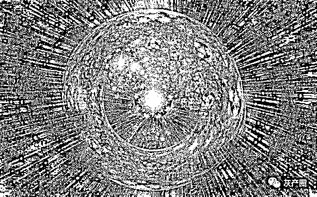
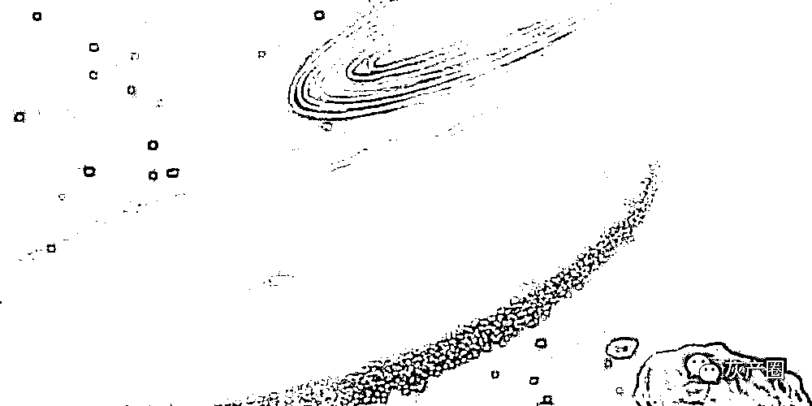

# 玩元宇宙游戏“躺着赚钱”？业内人士：警惕游戏中暗藏骗局

> 原文：[`mp.weixin.qq.com/s?__biz=MzIyMDYwMTk0Mw==&mid=2247526333&idx=3&sn=be4310c8d9cbc67a64e982ef81a787c5&chksm=97cbac85a0bc25937b6963e5e74caf5bb809fd6e0a798034bb098020d7f42562bd778bbc2db4&scene=27#wechat_redirect`](http://mp.weixin.qq.com/s?__biz=MzIyMDYwMTk0Mw==&mid=2247526333&idx=3&sn=be4310c8d9cbc67a64e982ef81a787c5&chksm=97cbac85a0bc25937b6963e5e74caf5bb809fd6e0a798034bb098020d7f42562bd778bbc2db4&scene=27#wechat_redirect)

****

在人们还弄不清什么是元宇宙的时候，一些区块链游戏已经搭载上元宇宙的概念重新收割用户。北京青年报记者采访中了解到，“元宇宙区块链游戏”(以下简称“链游”)被一些商家宣传成能够“躺赚”的游戏，月收益甚至达到 100%。

而业内人士表示，这类游戏不仅暗藏庞氏骗局，由于要用虚拟货币结算，其本身或可能已经涉嫌非法集资或金融诈骗。

**游戏与赚钱挂勾**

**搭上元宇宙概念**

**“链游”声称能“躺赚”**

近期，元宇宙如同一股强劲的龙卷风入侵，不仅席卷了整个科技圈，资本市场也深受影响。一些游戏公司更是靠着元宇宙的概念股价大涨。

就目前情况来说，游戏可以说是元宇宙的一个雏形，元宇宙也为游戏的内容创作带来了更多创新与惊喜，就像电影《头号玩家》一样，可以极大地满足用户的体验感，各大厂也纷纷布局元宇宙概念。

在众多民众还没有弄清到底什么是“元宇宙”时，一类声称能“躺赚”的“链游”进入大众视野，在网络上还有不少鼓吹玩此类游戏能够暴富的推广与教学视频，其中“3 天就能回本”、“每日躺赚 7 万”、“客户已资产翻倍”、“强制暴富新方式”等直白的广告语，让游戏和赚钱挂了勾。

北青报记者注意到，这些“链游”的服务器大多在境外，不少论坛和社交媒体上有此类“链游”如何能在国内玩的教学以及软件，也有人专门将代玩这类游戏当成了生意。还有号称可帮客户托管资金、代打游戏的“中介”，把自己包装成“元宇宙投资老师”，他们的朋友圈里经常是其“代投资”的成功案例。一些人称投资 30 万元，两周赚了 14 万，有的甚至宣称其月投资收益能达到 100%。

当然这些“收益”也不是白来的。以“农民××”这款游戏为例，中介首先要收取 6000 元服务费，为用户开账号，随后用户要付给对方本金让其协助兑换虚拟货币，用于购买游戏币。此外，该游戏产生的收益，中介要提 20%的费用。

北青报记者注意到，所谓元宇宙链游游戏与普通游戏一样，大多是网页版游戏，很多构架像早期经典模拟经营游戏“虚拟人生”。游戏操作也简单，按中介的话就是“购买相关工具”，点击按键将游戏放置一段时间，即可获得“收益”。

**声称可控制收益**

**打着游戏名义发行虚拟货币**

**涉嫌非法集资及金融诈骗**

这种游戏真的能挣到钱吗？浙江的张女士在接受媒体采访时表示，她曾经玩过一款叫“幸运石生肖”的区块链游戏，号称投资 5000 元，6 天就有 12%收益。

她玩了 4 个月后游戏无法登录，自己血本无归。江苏的莫先生是一款区块链宠物养成游戏“龙凤呈祥”的玩家，仅玩了 3 天平台就关停了，他被骗 5000 多元。

事实上，这类游戏的搭建并不复杂。北青报记者以买家的身份联系上河北一家游戏搭建公司，对方表示，这里有很多“链游”的模板，有的可以直接“模仿”目前大热的几款境外“链游”。对方向北青报记者发来一款已经搭载好的“链游”，游戏只有简单几个页面，用于抽卡、集人物和对战等。这样一个“链游”的搭建需要十几万元到几十万元不等。游戏搭建公司表示，游戏可以在后台设置游戏币的增发、实时变更虚拟币与游戏币兑换比例，“也就是可以控制收益”。

北青报记者注意到，不仅游戏数据本身可以“造假”，有的所谓元宇宙游戏开发公司就是打着游戏的名义“发行”自己的虚拟货币。

此前上海一种名叫“ME”的虚拟币被曝光。发行公司称未来的元宇宙将使用它作为货币。该公司称“ME”币数量有限，全球仅发行 2100 万枚，如果现在投资，40 天可以翻 18 倍。但是中国人民银行早在 2017 年就已经发布公告，所谓虚拟货币，在本质上都是未经批准的非法公开融资，这种行为涉嫌非法集资以及金融诈骗。

**玩家面临风险**

**部分“链游”疑似庞氏骗局**

**可能一夜之间血本无归**

一位从事区块链研究的人士表示，目前，链游的赚钱逻辑很简单：用户将现实中的货币兑换成指定的虚拟币，再通过虚拟币购买游戏发行的游戏币，用游戏币购买游戏中的装备、土地等。游戏公司通过数据让游戏中的道具或物品增值，再由游戏中的玩家相互买卖，以此形成增值。

该人士表示，对于用户来说，其中有两大风险，最明显的是他们不知道游戏公司是否真的绑定了某个标的物，或“NFT”(非同质化代币)，并依靠该标的物形成的数据进行增值。“简单说，就像你以为自己买了一块可升值的玉，但最后你发现买的其实是块玻璃。”因此有的链游就像庞氏骗局，用后来者投入的钱给前面的人补利润，游戏公司赚得差不多了，就卷钱跑路。

即使是游戏公司确实绑定了某种标的物，但还有很多的环节是会产生问题的，比如说游戏公司发行的游戏币或虚拟货币本身，就一定只涨不跌吗？

“链游”玩家需要购买“以太坊”、“AXS”、“WAXP”等虚拟币用来购入价格不菲的道具，才能通过游戏赚钱。此前，狗狗币一夜之间有 1000 倍的增长，但就因为马斯克的一条推特直接跌落神坛，随后这种虚拟货币就跟随马斯克的言论或涨或跌，极不稳定。此外，虚拟货币在我国没有合法身份，出现问题很难维权。

不仅如此，很多“链游”的服务器在境外，一些国家也加大了对这些游戏的打击。有的游戏可能一夜之间就无法登入，投资者直接血本无归。

来源：北京青年报，巴蜀反诈

← 向右滑动与灰产圈互动交流 →

