# 坑过你的 P2P 要退款了？假的！

> 原文：[`mp.weixin.qq.com/s?__biz=MzIyMDYwMTk0Mw==&mid=2247526333&idx=4&sn=12198bf960638e2e2c93e3faffdca8a4&chksm=97cbac85a0bc2593c573cf53df4944734b025d1ab420b036108ee01069b1d85ed7289de2d2ad&scene=27#wechat_redirect`](http://mp.weixin.qq.com/s?__biz=MzIyMDYwMTk0Mw==&mid=2247526333&idx=4&sn=12198bf960638e2e2c93e3faffdca8a4&chksm=97cbac85a0bc2593c573cf53df4944734b025d1ab420b036108ee01069b1d85ed7289de2d2ad&scene=27#wechat_redirect)

P2P 投资已成为过去时，但不少当时的投资者，还在等待平台清退兑付。

骗子又盯上了这个“时机”，用上了新的招式：**冒充爆雷的 P2P 平台来退款**。

骗子冒充平台客服用短信、邮件联系投资者，称要给他们退款，提出加微信群、QQ 群，随后实施诈骗。

目前，此类案件在全国多地发生，多地警方发出预警。

**12 月 12 日**

****张家港警方**发出预警**

**警方预警** 

近年来，P2P 投资平台出现“爆雷潮”，投资人无法提现，被骗受损较大，严重影响了金融秩序和社会稳定。近期，部分不法分子又冒充 P2P 投资平台客服，以“清退回款”为由向投资人实施二次诈骗，导致投资者再次上当受骗。一、典型案例 1、2021 年 11 月 30 日 8 时，刘某银在网上看到一个关于合盘金服退款的广告，其添加 QQ 群号后群内客服下发链接，让其下载澳门永利国际的平台，后刘某银按照平台客户的要求进行操作投资，被骗 15417 元。2、2021 年 11 月 21 日 11 时，犯罪嫌疑人联系现住泰兴市的谢某，谎称谢之前在“草根投资”上投资的钱进行回款，骗谢按其指示通过网银转账的方式从名下的农业银行卡内向其提供的工商银行卡内转账 90526 元。二、警方提醒请广大群众提高防范意识，尤其是投资受损群体，不要病急乱投医，关注官方通报信息，不要轻信不法分子回款谎言。

**12 月 17 日，** 

**杭州警方发出预警** 

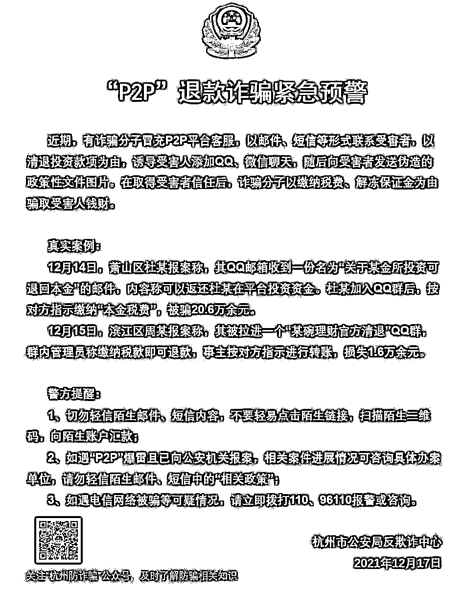

**骗局解析**

**民警分析**：这一骗局，是利用了 P2P 投资者急于兑付的心理，骗子伪装发布退资消息，主动联系投资者，以注资才能回款、缴纳税款等名义诈骗，还有的诱导投资者下载某个平台软件，一些投资者再次受骗。

**骗子还冒充警方发布通告，实施诈骗**

今年 7 月，曾爆出骗子冒充警方发布通告，实施诈骗。 

比如看这则通告内容： 

“近期，有不法分子假借某些 P2P 公司名义，打着落实国家清退政策的旗号，以私兑回款为由，骗取投资人的身份和投资信息后，引导下载快三，北京 28 之类的赌博平台，骗取投资人的钱财”。 

在该通告中还作出了提示，“关于 XX 公司的资金清退和回款兑付工作，目前我市只对接了深圳达晨创投数字区块链交易所进行本息回款兑付工作，目前 XX 投资官方回款工作对接企鹅群向出借用户公示:16247833X……”，落款为：北京市公安局反诈中心。 

是真的吗？

假的！ 

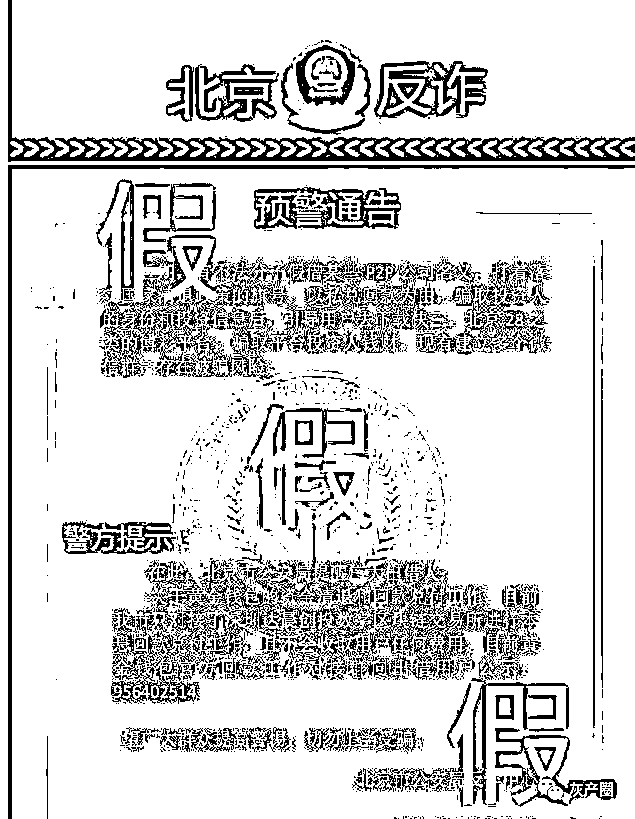

相类似的通告出现在其他地方，已经被多地警方辟谣。

**这些也是假的**

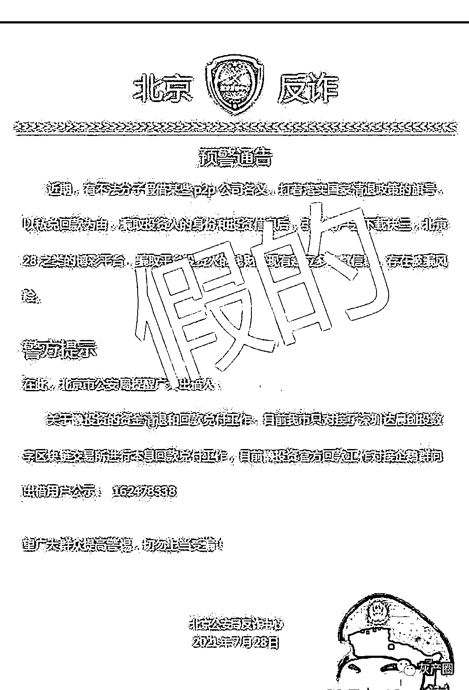

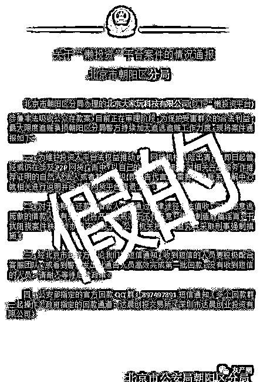

骗子们这波操作，经过精心的谋划，环环相扣，让心急的投资者以为可以拿回钱了，不料却再次掉进陷阱。 

**这类骗局，主要有这几步**

**1、伪造文件、公告，让你以为可以拿回钱** 

骗子伪造红头文件或者公告，网上发布消息或发邮件、发短信等方式，谎称 xx 公司正在组织办理清退回款手续，让大家加请退群，或 QQ、微信等。 

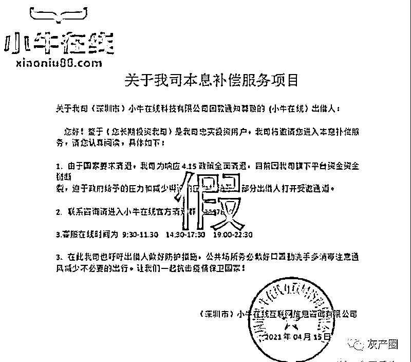

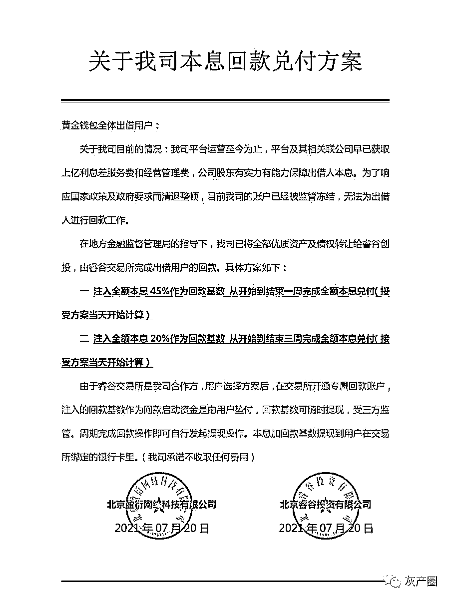

**2、几种回款方案选择，说来说去就是让你转账**

投资者想快点拿回本金，看到后，加群。

骗子与投资者取得联系，提供回款方案。 

各种所谓的回款方案，只是个噱头，唯一目的是让你注资。骗子还会说，只有注资转账了才能给你分批返还之前的资金，比如即刻性方案，让你注入操作资金，每日提现，兑付比例在 5：1；或者周期性方案，周期五到十天，要注入 45%资金；或者一次性方案，先公司垫付启动资金完成全额本息兑付，完成后提现要缴纳 20%个人所得税，等等。 

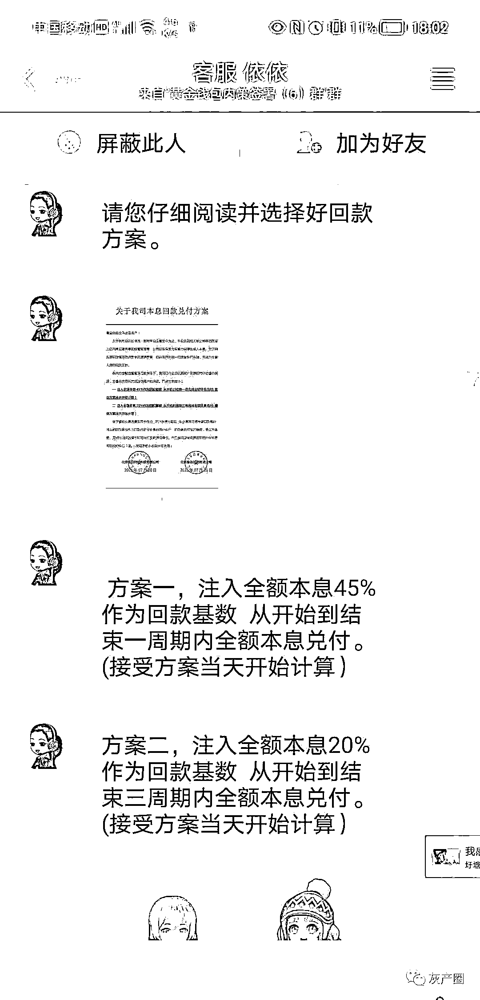

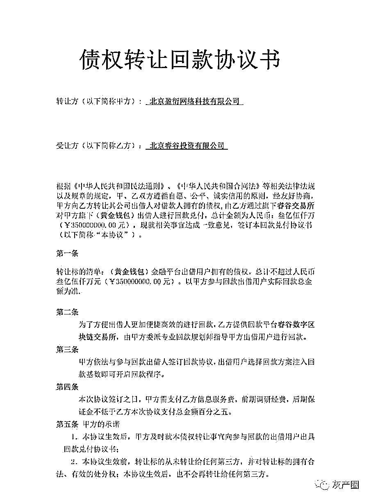

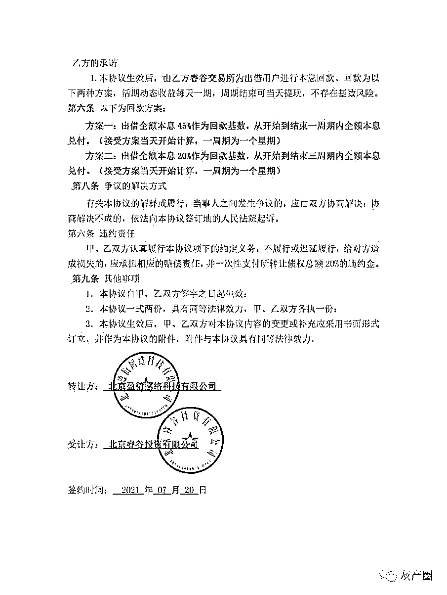

**3、为了诱导你去骗子搭好的平台，再次搬出伪造公文**

骗子会用话术，诱导投资者一步步进行回款操作。

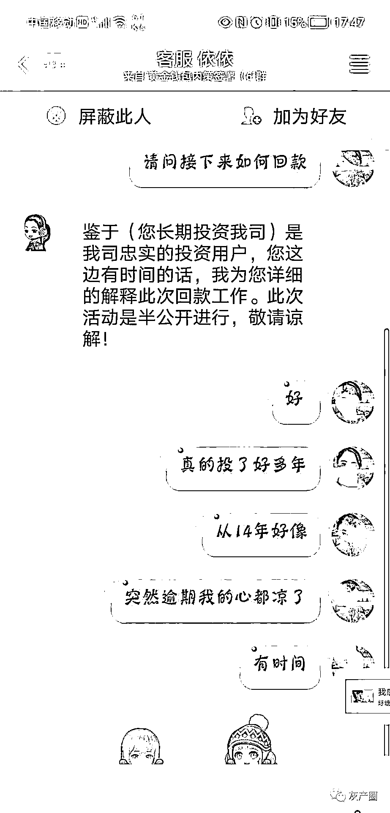

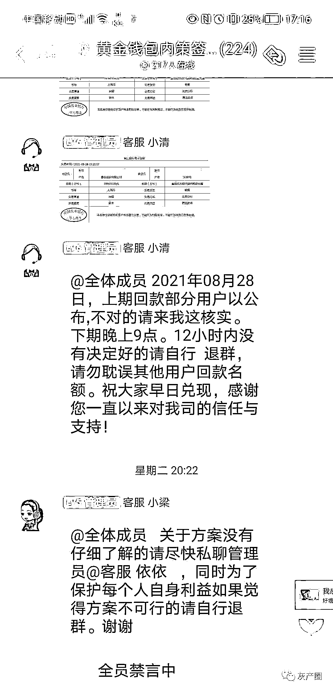

群里还有些托，会说昨天回了一笔，其实都是假的，这是配合演戏，目的就是让群里的其他人觉得这是真的。有时客服也会在群里发“回款”名单，当然也是造假的。

如果有投资者相信，骗子接着使招。

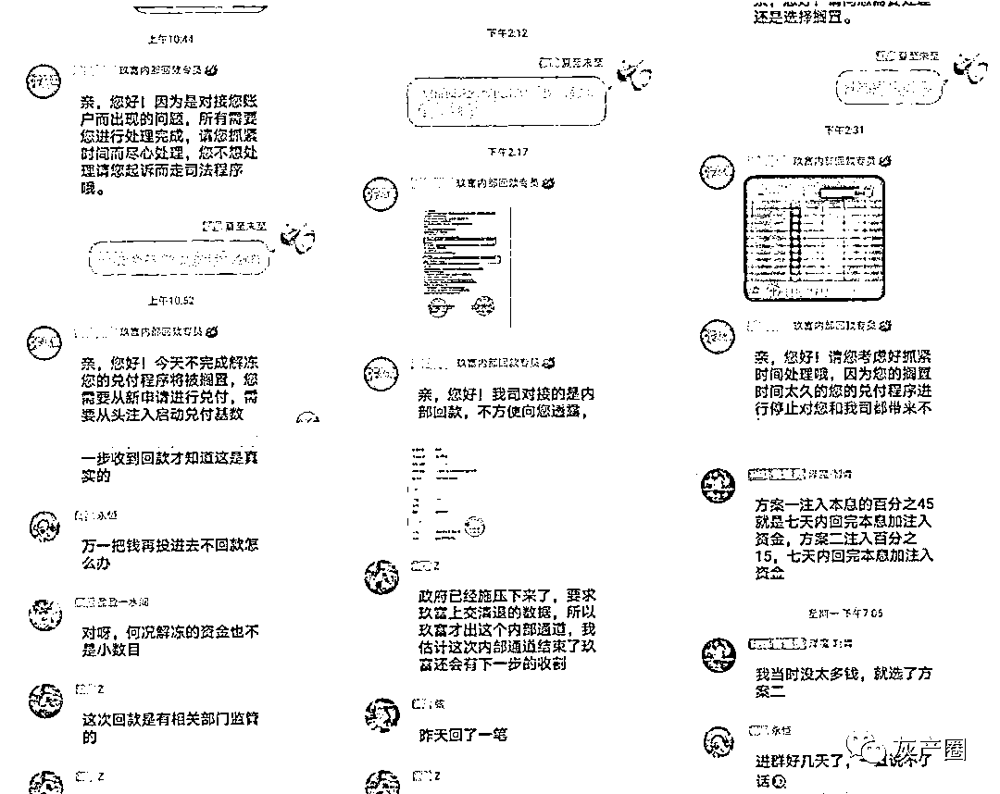

坐等人上钩后，骗子客服说，公司的流动资金都转到了第三方平台，银保监会责令他们通过三方平台为部分出借人进行兑付，还发来一个链接让人下载，这些链接要么是非法金融交易平台，比如境外虚拟币交易平台，要么是骗子做的“投资平台”等。

为了让人相信，骗子还会伪造文件。

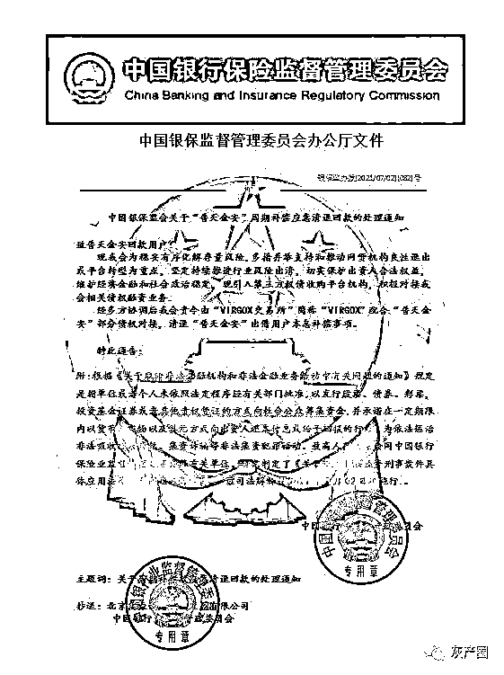

这是一位被骗者收到的所谓的“银保监会办公厅文件”。骗子道具备足、群演配足，就是为了让人信以为真，“请君入瓮”，实施诈骗。

**民警教你见招拆招：**

**有几个地方仔细辨别，是可以发现端倪的**

**伪造的文件，仔细辨别，就能发现猫腻** 

比如上面的这份“中国银保监督管理委员会办公厅文件”，但其实银保监会全称应为：中国银行保险监督管理委员会，包括落款的公章，也是错误百出，抬头和公章名称不一样…… 

警方发布的通告，不会提到让人去加某某群等这类的内容。 

补充提问：假如骗子把公文伪造得更逼真，我们普通人是不是很难分辨？ 

虽然骗子“用心”制作假公文，但请大家牢牢记住：警察不会通过 QQ（群）、微信（群）办案的，更不会让你转账的私人账户的。 

行政机关的职能是进行行政监管，对行政违法行为进行立案调查，无权责令就投资者之间的民事赔偿作出退赔的决定。投资的经济损失应该通过司法途径解决。 

**兑付是要判决之后处理的**

如果已经立案侦查或者进入审判阶段的案件，正常兑付的流程是在判决之后由司法机关处理，不会由银保监会提供回款平台。

大家如果在一些聊天群看到这样的信息，收到此类信息或邮件，请拨打全国反诈热线 96110 或 110 进行咨询。

来源：苏州市反诈骗中心，全民反诈，阻击诈骗

← 向右滑动与灰产圈互动交流 →

