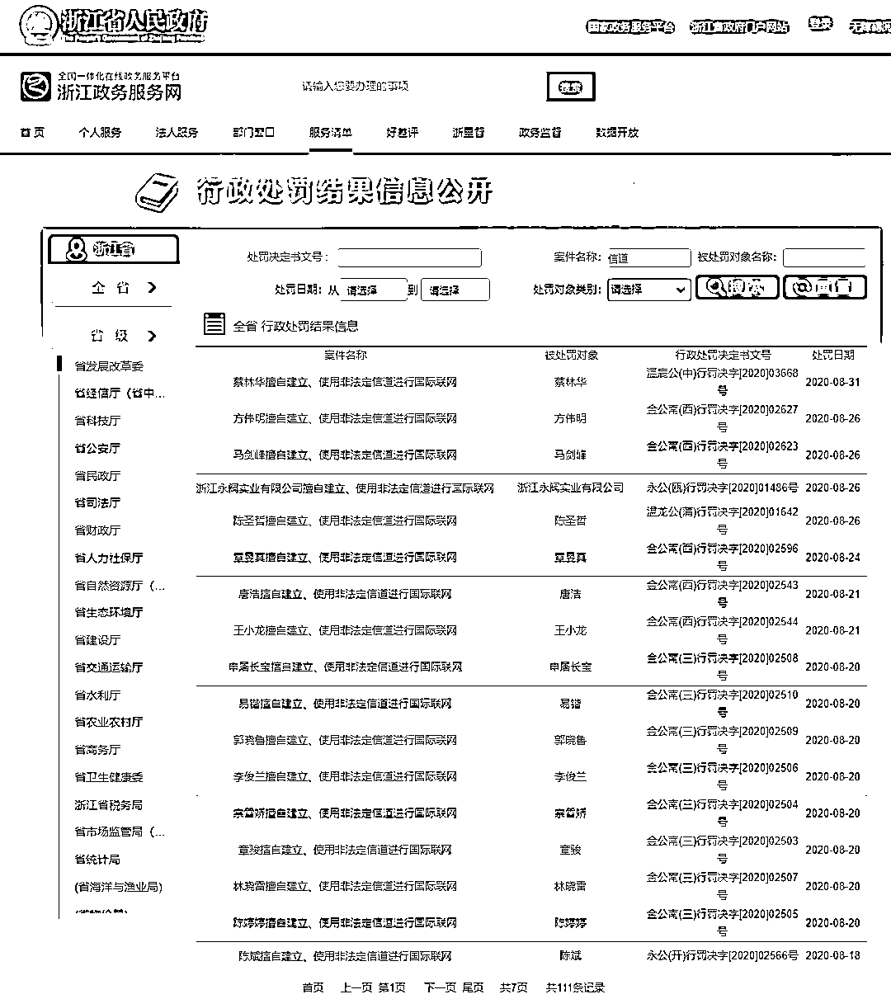
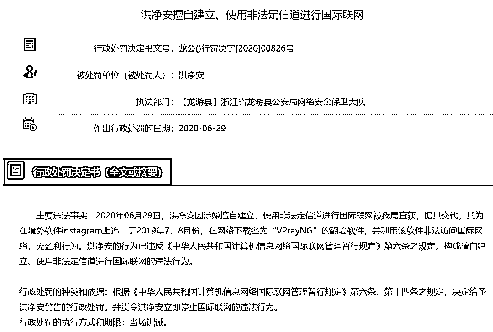
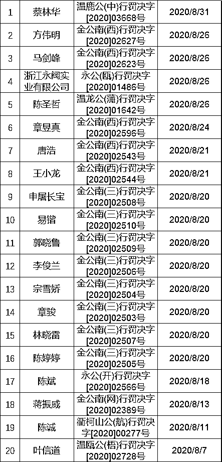
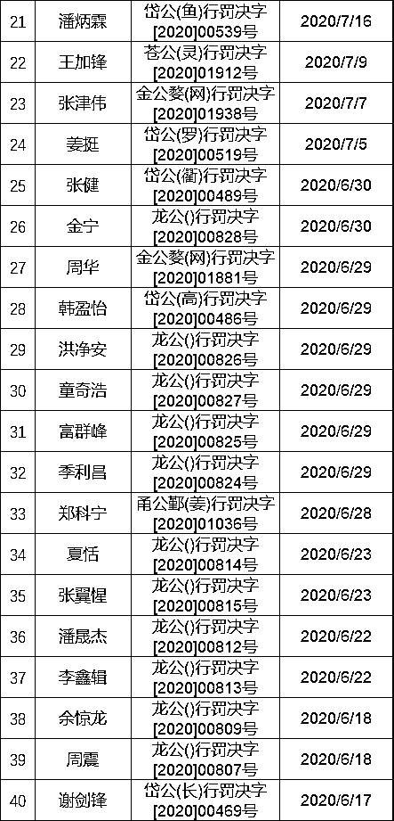
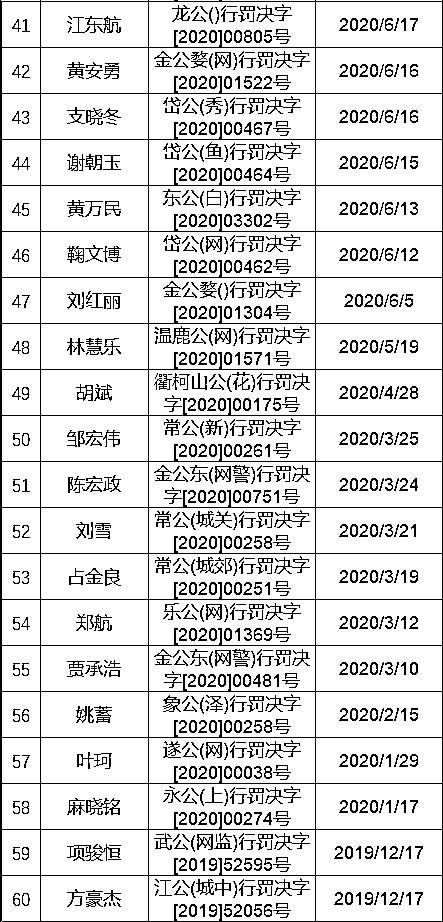
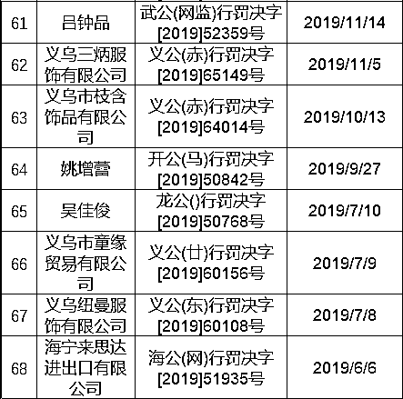

# 警告！VPN 翻墙被抓了！已大规模行政处罚！

> 原文：[`mp.weixin.qq.com/s?__biz=MzIyMDYwMTk0Mw==&mid=2247526333&idx=5&sn=ce4a216677e843bcd2231faac583640f&chksm=97cbac85a0bc259332b13032f85ed16631220e50061fcc441f742d19efe25dec5dcd5bd618aa&scene=27#wechat_redirect`](http://mp.weixin.qq.com/s?__biz=MzIyMDYwMTk0Mw==&mid=2247526333&idx=5&sn=ce4a216677e843bcd2231faac583640f&chksm=97cbac85a0bc259332b13032f85ed16631220e50061fcc441f742d19efe25dec5dcd5bd618aa&scene=27#wechat_redirect)

这几天看到一件超无语事件，翻墙被抓了

**曾何几时，不少人认为翻墙是无罪的，只要不做违法的事情即可。**

然而这个说法很快被现实啪啪啪打脸。以下翻墙简称 FQ

首先，FQ 不仅一定违法，而且全国范围内，个人 FQ 被抓已经从个案逐步上升为高频次事件。仅浙江省一省，去年**8 月**因个人 FQ 而被行政处罚就**达到 18 例**，**全年 60 余例**。

也就是说，相较于过去几年，自 19 年起，个人 FQ 被行政处罚的数量开始呈直线上升的趋势。 

很多因 FQ 而被处罚的人，在被抓之前，都是抱着同样侥幸的心态。

他们始终觉得：

**1、FQ 已经成为事实，中国那么多人 FQ，应该不会被盯上。**

**2、反正我翻墙又不是干什么坏事，逛逛 ins 也违法吗？**

**3、帝吧、饭圈不是天天翻吗？为什么不抓他们？**

首先，FQ**一定是违法的**，你别去关注什么法律专家的解释，违法就是违法，法律专家说了不算。

除非你用的不是 vpn，而是用的三大运营商的国际专用信道。但是，个人无法向 3 大运营商申请使用国际专用信道。

准确来说，就是**个人无权使用合法信道访问外网**，这一功能仅对企业开放。

当然，就算是那些为了照顾留学生而推出了的海外流量卡，费用相当昂贵，一般人也用不起。

这表明国家为了防止个人 FQ 做了相当大的努力。

**以下为浙江省“擅自建立、使用非法定信道进行国际联网”翻墙处罚案件列表**

（注：第 20 个案例系错误并入，因当事人的名字恰好叫“信道”）

至于帝吧、饭圈为什么不被抓？

这个我也不清楚。虽然饭圈、帝吧的群里天天都在发 vpn 的安装包。

不过，帝吧也不是完全没被请去喝过茶，去年 HK 事件中，就有帝吧相关牵头人被请去喝茶。

饭圈女孩 FQ 追星倒是没有相关的处罚案例。

好多人又说，这部分人被抓，很大程度上是由于使用的 APP 保密性比较差，导致信息泄露。 

事实真的是这样吗？ 

首先，我们所有人使用的流量都由三大运营商提供，那么，所有的信息入口和出口都掌握在三大运营商手里。

你真的认为，只要 APP 够安全，就没人知道你在干什么？ 

的确，如果 APP 足够私密，你在这个 APP 上发黄图都没人知道。但上外网跟使用普通 APP 是两码事。

这么说吧，你打开微信，那么三大运营商就会知道你的微信正在运行，上传并下载数据，但具体是什么数据，他们不清楚，你发的图片或消息，他们无从得知。

但是你一打开推特，三大运营商不就知道你的推特在进行数据传输了么。

只是，三大运营商不会主动将你的异常行为反馈给叔叔，但当叔叔需要协助调查时，他们就会提供。

按照叔叔的描述（叔叔跟我说的），理论上，辖区里面所有翻墙行为都应当被控制，但是，由于地方辖区的警力不足，只能带走部分人进行处罚。 

这完全是一个概率事件，视乎是谁。

因此，有的人可能 FQ 几年没被抓，有的人可能才刚打开 vpn，就找上门了。 

7 月底，一个粉丝因为翻墙被深圳警方请去蹲了 24 小时，他跟我说。

当时，警方先是电话通知其到派出所，被当成电话诈骗无视后，叔叔直接找到他的住址，上来就给他戴上手铐，将其带回派出所，期间没收手机，穿上嫌犯的制服，蹲了一夜。

那个粉丝出来后心有余悸，至今连手机静音也不敢设置，生怕错过了派出所的电话。

一朝被蛇咬，十年怕井绳。

之后，他开始劝身边的人别再 FQ，鉴于他的经历，他的朋友也开始放弃了 FQ。 

而这个粉丝最初翻墙目的是为了什么？

上谷歌找资料，他是做自媒体的，每天写稿件需要灵感和素材。

因此，别再自我安慰，网上就没有安全不违法的 VPN，也没有不干坏事就不会被抓的个人翻墙者。

天知道，下一个月，又会有多少人因 FQ 而被处罚。

好吧，做为程序员，以后也只能用百度了。 

可百度，真的不行啊。

好了，这篇文章就到这了，我们下篇文章见。

来源：启舰杂谈，程序员小灰

← 向右滑动与灰产圈互动交流 →

