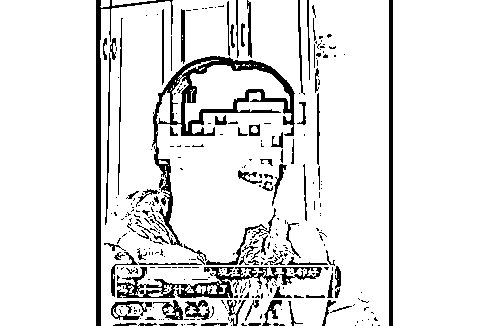

# 网传山东一母亲发儿女裸睡视频， 官方回应

> 原文：[`mp.weixin.qq.com/s?__biz=MzIyMDYwMTk0Mw==&mid=2247526333&idx=6&sn=3df78df0948c3f73f11fbb9aec9d5d32&chksm=97cbac85a0bc259319b066a6ac081d1f7bd22b71ae2c8e037bbea22901ff564a9af5ed4ac5a0&scene=27#wechat_redirect`](http://mp.weixin.qq.com/s?__biz=MzIyMDYwMTk0Mw==&mid=2247526333&idx=6&sn=3df78df0948c3f73f11fbb9aec9d5d32&chksm=97cbac85a0bc259319b066a6ac081d1f7bd22b71ae2c8e037bbea22901ff564a9af5ed4ac5a0&scene=27#wechat_redirect)

近日，“山东一母亲发儿子女儿裸睡视频”一事引发网络热议，众多网友纷纷发声谴责。

12 月 22 日，当地宣传部门负责人回应称，**网传内容不实，两个孩子只是兄妹之间的亲近，当地妇联、公安等部门已经介入调查**。目前，该母亲的短视频账号已经被平台封禁。

<mpvideosnap class="js_uneditable custom_select_card channels_iframe" data-pluginname="videosnap" data-id="export/UzFfAgtgekIEAQAAAAAA2YYW1Cwd_QAAAAstQy6ubaLX4KHWvLEZgBPElaMYJVxMfZ39zNPgMIv39n_mJTSmJCccgBkOUkXF" data-url="https://findermp.video.qq.com/251/20304/stodownload?encfilekey=oibeqyX228riaCwo9STVsGLPj9UYCicgttvEZzDnYKlODT1ibZHpZEg8fBnQibEDAC8ZCPMxdCtMAn5e2R88080qXJLkRG4UXQuTzxmNUyXIXSygVtO25PKDiciaWw9ic9AzEm8CHtTO9eCRR9g&amp;adaptivelytrans=0&amp;bizid=1023&amp;dotrans=0&amp;hy=SH&amp;idx=1&amp;m=9650707dc7594e10ac757804fec6f42a&amp;token=x5Y29zUxcibArKMqVJia05jSMzPibxdASticSZ6xWOuWu8nxO1sMzu6uZW9pXh7UFbWtOEfB6ZSCnaM" data-headimgurl="http://wx.qlogo.cn/finderhead/Xk8cWgeflKBnia5J8tdryjGbrxh0tXnpt8HxE6vUjf6U/0" data-username="v2_060000231003b20faec8c5e1801dc3d0cb07e432b077cd506cb60cf44c5d6ced9ba24c0e493d@finder" data-nickname="北京青年报" data-desc="#官方回应网传母亲发儿女裸睡视频 【官方回应#山东一母亲发儿女裸睡视频 网传内容不实】】近日，有网友爆料，山东菏泽名为“小妞日常”的短视频账号发布兄妹裸睡等不当视频。引发关注后，视频中孩子母亲在直播中称，发视频初衷是为记录孩子成长，顺便赚取零花钱，没想到却被个别网友恶意剪辑。12 月 22 日，山东菏泽单县宣传部新闻科负责人告诉记者，当地多个部门已经就此事介入调查，网上传播内容不实，视频系孩子母亲拍摄，两个孩子只是兄妹之间的亲近。目前，账号“小妞日常”已经被平台封禁。 （南都视频）#@北京青年报" data-nonceid="4240524597777044328" data-type="video"></mpvideosnap>该视频号不可引用

据网友爆料，发布兄妹疑似裸睡不当视频的账号名为“小妞日常”，在短视频平台上拥有近 30 万粉丝，视频点赞量已经超过 300 万。视频内容主要是母亲分享一些兄妹俩的日常生活。

账号简介写道：“小妞是 2012 年 2 月 4 号的生日，本性善良单纯，有点吐词不清，来抖音只是记录孩子的成长，分享日常生活，希望大家少些指责，多点理解，谢谢大家了。”

观察者网查询发现，“小妞日常”在另一平台也有账号，而且十分活跃，一天能更新四五条视频。就在 21 日，“小妞日常”还分享了一家人冬至吃饺子的视频。

近日引发网络关注的，主要是“小妞日常”此前发布的一些视频中出现的兄妹疑似同一被窝裸睡、哥哥触碰妹妹胸部、哥哥骑在妹妹身上等画面。还有网友爆料称，妹妹因小时候发烧导致智力有些迟缓。

众多网友批评道：“记录日常也不是这样拍的吧！”“这么大了合适吗？”

“不重视孩子的性别教育……起码要让孩子妈意识到问题严重性。”

此事引发网络关注后，孩子妈妈在直播中回应称，自己发视频的初衷是记录下儿子女儿的日常生活，刚开始发布在西瓜视频，“然后看到还稍微有一点收益，可以赚点零花钱。”她表示，自己发的视频被个别网友恶意剪辑。

提及儿子女儿在同一被窝裸睡一事时，她叹气说道：“一个八岁多一个十岁多，我也没想那么多，以前他们都是跟我一起睡的。”当有网友留言“不要让男孩和女孩一起睡”时，孩子妈妈眉头一皱，身体后仰调整了下坐姿，不发一言。

有网友留言“男孩子早熟”，这位妈妈呵呵笑了下，不以为然地说道：“男孩子早熟，呵呵，不是所有的男孩子都是一样的。”

12 月 22 日，当事人所在的山东菏泽单县宣传部新闻科负责人接受采访时回应道：**“妹妹没有精神病，都已经调查了，她妈妈发的视频。网友说的哥哥猥亵妹妹的情况不属实，两个孩子只是亲近，实际上不是那个情况。”**

北青-北京头条记者报道称，当地妇联已联合当事人所在街道、社区以及教育部门等多部门介入，也已经联系到当事人，正对网友提出的问题逐一核实。

单县县委宣传部表示，因为涉及到未成年人权益保护，当地非常重视，目前包括公安机关在内的多部门均已介入，正在积极协调处理此事。

**目前，“小妞日常”的抖音账号已经被封禁。**

来源：观察者网

← 向右滑动与灰产圈互动交流 →

