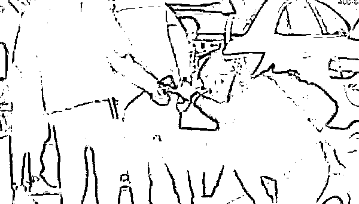
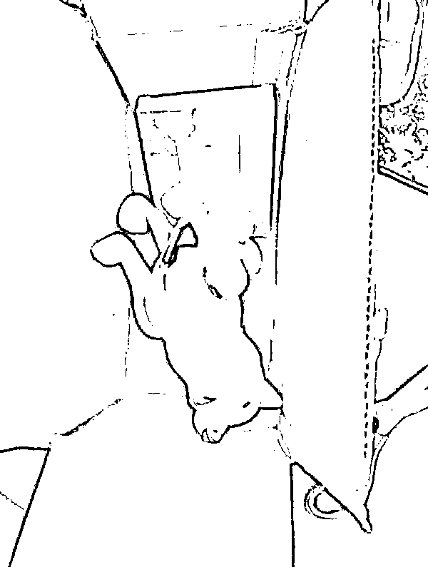

# “勾结医药代表，把毒品掺零食袋内卖”，抓！

> 原文：[`mp.weixin.qq.com/s?__biz=MzIyMDYwMTk0Mw==&mid=2247526333&idx=7&sn=9da74cf033a5b716a1cc9a0e6b20fe92&chksm=97cbac85a0bc25931a117f826c619d28ac36777e8172c349805e0088c616228066eff59db625&scene=27#wechat_redirect`](http://mp.weixin.qq.com/s?__biz=MzIyMDYwMTk0Mw==&mid=2247526333&idx=7&sn=9da74cf033a5b716a1cc9a0e6b20fe92&chksm=97cbac85a0bc25931a117f826c619d28ac36777e8172c349805e0088c616228066eff59db625&scene=27#wechat_redirect)

主要犯罪嫌疑人勾结医药代表获取国家管控的精神麻醉类药品，将毒品掺在零食等包装袋内，通过网络及快递渠道售卖分发——12 月 21 日，浙江温州市苍南县警方通报了一起涉案人员 100 余名、涉案交易金额数千万元的特大网络贩卖精麻药品案。

抓捕现场 苍南警方供图

澎湃新闻 12 月 23 日从苍南县公安局获悉，2019 年 5 月，苍南警方在工作中发现：有人利用各类网络平台发布“止痛药”“疼痛贴”等关键字的商品吸引购毒者，通过寄递渠道把毒品掺杂在零食、水果、茶叶包装袋内作为伪装进行售卖。 

苍南警方循线深挖，在吉林、安徽、江苏等地抓获犯罪嫌疑人康某、李某、张某等人，并查获大量新型毒品、国家管控精麻类药品，因案情严重，被列为公安部目标案件。 

在梳理证据链时警方发现，该案还有多名上线、下线未归案，温州、苍南警方迅速成立市县两级联合专案组，抽调精干警力参与。在全方位梳理分析延伸侦查后，一个以邵某为中心的犯罪团伙脉络清晰。专案组奔袭华东、华北、中部西南、东南等地区，先后抓获涉毒犯罪分子“邵某”“卞某”“谭某”“徐某”“刘某”等 30 余人。 

经查，该团伙由邵某在吉林省吉林市负责统筹指挥，其父协助其在互联网上寻找下线，其母为从事贩毒行为提供银行账户。该团伙勾结行业人员，在巨额利润诱惑下，不法医药代表利用监管漏洞，通过职务便利监守自盗，获取大量精神、麻醉药品作为毒品货源。

警方截获藏在面膜包装盒内的毒品

在获取毒品后，邵某团伙通过寄递渠道，将毒品运送给多地区毒品“二级经销商”，并通过网络交易平台收取毒资，或者与二级经销商约定快递货到代收货款方式，进行非接触性交易。二级经销商们在各类网络平台发布商品吸引购毒者，通过寄递渠道把毒品掺杂在包装袋内作为伪装再进行二次售卖。其中刘某贩毒案涉及毒品为盐酸羟考酮复方制剂，该药品于 2019 年被列管，涉及到此类药品的涉毒案件在浙江省属“首例”。 

专案组经过对前期抓获的康某、张某等毒品来源和贩卖渠道延伸侦查，发现康某一直与山东王某、庞某等人通过固定通讯手段频繁联系。“飞行燃料”“420”等字眼在他们的“信息”记录里频频出现。经对“王某”“庞某”近 1 个月的深度调查，民警一锅端了他们在山东济宁窝藏的大麻种植加工销售点，缴获成品大麻 1 公斤、活株 3000 多株、大麻种子 5000 多粒，排风机、吹干机、压制机等一整套种植生产大麻设备，一举捣毁种植规模巨大的大麻种植加工点。 

在后期抓捕中，警方捣毁多处贩卖“精麻药品”窝点，摧毁一处大麻种植加工销售点，先后抓获李某、刘某某、林某、崔某等 70 余人。 

历经 14 个月，这起横跨华东、华北、中部西南、东南等地区的公安部目标特大网络贩卖毒品案件终于被一网打尽。苍南警方共抓获邵某、谭某等涉案人员 100 余名，缴获各类精麻药品 40 余公斤，涉案交易金额高达数千万元。 

据最高人民法院关于印发《全国法院毒品犯罪审判工作座谈会纪要》的通知中第七条“非法贩卖麻醉药品、精神药品行为的定性问题”，行为人向走私、贩卖毒品的犯罪分子或者吸食、注射毒品的人员贩卖国家规定管制的能够使人形成瘾癖的麻醉药品或者精神药品的，以贩卖毒品罪定罪处罚。

来源：澎湃新闻

← 向右滑动与灰产圈互动交流 →

