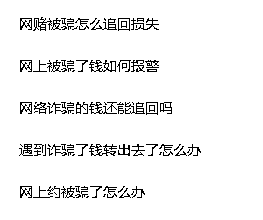
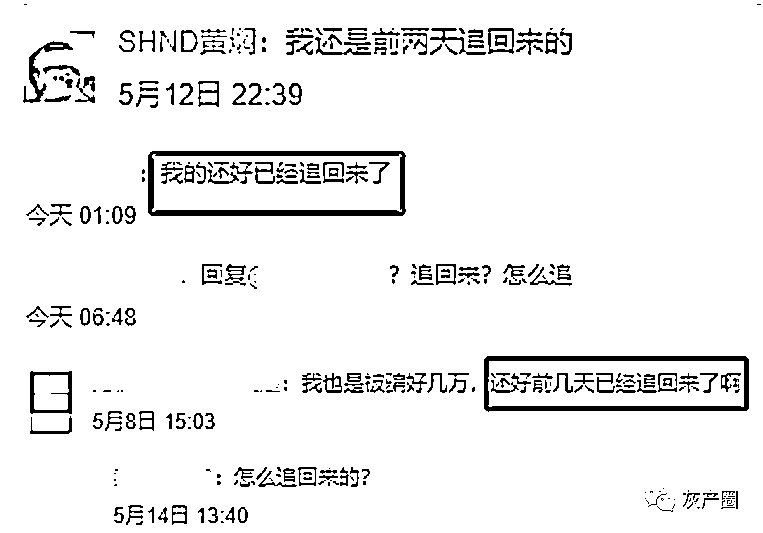
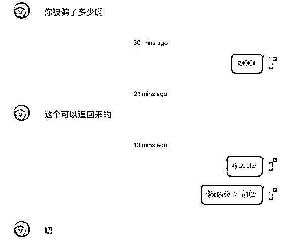
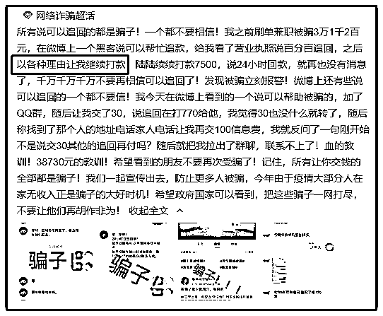
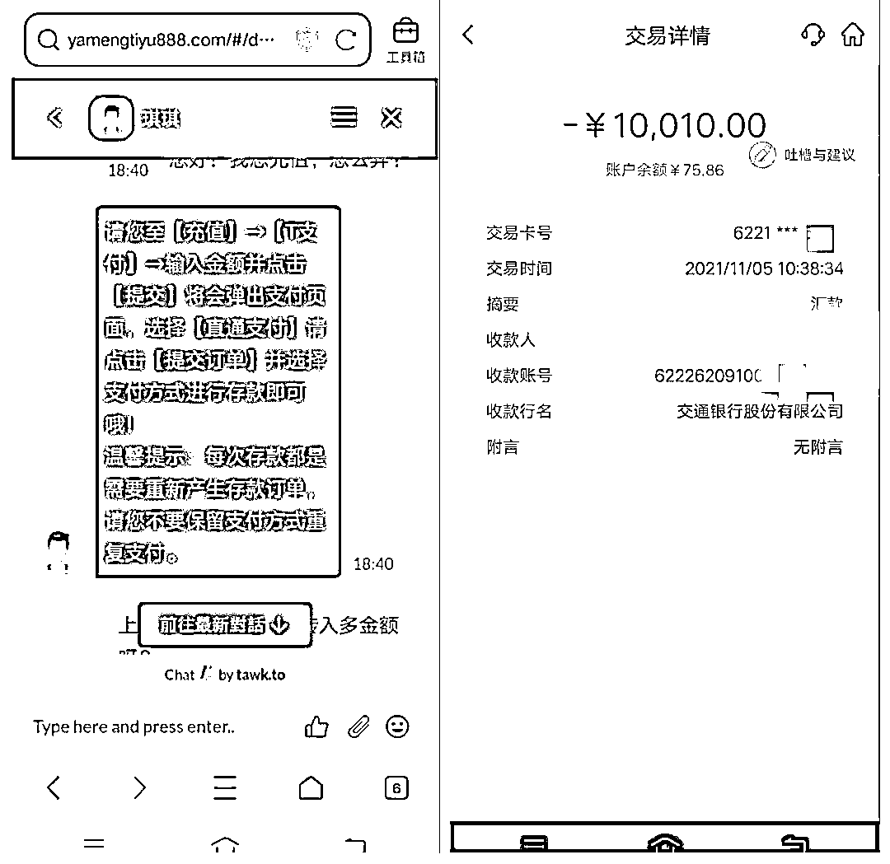
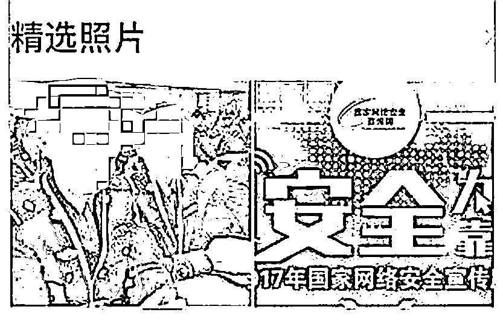
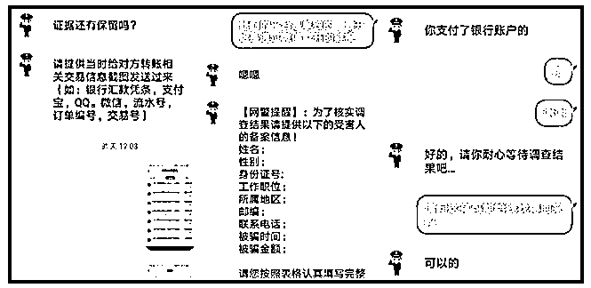

# 被骗后千万不要在网上搜索这句话！

> 原文：[`mp.weixin.qq.com/s?__biz=MzIyMDYwMTk0Mw==&mid=2247526401&idx=3&sn=de7404004769100cef1d56afd308ef6a&chksm=97cba339a0bc2a2f87e0df5658010ecabf8c2f5febd42412b701807d91fb98657230cbde74b9&scene=27#wechat_redirect`](http://mp.weixin.qq.com/s?__biz=MzIyMDYwMTk0Mw==&mid=2247526401&idx=3&sn=de7404004769100cef1d56afd308ef6a&chksm=97cba339a0bc2a2f87e0df5658010ecabf8c2f5febd42412b701807d91fb98657230cbde74b9&scene=27#wechat_redirect)

现代人的生活离不开网络

吃穿住行一网搞定

甚至网聊替代面聊

还能解决部分人士的“社恐”问题

但你若连遭遇**网络诈骗**后 

还要网络求助发出类似这样的帖子

那么我们很负责任地告诉你 

你大概率会面临以下三种情况

**1.“黑客”来啦！**你会收到热心群众这样或那样回复

  

网友的热心不止于此，还会给你一个联系方式，说是这位黑客帮他追回的。

如果受害者轻信了黑客的身份，那么他接下来的话也不会让人起疑心。仗着普通人对黑客技术知之甚少，装成黑客的骗子瞎编起来也肆无忌惮。这位名叫“黑科技”的黑客表示，追回方式是“技术破解”，并且承诺 100%追回。

（网友被追回诈骗的血泪教训）

**2.“追回中心”来啦！**

个人不可靠

那有组织的神秘机构可靠吗？

扬州王女士因深陷投资诈骗损失了 14 万多，被骗后的王女士并未拨打 110，而是同样进行了网上搜索，网页上跳转了法律咨询页面，王女士将被骗经历告诉了对方，对方让她加**“追回中心”**QQ 号。王女士将转账截图等证据发给对方，没多久对方就发回了一张截图称被骗的 14 万余元已经到王女士卡里了，但钱暂时被冻结需要充值成公司 VIP 才能解冻。王女士信以为真，向对方提供的账号转账了**1 万元**。

**3.“公安机关”来啦！**

**很多被害人在搜索过程中，往往会被网页中弹出的网警吸引。普遍认知觉得是网上办案的警察。但其实网警是从事网安工作的警察，他们并不会在网络上受理诈骗案件，也不会帮你追回被骗的钱。骗子们看起来都有模有样，不管是名字、头像甚至空间都营造出“我是真警察”的气氛，其实图片都是网上当得。**

****

**当你添加了网警，网警就开始线上办案了。**

****

**流程看起来很规范也相较专业。大约等个一天半天对方就说有结果了，已经将骗子的账户冻结住了，但要把钱从骗子账户转回来需要**“带动资金”**。这“带动资金”可就没底了。**

****

**有些人对网络诈骗还有些了解。不寻找网警，直接搜索“国家反诈中心”，添加了“反诈中心”工作人员的 QQ，结果还是要将钱转入“安全账号”。**

****

****友情提醒****

**生活不易**

**一骗再骗雪上加霜**

**被骗了千万别再这么干了！**

****第一时间报警！****

**来源：南通网警、江苏网警，利箭在行动**

****

**← 向右滑动与灰产圈互动交流 →**

****