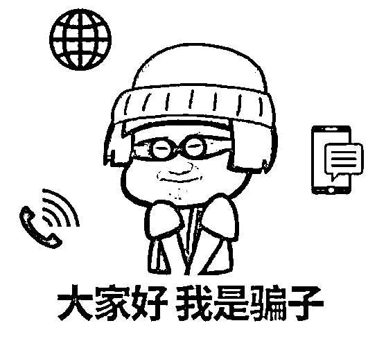
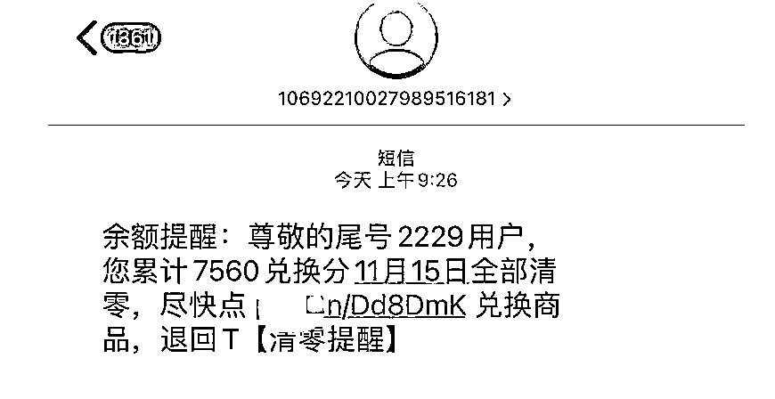
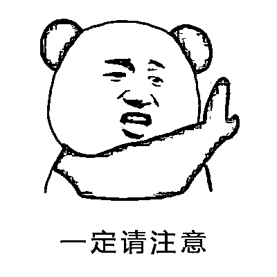
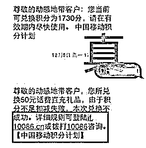
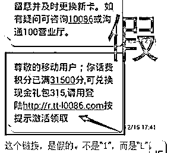
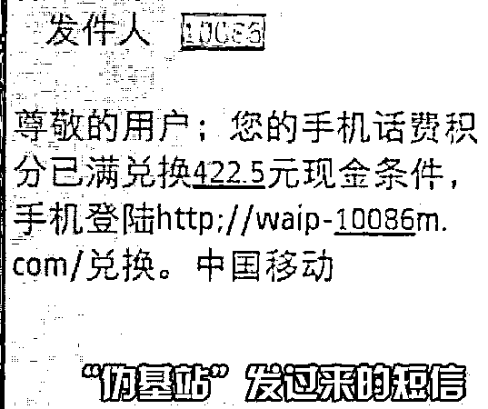
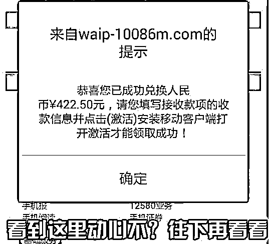
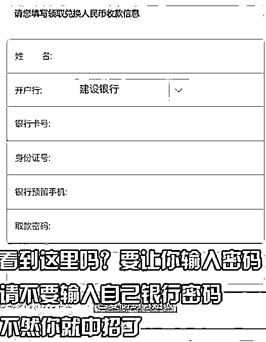
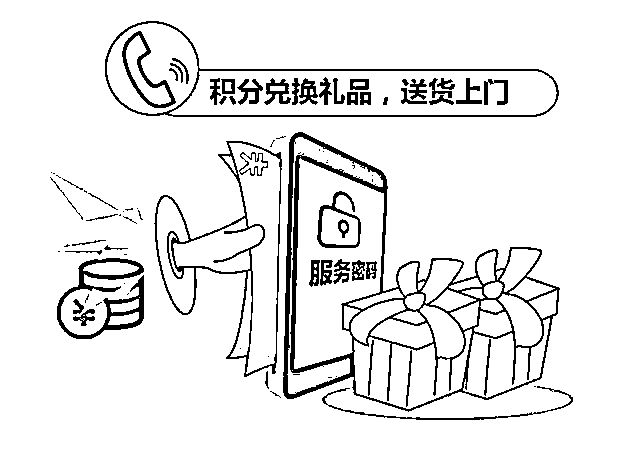

# 警惕！临近年底，这种骗局又来了……

> 原文：[`mp.weixin.qq.com/s?__biz=MzIyMDYwMTk0Mw==&mid=2247526401&idx=4&sn=20cbad261cbf516110d6cac88ec75018&chksm=97cba339a0bc2a2fc95006a913223cfbc584ca2b08cc273f47e1a8e27c844b5f7cfdff148a2f&scene=27#wechat_redirect`](http://mp.weixin.qq.com/s?__biz=MzIyMDYwMTk0Mw==&mid=2247526401&idx=4&sn=20cbad261cbf516110d6cac88ec75018&chksm=97cba339a0bc2a2fc95006a913223cfbc584ca2b08cc273f47e1a8e27c844b5f7cfdff148a2f&scene=27#wechat_redirect)

年底了

不少商家会推出积分清零活动

平日各种消费积攒的积分

再不及时兑换

有的可能就会过期作废

商家会发来提醒信息

不过这时候

骗子也盯准“契机”

来忽悠人了

像这样的

**“积分兑换”**

**“积分清零”**

**提醒短信**

相信大家可能都收到过

大家收到这样的短信或电话

一定要谨慎，注意识别

最近，广东江门市民杨先生

收到一条“积分兑换”短信

内容如下

尊敬的客户：您好！您的话费积分 3160 即将过期，请手机登录 eb-10086.com/bank 激活领取现金礼包。

看到短信是由自己手机号码

所在的运营商发来的

而且短信里的网址

与真实网址相似

杨先生并没有过多的怀疑

就用手机打开了网址

进入的也是一个标题为

**“掌上营业厅”**的页面

页面要求填写姓名、身份证号、

信用卡卡号、交易密码、

预留手机和卡背后三位等信息

杨先生按照要求填写后

又进入了一个标题为

**“全国银联信用卡提额专用”**的页面

继续填写信息后

就被要求下载安全控件

**（实际上是木马程序）**

当杨先生提交信息后

页面就进入了一直等待的状态

不久后

王先生就收到多笔消费短信

**提示自己的信用卡被消费了 7739 元**

珠海的张先生也遇到了一样的骗局

**本想用积分兑换一台空气炸锅**

**结果 2 万多元没了**

往年张先生也通过积分

兑换了不少话费、日用品、

视频会员等等

这回他一看到短信

并没有过多的怀疑

就用手机打开了网址

填写了个人信息

还下载了一个“安全软件”

**（实际上是木马软件）**

最后等来的不是空气炸锅

而是信用卡被消费 22839 元的短信

其实这些骗局

都是骗子通过基站

伪装成电信运营商发送短信

诱导受害者填写个人信息

并下载木马软件

最后盗刷受害者的信用卡

临近年底

各种积分清零、积分兑换活动

也进入高峰期

为了避免上当受骗

警方在此特别提醒大家

一定要注意以下几点

**01**

收到积分兑换的短信，即便是自己熟悉的客服号码发来的短信，也不能轻易相信。

**“10086”和“l0086”**

**傻傻分不清**

如果不仔细看，可能大部分人都会误以为这真的是 10086 所发送的，可是仔细观察这里的“l0086”，**就会发现它是小写的“L”而不是“1”。**骗子利用大家对英文字母“l”和数字“1”的低辨识度，混淆视野、投机取巧。

**02**

凡是短信中有网址链接的，一定要注意识别，千万不能随意点击，有可能是木马病毒或是仿冒的钓鱼网站。

**遇到要输入真实姓名、银行卡及密码等隐私信息时，一定要多留心。**不论是银行还是电信运营商又或是商家发送的活动短信，通常只会要求用户填写账号或手机号，不会要求用户填写银行卡密码、身份证号等非常敏感的信息，更不可能要求用户填写信用卡有效期、安全码等信息。

**前缀后缀混淆视野**

**带你进入钓鱼网站**

骗子通过伪基站发短信：http://waip-10086m.com/。网址上还有一个 m 字母，是 10086m，**这明显是一个钓鱼网站**，千万不要按要求操作，否则损失惨重！

**03**

办理积分兑换业务，尽量不要直接跳转链接操作，可拨打官方客服电话或者登录官网咨询办理，又或者是打开通过官方渠道下载的手机 APP 进行操作。

**冒充工作人员骗取验证信息**

骗子还会冒充工作人员，拨打电话宣传积分兑换活动礼品，索要验证码、密码；或是谎称有中奖、积分回馈活动，索要各类验证信息，骗取钱财。

总之

大家若收到类似短信时

要多加留心，避免上当

如发现被骗

请及时拨打 110 报警

捂紧钱包

别让骗子钻了空子

来源：广东公安，拒绝跨境赌博

← 向右滑动与灰产圈互动交流 →

