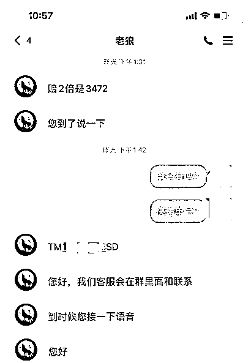
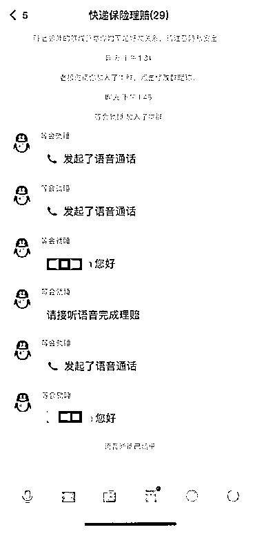
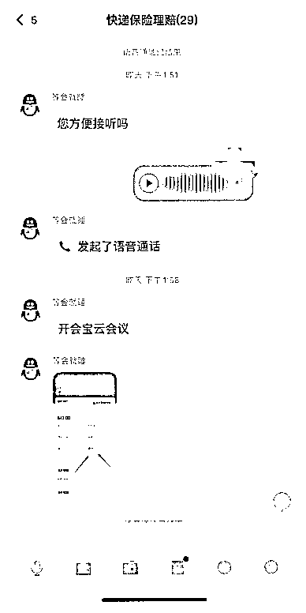
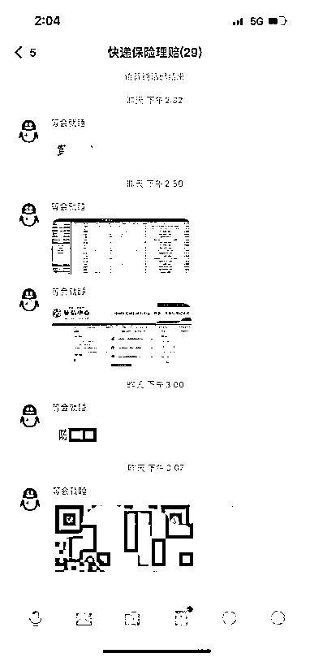
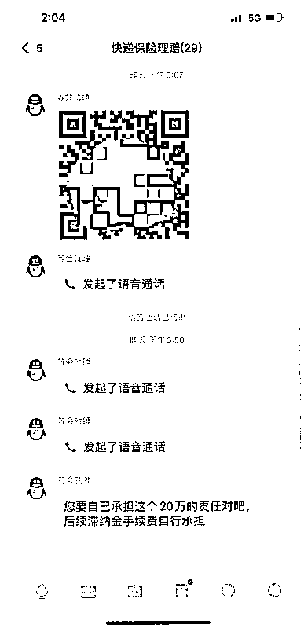
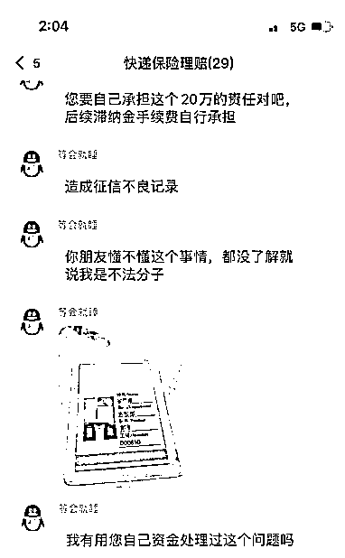

# 快递理赔能影响征信？

> 原文：[`mp.weixin.qq.com/s?__biz=MzIyMDYwMTk0Mw==&mid=2247526401&idx=5&sn=e47392498d74353ab96f0be8d828f07e&chksm=97cba339a0bc2a2f2882862426d68d2717a2196acf72f6feaba21544568a6660d41f0f43bdb7&scene=27#wechat_redirect`](http://mp.weixin.qq.com/s?__biz=MzIyMDYwMTk0Mw==&mid=2247526401&idx=5&sn=e47392498d74353ab96f0be8d828f07e&chksm=97cba339a0bc2a2f2882862426d68d2717a2196acf72f6feaba21544568a6660d41f0f43bdb7&scene=27#wechat_redirect)

**“国际物流客服”来电**

某天，M 女士接到一个来自香港的来电，其自称“国际物流客服”表示 M 女士有一个来自美国的包裹，由于在分拣过程中被压坏，需走核对理赔程序。此时 M 女士防备心理还挺强，因确信自己没有跨境快递，让对方联系寄件方并挂线。

**执着赔偿**

对方非常执着，又继续打来电话，声称 M 女士的确有跨境包裹，并叫 M 女士去核实。M 女士想到远在美国的亲戚，于是致电亲戚核实。发现其的确有寄送包裹给 M 女士，且亲戚提供的快递单号与“客服”报的一致。M 女士这才放下防备心理。按照“客服”要求添加好友，被拉进理赔群。

**听从指引接受“赔偿”**

“客服”称理赔有录音要求，需下载**会议 APP。M 女士下载 APP 并输入指定会议号进入了屏幕共享。随后，对方又要求 M 女士查看银行卡余额，又要求打开 ZFB 备用金，查询退款。

↔左右滑动查看图片

**以影响征信为由，语言恐吓**

突然，“客服”声称由于 M 女士操作失误，把其他人的理赔钱全部取走，并说如果不在 5 分钟内取消的话，会严重影响其个人征信。M 女士听到只有这么短时间，且会影响征信，顿时惊慌，不知所措。于是，在惊恐中，听从对方的指引进行了所谓的补救操作（其实是进行了网银转账）：

1.到银行 APP 进行人脸识别；

2.填写对方提供的账号；

3.在转账页面填写金额：196528；

4.输入绑定手机收到的银行验证码；

……

进行了一系列操作后，对方又要求 M 女士下载云*付 APP。

幸好此时 M 女士先生回家，察觉异样，了解情况后，立即打断骗局，及时报警。但为时已晚，M 女士共被骗 19 余万元。

**复盘该案例，有 3 个重点**

1.**骗子通过非法手段获取了 M 女士精确的快递包裹信息。**这是获得 M 女士信任的关键；

2.**添加好友后，M 女士允许骗子通过某会议 APP 共享屏幕。**这是骗子后续窥探 M 女士所有手机操作的关键；

3.**以影响征信为由，设定了极短的补救时间，进行语言恐吓。**这是骗子利用了人性的应急反应。在极短时间，给人植入大量应急信息，使事主处于恐慌状态难以进行理性思考，从而听从骗子指引进行了转账操作。

**怎么防范？**

**见招拆招！**

1.接所谓“客服”来电，即使能准确报出精准信息也不轻易相信，要通过官方途径核实：查官方号码拨打或到官方网站查询。

**2.“客服”一般不会以私人方式添加好友，更不会要求在会议 APP 共享屏幕。遇有要求下载陌生 APP，要求屏幕共享的情况，对方多是骗子，直接拒绝。**

3.当听到有会对自己有负面影响的信息时，不要立即就对号入座，轻信其言。先冷静分析，只是一家之言，思考：对方身份是否真实？对方是否就能代表官方？这样的处理是否就真能对自己有负面影响？ 

最后

高度警惕境外及港澳台地区的陌生来电

日常与这些地区的亲友有经常联系的除外

## 

来源：阻击诈骗，邯郸市反诈中心

← 向右滑动与灰产圈互动交流 →

