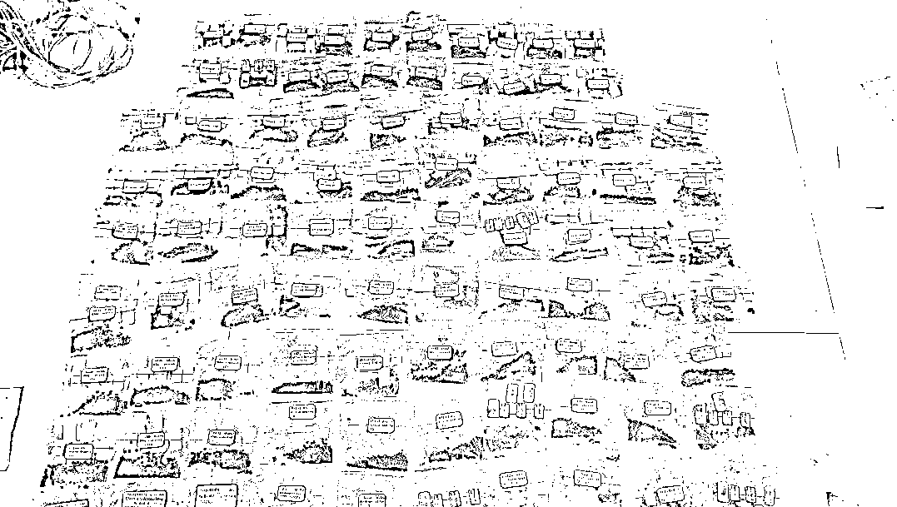

# 荒唐至极！贩毒案主犯竟称“是买来自己吃的”

> 原文：[`mp.weixin.qq.com/s?__biz=MzIyMDYwMTk0Mw==&mid=2247526401&idx=6&sn=c68f0822abf8957fd382c125463062a7&chksm=97cba339a0bc2a2f3553c087ad5f3c72c9906b339b4ca599d98caf148bd946d13712470ec1fc&scene=27#wechat_redirect`](http://mp.weixin.qq.com/s?__biz=MzIyMDYwMTk0Mw==&mid=2247526401&idx=6&sn=c68f0822abf8957fd382c125463062a7&chksm=97cba339a0bc2a2f3553c087ad5f3c72c9906b339b4ca599d98caf148bd946d13712470ec1fc&scene=27#wechat_redirect)

和平年代

缉毒警察算得上是最危险的职业

枪毒合流

生死一线

缉毒民警频繁面临死亡威胁

2021 年 12 月 15 日，四川省自贡市中级人民法院依法对一起贩卖、运输毒品案件作出一审宣判。

这起毒品案件的侦破，不仅捣毁了一个长期藏匿于自贡当地的贩毒窝点，更是斩断了又一条通过云南向四川输送毒品的秘密通道，有力的震慑了毒品犯罪行为，维护了当地及周边的社会稳定。

**案件始末** 

**01**

**货车司机的嫌疑**

2020 年 7 月，自贡警方在侦办一起刑事案件过程中收获一条重要线索，一名绰号“二哥”的货车司机正在秘密联系买家，试图从云南将一批毒品销往自贡，然后由下家进行分销。随即，自贡警方成立专案组，由市局禁毒支队牵头，富顺县公安局禁毒大队主办，全力侦办此案。

 “二哥”名叫邱某，现年 40 岁，内江市隆昌人，是一名货车司机，在云南——四川两地拉货谋生已 10 多年。办案民警通过调查了解到，邱某好赌，长期通过网络进行赌博，输了很多钱。为了找“快钱”，他在云南组织了一批毒品，试图销往四川。

办案民警在前期侦查中发现，那段时间，邱某经常跟自贡的罗某联系。罗某，30 来岁，不仅有吸贩毒史，曾经还因抢劫获刑。因此，罗某进入警方视线。

**02**

**三人拼凑而成的贩毒团伙：均为吸毒人员**

因为疫情防控工作的严管严控，使得毒品货源紧张，价格不断提高，利润不断攀升。正是为了追逐高额利润，罗某开始筹集资金，准备买下邱某的毒品。

2020 年 8 月中旬，罗某筹到 80 余万元，然后让女友邓某某通过银行卡、微信、支付宝等不同渠道，将款项付给邱某。8 月 23 日，罗某安排其马仔杨某到云南昆明验货收货。 

杨某试货后，对这批货很满意，当即向罗某反馈情况，罗某及时支付了尾款。

交易完毕，邱某找了一辆昆明开往自贡的货车，以搭顺风车的名义，让杨某带着货返回自贡。

办案民警在调查中发现，罗某、邓某某、杨某三人均为吸毒人员，杨某曾因盗窃获刑，当年 5 月份刚刚刑满释放。

**03**

**检查站收网：现场缴获毒品近 4 千克**

自以为这笔买卖干得“神不知鬼不觉”，不曾想，邱某、罗某等人的伎俩早已被自贡警方看穿并尽在掌握。 

从邱某、罗某二人确定交易起，警方就兵分多路，对相关人员展开了细致的调查和严密的监控。

经过通宵达旦的蹲守监控和研判分析，案侦小组决定：在毒品运输途中收网。

次日上午 8 时 30 分许，在云南警方的大力协助下，杨某搭乘的顺风车行驶至高速路上一检查站接受例行检查时被民警挡获。民警从杨某所携带的双肩背包中查获海洛因六包 2061.62 克，麻古 6 包 1691.18 克。而两名货车驾驶员对此并不知情，只认为是帮同行邱某某顺带了一位朋友回自贡。 

与此同时，另一组民警在位于自贡某小区的一间出租屋里，将罗某、邓某抓获，现场查获海洛因 169.37 克。 

邱某闻讯而逃，后通过上网追逃，在昆明被警方抓获归案。

**04**

**一审宣判**

办案民警介绍，审讯过程中，邓某某、杨某都比较配合，如实地供述了各自的犯罪事实，而罗某却试图避重就轻、逃避打击。

罗某不仅在被审讯过程中辩称，这么多的毒品“是买来自己吃的”；还在羁押期间，多次闹着自己体内有针头（多年前注射毒品时，疑似部分注射器针头断在体内），要求手术。

最终，在铁证面前，罗某、邱某某、邓某某、杨某等人还是低下了头。

经检察机关提起公诉，自贡市中级人民法院依法开庭审理，12 月 15 日，自贡中院对该案作出一审宣判： 

被告人罗某犯贩卖、运输毒品罪，判处死刑，剥夺政治权利终身，并处没收个人全部财产；被告人邱某某犯贩卖、运输毒品罪，判处死刑缓期两年执行，剥夺政治权利终身，并处没收个人全部财产；被告人杨某犯贩卖、运输毒品罪，判处有期徒刑十五年，并处没收个人财产 60000 元；被告人邓某某犯贩卖毒品罪，判处有期徒刑八年，并处罚金 40000 元；涉案毒品、扣押的 6 部手机、现金 90715.5 元、云 AT8xxx 号机动车予以没收。

拒绝毒品 珍爱生命

自贡禁毒

一直在行动

来源：自贡公安，巴蜀反诈

← 向右滑动与灰产圈互动交流 →

