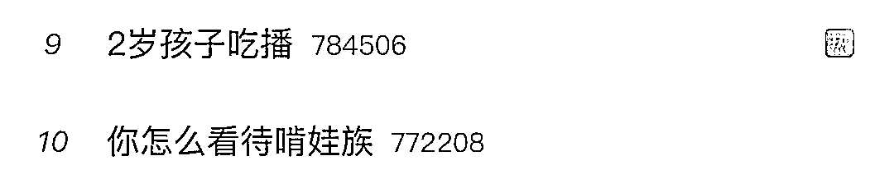
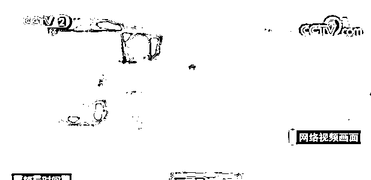
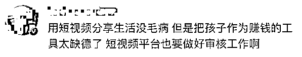
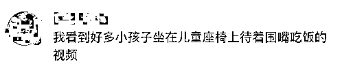
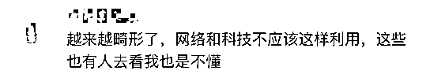
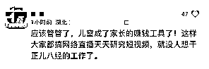
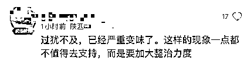
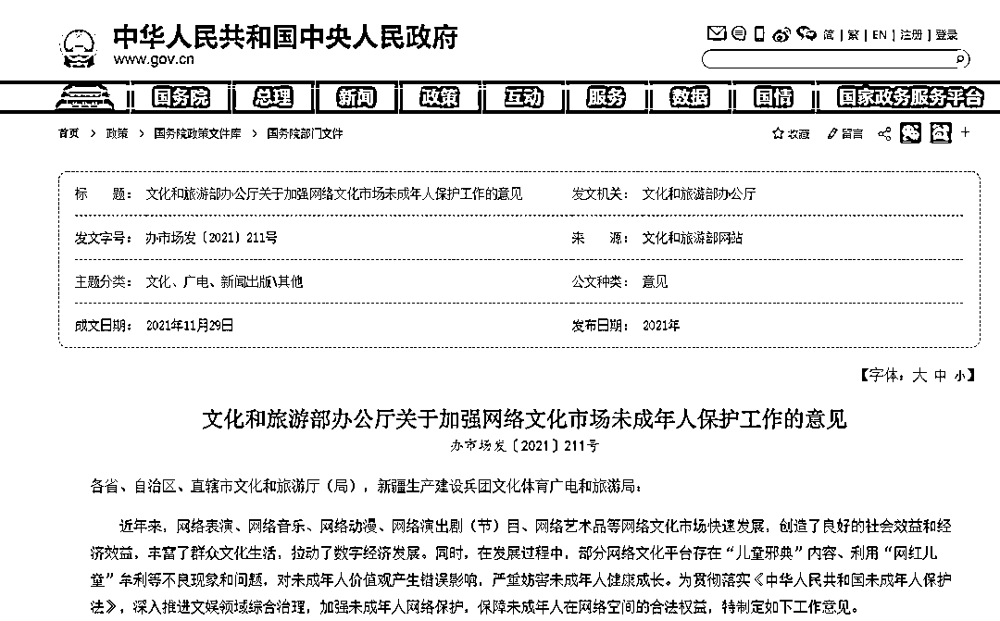

# 2 岁孩子吃播上热搜，网友怒了

> 原文：[`mp.weixin.qq.com/s?__biz=MzIyMDYwMTk0Mw==&mid=2247526463&idx=2&sn=06980b724f13fe02dfe83d165cf6c97c&chksm=97cba307a0bc2a115b26ff0576e4072b8cbf467817e7e9c6f72432577b4925700a5f16853d64&scene=27#wechat_redirect`](http://mp.weixin.qq.com/s?__biz=MzIyMDYwMTk0Mw==&mid=2247526463&idx=2&sn=06980b724f13fe02dfe83d165cf6c97c&chksm=97cba307a0bc2a115b26ff0576e4072b8cbf467817e7e9c6f72432577b4925700a5f16853d64&scene=27#wechat_redirect)

[`mp.weixin.qq.com/mp/readtemplate?t=pages/video_player_tmpl&action=mpvideo&auto=0&vid=wxv_2193533688888492033`](https://mp.weixin.qq.com/mp/readtemplate?t=pages/video_player_tmpl&action=mpvideo&auto=0&vid=wxv_2193533688888492033)

随着萌娃短视频爆火，一些家长的“晒娃”模式逐渐畸形化，出现了 2 岁孩子吃播、还穿着尿不湿的萌娃下厨房做菜等模式。 

消息一出

引发网友关注： 

据报道，**萌娃短视频爆火后，大量的广告也会随之而来，这也导致一些父母把利用孩子打造账号当作生意来经营**。

翻开一些账号主页，大多可以看到“好物推荐”“找我官方合作”等标识。有运营儿童短视频账号的家长表示，靠娃就能月入 15 万元。

早在 2020 年，吃播博主“佩琪”年仅 3 岁就被父母喂到了 70 斤，引发网络热议。有媒体联系上了佩琪父母，对于让孩子当“吃播”赚钱的质疑，两人称并不属实，虽确实“赚了几百元”，但拍视频纯粹只是为了好玩。

众多网友投诉了佩琪的吃播账号后，相关平台表示将对其视频和账号进行封禁。

专家表示，**为了牟利“啃小”，实则是“坑娃”**。

一方面，把孩子推到镜头前，按照脚本“卖萌”，过度透支他们的体力精力，过度暴露隐私，**易造成心理焦虑**。

另一方面，孩子过早借直播短视频等参与商业活动也会**造成****价值观扭曲，形成功利思维和浮躁心态**。

此外，**炒作“网红儿童”，存在诸多法律风险**。根据未成年人保护法有关规定，任何组织或者个人不得组织未成年人进行危害其身心健康的表演等活动。未成年人保护法明确规定，网络直播服务提供者不得为未满 16 周岁的未成年人提供网络直播发布者账号注册服务。

**不少网友也表示**

**应该管管了！**

**文旅部：**

**严禁借“网红儿童”牟利**

文化和旅游部近日发布《关于加强网络文化市场未成年人保护工作的意见》。意见指出，**部分网络文化平台存在“儿童邪典”内容、利用“网红儿童”牟利等不良现象和问题，对未成年人价值观产生错误影响，严重妨害未成年人健康成长**。

《意见》明确，要压实市场主体责任，包括切实强化用户识别、严格保护个人信息、坚决阻断有害内容、**严禁借“网红儿童”牟利、有效规范“金钱打赏”、持续优化功能设置。**

**你怎么看待“啃娃族”？**

来源：新华网

← 向右滑动与灰产圈互动交流 →

