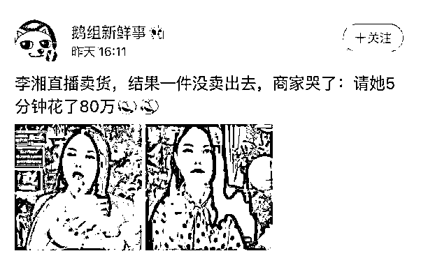

# 陈小春带货也“翻车”：商家花 51 万仅卖出 5000 元

> 原文：[`mp.weixin.qq.com/s?__biz=MzIyMDYwMTk0Mw==&mid=2247526463&idx=3&sn=e4b44ca799466125a44657ddebf39a26&chksm=97cba307a0bc2a11c0c8496bf74145c0d04f7cc807b8d83c66863da0ee1085d232173a71b9ee&scene=27#wechat_redirect`](http://mp.weixin.qq.com/s?__biz=MzIyMDYwMTk0Mw==&mid=2247526463&idx=3&sn=e4b44ca799466125a44657ddebf39a26&chksm=97cba307a0bc2a11c0c8496bf74145c0d04f7cc807b8d83c66863da0ee1085d232173a71b9ee&scene=27#wechat_redirect)

签下价值 51 万元直播带货合同，安排陈小春和网红一起带货，结果 3 场直播只卖出 5000 元，商家一纸诉状将负责直播推广的传媒公司告上法庭。

 12 月 25 日，上游新闻记者得知，广州市中院近日作出二审裁决，判决直播推广协议的传媒公司向原告商家返还 41 万余元服务费。

 上游新闻记者从广州市中院的这份（2021）粤 01 民终 19281 号民事判决书中看到，2020 年 10 月，某按摩器公司与某传媒公司签订一份《双 11 矩阵直播推广协议》，协议约定：2020 年 11 月 1 日-2020 年 11 月 11 日，传媒公司提供 16 场次直播销售推广活动，其中 10 场由粉丝总量大于等于 1000 万的达人执行，6 场由其他明星达人主播在其互联网直播间执行。

 在按摩器公司按约支付 51.5 万元的推广服务费后，传媒公司又向按摩器公司发来《双 11 直播更改说明》，将原来 16 场直播的主播执行人，改为实际安排影视明星陈小春加 3 名网红，时间为 11 月 5 日-11 月 11 日，并约定服务费减少 10 万元。

 11 月 5 日下午，陈小春的直播由于在直播时没有在直播间上商品链接，导致仅直播几分钟按摩器公司商品就被下架。后传媒公司在当日晚上安排了陈小春的助理补播。上述 4 场直播完成后，按摩器公司的商品销售额仅 5000 余元。

 广州市中院二审审理后认为，《双 11 直播更改说明》中将原合同中的 16 位主播变更为 3 位网红和陈小春，但同时说明其他合同内容不变。即《双 11 直播更改说明》只是减少了拟参加主播的人数，但并未将直播场次从 16 场变更为 4 场。

 在实际直播执行中，主播甲、主播乙、网红丙的直播场次均为 1 场，陈小春直播 1 场后，因涉案商品没在直播间上商品链接导致下架，需要陈小春补充直播 1 场，但陈小春本人未能直播，而是由其助理代替陈小春补播，助理补播的效果显然不能等同于陈小春，且陈小春助理也不是原合同约定的流量主播，故应视为陈小春直播不成功。综上，传媒公司实际安排直播成功共计 3 场，但合同约定应直播 16 场，故某传媒公司严重违约。

 法院认定，因《双 11 直播更改说明》只是减少了拟参加主播的人数，其他合同条款不变，故原合同约定的 ROI 保证当然应继续适用。第二，按照合同约定的 ROI 保证，直播销售保底数额高达 100 万元以上，但实际直播后的销售额仅为 5000 元，继续履行合同由传媒公司补播 3 场显然已经无法实现合同目的，所以按摩器公司不再要求补播并且要求退款合理，广州市中院予以支持。

 广州市中院终审判决，按摩器公司选择按照未能直播的场次比例退款合理，即传媒公司应向按摩器公司总计退还服务费 418437.5 元（515000 元*13/16）。

**律师提醒：应注意 4 点**

“这起案件非常具有行业的典型性。”重庆一位长期为网络电商提供服务的服务商戴先生告诉上游新闻记者：“电商逻辑里有三大环节非常重要，销售、选品、供应链，一般做直播会给商家做销售托底，不然谁干呢？除了娱乐明星主播，带货主播比拼的就是卖货能力。”戴先生指出：“电商规则是以天为单位变化的，这个案件就是双方在前端的工作没做好。”

重庆渝和律师事务所律师周小山提醒商家，签署直播带货委托协议，为了避免履行过程中产生争议应注意四点：

 第一，应该对直播细节进行具体的约定，比如主播、直播场次、直播平台、直播方式以及直播时间，甚至直播间的布置等，让每个环节都可以有章可循；

 第二，直播应达到的目标或效果，应明确约定；

 第三，约定如果受托直播方没有按照约定履行，没有达到约定目的，该承担什么责任；

 第四，合同履行过程中，一方的沟通意见，另一方应及时答复明确表态，以免误解。

**那些年“翻车”的带货明星**

**杨坤：** 

**卖了 120 万退货 110 万**

2020 年 11 月 8 日，杨坤在自己的直播间进行带货直播，这天他共售卖羽绒服、面膜等 40 样产品。商家给出的坑位费从 10 万到 13.5 万不等，其中一家还给出了杨坤销售额 20%的佣金。

 但令他们没有想到的是，满心期待的直播带来的并不是销售奇迹，而是惨烈的“翻车现场”。

 有商家称收回坑位费需要卖出 3500 单，最后只卖出了 180 单 3 万多元；99 元一盒的面膜销售了 1.8 万元，但退款近 4000 元；有的商品虽然直播时下单情况很好，但最后出现了 90%退款的情况。其中一个商家花了 12 万元的坑位费，当天总销量 120 万元，没想到仅过一天就大量退款 110 多万元，实际销售额只有 4 万元。

 商家意识到杨坤的直播间中可能存在“刷单”行为，联合起来建立了“杨坤直播被坑商家”维权群。对于商家的损失，运营总监表示可以“补播”就“补播”，但是无法退款。

 最后商家选择报警，但民警表示即便有证据表明杨坤直播靠刷单来冲量，也只能说是“以次充好”，不算“诈骗”，只能算民事纠纷，因此建议走法律途径，警方不予立案。

 **吴晓波：**

**860 万人观看只卖出 15 罐奶粉** 

2020 年 6 月 29 日晚，吴晓波在淘宝开启直播“新国货首发”专场。根据此后官方公布的数据显示，当晚 5 小时的直播吸引了 860 万人次观看，带货销量 3.4 万件，GMV 近 2400 万元。

 但事后有参与的商家表示：“我们付了 60 万元坑位费，实际成交 5 万元都不到。真是令人大跌眼镜。”另一家乳业公司则表示在吴晓波的直播上只售出 15 罐奶粉。

 事件曝光后，吴晓波发表了题为《十五罐》的反省文章。

 **汪涵：**

**开播费 10 万，退货率 76%**

2020 年 11 月 6 日，银河众星直播机构旗下艺人汪涵举办“顺德专场直播”。有参加活动的商户在直播后公开发表质疑，称开播费 10 万，当天成交 1323 台，退款 1012 台，退款率 76.4%，ROI 仅为 0.3，“更令人气愤的是直播进行中出现大批多台退款单的刷单行为，导致我店铺收到平台的虚假交易警告。”

11 月 12 日，汪涵签约的直播机构上海银河众星电子商务有限公司发布声明称，该司从未有任何虚构数据或购买流量的行为，“合理怀疑是第三方以刷单为手段的不正当竞争行为”。

 **李湘：**

**5 分钟带货费 80 万****1 件都没卖出去**

**2020 年 4 月，某商家请李湘直播卖貂毛衣，该商品原价 8313，折后价是 4988，李湘直播间的价格再减 800 元，结果一件也没有卖出去。商家只能出来哭诉：请她 5 分钟，花了 80 万的坑位费打水漂了。**

****

****“广东雨神”+王晶：****

****花 8 万仅售出 6 瓶护肤品****

****

**2020 年 7 月，某护肤品公司与经纪公司签订《推广合作协议》，载明“鉴于乙方拟在某平台与广东雨神和导演王晶举办活动，甲方有意委托乙方通过指定活动推广甲方指定的商品”，指定的商品名称为某氨基酸洁颜蜜，推广服务费为（含税）82820 元。**

 **直播当晚，网络科技公司安排主播“广东雨神”进行直播推广活动。该护肤产品的推广时段开始时间为当晚凌晨 00:07 左右。期间协议约定的导演王晶并未出镜，产品最终的销售额仅为 6 瓶共计 800 余元。**

 **事后护肤品公司将经纪公司诉至法院，请求经纪公司赔偿相应损失等各项费用共计 9.7 万余元。**

 **法院审理认为，原告产品销售时段被安排在凌晨，且直播过程中王晶始终未出镜，被告未完全按照协议约定履行义务，履约行为存在瑕疵，构成违约。综合本案实际情况，法院酌定被告经纪公司应向原告赔偿服务费损失 2.5 万元以及其他各项诉讼费用共计 3.5 万余元。**

**来源：上游新闻，澎湃新闻******

**← 向右滑动与灰产圈互动交流 →**

****