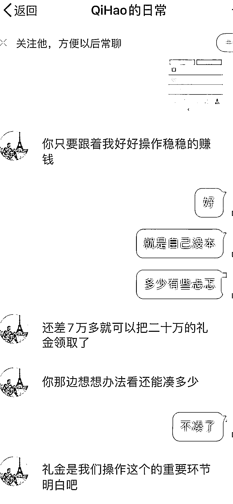
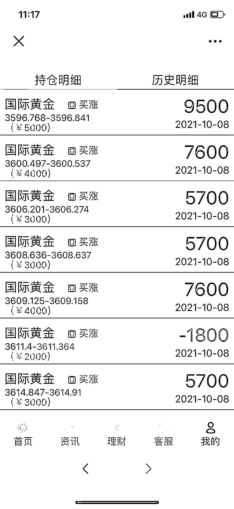
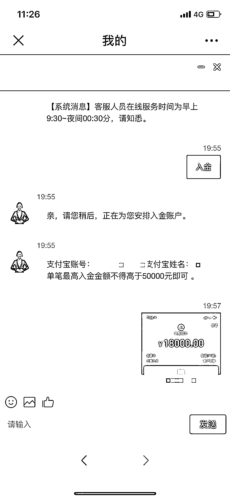
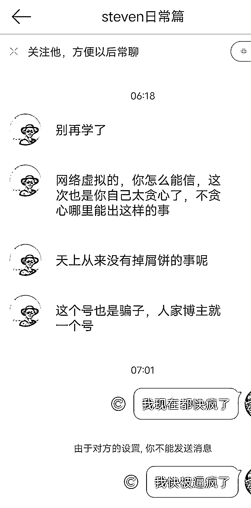

# 1 个月内连骗 3 人，警惕这种新型“杀猪盘”

> 原文：[`mp.weixin.qq.com/s?__biz=MzIyMDYwMTk0Mw==&mid=2247526463&idx=4&sn=32cf6e4b8154216280f5457f01cf9e01&chksm=97cba307a0bc2a11fe8d0dd8b0fe173795d62b308f00a2a26c5f42427fc46c131f3c2fcdfd01&scene=27#wechat_redirect`](http://mp.weixin.qq.com/s?__biz=MzIyMDYwMTk0Mw==&mid=2247526463&idx=4&sn=32cf6e4b8154216280f5457f01cf9e01&chksm=97cba307a0bc2a11fe8d0dd8b0fe173795d62b308f00a2a26c5f42427fc46c131f3c2fcdfd01&scene=27#wechat_redirect)

“我一直知道‘杀猪盘’这个词，但没想到只是和微博网友聊聊天，这种事会发生在自己身上。”近日，多名女性向澎湃新闻爆料称遭遇了微博私信杀猪盘，被骗金额从 7 万元到 40 万元不等。

不同于以往“放长线钓大鱼”的诈骗形式，微博私信“杀猪盘”往往是在私信闲聊时透露投资项目，引诱受害人参与投资。看似普通志同道合的网友聊天，实际暗藏目的，短短几天内被骗走大额资金。被骗后，受害人发现骗子有多个相似账号，图片、文案一致，“但我们只能申请封掉骗我们的账号，其他的还能继续行骗。”受害人梁萍（化名）说。

 对此，新浪微博客服表示，平台对网络诈骗非常重视，并专门设立了六类诈骗信息的直接投诉渠道，但针对私信聊天诈骗，没有直接投诉方式。受害人可通过向微博平台进行线上投诉，并提供具体的被诈骗证据，如转账记录、聊天记录、诈骗账号链接、警方受理回执等，平台会视情节严重程度采取禁言直至关闭账号。

孕妈遭遇微博私信“杀猪盘”

今年 32 岁的梁萍（化名）是一名体育教练，由于怀孕不得不减少工作。今年 10 月 7 日，一名微博名为“QiHao 的日常”的男士频繁私信她，“他经常关心我，我刚好没什么事，就聊了一下，对方会和我聊一些旅游、创业、家庭之类的话题，感觉很能站在我的角度去理解我，还知道我所在地方的风土人情，让人感觉很真实。”

诈骗人员在聊天中引导梁萍跟着他投资 

抱着谨慎的态度，梁萍并没有添加对方微信，而是在微博私信中聊天。聊天过程中，对方不时透露自己家境良好，正在一边创业一边进行投资，“他的微博都是发一些各地旅游照片，还有在高档餐厅、酒店的个人照片，感觉形象很不错。” 

在谈及家庭的话题时，梁萍曾透露出自己的担忧，“我当时说担心怀孕工作减少了会影响收入，而且还有未来养育孩子的压力，对方听说后，就利用我的这种心理和信任，说可以带着我投资国际黄金。”

诈骗人员发来的投资平台内界面 

梁萍说，对方给她发来了一个名为 GTC 的链接，她上网搜索后发现，确实有一家名为 GTC 泽汇资金的公司，从事外汇、贵金属等在线交易。“因为我自己金融知识比较匮乏，最初都是三十、四十的投，他让我买哪个我就跟着买，后来发现能赚钱，投的钱就开始多了。”梁萍说，投资的钱除了一部分家庭存款，还有 6 万多元是网贷资金，“也是他让我网贷，说利用网络资金赚钱。”

梁萍告诉澎湃新闻，对方以充值送礼金为由，诱导她大额充值，“比如充 1 万送多少，充 10 万送多少礼金，他说礼金就相当于赚的钱，再拿去买国际黄金。”在梁萍充值 10 万本金时，由于实在凑不齐，对方还帮她“垫资”了一部分，“当时特别感动，后来想想他们可能就是在平台上改改数字，或者平台客服可能就是他本人。”

“投资平台”客服引导梁萍转账投资解锁账户 

三天里，梁萍陆续投入 10 多万，一部分成功提现后又再投入其中，最终在账户被封时，梁萍账户内还有 74840 元。“发现被骗是 10 月 9 日晚上，登录时突然发现账户被冻结，和亲人沟通后才意识到被骗了。”梁萍告诉澎湃新闻，发现被骗后她曾要求对方退钱，对方拒不承认，随后将梁萍拉黑。

 回想被骗的经历，梁萍觉得不可思议，“现在想起来，家庭主妇防备心比较弱，再加上夫妻关系不好、对自身的认知不够，就很容易被骗。”被骗后梁萍前往所在地派出所报警，警方受理并立案。

 同时，梁萍也在微博上分享了被骗经历，并向微博管理员举报该账号，附上警方立案回执，要求封号并提供账号注册信息。但迟迟没有等来处理结果。

一个月内骗三人

多个账号内容相似

在梁萍等待微博管理员处理期间，骗子仍在继续行骗。

10 月 17 日，身在国外的王敏（化名）被名为“漂泊大江南”的男士私信搭讪，“上来也是各种关心，我知道网恋不靠谱，但觉得只是聊聊天而已，没想到还是被骗了。”

网聊几日后，王敏在对方引导下，向 GTC 平台陆续投入约 10 万元，“他还帮我垫资了 9 万”。投资两日后，王敏突然发现账号被锁、无法提现，“他让我再转钱激活账户，我想着赶紧把钱取出来，就又投了 18 万，结果还是被锁，他让我再投 20 万，但我没钱了，他就帮我垫了 13 万多，我自己投了 6 万多，我在国外网络不好，还以为是网络问题没到账，后来才意识到被骗了。”短短 6 天里，王敏损失了 35.8 万元。

 事后，她在微博上搜索，看到了梁萍发布的被骗经历，“我看到骗他那个人的微博，和骗我的账号，图片什么的都是一个人，只是换了名字。”由于王敏人在国外，也无法报警处理，“现在只能努力弥补，毕竟 35 万对普通家庭也不是小数目。”

梁萍说，在王敏被骗的同时，还有一名女性于 10 月 24 日被“漂泊大江南”以同样的方式骗走近 40 万元。10 月底，经三位被骗人多次投诉，两个账号被封。“骗子都是同时在骗，但微博封号差不多过了半个月，如果能早点封号，也不至于还有人被骗。”

更让梁萍更诧异的是，她通过在微博搜索骗子发布的文案，竟找出多个相似内容的账号，账号名如“steven 的日常”“Dennis 的日常”“Daniel 的回忆篇”“Howe 的日常”等，“微博发的照片都一样的，是同一个人，文案也大差不差。”

王敏联系另一个和诈骗人员内容相似的账号，对方承认是骗子 

王敏曾尝试对其中一个号私信套话，对方回复她“网络虚拟的，你怎么能信，这次也是你自己太贪心了，不贪心哪里能出这样的事”，并承认“这个号也是骗子，人家博主就一个号”，随后拉黑了王敏。

 梁萍联系上一个疑似博主本人的账号，该博主发微博称自己的图片被多个账号盗用，其中就有诈骗梁萍的账号，“我们以为这个人是照片本人了，但后来研究他的微博，发现有几组照片他发的比之前诈骗我的人还晚，也就是说这个号也可能是骗子，还想靠声明来证明自己是真人。”梁萍认为，这些账号背后或许都是一个人在运营，“他们盗图伪装高富帅，再来和你套近乎。”

已设置 6 类诈骗直接投诉渠道

如今报警已经超过两个月，梁萍仍然没能追回自己被骗的款项。12 月 25 日，澎湃新闻记者致电兴宁市永和镇派出所，民警称案件正在调查中，暂无进展。

梁萍告诉澎湃新闻，她曾发微博点名几个图片相同、文案相似的疑似诈骗账号，但随后发现被点名账号均更改了名称，“没有人来回复我说被污蔑，而是直接改名，说明存在问题。”

梁萍说，按照目前微博的机制，改名后再点击账号名会显示“用户不存在”，无法起到提醒他人的作用，“他们改名后可能正在诈骗其他的女性。”她表示，自己也曾向微博平台投诉上述几个和诈骗人员图片、内容一致的账号，要求封号，但由于缺乏证据，没有下文。

 对此，12 月 25 日，澎湃新闻记者致电新浪微博平台，客服人员称，平台对网络诈骗非常重视，并专门设立了“微博防诈骗”账号，用于发布防诈骗信息、接受微博诈骗投诉，“我们接到的诈骗投诉主要以仿冒他人诈骗类型居多，比如在原账号昵称后面加一个小符号，然后私信原账号的好友实施诈骗。”

客服人员表示，为了预防诈骗，平台提供了多种线上投诉途径，今年 9 月，还根据诈骗信息的常见表现形式，设置了六类诈骗信息的直接投诉渠道，包括高仿账号诈骗、发布虚假网络兼职信息、冒充票务公司售卖演唱会赛事门票、蹭热点事件附带支付宝链接、给未关注人私信红包样式的木马病毒、大额投注返钱活动。但其中没有针对私信“杀猪盘”设置直接投诉渠道。

 对于梁萍等人被骗的遭遇，客服表示，可以通过向微博平台进行线上投诉，并提供具体的被诈骗证据，如转账记录、聊天记录、诈骗账号链接、警方受理回执等，来得到处理。但是否会被封号，还要看平台的调查结果，对于发布诈骗信息的账号，平台会视情节严重程度采取禁言直至关闭账号。同时建议报警处理，若警方有需要，平台可配合警方提供相关信息。

来源：澎湃新闻

← 向右滑动与灰产圈互动交流 →

