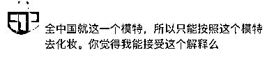
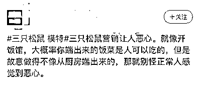
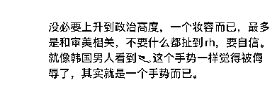
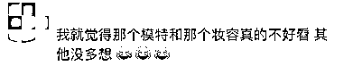

# 三只松鼠又又又翻车了！

> 原文：[`mp.weixin.qq.com/s?__biz=MzIyMDYwMTk0Mw==&mid=2247526509&idx=1&sn=9e74c3b880135e2fc5af10c13ee2e579&chksm=97cba355a0bc2a43cfdcb457f98e4df99b3164f457fedb45f74de16ff98d0d2d784e0e485cb2&scene=27#wechat_redirect`](http://mp.weixin.qq.com/s?__biz=MzIyMDYwMTk0Mw==&mid=2247526509&idx=1&sn=9e74c3b880135e2fc5af10c13ee2e579&chksm=97cba355a0bc2a43cfdcb457f98e4df99b3164f457fedb45f74de16ff98d0d2d784e0e485cb2&scene=27#wechat_redirect)

近日，有网友晒出三只松鼠 2019 年 10 月份的产品宣传海报，因海报中模特的“眯眯眼”、厚嘴唇等元素，部分网友认为三只松鼠在故意丑化国人，此事在微博上引发争议。

26 日，三只松鼠发布声明表示，经查，该产品于 2019 年 10 月上线，该页面中模特为中国人，其妆容均基于其个人特征打造，无刻意丑化。对于网友由此产生的不适感，三只松鼠深表歉意，并第一时间已进行页面的替换，且已安排排查公司其他产品页面，杜绝类似情况产生。

有网友拿本次的三只松鼠事件与此前引发众怒的陈漫事件相关联。

据媒体此前报道，在上海展出的《迪奥与艺术》展览中，一张由中国摄影师陈漫 9 年前拍摄的照片，引发质疑。（→）

此前，还有类似事件发生，请看下文链接：

[清华美院毕设这几个模特的妆容被网友骂了，这眯眯眼是在“自取其辱”？](http://mp.weixin.qq.com/s?__biz=MzIyMDYwMTk0Mw==&mid=2247516260&idx=1&sn=8f9b9a170942e7d54145473d25a2e475&chksm=97cb4b5ca0bcc24a7f03e7ce205b4578285fe1aef5adde5c14ffc41a4e5b823693ae391755d5&scene=21#wechat_redirect)

照片中，一位亚裔女性拿着迪奥经典款戴妃包。乌黑的眼影，暗沉带有雀斑的脸色，油腻的头发，还戴着清朝护甲……网友怒批“太阴间”“丑化亚裔”。

此后，@DIOR 迪奥 及@陈漫 ChenMan 均对此事作出回应。

@DIOR 迪奥 称，该作品并非商业广告，网络舆论出现后，迪奥立即予以高度重视，随即删除该作品在迪奥官方线上及线下相关内容。@陈漫 ChenMan 表示，其早期艺术观尚未成型，参加展览时对策展概念也不甚了解，使得当时的作品欠缺思考。同时表示，将深深反思，并正式向大家道歉。

三只松鼠相关负责人在接受中新经纬采访时表示，该广告宣传页面于 2019 年 10 月上线，时值国潮风流行，因此选择“国潮风”来进行广告拍摄，意图传达给消费者国潮的视觉感受。“该页面中模特为中国人，其妆容均基于其个人特征打造，绝无刻意丑化之意。陈漫事件是今年 11 月份的事，所以根本就没关系。”

针对该事件，有网友认为三只松鼠确实存在问题：

也有网友觉得只是一个妆容而已，没必要上纲上线：

此前报道：

[三只松鼠 90 后总监被判刑，原因竟是盗卖公司废纸箱获利 34 万](http://mp.weixin.qq.com/s?__biz=MzIyMDYwMTk0Mw==&mid=2247516382&idx=6&sn=a4068dc45416be7114751d3bf41389b7&chksm=97cb4be6a0bcc2f0dc259adae2f2f683d5dc8299caac0a85082406db47c10e5ca535d1086a45&scene=21#wechat_redirect)

[传三只松鼠某总监猥亵实习生致其抑郁割腕！](http://mp.weixin.qq.com/s?__biz=MzIyMDYwMTk0Mw==&mid=2247520664&idx=2&sn=0e5725240ad645eb9eac3a1632258510&chksm=97cb5aa0a0bcd3b6cb2def0e18dd321c73dff134a3b6d95c2950f4c32fc5faaa7eb76b91ee2d&scene=21#wechat_redirect)

[发霉、长毛、吃出虫卵！三只松鼠又出问题！](http://mp.weixin.qq.com/s?__biz=MzIyMDYwMTk0Mw==&mid=2247524177&idx=2&sn=4fc6d56637756efc745aa3b520888694&chksm=97cb5469a0bcdd7f5760f4ea2d7f2ddcb09758d23298d0ff8d8c2a09b2efff7615490fad44d5&scene=21#wechat_redirect)

来源：中国新闻网

← 向右滑动与灰产圈互动交流 →

