# 三只松鼠模特发声：眼睛小不配做中国人？

> 原文：[`mp.weixin.qq.com/s?__biz=MzIyMDYwMTk0Mw==&mid=2247526569&idx=1&sn=f6bede88b8c613d63e76461d45f9a52f&chksm=97cba391a0bc2a877d585b3bab7304e5be35348d308c5f25324c66469fa146eb88196faede9b&scene=27#wechat_redirect`](http://mp.weixin.qq.com/s?__biz=MzIyMDYwMTk0Mw==&mid=2247526569&idx=1&sn=f6bede88b8c613d63e76461d45f9a52f&chksm=97cba391a0bc2a877d585b3bab7304e5be35348d308c5f25324c66469fa146eb88196faede9b&scene=27#wechat_redirect)

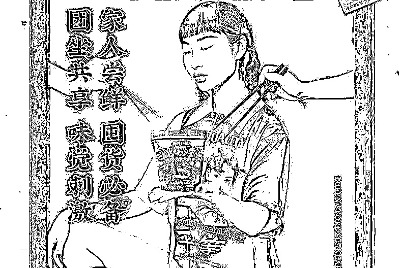

本文转载自环球网

近日，有网友晒出三只松鼠 2019 年 10 月份的产品宣传海报，因海报中模特的“眯眯眼”、厚嘴唇等元素，部分网友认为三只松鼠在故意丑化国人，此事在微博上引发争议（**→**[**三只松鼠又又又翻车了！**](http://mp.weixin.qq.com/s?__biz=MzIyMDYwMTk0Mw==&mid=2247526509&idx=1&sn=9e74c3b880135e2fc5af10c13ee2e579&chksm=97cba355a0bc2a43cfdcb457f98e4df99b3164f457fedb45f74de16ff98d0d2d784e0e485cb2&scene=21#wechat_redirect)）。

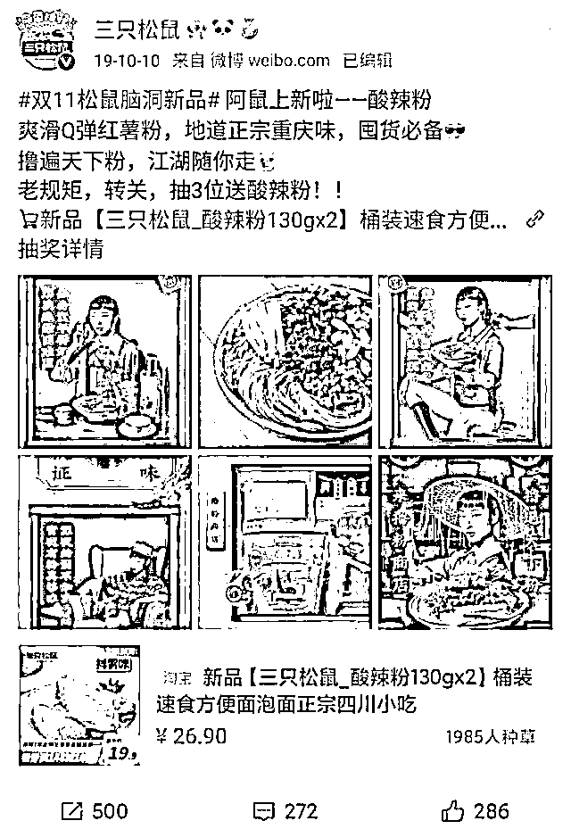

12 月 26 日，模特@菜孃孃 在微博上回应称，自己没有故意要去营造辱华形象，做的仅是按照商家的要求拍出商家要的东西。“我眼睛小就不配做中国人了？”

[`mp.weixin.qq.com/mp/readtemplate?t=pages/video_player_tmpl&action=mpvideo&auto=0&vid=wxv_2197480511118376961`](https://mp.weixin.qq.com/mp/readtemplate?t=pages/video_player_tmpl&action=mpvideo&auto=0&vid=wxv_2197480511118376961)

来源：极目视频

她表示，可能每个人审美不一样，也许有些朋友欣赏不了我这种类型，但是也大可不必这样来攻击我，萝卜白菜各有所爱。 

最后她说，希望广大网友不要再私信进行人身攻击，自己不是什么超模，也不是什么公众人物，只是一个热爱自己祖国、遵纪守法的中国公民。

**全文如下：**

大家好，我是菜孃孃(白菜)，这个图片上的模特，四川乐山人，一整天忙于工作，没有时间看手机。但没想到忙完一看我得手机，抖音私信等，以及我的亲朋好友都在问我，关于三只松鼠辱华的事，我想我还是需要跟大家表达一下我的态度。

首先我拍这个广告时间线是在 19 年 10 月，眼睛，确实就是长成这个样子，因为我的性格，和表演风格被选中做这个广告模特。也没有故意要去营造什么辱华形象。很多朋友告诉我我上了热搜我也是一脸懵，我在网上看见很多朋友对于我长相的讨论，作为一个专业模特，我需要做的就是按着商家的要求拍出商家要的东西，我不知道我怎么就给辱华扯上了关系，关于网上的评论我很无奈，我不知道我做错了什么要遭受这种网络暴力，我只是一个普通的打工人，完成我自己的工作。我眼睛小就不配做中国人了？

对于这些网友我真的也很无语，其中有一条评论明明模特眼睛很大画成这么小哈哈哈哈我笑出了声音突然遭受到网络暴力我真的也很无奈，我真的有被气笑了，长相是父母给的，可能每个人审美不一样，也许有些朋友欣赏不了我这种类型，但是也大可不必这样来攻击我，萝卜白菜各有所爱。我眼睛就是这样，甚至生活中比这还细小。那是不是说长这样了就不该选择模特这个职业？长这样了出生那天就在辱华了？那是不是也可以告你歧视了？爱国我举双手赞成！但事事都要上纲上线，那这就是一种病态了！大家做一个心态健康的网民吧。

你们在骂我的同时有没有想过我的职业是模特，我靠这个吃饭，在这个互联网时代，我希望大家可以善良一点，你们的节奏带的很好，我眼睛小就不该是中国人？我招谁惹谁了？

其次我觉得长相的问题首先轮不到别人来论头论足每一个人都有自己的特点自己的人格魅力，而不是单单只凭长相就能定义的。我的性格是非常开朗上进爱运动阳光的女孩，我相信和我接触过的人都能站出来替我说话反驳这些无谓的评论。

最后希望广大网友不要再对我私信进行人身攻击，不是什么超模，也不是什么公众人物，只是一个热爱自己祖国、遵纪守法的中国公民。这是我的工作，请不要上升到人身攻击！这些言论确实会对我造成一定的影响。如果你不喜欢你可以不看但是如果上身到人身攻击这就是需要采取法律了。我依然热爱我的模特事业，也不会因为这件事而改变自己的性格和乐观的态度和长相去迎合市场。每一个人都有属于自己的魅力！

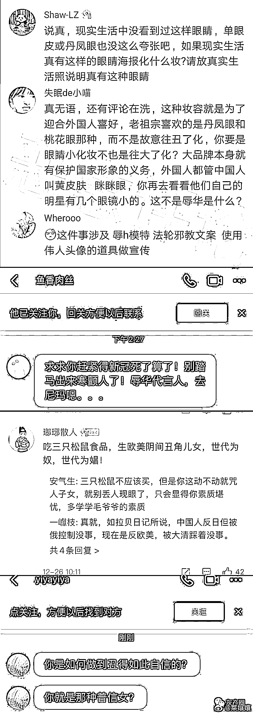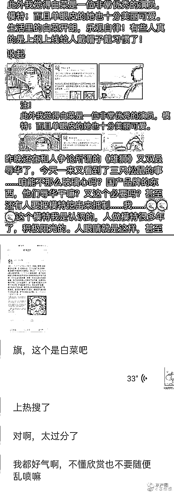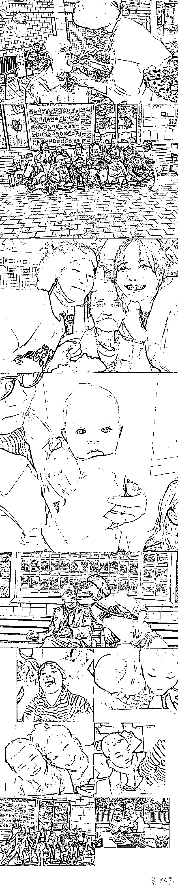

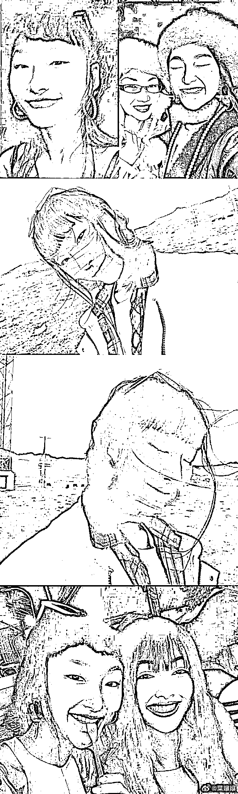

**26 日，三只松鼠发布声明表示，经查，该产品于 2019 年 10 月上线，该页面中模特为中国人，其妆容均基于其个人特征打造，无刻意丑化。对于网友由此产生的不适感，三只松鼠深表歉意，并第一时间已进行页面的替换，且已安排排查公司其他产品页面，杜绝类似情况产生。**

**有网友拿本次的三只松鼠事件与此前引发众怒的陈漫事件相关联。** 

**三只松鼠相关负责人在接受中新经纬采访时表示，该广告宣传页面于 2019 年 10 月上线，时值国潮风流行，因此选择“国潮风”来进行广告拍摄，意图传达给消费者国潮的视觉感受。“该页面中模特为中国人，其妆容均基于其个人特征打造，绝无刻意丑化之意。陈漫事件是今年 11 月份的事，所以根本就没关系。”**

**针对该事件，有网友认为三只松鼠确实存在问题：**

**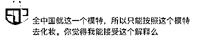**

**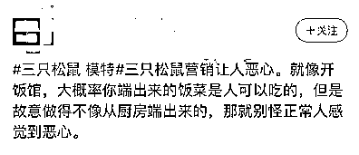**

**也有网友觉得只是一个妆容而已，没必要上纲上线：**

**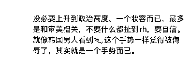**

**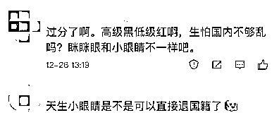**

**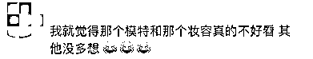**

**来源：观察者网综合自@菜孃孃、中国新闻网、极目视频**

****

**← 向右滑动与灰产圈互动交流 →**

****