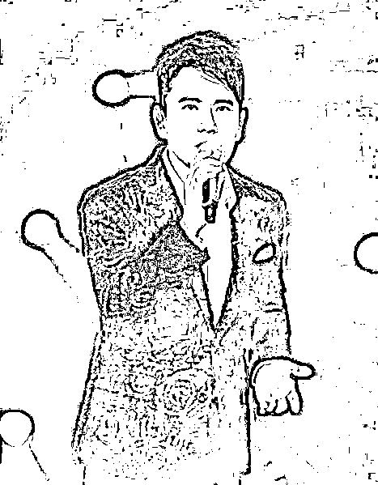
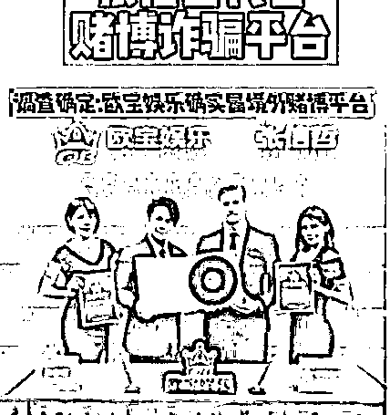

# 张信哲被实名举报，为境外网络赌博诈骗代言，古天乐受牵连

> 原文：[`mp.weixin.qq.com/s?__biz=MzIyMDYwMTk0Mw==&mid=2247526569&idx=2&sn=3fced7471fe78ed37792b4477a4ece0c&chksm=97cba391a0bc2a87832ff29a78cd374aa42c4f1c1415ee8393166b7e9ba2d86fb0e8f8a4cf4c&scene=27#wechat_redirect`](http://mp.weixin.qq.com/s?__biz=MzIyMDYwMTk0Mw==&mid=2247526569&idx=2&sn=3fced7471fe78ed37792b4477a4ece0c&chksm=97cba391a0bc2a87832ff29a78cd374aa42c4f1c1415ee8393166b7e9ba2d86fb0e8f8a4cf4c&scene=27#wechat_redirect)

张信哲，1967 年出生于台湾，是著名歌手。他最近被实名举报，为境外网络赌博诈骗平台代言。事情不断发酵，后来连古天乐也牵扯其中。 

张信哲一直被称为情歌王子，作为华语乐坛的常青树，张信哲的社会评价一向很高。他为人低调，没有任何负面新闻，其歌曲《信仰》《过火》《爱如潮水》等，传唱度都非常高，他本人也深受歌迷的喜爱。张信哲在音乐界算是资深级的人物代表，影响力非常大，所以他代言的产品，信服力都很高。

这次遭到网友实名举报，称他不顾社会影响，在疫情期间，公然为菲律宾网络赌博平台代言，致使很多人受到赌博的陷入深渊，深受其害。

据悉，张信哲代言的网赌诈骗推销广告没有在主流媒体宣传，而是在小平台中大规模推广，打着张信哲的名号，到处诱骗受害者进行赌博。

可能张信哲本人并不了解，他所代言的平台是什么背景，没有做好调查核实才会被利用。如果张信哲明明知道自己代言的广告会涉及到网络赌博诈骗，还去做推广。那么，他已经触犯到法律的底线。作为一个公众人物，被发现后其负面影响可想而知。

如果张信哲也是受害者，是别人利用张信哲的影响力进行非法宣传，那就可以通过法律来维护自己的合法权益。

网赌跟线下赌场不一样，其传播速度快隐蔽性高，涉及的人群范围也更加广泛。疫情期间好多人在家无事可做，经不住就沾染上了赌博。

不光是张信哲身陷舆论风暴，连古天乐都受到牵连。有网友称古天乐曾经为赌博大佬洗米华的太阳城赌场代言过。太阳城集团成立时，古天乐出席开业仪式并担任代言人。后来洗米华庆祝太阳城集团成立 12 周年，大摆筵席，古天乐、汪峰均为座上宾。

参与网络赌博本身就是违法的，有许多人深受赌博的侵害，有无数个幸福的家庭，因赌博而破裂。十赌九输，希望大家远离赌博，在赌博中没有永远的赢家。也奉劝参与赌博的人不要等以后才后悔，趁早收手。

也提醒明星艺人，代言不能随便接，要先确定没有任何违法违规行为，慎用自己的影响力。维护好自己的公众形象，才能获得长久发展。大家觉得呢？

来源：鹿头社，阻击诈骗

← 向右滑动与灰产圈互动交流 →

