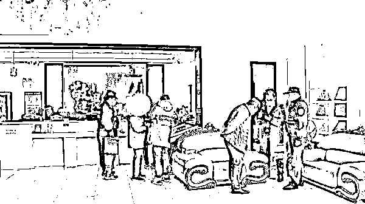

# 85 岁老人半年足浴店消费近四十万，店长称最贵一次 2.5 万

> 原文：[`mp.weixin.qq.com/s?__biz=MzIyMDYwMTk0Mw==&mid=2247526569&idx=3&sn=82e379ec23c8dd95999c1cfd763fa182&chksm=97cba391a0bc2a879bb1dcda60cb373192a6107f0c30c434ed643743f7799679a531b74f4cc7&scene=27#wechat_redirect`](http://mp.weixin.qq.com/s?__biz=MzIyMDYwMTk0Mw==&mid=2247526569&idx=3&sn=82e379ec23c8dd95999c1cfd763fa182&chksm=97cba391a0bc2a879bb1dcda60cb373192a6107f0c30c434ed643743f7799679a531b74f4cc7&scene=27#wechat_redirect)

浙江嘉兴市一名 85 岁老人，今年 5 月起在一家足浴店消费近四十万元，家人直到收到银行对账单才发现。

“账单足足 15 页纸，其中付给足浴店账户的 23 万多，还有转给店里三个技师的钱，加起来 16 万多。”近日，嘉兴的小金向嘉兴电视台投诉当地一家足浴店，称自己 85 岁的爷爷近半年来在该店花掉了近四十万元。

据该台“嘉兴小新”栏目报道，小金表示，爷爷平时节俭，不知道为什么迷上了去足浴店，把家里多年积蓄都砸了进去，奶奶已经气得好几天睡不着觉。

12 月 22 日，小金和电视台记者以及浙江国毅（嘉兴）律师事务所律师张磊去足浴店交涉。

12 月 24 日，澎湃新闻（www.thepaper.cn）从张磊律师处获悉，22 日白天交涉时，足浴店无法提供小金爷爷的充值、消费清单，并称接受转账的技师已经离职。

小金提供的银行对账单显示，爷爷 5 月起开始充值，开始金额较小，几千元，后来越来越大，每笔数万元。转给三个技师的共有 16 万多，最多一人转账 54 笔，加起来 12.8 万元。

“店长承认，小金爷爷因为‘认可店里的服务’，几乎每天都去足浴店消费。有时需要 4 名技师同时做足浴、背部按摩，再加上仪器，所以价格贵，最高一次用了 2.5 万元。”张磊告诉澎湃新闻。

对店长说法，小金不认可：“就算一个技师 298 元，难道 2.5 万元是同时 100 个技师服务？”

12 月 22 日交涉现场

张磊当时向店长表示，技师私自接受转账，已经涉嫌诈骗，足浴店也需要承担法律责任。交涉现场，小金报警后，派出所民警到现场要求足浴店出示消费清单。

“22 日晚，小金称足浴店提供了消费清单，并退回了所有充值款。”张磊告诉澎湃新闻。

   [`v.qq.com/iframe/preview.html?width=500&height=375&auto=0&vid=s3315bb0a30`](https://v.qq.com/iframe/preview.html?width=500&height=375&auto=0&vid=s3315bb0a30) 

来源：澎湃新闻，利箭在行动

← 向右滑动与灰产圈互动交流 →

