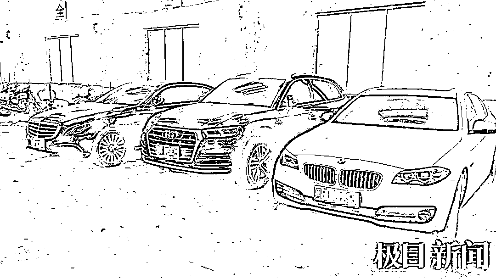
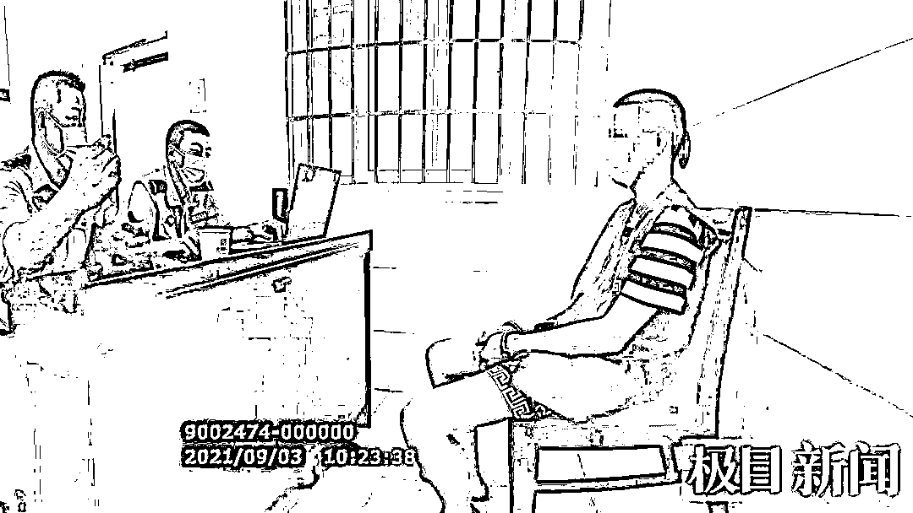
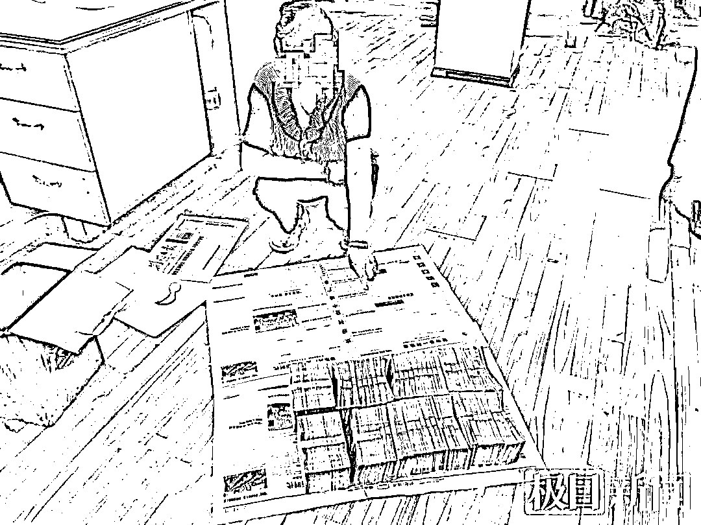
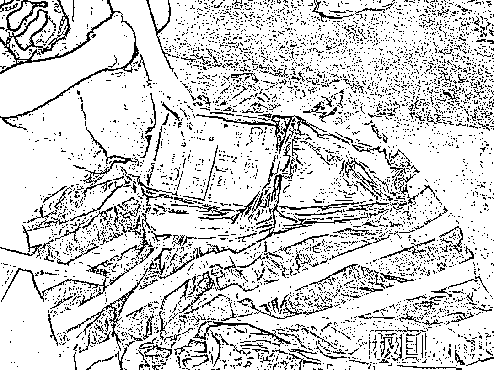

# 00 后金主在国内遥控境外诈骗，涉案 3000 多万，赃款藏到菜地里

> 原文：[`mp.weixin.qq.com/s?__biz=MzIyMDYwMTk0Mw==&mid=2247526569&idx=5&sn=d2018d914a5f367e3ed7fdd6fc7fe013&chksm=97cba391a0bc2a87504a94b4ffa596aeda17846eb6efe7f8be67c51a1778ca8c63c5f29ce4e8&scene=27#wechat_redirect`](http://mp.weixin.qq.com/s?__biz=MzIyMDYwMTk0Mw==&mid=2247526569&idx=5&sn=d2018d914a5f367e3ed7fdd6fc7fe013&chksm=97cba391a0bc2a87504a94b4ffa596aeda17846eb6efe7f8be67c51a1778ca8c63c5f29ce4e8&scene=27#wechat_redirect)

25 名“键盘手”牵出电诈大案

2021 年初，湖北荆门京山市公安局通过线索研判摸排，发现部分本地青年通过专门中介，有组织赴缅北从事电信网络诈骗活动。

3 月，京山警方抓获刘某等 25 名曾经在缅北充当电诈集团“键盘手”的回流人员。

刘某等 25 人均是京山本地人，去年 6 月起，他们在同乡好友的鼓吹引诱下，被偷渡组织以“出境务工”为由经云南边境偷渡至缅甸的勐波县，其实是为盘踞在当地的电诈窝点输送“键盘手”。

警方查扣的部分涉案车辆

刘某等人一进入公司便手机被没收，人身自由被限，每天接受培训洗脑，稍有不从就会招来体罚与殴打，更有甚者会被送去人人闻之色变的“水牢”遭受非人折磨。

在重重威逼利诱之下，这些原本被骗来的受害者一步步沦为吃人不吐骨头的电诈犯罪的帮凶。

刘某等人交代，他们在公司里的主要工作就是在网上寻找女子作为“猎物”，再用甜言让女子（“猪”）陷入网恋，并穷尽口舌引导“女友”投身网络赌博“投资”赚钱，美其名曰为他们今后“美好的爱情”打下物质基础。

最终让一位位相信美好爱情的女子四处举债欠下巨额债务，而“男友”却在她最困难的时候人间蒸发……

办案民警通过对刘某等人的深入询问，一个位于缅北、名叫“永隆公司”的电信网络诈骗集团浮出水面。

6 月 11 日，以荆门市公安局反诈中心和京山市公安局反诈中心、刑侦大队为主力的专案组正式成立，代号“6·11”。

民警审讯诈骗团伙“00 后金主”郑某

**20 个小组集中收网抓获 93 人**

“民警不能被电诈犯罪牵着鼻子走，我们的战术不但要根据当前的线索顺溜、弹跳，有时甚至要倒着爬。”

京山市公安局副局长曾忠在案情分析会上，带着专班民警们寻找破案的突破口。

专案组深挖过往相关电诈案件，深耕关联线索，在全国各地寻找永隆公司电诈参与者、受害人。

数以万计的碎片化案件信息慢慢在专案组汇集，神秘的境外永隆公司电诈集团的拼图渐渐清晰起来。

经过专案组近 1 个月的努力，永隆公司电诈集团幕后的头目“金主”京山籍青年郑某、聂某、邹某等 3 人被专案组揭开了神秘面纱。

起获的脏款

“抓捕行动现场开始，除骗务尽！”

7 月 2 日，荆门市公安局副局长、专案组指挥长熊杰发出指令，20 个抓捕小组分赴京山市、武汉市、广州市、上海市等地集中收网，共抓获犯罪嫌疑人 93 名，冻结 14 个账户 300 余万元，扣押资金 1200 余万元。

该诈骗集团中不乏“家族式”团伙成员，集团头目之一聂某的父亲本是一名普通职工，多次在国内协助聂某收取藏匿赃款，并购买一辆宝马轿车自己享用。

收网行动中，民警从聂某父亲家的菜地里挖出埋在土中的 90 余万赃款，同时从聂某外婆家起获 80 余万赃款。

办案民警介绍，永隆公司电诈集团，按“金主”（公司老板、股东，公司各类管理人员）、诈骗组的代理、诈骗组组长、键盘手等四个层级管理，并分为多个诈骗小组进行诈骗，犯罪集团成员多达 100 余人，其中荆门籍人员有 90 人。

**“00 后”金主境内操盘诈骗集团**

令人意想不到的是，电诈集团永隆公司“创始人”郑某竟然是京山一名千禧年出生的青年。

郑某 17 岁外出打工创业失败后，跟随亲友在福建混迹赌场谋生。

2018 年 4 月，他辗转前往金三角等东南亚地区参与电信网络诈骗犯罪活动，一步步从电诈集团的键盘手成长为电诈集团“领导”。

未料，中国警方与越来越多的国家组建联合行动，跨国打掉多个电诈集团，郑某等人迫于压力只好回国。

2020 年初，不甘穷混的郑某伙同聂某、邹某前往缅北投靠亲戚，“加盟”并开办“永隆公司”，实施“杀猪盘”类电信网络诈骗犯罪。

彼时，郑某和他们的“永隆公司”还受制于人，需向母公司上缴高比例的非法所得，且没有自己的洗钱路子。

2020 年 4 月，不甘寄人篱下的郑某掌握了电诈公司运营的所有伎俩，并打通了洗钱通道。

从此，翅膀硬了起来的郑某正式脱离母公司，独立运营，并开始大量招兵买马，当起了老板。

郑某对缅北诈骗窝点集团化作业，他躲在境内遥控指挥完成复杂的犯罪过程，一批批京山及各地的青年怀揣创业梦，被他们诱骗到缅北，从受害人被逼成电诈集团的帮凶。

“打工三个月，倒欠公司 6 万元，父亲汇过去 6 万才脱身。”被抓获的键盘手周鹏（化名）回忆道，“在缅北我感觉我的命，不如一条狗。”

周鹏回忆道，每天连续 15 个小时，甚至通宵的工作，打一次瞌睡要罚款 500，没加够好友要扣 1000，月度考核不合格罚 2000……

好不容易骗了 10 万，6 万归公司，4 万小组分，组里三个老板又各分 20%，落到七八个年轻人手上不足 500 块钱，还不够交罚款。

民警从菜地挖出 90 多万赃款

来源： 极目新闻  

← 向右滑动与灰产圈互动交流 →

