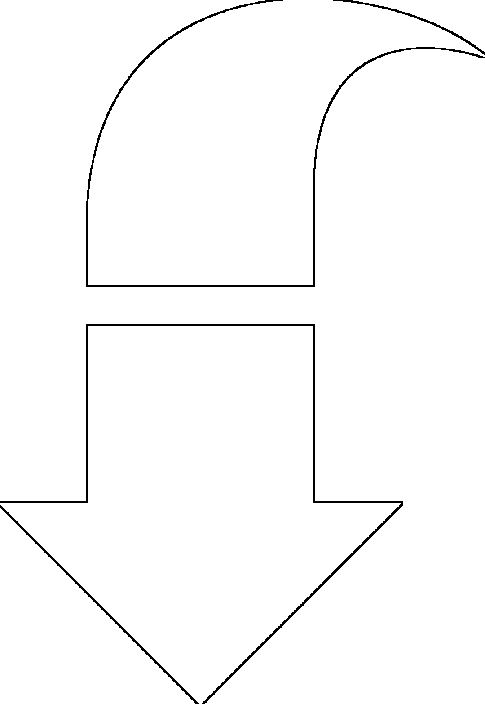
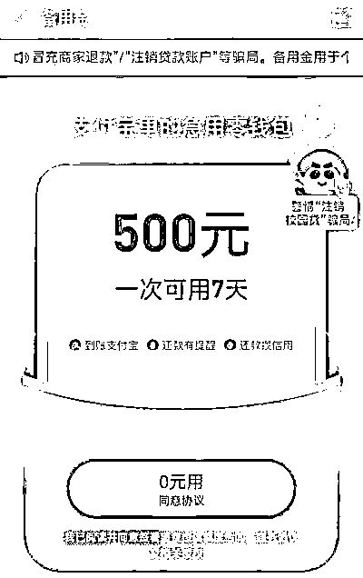
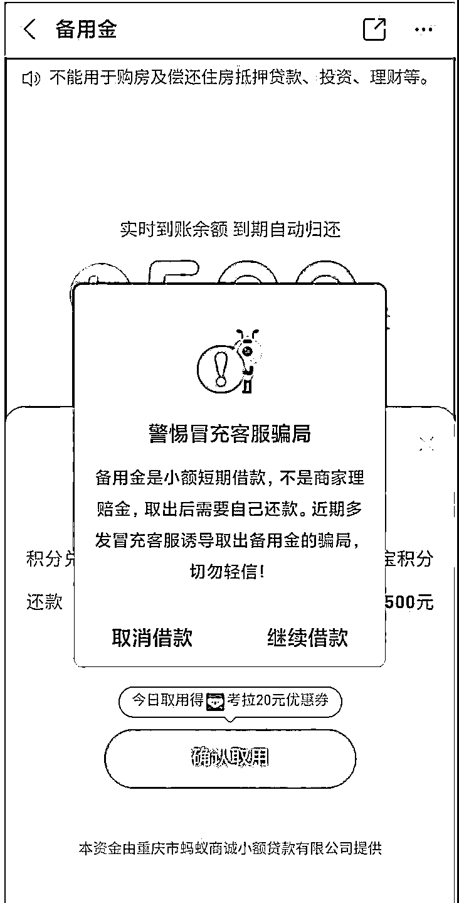

# 网购游戏贴纸被骗 15.8w！昆明小伙竟用支付宝“备用金”退赔

> 原文：[`mp.weixin.qq.com/s?__biz=MzIyMDYwMTk0Mw==&mid=2247526569&idx=7&sn=899b5590053093872af0580ed3b454c6&chksm=97cba391a0bc2a87fc33e1b09ce97c785e12e5c8afcda2e8ca982d9929c00816ec603fecdcf7&scene=27#wechat_redirect`](http://mp.weixin.qq.com/s?__biz=MzIyMDYwMTk0Mw==&mid=2247526569&idx=7&sn=899b5590053093872af0580ed3b454c6&chksm=97cba391a0bc2a87fc33e1b09ce97c785e12e5c8afcda2e8ca982d9929c00816ec603fecdcf7&scene=27#wechat_redirect)

16.6 元的游戏贴纸丢失了

快递竟然主动退赔

并补偿 50 元

但一番操作后

他竟然让我点开了支付宝“备用金”

还要屏幕共享

**危险！！！**

**“备用金”说成是理赔款**

**他信了！**

11 月 11 日，家住昆明官渡区的小韩接到一个自称是中通客服人员的电话，该客服说物流不小心把小韩的快递弄丢了，现在打电话来就是为了对他进行赔偿。接着，对方发来一个快递单号，小韩打开淘宝发现是自己买的价值 16.6 元的“王者荣耀”游戏贴纸。

看来这事儿是真的了，随后，对方称将赔付小韩 66.6 元人民币，多出的 50 元是物流的补偿。于是，小韩添加了对方的微信账号，并将丢失快递的订单和微信收款码截图发给对方。

客服指导小韩扫描一个“快递 100”的二维码进行退款操作。小韩扫码后发现是一个查询快递的微信小程序，他在微信小程序内操作退款，但一直都是提示验证码不对。

**打开屏幕共享后**

**15.8 万没了！**

客服随后就让小韩下载一个叫“teampro”的 APP，并输入一串会议号。小韩操作后，与客服进行了手机屏幕共享。客服让他登录支付宝，在里面申请备用金赔付，小韩按照对方指示操作，将钱从微信转到银行卡内后又转到对方账户。

11 月 11 日 19 时 30 分，在小韩转完账后，因为有事，便与对方停止了通话。等到小韩处理完手上的事情，才发现自己的支付宝、微信、浦发银行 APP 有多笔转账提醒，一共**158370 元**被对方转走！小韩随即报了警。

**支付宝“备用金”**

**是小额短期借款产品**

所谓的支付宝“备用金”其实原理上和借呗是一样的，都是小额短期借款产品，最大的区别是额度不同，备用金一般是 500 元的额度，7 天自动归还。

在这类诈骗中，骗子利用一些人不了解支付宝备用金功能，让人误以为“备用金”是商家的退款而上当。其实，只要稍微了解这一功能，骗局就会不攻自破。

**套路陷阱**

一、冒充网站商家客服来电，提供网购订单信息以获取信任；

二、谎称购买商品质量有问题，提出要给予多倍赔偿款，并添加 QQ 或微信；

三、赔偿金已经退到支付宝，打开“备用金”领取；

四、询问“备用金”领取数额，以领取错误、影响个人征信为由要求返还“多余赔偿金”；

五、后续以各种理由忽悠受害者去借贷、辅助认证，将钱转至指定账户。

在支付宝备用金页面，上方有滚动字幕写着：**“最近电信诈骗频繁，警惕冒充商家退款、贷款注销等骗术，请不要相信!”**

‍‍‍‍

凡是接到自称是客服的电话都要提高警惕

一定要先到正规网站核实交易信息

或通过正规渠道获取官方电话核实

如果遇到疑似诈骗无法自行判断的情况

请拨打**96110**或者**110**进行咨询

来源：昆明反电信网络诈骗中心

← 向右滑动与灰产圈互动交流 →

