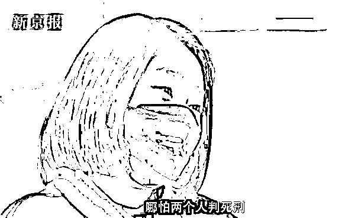
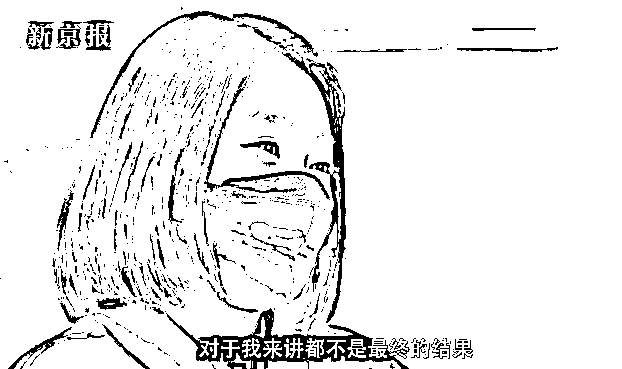
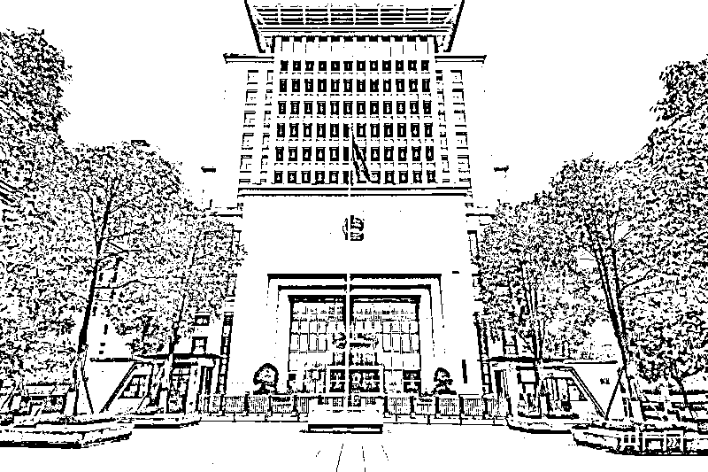
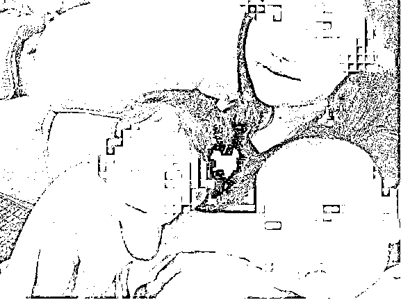
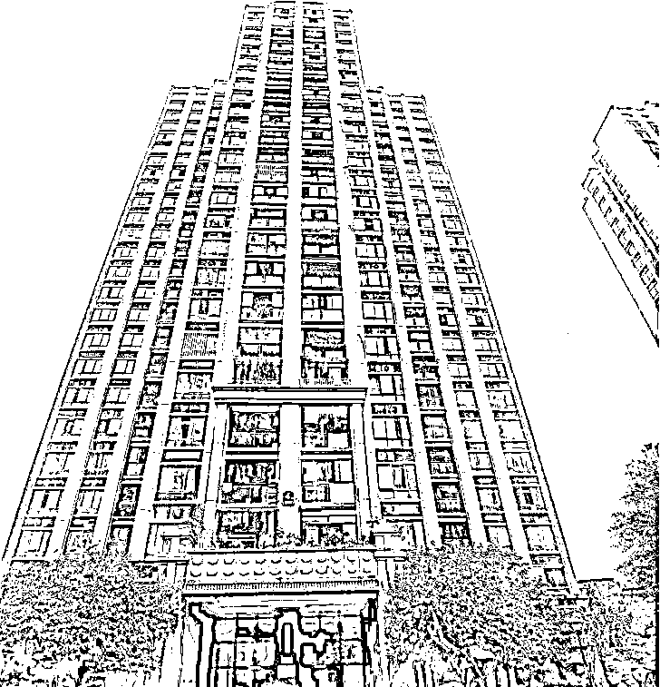
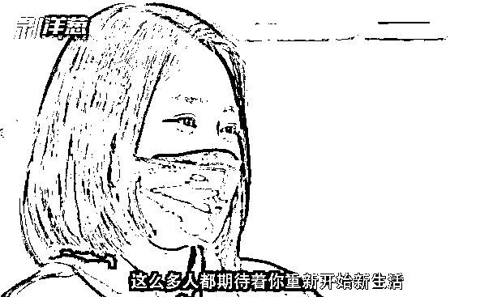
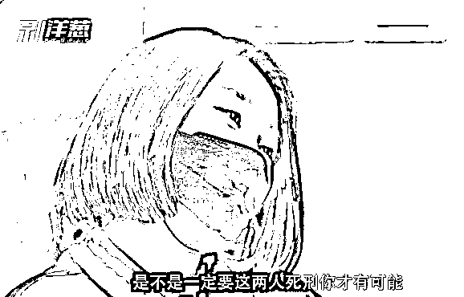

# “姐弟坠楼案”庭审细节曝光！生母称“她曾想花 30 万买命”

> 原文：[`mp.weixin.qq.com/s?__biz=MzIyMDYwMTk0Mw==&mid=2247526633&idx=3&sn=6090d8cd3647a0b26a17cd9adf871ebe&chksm=97cba3d1a0bc2ac71013009218af287d6a1cc0a3a21fa53cab1d03efdefd7ddd369ebaba3b86&scene=27#wechat_redirect`](http://mp.weixin.qq.com/s?__biz=MzIyMDYwMTk0Mw==&mid=2247526633&idx=3&sn=6090d8cd3647a0b26a17cd9adf871ebe&chksm=97cba3d1a0bc2ac71013009218af287d6a1cc0a3a21fa53cab1d03efdefd7ddd369ebaba3b86&scene=27#wechat_redirect)

死刑！双死刑！ 

 备受公众关注的“重庆姐弟坠楼案”等来了一审判决。12 月 28 日，重庆市第五中级人民法院依法对被告人张波、叶诚尘故意杀人及刑事附带民事诉讼一案进行一审公开宣判，以故意杀人罪判处两人死刑，剥夺政治权利终身；对刑事附带民事诉讼原告人陈某某的撤诉申请，依法裁定准许。

庭审结束后，陈美霖及其家人乘车前往存放两名被害幼童骨灰的寺庙。陈美霖告诉澎湃新闻，**她要第一时间去将判决结果念给孩子们，让他们知道妈妈已经为他们讨回了公道和正义，希望孩子们能瞑目**。

**两被告当庭未表示要上诉**

澎湃新闻从参与庭审的人员处获悉，**张波、叶诚尘二人未在当庭表示是否要上诉。**  

重庆市第五中级人民法院在南岸区人民法院开庭审理此案（央广网发 王海摄）

在庭审中，法院认为，被告人张波与被告人叶诚尘共谋，采取制造意外高坠方式，故意非法剥夺张波两名亲生未成年子女的生命，致二人死亡，张波、叶诚尘的行为均已构成故意杀人罪。公诉机关指控的犯罪事实和罪名成立。在共同犯罪中，张波积极参与共谋，设计将女儿接到家中，直接实施杀害两名亲生子女的行为；叶诚尘积极追求二被害人死亡的发生，多次以自己和家人不能接受张波有小孩为由，催促张波杀死两名小孩，并在张波犹豫不决的情况下，逼迫张波实施杀人行为，最终促使张波直接实施故意杀人犯罪行为，与张波在共同犯罪中的地位、作用相当。二被告人的行为突破了法律底线、道德底线、人伦底线，作案动机特别卑劣，主观恶性极深，作案手段特别残忍，犯罪情节、后果和罪行极其严重，社会影响极其恶劣，依法应当严惩。  

涉嫌故意杀人的叶某某和张某。受访者供图

澎湃新闻此前报道，公诉机关指控称，张波与陈美霖于 2017 年 8 月结婚后先后生下女儿张某甲（被害人，殁年 2 岁）、儿子张某乙（被害人，殁年 1 岁）。2019 年 4 月左右，张波向陈美霖提出离婚，同时隐瞒自己已婚有子的事实追求网友叶诚尘。同年 8 月左右，张波与叶诚尘私下建立恋爱关系。后叶诚尘得知张波有小孩，仍继续与张波交往。 

2020 年 2 月，张波与陈美霖协议离婚，双方约定张某甲归陈美霖抚养，张某乙在六岁前归张波抚养，六岁后由陈美霖抚养。

据成都商报，2020 年 11 月 1 日，张波原计划作案，但因其母亲在场一直未实施，他还曾前往叶诚尘所在的长寿区，给了叶诚尘 4 万元。11 月 2 日，他再从叶诚尘处赶回位于南岸区的靖江华府小区，下午作案。**关于叶诚尘此前提出的有关张波曾威胁她、要伤害她家人的辩护意见，因证据不足未予认定。关于张波作案前叶诚尘是否在与张波视频时割腕这个细节，因为张波、叶诚尘被逮捕前将两人的聊天记录删除了，证据不足，未予以认定。**  

**曾提出 30 万赔偿**

叶诚尘多次向张波表示自己及父母不能接受张波有小孩，两人多次共谋并商定采用制造意外高坠的方式杀害张某甲、张某乙。2020 年 6 月，叶诚尘多次通过微信催促张波作案。同年 10 月，张波、叶诚尘商定以给张某甲买衣服为由，将张某甲接至张波家中伺机作案。10 月 25 日，张波让其母亲联系陈某某将张某甲接到自己租住于南岸区某小区的家中，后因陈美霖一直在场而未能作案。同年 11 月 1 日，张波再次让陈某某将张某甲带至家中并留宿。次日 15 时 30 分许，张波趁家中无其他人，将正在次卧玩耍的张某甲、张某乙一起从次卧飘窗处扔到楼下，致张某甲当场死亡，张某乙经送医院抢救无效死亡。 

**一审****开庭前，法院工作人员告知孩子母亲陈美霖，****叶诚尘的家属愿意赔偿 30 万元，希望能获取她的谅解，被她拒绝。后来法院工作人员又告知她，****叶诚尘的家属愿意在 30 万元的基础再增加赔偿。“无论他们给多少钱我都不能接受，拿这点钱买我两个孩子的命，我的良心过得去吗。”**

7 月份**第一次开庭时，叶诚尘和其辩护人辩称其是从犯，而****这次开庭她却一言不发。法官询问二人是否上诉，叶诚尘也没有说话，张波表示“会考虑”**，法庭驳回了叶诚尘的所有辩护意见。

**“他毁了我一生”**

“朋友莫名其妙将我们撮合在一起了！”陈美霖现在回忆起和张波的婚姻满是后悔，“我后悔和他相恋，毁了我的一生。”

开庭前一天（27 日），陈美霖应多家媒体之约，在一家咖啡馆接受采访，讲述了她与前夫张波从相恋、结婚生子、离婚……再到一双儿女被前夫及前夫女友杀害后的心路历程。  

▲陈美霖正在接受媒体采访

陈美霖的父母觉得张波“不靠谱”，反对女儿的恋情，陈美霖身边很多朋友都不支持，但陈美霖觉得张波特别有上进心，人很聪明。

“其实那时候我认识的张波，展现的不是真实的样子。”陈美霖如今回想，以往张波的朋友就跟她说过，她不在的时候，张波不是这样的，“但当时我是信任他的。”两人交往没几个月，陈美霖意外怀孕，陈美霖选择和她爱的人组建家庭。那场婚礼，没有彩礼，陈美霖父母还承担了酒宴费用。

▲陈美霖和两个孩子

 大女儿雪雪出生后不久，陈美霖一家就搬到了江北区的娘家，也是这个时期，张波与他人合伙开了一家小贷公司。在陈美霖看来，从那时候开始，张波整个人变了。

“张波在工作上是有目的性的，做任何事情都是有目的性的。”陈美霖甚至觉得，张波和她结婚也是有目的性的，“我觉得这就是一场骗局，他很聪明，心思缜密，我和他离婚后，反思这段感情，我才知道。”

陈美霖认为，张波开公司后，认识一些做工程发家致富的人，这些人往往年龄比较大了。他的野心开始膨胀，想过有钱人的生活，突然面子观念变得很重。

大女儿雪雪出生后不久，陈美霖发现自己又意外怀孕，她选择将孩子生下。张波平日疏于照顾孩子，还在儿子生病住院后提出离婚。2020 年 2 月，因张波出轨，两人正式离婚。离婚时和张波协商，两个孩子均归陈美霖抚养，洋洋先交由张波和张波妈妈照看至 6 岁，此后洋洋转由陈美霖抚养。

**第三者**

**他说她是一个极端的人**

陈美霖记得，她在和张波办理离婚时，**张波曾谈到，叶诚尘是一个比较极端的人，他担心叶诚尘在外面找人伤害他妈妈和家人**。“如果把叶诚尘逼急了，她什么事都能做得出来。”而**在法庭上，叶诚尘则称，张波逼着她和他交往，如果不交往张波就会找人杀她全家**。张波还曾跟陈美霖讲起，**张波和叶诚尘有时会打架，有时还打出血**。

 两个小孩跟叶诚尘相比，叶诚尘在他内心更加重要。张波的收入不低，但是离婚协议中应付孩子的抚养费不给付，也不怎么给张波自己的母亲花钱，但是会给满身奢侈品的叶诚尘花钱，过“520”时，会借钱给叶诚尘准备一个装满现金的礼盒。这是因为叶诚尘家境富裕，“比如说张波有什么项目，可以通过叶诚尘帮他找人对接。对他来说，叶诚尘有利用价值。”

 陈美霖前期通过警方和法院庭审了解到，**叶诚尘曾对张波谈起，说给洋洋算过命，洋洋活不了多久就会死，之后叶诚尘多次向张波提起要弄死孩子的事情**，并告诉张波，叶母不同意她和有孩子的人交往，两人要在一起的话张波就不能有孩子。张波曾在网页上搜索过小孩高坠的相关新闻。

▲事发小区

**一直思念儿女** 

**从未走出痛苦**

刚刚获知孩子去世的那几天，陈美霖一直无法入睡，一闭上眼睛就开始想孩子，靠安眠药入睡。每过一两周，她都会驱车前往寺庙，到了那里，她就泪流不止。 

对飞入她家的蜻蜓、蝴蝶、鸽子等小生物，她都会静静地观察它们来了又走，看到这些突来的访客，她都会想起自己的孩子。

“我的世界已经被张波毁了，我以后怎么过，我是懵的，我只能活在当下，我没有考虑过我的未来，只希望现在能正常生活。”经历这件事，她对异性甚至不再信任，更多关注案件本身。

澎湃评论

**“双死刑”告慰了天堂里的孩子** 

就像一审判决里所说的：“二被告人的行为突破了法律底线、道德底线、人伦底线，作案动机特别卑劣，主观恶性极深，作案手段特别残忍，犯罪情节、后果和罪行极其严重，社会影响极其恶劣。” 

 “保留死刑、严格控制和慎重适用死刑”是我们国家一贯的刑事政策，死刑只适用于罪行极其严重的犯罪分子。2019 年召开的第七次全国刑事审判工作会议要求，确保死刑只适用于极少数罪行极其严重、社会危害极大、罪证确实充分、依法应当判处死刑的犯罪分子。

 在这起引发人神共愤的杀害亲生子女案当中，两名被告人不顾人伦，为维护自己畸形的恋情，竟然将黑手伸向毫无自我保护能力的两名幼儿，以极其凶残的高坠方式杀害亲生骨肉，引发恶劣的社会影响，特别是张波亲手杀害儿女之后，在坠亡现场的痛哭表演令人作呕，从侧面表征其主观犯意之深。

 两被告人都达到了死刑犯的“罪行极其严重”的法定标准，双双被定死刑，维护了死刑的必要性、严肃性、正当性，告慰了天堂里的孩子，弘扬了人间正气。

来源：综合澎湃新闻/谢寅宗 沈彬、红星新闻、成都商报、中国新闻网、新京报等

← 向右滑动与灰产圈互动交流 →

