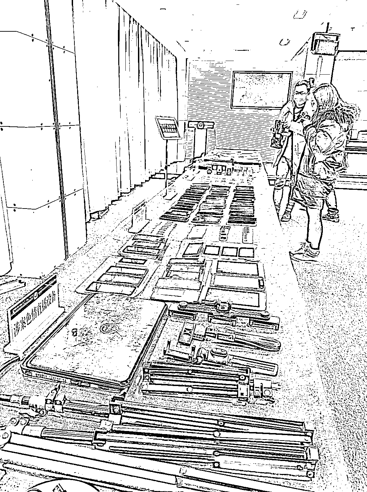
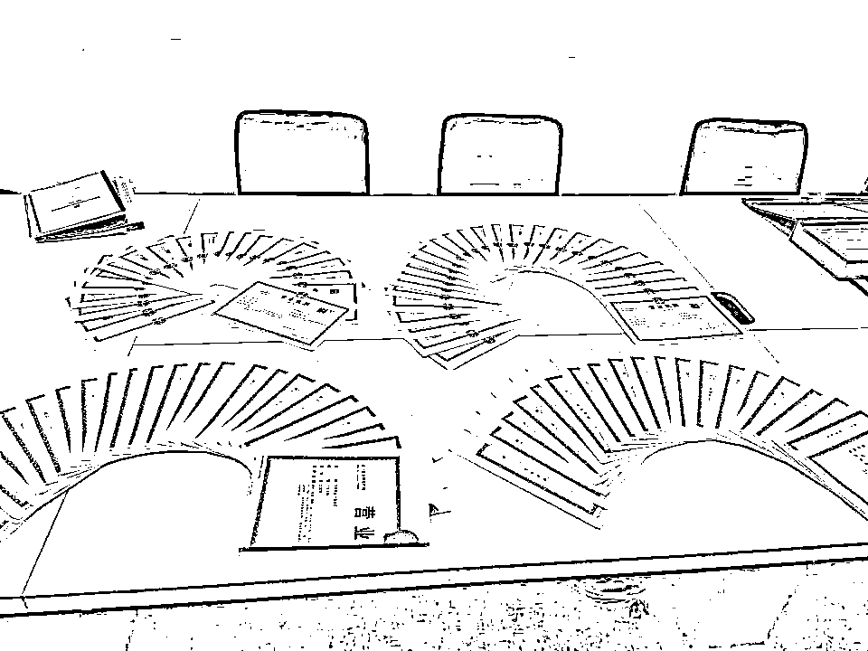
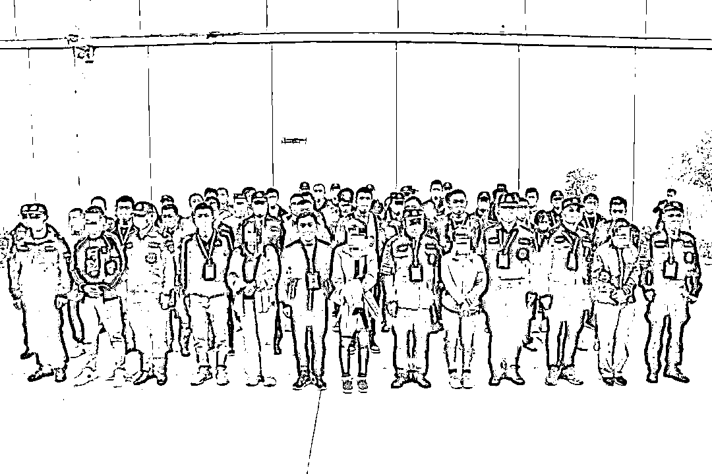

# 色情直播平台暗藏陷阱，竟还是境外赌博的拉客工具……这起涉案 318 亿的大案破了！

> 原文：[`mp.weixin.qq.com/s?__biz=MzIyMDYwMTk0Mw==&mid=2247526633&idx=4&sn=acd42a728d1df5d8164ce6a1eaa6f26e&chksm=97cba3d1a0bc2ac7f2adaa92365a154c835f5aca5a3ca9676b05034c94508e0a6e7cc449a246&scene=27#wechat_redirect`](http://mp.weixin.qq.com/s?__biz=MzIyMDYwMTk0Mw==&mid=2247526633&idx=4&sn=acd42a728d1df5d8164ce6a1eaa6f26e&chksm=97cba3d1a0bc2ac7f2adaa92365a154c835f5aca5a3ca9676b05034c94508e0a6e7cc449a246&scene=27#wechat_redirect)

以色情直播为网络赌博引流 

再通过调包普通用户的话费充值订单

将赌博资金洗白……

12 月 27 日 

湖北省公安厅举行新闻发布会

通报“9·17 新型网络犯罪系列案”最新战果

据通报，在湖北省公安厅的指导下，孝感警方成功打掉赌博、洗钱、色情直播等犯罪团伙 31 个，抓获犯罪嫌疑人**115 人**。查证涉案赌博、色情、洗钱流水总金额达**318 亿元**，冻结各类涉案黑产资金近 1 亿元，全链条查清并打掉一条为境外赌博、色情、洗钱集团服务的黑色产业链。

警方展示犯罪团伙作案工具

**涉毒案牵出网络赌博线索**

孝感市公安局副局长张劲松介绍，去年 7 月，孝感警方在查处一涉毒团伙时，**发现该团伙成员均利用境外聊天工具沟通，且聊天记录中存在“跑通道”等术语。**民警在现场还查获 54 张已办好的“空壳”企业营业执照。

“空壳”企业营业执照

获悉这一线索后，去年 9 月 17 日，孝感市公安局成立专案组，并连续组织三轮跨省收网行动，成功打掉包括撮合交易技术平台、四方支付代理、洗钱中介在内的相关犯罪团伙，**陆续抓获 17 名犯罪嫌疑人。**

“我们发现，这个犯罪团伙还只是冰山一角。”张劲松介绍，整个跨境网络赌博已经形成产业链和非法交易黑市，涉及色情直播平台、大量的渠道商、中介、卡商、话费代理充值商……

扣押的涉案物品

办案民警介绍，**该案赌博均为网络赌博，涉及到境外的多个网络赌博平台。**警方通过深挖这些团伙黑产犯罪链条和非法交易网络发现，全国注册境外赌博平台账户以百万计，参与跨境赌博人数众多，影响极为恶劣。

这些境外的网络赌博集团，往往以高奖金、高胜率为噱头，通过网站黑链接，微信、QQ 群，短信等推广方式招揽网民参与网络赌博。

**“赌博网站后台可人为操控，胜率可随意修改**，往往会让新加入的参赌人员小赢一点钱，而后调整胜率使其一直输，直到其投入大额资金时被全部套走。”办案民警称，如果参赌人员赢了钱，赌博网站会设置金额、次数、在线时长等一系列高提现门槛，迫使参赌人员持续赌博，在不知不觉中输光钱财。

**赌博平台用色情直播引流**

**“几乎每个网络赌博平台，都在用色情直播进行引流。”**办案民警介绍，这些进行直播的 APP 并未在各大商店上架，而是利用社交软件进行推送，通过链接或扫描二维码进行隐秘下载，躲过了监管。

警方经进一步调查发现，类似的直播平台很多，仅民警掌握的，就多达近十个。这些直播平台的服务器在境外，**平时通过“家族长”在国内招揽主播，而直播平台的背后还有一个赌博平台。**网民打赏的礼物，平台会抽取两成，剩下的八成由主播和“家族长”继续分成。**通过直播间进入赌博平台，在赌博平台上的充值，主播也可以拿到分成。**

“在直播平台上挂有赌博平台的链接，以此来为赌博平台引流。”安陆市公安局专案组副组长刘洋介绍，该案抓获的涉黄主播，以“90 后”年青人居多。

抓获色播案犯罪嫌疑人

福建某地一名 90 后女子王某，常年窝在自己家里做色情直播，为了不让别人发现，她完全不敢出门，以至于在家呆了几年，与周围村民没有打过任何交道。

**调包话费订单洗白赌资**

“网络赌博平台赢了钱后，下一步就是要洗钱。”张劲松介绍，该案涉及到的多个境外网络赌博团伙，都在利用话费充值订单进行洗钱。

发布会上，应城市公安局专案组副组长左永安介绍，该案涉及到的相关犯罪团伙，**通过将话费充值与赌资充值“调包”的方式，从而洗白赌资，掩护赌博资金出境****，**并从中抽取高额佣金，牟取暴利。

这些为赌博团伙提供洗钱服务的犯罪团伙层级复杂、手段隐蔽、分工明确，既有负责接赌博订单的第四方支付平台，有负责订单匹配的话费充值平台，有负责代收验证码的接码平台，还有专门负责开发、维护的技术公司。此外，大量渠道商、代理商、卡商参与其中，为犯罪链条各个环节提供服务。这些犯罪嫌疑人，明知道对方是为达到洗钱目的，而利用信息网络实施犯罪，还为其犯罪提供技术支持，构成帮信罪。

抓获犯罪嫌疑人

**涉案流水达到 318 亿元**

该案涉案流水总金额达到 318 亿元，冻结各类涉案黑产资金近 1 亿元，**这也是目前为止湖北省已破获的复合型新型犯罪团伙案件中涉案流水最大的。**

“经过我们查证，这些提供给境外赌博人员进行非法资金结算的支付接口，涉案流水均十分巨大，仅广东某支付平台，就结算了非法资金 240 亿元；而我们在 2020 年三次收网打掉的洗钱团伙，主要为赌博、黄播等违法犯罪活动提供资金结算，洗钱流水也是超过了 40 亿元。”张劲松介绍。

“通过侦办案件，我们发现，当前新型网络犯罪的技术之新、分工之细、融合之紧远远超出了以往的想象。”孝感市公安局专案组副组长喻泽华介绍，本案中，他们在成都打掉了在黑产圈号称技术一流的“云觅支付”平台，抓获了平台开发者何某某。审查发现，何某某曾在某知名互联网公司任职，年薪近百万，掌握着最新的支付接口开发技术。

办案民警介绍，新型网络犯罪已经形成了一条分工明确、集团化、专业化、市场化运作的完整产业链。

“网络不是法外之地，新型网络犯罪要打更需防。”发布会现场，张劲松也呼吁广大群众**远离黄赌毒诈及各类网络陷阱，守牢自己的“钱袋子”，避免误入歧途。**

来源：楚天都市报,戒赌吧

← 向右滑动与灰产圈互动交流 →

