# 2021 的财富密码，都藏在 9 块 9 的小广告里了

> 原文：[`mp.weixin.qq.com/s?__biz=MzIyMDYwMTk0Mw==&mid=2247526633&idx=5&sn=21156d16a5a9c2f3ca3105fe37f5c767&chksm=97cba3d1a0bc2ac74f786a7fa2eb4cd72cdfeb564641d045a43ab1005a0bf367189cabc9d1c4&scene=27#wechat_redirect`](http://mp.weixin.qq.com/s?__biz=MzIyMDYwMTk0Mw==&mid=2247526633&idx=5&sn=21156d16a5a9c2f3ca3105fe37f5c767&chksm=97cba3d1a0bc2ac74f786a7fa2eb4cd72cdfeb564641d045a43ab1005a0bf367189cabc9d1c4&scene=27#wechat_redirect)

我坦白：没钱了，想发财。

求求老天爷赏我一个致富的路子吧！

想搞钱？你可找对人了！

这么说吧，2021 以及未来十年的来钱路子，

都藏在这些 9 块 9 的广告里了……

**配音课训练营**

**轻松配音惊艳众人**

**“****1****元学配音，有手机就能做。”**

**“****9****块****9****上课，学成接单月入过万。”**

**“靠声音赚钱，****3000****元两小时”**……

诸如此类的配音兼职、培训广告，

在各个公众号、音频 APP 上铺天盖地。

1 元起底，封顶 9 元！

天啊！这到底是什么天上掉馅饼的事啊！

不到十块的试错成本，真的买了不吃亏不上当！

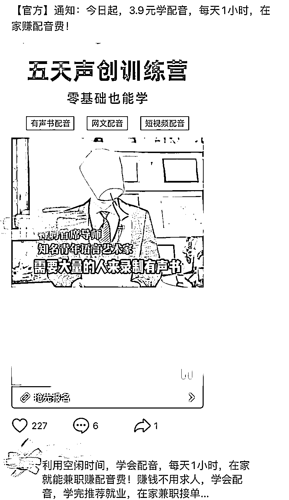

低投入、高回报，抱着月入过万的诱惑，

许多年轻人被勾起了配音之梦。

**“闲着也是闲着，不如我们就去看看？”**

九九喜欢动漫，也爱听广播剧和有声书，

她就决定去试试。

网上类似的配音广告很多，收钱和上课方式——

甚至和领外卖红包如出一辙。

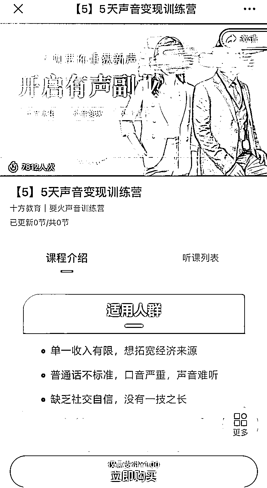

先在看到广告页面的微信上跳转交钱，

然后页面会提示你去关注某公众号领取课程，

再弹出一个专属老师的微信添加，

到了上课时间，老师会让所有学员一起进群学习。

在试听直播里，一位讲师讲述自己如何从小白晋升为大佬，

靠配音获得高副业收入，还现场播放自己的作品。

虽然后来意识到是“画大饼”，

但在那一刻九九还是觉得这样的课程里一定有诀窍，

“只觉得她讲得真好啊。”

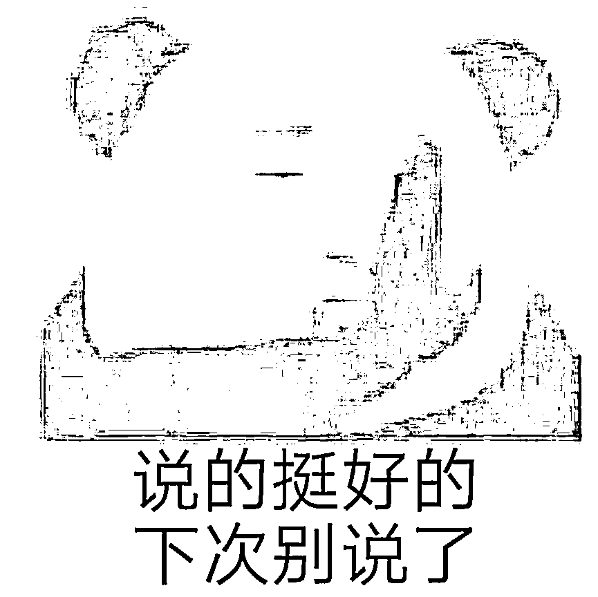

但没过多久，九九觉得好像没什么用了，

试听课里夹杂了太多老师们的光辉历程，

正儿八经的干货就是：如何说好普通话。

九九是真的想要学点什么，她开始焦虑起来。

这时候，培训老师和“往期学员”上线了。

他们苦口婆心地说尽配音兼职的大好前景，

**只要培训一两个月，就能上手做兼职赚钱**，

但需要继续花钱买他们的高阶课程。

高阶班动辄几千起步，价格高的甚至一万多元。

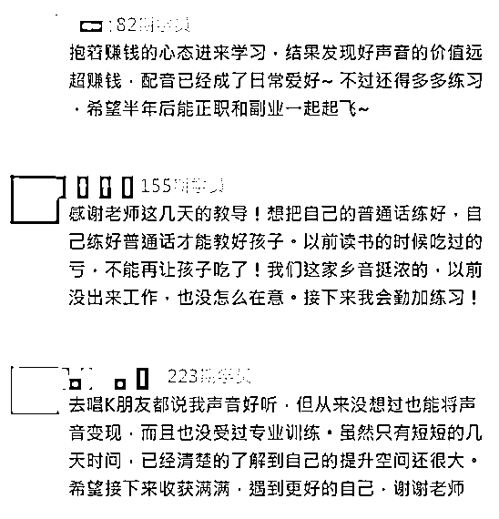

培训班老师承诺学员，课程通过后**免费、无限次地安排试音机会**， 

帮助学员匹配到合适的有声书，

**保证一定能让学员靠着配音挣钱**。

心动，但没钱。

没关系的呀~培训机构早已充分考虑到了用户的需求，

和第三方平台建立了合作，**为学员提供 12 期免息贷款服务**。

扫码就可办理，下个月才需要还第一笔学费。

嘿嘿，那不是下个月就能学成出师找兼职了？

区区几百块的学费月供，分期就分期吧！

“试音就是读书时候常出现的分角色朗读课文，一组组试读。”

“他们会说你‘感情不够、语气不明显、不太自然’之类的套话啦！”

“后来才意识到其实这就是韭菜机构。有人想退钱，已经不可能了。”

九九想到自己竟然这么轻易就上了当，又气又好笑。

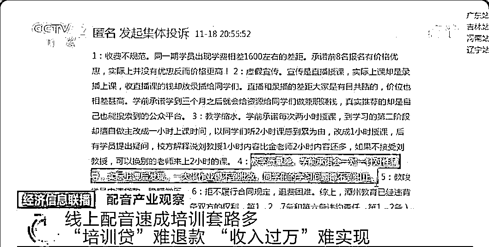

其实踏入这种圈套的几乎都是学生党和宝妈们，

他们有的确实是热爱这一行业，想要从事相关工作；

有的是生活压力大，日常拮据想要开源搞钱，

但**配音本来就不是一个可以速成赚高薪的行业**。

它不仅需要大量的学习积累，还需要长时间的锻炼，

虽然**现在网络上各种配音的工作越来越多，但也不是毫无门槛**。

以喜马拉雅有声制作平台为例，

入驻者必须使用专业设备录制，

不接受手机录音，并需要播音主持、配音等相关专业毕业，

或播音、商配经验 1 年以上者。

而**所谓的靠兼职就能轻轻松松月入过万，根本不现实**。

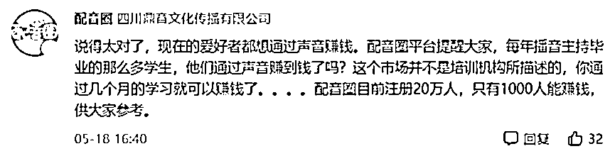

总而言之，想指望配音兼职不费什么力气就暴富，

还是枕头垫高点做个好梦来得更加实在。

**上了我的理财课**

**明天变身巴菲特**

**“你不理财，财不理你！加入学习理财课，财务自由人人做到！”**

**“基金半年赚 10 万，做好这 4 点你也可以！”**

**“一天赚 1000，这个白捡钱的机会了解一下！”**

写到这里忍不住拳头都握紧了，

这么好这么吸睛的标题，我怎么就没想到呢！

总之在财商教育的宣传中，赚钱方法千千万，不来你就亏了。

新的致富之路，我呸汉三又来了！冲！

财商教育是怎么个发财的路子呢？

他们也是先用 9.9 元的体验课吸引大众，为微信社群引流。

购买了 9.9 元的体验课程之后，

负责课程的班主任会建立一个学习社群让想致富的大家一起交流，

有自称班主任、学长的工作人员轮番介绍机构资质。

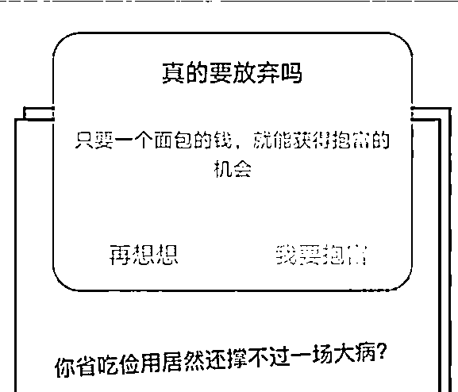

他们侃侃而谈大肆宣传学员成功的故事，

进入正题了又只说原理不说方法论，你好像懂了却又无从下手；

那些可以实操层面的知识呢？

“视频篇幅有限，以后的课程带你了解更多！”

然后他们会故意绕个弯子，

说**这个深度的知识点留到 7000 元的正式课程里再讲**。

留下这个 7000 元课程悬念后，

最多的内容就是讲成功学员的案例和收益。

一碗又一碗的鸡汤接连下肚，

群友们在群里激情接龙：

**“我要做好准备迎接人生第一个 100 万！”**

**“月入过万，一起躺赚。”**

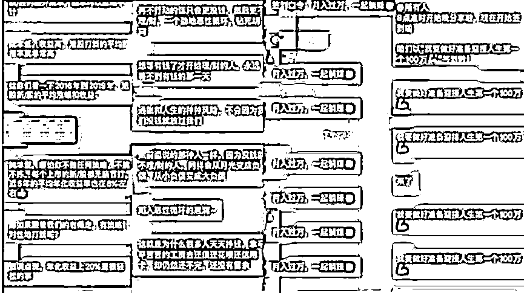

可是……可是 7000 块不是笔小数目欸……要不再想想呢？ 

**"你可以今天不理财，明天也不理财，**

**但后天，那些理财的人已经发财了。而你，还在原地等待 。"**

**“世界上最大的病是什么？是穷病。”**

**“比穷更可怕的，是穷人思维。”**

制造焦虑也是他们的手段之一，真的句句戳心，

他们放大了普通人对财富的渴望，对贫穷的不满，

也制造了一种轻松月入过万的假象，

而愿意报名听这场 9.9 元理财课程的人，

大概率都是想要摆脱贫穷的理财小白。

**接下来……贷款分期高阶课程，学习‘专业’的理财知识……**

实现财富自由，拥有不一样的人生！

？啊等等，小呸你是不是凑字数重复了？

这段话我怎么感觉在哪里见过？

哎呀小傻瓜，让你发现了，

**9 块 9 的致富之路，它们根本都是同一个路子！**

当你报名了这些网课之后，

你能否年入百万我不知道，

但是你交的学费足以让导师们实现财富自由。

据报道，财商课程的生意简直暴利,

**因为单价高利润高，而且创业门槛低，**

**一件 7000 元的课程包，毛利率达到 90%，净利率也有 40%。**

**一个人的净利润就达到了 2800 元，**

并且同一份课程可以重复卖给其他人，

**只要一百人购买了这份课程，那么净利润就是 28 万！**

好家伙，我直接好家伙。

值得一提，根据公开数据显示，

截至 2020 年，与财商相关的公司总计达 6054 家！

但这种背后畸形的产业链已经被迫叫停。

**专项整治活动打击的八类违规问题中，**

**明确指出要打击炒作社会恶性事件、负面极端事件，**

**煽动悲情、焦虑、恐慌等情绪，**

**借以推销所谓“财商课”、各类保险产品等。**

对此，我只想说：干得漂亮！

**9.9 速成大主播**

**拳打薇娅脚踢李佳琦不是梦**

某娅高达 13.41 亿的税罚金大家都知道吧？

当主播能赚这么多钱？你来不来？

小婷就是在某带货主播的直播间被震惊到了，

主播“三二一上链接”，话音刚落，

下一秒产品就被售罄了，太牛了！

小婷平时就挺关注直播电商行业，但话术、运营技巧、涨粉、带货……

桩桩件件都是陌生的领域。

然而此时“**9.9！速成大主播，成就你的另类人生**”吸引了小婷的注意。

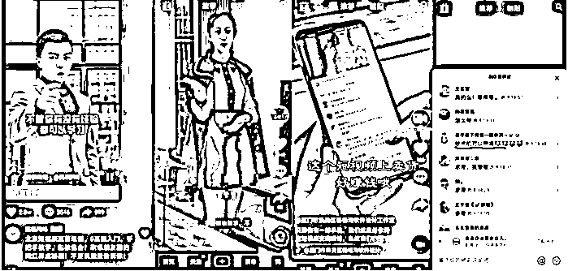

“没有粉丝可以带货吗？没有货源可以吗？没有经验可以吗？”

“of course!”

在这类广告中，他们都是职场精英，

穿着华丽，俨然一副成功人士的样子。

他们说，**0 基础入门、手把手教学、包教包会、先体验再交学费**！

小婷：这不是把赚钱的法子往我手里扔吗？

“**反正不贵，就当打发时间吧**”。

很快，就有专门的工作人员联系上了小婷，

对方并未推销课程，而是发来了一个链接，

并表示晚上 8 点会有专业的老师讲短视频、

带货变现的课程，可以免费学习。

**“有了流量以后，下一步就是带货变现，**

**按照我们的经验来说，粉丝体量起来之后，**

**一个月拿到三万五万的收入很轻松。****”**

不过，**9.9 只是发财的敲门砖**，

想要更深入更细致地了解还是得再交点学费！

抱着“天下没有免费的午餐”的想法，

再加上对方所承诺的培训合同中有一定的保障，

如果对效果不满意可以选择申请退款，

小婷向对方缴纳了 3498 元的培训费。

成为学员之后，对方的工作人员打包发过来一堆视频以及文案，

包括带货脚本、文案、小白快速起号，0 粉丝手机剪辑操作素材。

这么多资料？是真的是真的！发财之路真的来了！

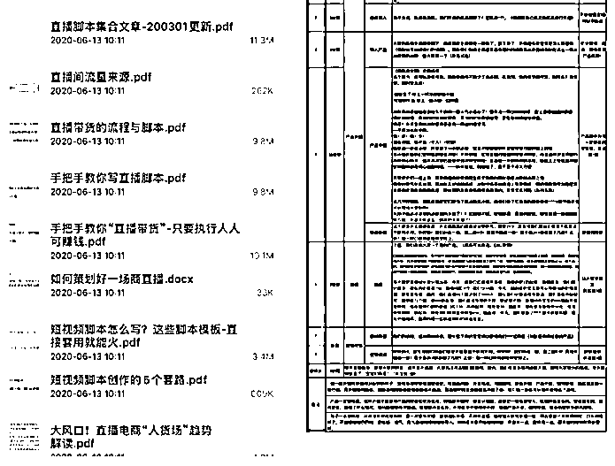

哈哈，你真是个单纯的小傻瓜！

对接的工作人员仅仅只是发来简单的视频让小婷模仿，

坚持了一段时间之后，小婷的账号只积累了七八个粉丝，

而工作人员也没有给到所谓专业的指导，

直到第 20 个视频，小婷还是没有等来对方口中所说的大流量。

**当提出退款时，小婷没有等到任何的回复。**

其实小婷接洽的工作人员口中所谓的直播电商秘籍，

很多都是**平台提供的公开资料**。

而直播电商培训导师，也没有资质，

拿来吸引学员的案例大多都是网上抄袭来的。

“现在的很多直播带货培训机构都是**靠着资料来赚一波信息差的钱**，而变现的主要方式就是靠学员继续拉人头。”

不仅如此，其他的直播带货培训平台大多用同一模板，

很多成功的学员案例还是靠 P 图软件伪造的。

**天下没有免费的午餐**

9.9 致富经的套路真的很多。

**“9.9 大主播强势打造，如何走在流量风口成为下一个网红达人！”**

**“抖音达人都害怕的圈内知识 9.9！如何让自己的视频‘爆’起来”**

**“9.9 学原画，从此在家办公实现人生巅峰！**”

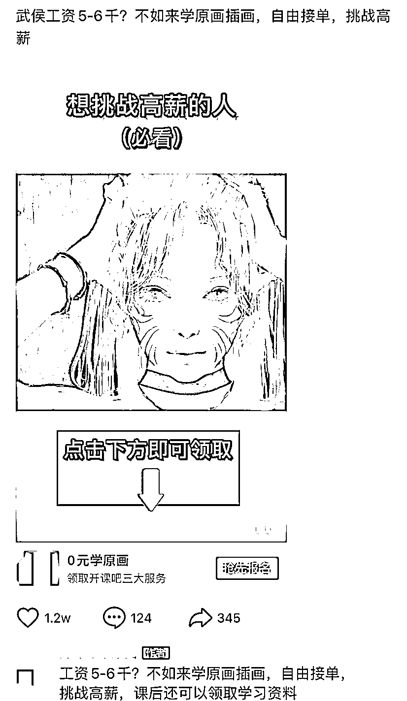

…… 

请记住，如果你一个人告诉你一个项目很赚钱，

特别是天天晒收入还告诉你可以躺赚的，

无非 3 个目的:

**他想赚你的钱；**

**他想让你帮他赚钱；**

**他想让你来填坑。**

一般发现一个好的商机，人们只会闷声发大财，生怕多一个竞争对手，

而整天吹嘘这个项目多么赚钱的人，大概率是想拉你入坑的。

**就拿前面的配音理财来说，**

**比起配音和理财本身，**

**或许教别人如何去做这两件事更加赚钱。**

这些 9.9 元致富经，

不过是往没钱的投资小白头上浇了一碗毒鸡汤，

给他们编织了一个“月入过万”的美梦罢了。

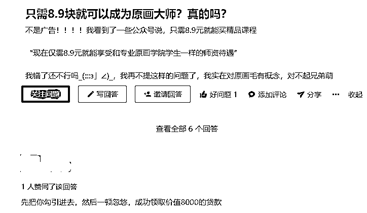

为什么在很多行骗手段中，

他们总能用‘赚钱’这个由头狠狠拿捏住大多数人？

因为大家都明白：钱真的太重要了。

尤其疫情大环境下每个人都不容易，

对钱的迫切感有时真的会蒙蔽了双眼，

但你赚钱的多少与你的能力成正比，

与其相信一夜暴富的美梦，

不如从现在开始踏踏实实地学一门技能或手艺。

嘿嘿，今天又是正能量小呸！

← 向右滑动与灰产圈互动交流 →

