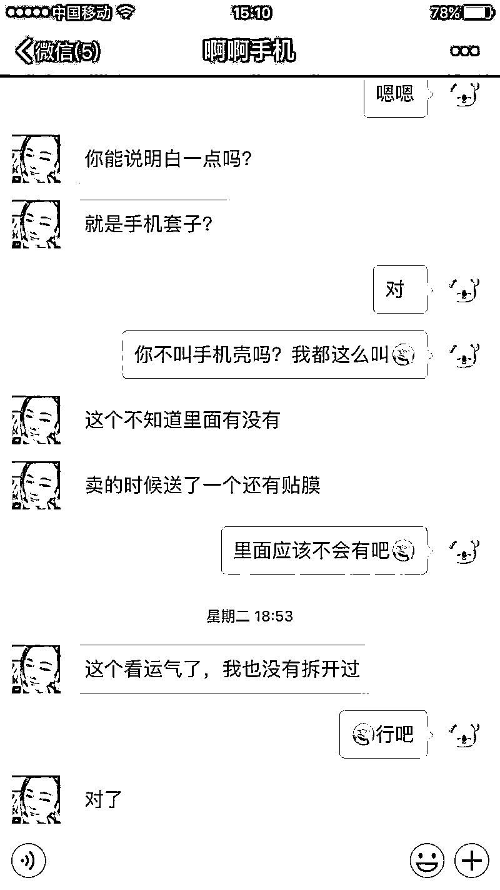
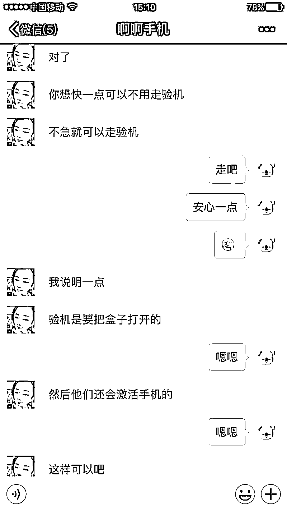

# 要懂！否则一不小心就代替骗子付了款！（附聊天被骗全纪录）

> 原文：[`mp.weixin.qq.com/s?__biz=MzIyMDYwMTk0Mw==&mid=2247526633&idx=6&sn=4389a6dd489cdf04da80a1702a736d55&chksm=97cba3d1a0bc2ac7e971ba8aa0128b349d723406b5359d4b05f4841bc5071ac882e1e71b13d8&scene=27#wechat_redirect`](http://mp.weixin.qq.com/s?__biz=MzIyMDYwMTk0Mw==&mid=2247526633&idx=6&sn=4389a6dd489cdf04da80a1702a736d55&chksm=97cba3d1a0bc2ac7e971ba8aa0128b349d723406b5359d4b05f4841bc5071ac882e1e71b13d8&scene=27#wechat_redirect)

现在越来越多的人

选择在**二手交易平台**

购买物品

可二手交易平台在给人们提供便利的同时

也给骗子带来**可乘之机**

骗子们想方设法钻空子

**规避正常交易流程**

实施诈骗！

**案情回顾**

近日，市民小宛（化名）想在二手交易平台“转转”上购买一部 iPhone X 手机，经过对比，最终看好了一部价值 5000 元的二手 iPhone X。小宛在“转转”上与对方聊天后，对方表示不是本人的手机，让小宛添加其闺蜜的微信进行详细咨询。小宛添加微信咨询后决定购买，对方通过微信发来一个“转转”支付链接，小宛支付 5000 元后一直未收到购买成功的信息，“转转”上也显示交易空白，再次询问对方时发现自己被拉黑，无法联系。

**以下为小宛被骗真实聊天记录**

（点击图片放大查看）

**发布广告 引诱上钩**

**脱离平台 添加微**

**脱离平台 添加微信**

**撒诈捣虚 实施诈骗**

**划！重！点！**

**骗子为何让你单独加微信？** 

**为了脱离平台****规避安全交易流程！**

**为何通过微信发送支付链接?**

**那是骗子制作的非法钓鱼网站！**

**交易账单显示资金全买了 Y 币？**

**是的！你被骗的钱确实是买了 Y 币！**

**但却是“帮”骗子买的！**

**骗子获得 Y 币后**

**通过非法销售此类虚拟货币获利！**

**而问题就出在那个付款链接上**

**骗子将“**待支付**”付款二维码植入链接**

**受骗者点击链接扫描二维码后付款**

**其实就相当于“代人付款”！**

来源：十堰人民路派出所

← 向右滑动与灰产圈互动交流 →

