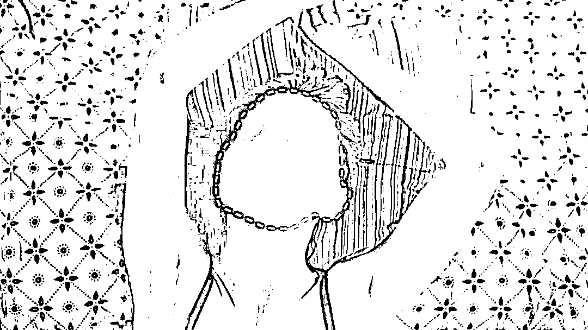
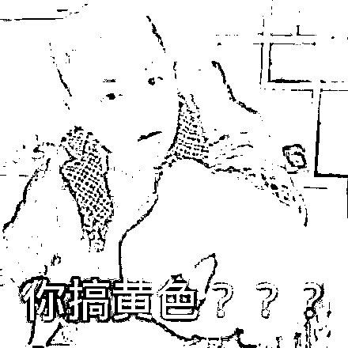

# “为防止色情报复，需要先上传自己的裸照”！？

> 原文：[`mp.weixin.qq.com/s?__biz=MzIyMDYwMTk0Mw==&mid=2247526704&idx=3&sn=aef43717d6faf3f45fef7e79f447dc03&chksm=97cba208a0bc2b1e90da0eedcbb120dce6b5a7b7af6f1fcde0747e45724d27da3ef2e2e9bb51&scene=27#wechat_redirect`](http://mp.weixin.qq.com/s?__biz=MzIyMDYwMTk0Mw==&mid=2247526704&idx=3&sn=aef43717d6faf3f45fef7e79f447dc03&chksm=97cba208a0bc2b1e90da0eedcbb120dce6b5a7b7af6f1fcde0747e45724d27da3ef2e2e9bb51&scene=27#wechat_redirect)

在互联网媒介的加持下，

**一张照片在一分钟内可以传递上万次。**

前有陈冠希**艳照门**事件，

导致数位女明星全国性社死。

后有美国队长饰演者**克里斯·埃文斯**手滑，

**将自己的大尺度自拍发送到 Ins 上。**

虽然当事人眼疾手快迅速删除，

但这些照片还是被网友们保存下来了。

私密照片落入他人手中， 

是一件极其可怕的事情。

因为你可以遭遇——**色情报复**。

**色情报复（Revenge Porn），**

> **是指未经当事人同意将当事人的性私密照片散布给第三者观看。**

多见于情侣分手后，

也有黑客为破坏当事人声誉盗取和散布他人的照片。

根据美国数据及社会研究院的一份报告显示：

> **约有 4%的美国互联网用户成为了“色情报复”的受害者。**

国际顶流社交平台**Facebook**（现更名为 Meta），

已经成为这类网络犯罪的沃土。

Facebook 创始人**扎克伯格**为了整治这种现象，

也是费尽了脑筋。

最近，他想到了一个“好主意”：

**用魔法打败魔法！**

具体方法是：

> **征收用户裸照，然后将裸照转变为独一无二的数字指纹。**
> 
> **之后就可以通过识别代码屏蔽相同照片。**

这逻辑把网友给整蒙圈了：**“为了防止你被杀，就请你先自杀?”**还有网友调侃：**“**没个月球表面一样的脑子，****都想不出这种办法。**”**这话倒也不是空穴来风，一直被质疑是蜥蜴人的**扎格伯格**，没准真就是从月球来的呢？
扎克伯格想出的这个妙招，让人想起了暴力执法的美国警察：**为了防止自杀者自杀，直接击毙自杀者。**也有网友看破真相：**“不过是想空手套黄图。”**面对网友的“友好”**质**（骂）**疑**（娘），
facebook 一本正经地回应：

# 

灰色有根部泡在水中，用保鲜袋遮盖，冰箱冷藏 保存时间：4 天 >>>>花菜/西兰花 储存方法：保鲜膜包裹，冰箱冷藏 保存时间：5 天 >>>>芹菜 储存方法：锡纸包裹，冰箱冷藏 保存时间：2 周 >>>>蘑菇 储存方法：纸袋，冰箱冷藏 保存时间：3 天 >>>>黄瓜 储存方法：保鲜膜包裹，冰箱冷藏 保存时间：1 周 >>>>番茄 储存方法：透气的保鲜盒，冰箱冷藏 保存时间：5 天 水果 Vol.02 >>>>苹果 储存方法：冰箱冷藏 保存时间：3 周 >>>>香蕉 储存方法：室温放置 保存时间：成熟后可保存 3 天 >>>>香蕉（已切开） 储存方法：保持切面平整用锡纸包裹，室温放置 保存时间：1—2 天 >>>>牛油果 储存方法：室温放置，熟后放入冰箱冷藏 保存时间：4 天 >>>>牛油果（已切开） 储存方式：切面淋上柠檬汁，包裹保鲜膜，放入冰箱冷藏 保存时间：1 天 >>>>葡萄 储存方法：带孔的保鲜袋，冰箱冷藏 保存时间：1—2 周 >>>>草莓/树莓/蓝莓 储存方法：透气的保鲜盒，冰箱冷藏 保存时间：3—5 天 >>>>柠檬/橙子 储存方法：冰箱冷藏 保存时间：2 周 >>>>柠檬/橙子（已切开） 储存方法：保鲜膜包裹，冰箱冷藏 保存时间：2—3 天 >>>>瓜类 储存方法：室温放置 保存时间：5 天 >>>>瓜类（已切开） 储存方法：保鲜膜包裹，冰箱冷藏 保存时间：7—10 天 肉类 Vol.03 >>>>鱼/虾肉 储存方法：密封保鲜袋 保存时间：冷藏 1 天，冷冻 3—6 个月 >>>>鸡/鸭肉 储存方法：密封保鲜袋 保存时间：冷藏 2 天，冷冻 3—6 个月 >>>>猪/牛/羊肉 储存方法：密封保鲜袋 保存时间：冷藏 2 天，冷冻 3—6 个月 >>>>三文鱼 储存方法：真空保鲜袋 保存时间：未开封冷藏 2 周，已开封冷藏 5 天，冷冻 6 个月 >>>>培根 储存方法：真空保鲜袋 保存时间：未开封冷藏 2 周，已开封冷藏 1 周，冷冻 1 个月 面包 Vol.04 >>>>面包 司 储存方法：密封保鲜袋 保存时间：室温 3 天，冰箱冷冻 3 个月 健友们在购买有包装的食物时，要注意包装袋上的保质日期和保存方法，食材最好是越新鲜的越好，如果实在没有时间每天准备，最好一次不超过三天的量。如果你有好的建议或者想法，欢迎留言跟编辑分享噢！如果对你有帮助别忘了点赞噢！如果偏向于低脂饮食的健友，应该要确保每日摄取足够的量；如果习惯于全脂饮食的健友，应该用低脂或脱脂的食物来替代全脂食物，来增加碳水和蛋白质的利用率；减脂的健友也要注意，即使是低脂或者脱脂的食物，也是高能量的，应当注意适度摄入。每日饮食中，人体必需的三大营养物质：碳水、蛋白质和脂肪，缺一不可，但不能摄入过量，反而会适得其反了。可由此查看其它营养物质的每日摄入量：怎样制定一个合理的饮食计划 如果你有好的建议或者想法，欢迎留言跟编辑分享噢！如果对你有帮助别忘了点赞噢！一份营养的健身餐，无非就是荤素搭配，每种营养都要摄入足够的量。其实编辑日常的健身餐很简单，肉类嘛，就是鸡胸肉、牛排、鱼肉，蔬菜倒是多种多样的，最近编辑比较偏爱西兰花，“万肉丛中一点绿”，看上去就有食欲。为什么编辑会偏爱西兰花呢？因为好看？因为水煮一下方便省时？那就错了。（虽然也有这一部分原因啦 O(∩_∩)O~~） 接下来由西兰花来为大家做个自我介绍：大家好，我叫西兰花，来自蔬菜星，我还有个妹妹，叫花菜，虽然我跟我妹妹颜色不一样，但是我的营养比她丰富，大家都喜欢我，还给我取了个好听的名字“蔬菜皇冠”。（傲娇脸） 西兰花凭借大家的喜爱，这么傲娇，编辑倒要分析分析是不是真的。1 营养成分 西兰花中不仅含有碳水、维生素和膳食纤维，还有蛋白质、脂肪以及矿物质等等。据分析，西兰花中的蛋白质含量是花菜的 3 倍；维生素 A、维生素 C、胡萝卜素含量比一般蔬菜都要高；矿物质含量也很全面，钙、铁、锌等含量都很丰富；而且还含有独特的叶酸等珍贵的营养物质。每 100g 西兰花，热量 33 大卡，碳水含量 4.3g，蛋白质含量 4.1g。2 主要功效 1、防癌抗癌西兰花最广为人知的就是具有防癌抗癌的功效，尤其是在防治胃癌、乳腺癌方面效果尤佳。有研究表明，西兰花中预防癌症最重要的成分是“ 萝卜硫素”，这种物质有提高致癌物解毒酶活性的作用，并帮助癌变细胞修复为正常细胞。2、增强免疫力 西兰花的维 C 含量极高，是西红柿的 5—6 倍，能提高人体的免疫功能，促进肝脏解毒，增强抗病能力。3、抗衰老西兰花中丰富的维生素，能增强皮肤的抗损伤能力、有助于保持皮肤弹性。4、减脂小助手西兰花属于高纤维蔬菜，不仅会增加饱腹感，而且能有效降低肠胃对葡萄糖的吸收。难怪西兰花这么倍受喜爱，营养丰富，价值也高。那要怎样吃才有营养呢？3 营养吃法 1、水煮/隔水蒸烹饪时间过长会损失其中的营养，如果西兰花炒的泛黄，甚至会有强烈的硫磺味。最好是水煮/隔水蒸 3~5 分钟左右。2、凉拌西兰花水开后煮西兰花，等水再次煮开后就可以捞出，凉拌时可加入蒜末，可减少营养的流失。而且这样吃，能保持西兰花本身的清香味。3、添加柠檬汁西兰花的花球有少许苦味，如果对苦味比较敏感的健友，可在水煮时适当添加柠檬汁或米醋，在锁住营养的同时还能掩盖西兰花的苦味。4 注意事项 1、不要用刀切整朵的西兰花花簇由许多小粒的花朵构成，如果直接切，会有很多小粒花朵散落，造成损失。建议用剪刀从花簇的根部连接处剪下，或者用手直接掰，这样可以保持花簇的完整。2、在盐水中浸泡 15 分钟将剪小后的西兰花泡入盐水中，能有效杀死花中残留的虫卵、小虫子，还有助于清除残留的农药。3、颜色越鲜艳营养价值越高 美国科学家研究发现，当西兰花烹饪变成亮绿色的时候，其功营养效最强。西兰花这么棒，再不吃，都愧对它的存在了，你觉得呢？如果你有好的建议或者想法，欢迎留言跟编辑分享噢！如果对你有帮助别忘了点赞噢！健身餐的搭配，讲究的就是每一餐都能满足人体必需的七大营养素，碳水化合物、蛋白质、脂类、维生素、矿物质、膳食纤维及水。每一餐都要保证食物的多样性。主食和副食都比较好选择，那么脂类呢？怎样才能选择对人体有益的脂类？我国料理的烹饪方式有很多种，炒、炸、烧、蒸、煮等等，那么日常用到最多的就是油，所以油的选择，是至关重要的。编辑在日常的饮食中用的最多的就是橄榄油，不管是炒菜还是凉拌。现在市面上售卖的橄榄油有很多品牌很多种类，今天编辑就来教大家如何选择一款好的橄榄油。文章概览：1、橄榄油是什么油脂 2、橄榄油的营养功效 3、橄榄油的产品分类 4、橄榄油的鉴别方法 5、橄榄油的十大品牌 1 橄榄油是什么 橄榄油是用初熟或成熟的油橄榄鲜果通过物理冷压榨工艺提取的天然果油汁，由于没有经过任何加热和化学处理，保留了天然的营养成分，是世界上以自然状态的形式供人类实用的木本植物油之一。橄榄油被认为是迄今所发现的油脂中最适合人体营养的油脂，又被称为“液体黄金”“植物油皇后”等。2 橄榄油的功效 1、橄榄油中的ω-3 脂肪酸，能降低血小板的粘稠度和纤维蛋白的量，能有效的促进血液循环，还能降低血压，多方面保护心血管系统。2、橄榄油中丰富的不饱和脂肪酸、维生素和胡萝卜素等溶脂性纤维素及抗氧化物等多种营养成分，能够改善消化系统，并且可以刺激胆汁的分泌，减少胆囊炎和胆结石的发生。3、橄榄油中含有 80%以上的单不饱和脂肪酸和ω-3 脂肪酸，能提高人体的新产代谢功能，研究表明，健康人食用橄榄油之后，体内的葡萄糖含量可降低 12%，目前已成为预防和控制糖尿病最好的食用油。4、橄榄油中天然的抗氧化剂有助于人体对矿物质的吸收，如钙、磷、锌等，另外ω-3 脂肪酸有助于保持骨骼的密度，可减少因自由基导致的骨骼疏松。5、橄榄油的主要成分是橄榄酸，这种物质不仅能够降低患恶性肿瘤的风险，还能提高肿瘤的治愈率。6、橄榄油中多酚和脂多糖的成分，能够起到防辐射的功能。7、橄榄油众多营养成分中的胡萝卜素和叶绿素，能够促进细胞的生长，加速伤口的愈合，还能减少皱纹的产生，防止肌肤衰老，其中还富含与皮肤亲和力极佳的角鲨烯，能有效保持皮肤弹性。8、橄榄油外用还有很多的功效，如护肤、护发、防止和淡化妊娠纹、皲裂等。3 橄榄油的分类 国际橄榄油协会将橄榄油分为初榨橄榄油和精炼橄榄油 2 个大类，5 个级别。初榨橄榄油又叫天然橄榄油，是直接用新鲜的油橄榄果实才去机械冷榨、经过过滤等处理，除去异物后得到的油脂。根据酸度来分为 3 个级别：1、特级初榨橄榄油（Extra Virgin）：是最高级别、质量最高的橄榄油，是纯天然的产品。酸度不超过 1% 2、优质橄榄油（Fine Virgin）：口味纯正、芳香，酸度稍高，但不超过 2%。3、普通初榨橄榄油（Ordinary Virgin）：口味与风味尚可，酸度不超过 3.3%。精炼橄榄油是指酸度超过 3.3%的初榨橄榄油再精炼后得到的橄榄油，或称为“二次油”。精炼橄榄油可分为 2 个级别：1、普通橄榄油（Olive Oil）：精炼橄榄油与一定比例的初榨橄榄油混合，来调和味道与颜色。其酸度在 1.5%一下，颜色呈透明的淡金黄色。2、精炼橄榄杂质油（Refined Olive-Pomace Oil）：是通过溶解法从油渣中提取并精炼的橄榄油。4 橄榄油的鉴别 最基本简单的鉴别方法就是通过看、闻、尝。也可通过多方面查证，比如产地、质检报告、证书等。1、好的橄榄油：看：油体透亮，浓，呈浅黄、黄绿、蓝绿、蓝甚至蓝黑色。低压首榨的橄榄油色泽呈浅黄色，色泽深的橄榄油酸值高、品质较差。闻：有果香味，不同的树种有不同的果味。品油师甚至能五分 32 种不同的橄榄果香味。尝：口感爽滑，有淡淡的苦味，及辛辣味，辣味的感觉比较滞后，喉咙的后部有明显的感觉。2、不好的橄榄油：看：油体混，缺乏透亮的光泽，说明放置时间长，开始氧化。颜色浅但感觉很稀，不浓，说明是精炼油或勾兑油。闻：有陈腐味、霉潮味、泥腥味、酒酸味、金属味等异味，说明变质，或者橄榄果原料有问题，或储存不当。尝：有异味，或者什么味道都没有。说明变质，或者是精炼油或者勾兑油。购买时，最好选择深色玻璃瓶的包装，或不易透光的器皿包装，这样保存的时间会较长，而且橄榄油中的营养不易被破坏。另外除小包装外，橄榄油的国际标准包装为：250ml，500ml，750ml，1L，3L，5L 等。5 橄榄油的十大品牌 NO.1、卡尼雅（KANIYA） 卡尼雅，中国十大品牌之一，突尼斯 EAGLE OLIVE OIL 集团生产。Testour 庄园内 EAGLE OLIVE OIL 集团为突尼斯境内最大的一个榨油企业，突尼斯名列前三强企业之一。NO.2、皇玛仕（Kingmas）意大利原装进口橄榄油，意大利出口前三名，受意大利原产地保护。NO.3、雅典娜产于希腊克里特岛的邮寄农庄和小农庄。NO.4、田园乐总部设在福建省福州市，在北京、上海、郑州设有分公司，在荷兰鹿特丹设有采购代表处。NO.5 伯爵（BORGES）伯爵橄榄油出口量一直稳居世界第一，西班牙的橄榄油产量通常占全世界产量的 50%--60%，为世界最大的橄榄油生产国和出口国。NO.6 多力橄榄油上海佳格食品有限公司旗下产品，西班牙橄榄油品牌。NO.7 包锘有机橄榄油产自意大利西西里岛，是中国市场获得中国政府有机认证中位数不多的 2 个橄榄油品牌之一。NO.8 亿芭利-品利西班牙橄榄油品牌，北京品利公司代理 NO.9 欧蕾（Lamasia）西班牙 2001-2002 年度知名品牌第一名 NO.10 皇家蒙特垒产自“橄榄油的故乡”西班牙南部安达卢西亚，皇家蒙特垒橄榄油公司是西班牙安达卢西亚地区最大的橄榄油企业，拥有西班牙面积最大的橄榄种植园。现在你挑橄榄油还会只看价格吗？谢谢宝宝们昨天对编辑的祝福！还有昨天跟编辑同一天生日的宝宝们，么么哒~！还有一个今天生日的宝宝，生日快乐！如果你有好的建议或者想法，欢迎留言跟编辑分享噢！不带便当去上班的员工， 不是好健友。今天编辑分享的是 7 款便当，午餐和晚餐都可以，随心搭配，每天都可以在同事面前炫耀、显摆、吃得营养又美味 周一 酸辣鸡丁便当 准备食材：黄瓜、胡萝卜、鸡胸肉、西兰花、玉米粒、青豆、鸡蛋、糙米 详细步骤：酸辣鸡丁 1、鸡胸肉切丁，加适量盐、黑胡椒和生抽腌制一晚入味；2、胡萝卜和黄瓜切丁；3、锅中加入少许橄榄油加热，加入既定炒至变色，盛起备用；4、用锅里剩下的油翻炒胡萝卜约 2 分钟；5、最后加入鸡丁和黄瓜丁一起翻炒，加入泰式甜辣酱调味即可。什锦炒饭 1、糙米饭提前煮好，蛋液打散加盐搅拌均匀，倒入糙米饭中，拌匀，确保蛋液能够包裹住每一颗饭粒；2、杂蔬粒（青豆、胡萝卜、玉米）解冻备用；3、锅中倒少许橄榄油加热，倒入蛋液糙米饭，反复翻炒至米饭金黄、颗粒分明，盛出备用；4、用锅里的剩余的油炒杂蔬粒，加入米饭一起翻炒均匀，加入少许盐和黑胡椒调味，出锅。凉拌西兰花 1、西兰花切小朵，洗净，用盐水浸泡 15 分钟；2.开水焯熟，过冰水，加入少许柠檬汁或生抽调味。周二 缤纷时蔬便当 准备食材：土豆、鸡胸肉、南瓜、鸡蛋、秋葵、胡萝卜、豆干，橄榄油、黑胡椒、肉桂粉、盐 详细步骤：香甜肉桂烤南瓜和土豆 1、南瓜去皮去瓤，切厚块，土豆切小块；2、混合橄榄油、盐、黑胡椒、肉桂粉，均匀刷在南瓜块和土豆表面；3、烤箱提前预热，200℃烤 30 分钟。香煎鸡胸肉 1、鸡胸肉切小块，加盐、黑胡椒、生抽腌制一晚入味；2、锅中倒入少许橄榄油加热，倒入鸡丁翻炒熟透即可。秋葵炒蛋 1、秋葵洗净，沸水焯烫 1 分钟，放入冷水冷却，切斜片待用；2、热锅冷油倒入鸡蛋，成型后划散，加入秋葵，加少许盐和生抽，翻炒均匀，出锅。胡萝卜丝炒豆干 1、胡萝卜、豆干切丝；2、热锅冷油，放入胡萝卜微炒，加入豆干，翻炒一会，加调料炒匀出锅。周三 夺命土豆泥便当 准备食材：土豆、杂蔬粒（青豆、玉米、胡萝卜）、秋葵、山药、胡萝卜、莲藕、空心菜、蒜泥 详细步骤：夺命土豆泥 1、土豆去皮切块，蒸熟后捣成泥，加入少量牛奶、盐、黑胡椒拌匀；（为了味道更丰富，也可以加入少量千岛酱）2、杂蔬粒解冻煮熟，拌入土豆泥。清炒时蔬 1、胡萝卜、莲藕、山药切成薄片，秋葵焯熟切片；2、锅中倒入橄榄油加热，放入胡萝卜翻炒 1 分钟左右，再加入山药片翻炒 1 分钟，再加藕片翻炒，最后加入秋葵，加少许调味料炒匀。蒜泥空心菜 1、空心菜切段洗净备用，大蒜捣成蒜泥；2、锅中倒橄榄油加热，加入蒜泥炒香，放空心菜翻炒至变软，加少量盐，炒匀即可。周四 香煎鸡腿肉便当 准备食材：山药、胡萝卜、荷兰豆、鸡腿、红薯、生菜、鸡蛋、黑胡椒粉、混合香料 详细步骤：清炒时蔬 1、山药、胡萝卜切片，荷兰豆沸水焯烫半分钟，放入冷水待用；2、锅中倒入橄榄油加热，放入胡萝卜和山药翻炒 3 分钟左右，再放荷兰豆，加适量盐炒匀。香煎鸡腿肉 1、鸡腿去骨，切小块，加盐、黑胡椒、混合香料腌制一晚入味；2、热锅冷油煎香蒜片，夹出蒜片，将鸡腿肉平铺在锅底，盖上锅盖，小火煎 1~2 分钟，翻面，再盖上锅盖煎 1~2 分钟。蛋卷 1、鸡蛋打散，加盐、黑芝麻搅匀；2、锅中倒橄榄油五分热，倒入蛋液，小火煎至成形，小心翻面再煎半分钟即可；3、卷成蛋卷，切段装盘。生菜焯十分钟，红薯蒸熟，一起装盘。周五 香辣牛肉便当 准备食材：芹菜、牛肉、干红辣椒、蒜瓣、韭黄、鸡蛋、口蘑、椰子油、糙米、紫米 详细步骤：香辣牛肉末 1、牛肉、芹菜切碎，蒜瓣切片，干辣椒切段；2、锅中倒橄榄油加热，放蒜片和干辣椒炒香，加入牛肉末迅速翻炒至变色，再加入芹菜翻炒，加适量盐、生抽拌匀，出锅。韭黄炒蛋 1、韭黄洗净切段，鸡蛋加盐打散搅匀；2、热锅冷油，倒入蛋液，成形后划散盛出；3、倒入韭黄翻炒一分钟左右加入鸡蛋，再加少许调味料翻炒均匀。椰香口蘑 1、口蘑切片；2、热锅融化椰子油，加入口蘑翻炒至变软。糙米紫米饭糙米、紫米 1:1，加水放入电饭煲煮熟。周六 金枪鱼沙拉便当 准备食材：杂蔬粒、小番茄、金枪鱼罐头、生菜、紫甘蓝、胡萝卜、荷兰豆、糙米、紫米 详细步骤：金枪鱼蔬菜沙拉 1、杂蔬粒解冻，煮熟晾凉备用；2、小番茄切两半，生菜洗净撕成小块，紫甘蓝切丝，从罐头中取出金枪鱼，将各种食材拌匀，挤少许新鲜的柠檬汁，加入香草沙拉汁，拌匀。清新蔬菜丝 1、荷兰豆在沸水中焯半分钟，冷却切细丝，胡萝卜切丝；2、热锅融化椰子油，小火翻炒胡萝卜丝 1 分钟，再加入荷兰豆翻炒，放一点点盐拌匀即可。（椰子油可提出胡萝卜和荷兰豆的甜味） 糙米紫米饭糙米紫米 1:1，电饭煲煮熟。周日 彩椒鸡丁便当 准备食材：卤牛肉、彩椒、杏鲍菇、生菜、糙米、紫米 详细步骤：彩椒鸡丁 1、彩椒切丁，杏鲍菇切小块；2、锅中倒橄榄油加热，放入杏鲍菇中火炒 2 分钟，加入彩椒一起翻炒 3 分钟左右，加盐和生抽，撒入适量黑胡椒粉，拌匀出锅。卤牛肉 1、牛肉洗净，切大块，冷水下锅，熟烧开后 3~4 分钟，捞出，用清水洗干净；2、在超市买现成的卤料包，用纱布包好；3、备一锅清水，放入葱段、姜片、蒜瓣、卤料包、牛肉；4、煮开后加入生抽和酱油、料酒调味上色，大火滚煮 30 分钟，调中小火，盖上锅盖熬煮 2 小时；5、将牛肉泡在卤水中，放入冰箱过夜入味，一次可以多卤一点，想吃的时候就拿出来切片。白灼生菜生菜焯 10 秒钟，可直接吃，也可拌入调料。糙米紫米饭糙米紫米 1:1 电饭煲煮熟。Tips：1、这是编辑自己的分量，大家可根据自己的量来适当增减；2、午餐晚餐都可以，也可提前一晚做好，第二天拿到公司微波炉叮一下更方便噢~ 7 种便当

**我这可都是为了大家好啊！**其实这个项目起源于 2017 年，当时脸书已经先和澳大利亚政府合作过了。起因是澳大利亚的网络安全委员会调查发现：

> **当地每 5 位 18 至 45 岁女性中，****就有一人是“色情报复”的受害者。****其中 53％的个案在脸书发生。**

于是他们决定与脸书合作，
将这种色情报复行为扼杀在萌芽里。具体怎么操作呢？担心泄露裸照的用户都可以去提交一份表格。**提交后，用户会收到一封电子邮件。**其中包含一个安全的**一次性上传链接**。通过这个链接用户可以上传他们**担心会被分享的裸照**。脸书工作人员审核图片后，会为这些照片创立独一无二的数字指纹。此后，任何人试图上传同样的照片都会被提前屏蔽。脸书表示：

> **所依赖的照片配对技术已用于禁止儿童色情内容以及极端暴力内容的过滤系统。**

脸书保证不会将用户的裸照保存到自己的服务器上。并且会在 7 天内删除照片。这项技术的工作原理类似于**人脸识别**，但又比人脸识别细致得多。然而网友们普遍是不能接受的。 要上传裸照不说，**后台审核居然靠人工？？？****这不等于邀请别人看自己的裸照吗？**后来被全网怒喷， 脸书的程序员赶紧升级审核系统， 最后审核这活儿就交给 AI 了。**估计后来也没有想到什么更高级的办法，****几年后的今天又把这项神奇的审核操作拿出来炒冷饭。**即便是 AI 审核也不能让人放心啊。万一哪一天服务器被黑客入侵，那这波裸照就等于白给了。很多人认为：**要想避免私密照片外传，就不要拍摄亲密照片。**只要断绝源头，就可以防止罪案发生。**其实，裸照外传这事儿不能怪当事人。**今年 10 月份，上海一大学生维修手机号遭遇“裸照”威胁。**维修店的员工私自翻看并保存客户照片**，事后还给客户发邮件，主题就一个字——“**约**”。由于邮件没有得到回应， 维修店员工又发送了第二封邮件。内容依然是这名大学生的裸照。女生收到邮件后， 当机立断选择了报警。**最终警方对该店员做出拘留 5 天的处罚。**然而此事曝光后， 很多人第一时间质疑的竟是**女大学生为什么拍裸照**。还有人开始脑补： **这名女大学生肯定是给男朋友戴绿帽子了。**这些网友似乎认为： **拍裸照＝不检点、放荡。**然而事实上，**这名大学生只是在减肥时记录身材**。她把自己的照片存在自己手机里，没影响到任何人，也没做错任何事情。大表姐**Jennifer Lawrence**也曾遭遇裸照外流。大表姐表示：**事发后自己曾想写一篇道歉文。**但几经思量后发现，**自己明明什么都没做错。****错的是发布照片的人和网站，**他们以此牟利，并侵犯她的权益。**错的是争相传看她裸照的人，**他们做了不道德的事，却反而指责受害者。去年，英国演员**Mischa Barton**的裸照也被前男友拿到色情网站兜售。最近接受媒体采访时，她表示自己至今仍感到烦恼、耻辱。无论男女，当你成为色情报复的受害者。**不要急着自责和感到耻辱，****也不要接受勒索者开出的任何条件。****你要做的是留存证据、及时报警。**最后提醒大家：**拍裸照不可耻，但千万别让你的裸照“裸奔”。**保护好自己的隐私， 

不要让自己的照片被居心不良的人利用。

来源：围脖那些事儿

← 向右滑动与灰产圈互动交流 →

