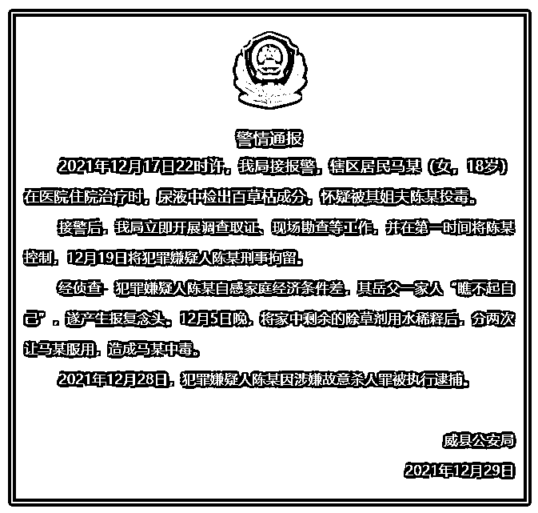
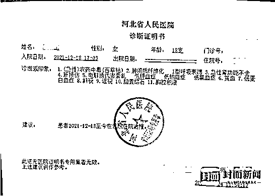

# 18 岁女孩被姐夫投毒百草枯，原因查明

> 原文：[`mp.weixin.qq.com/s?__biz=MzIyMDYwMTk0Mw==&mid=2247526704&idx=5&sn=2d4d1016635118a7f1da8f5b7b2c5243&chksm=97cba208a0bc2b1e99c85923d39253d74ba7b061d460c6617328a42cb2b52747dd40b16a2ec6&scene=27#wechat_redirect`](http://mp.weixin.qq.com/s?__biz=MzIyMDYwMTk0Mw==&mid=2247526704&idx=5&sn=2d4d1016635118a7f1da8f5b7b2c5243&chksm=97cba208a0bc2b1e99c85923d39253d74ba7b061d460c6617328a42cb2b52747dd40b16a2ec6&scene=27#wechat_redirect)

12 月 29 日，“威县公安”微信公号发布警情通报，称 2021 年 12 月 17 日 22 时许，我局接报警，辖区居民马某（女，18 岁）在医院住院治疗时，尿液中检出百草枯成分，怀疑被其姐夫陈某投毒。

接警后，我局立即开展调查取证、现场勘查等工作，并在第一时间将陈某控制，12 月 19 日将犯罪嫌疑人陈某刑事拘留。

经侦查：**犯罪嫌疑人陈某自感家庭经济条件差，其岳父一家人“瞧不起自己”，遂产生报复念头。**12 月 5 日晚，将家中剩余的除草剂用水稀释后，分两次让马某服用，造成马某中毒。

2021 年 12 月 28 日，犯罪嫌疑人陈某因涉嫌故意杀人罪被执行逮捕。

** 此前报道 **

**18 岁女孩被姐夫投毒百草枯**

**“你喝了嗓子就不疼了”**

据封面新闻 12 月 28 日报道，近日，河北邢台威县，18 岁女孩萌萌喝了姐夫陈某递上的两杯治感冒的药水后上吐下泻，送医院治疗数天后终于被查出居然是百草枯中毒。

12 月 28 日上午，封面新闻记者采访到了萌萌的亲属郭女士，她伤心地说：“医院又下病危通知书了，肾衰竭。因为孩子从 12 月 6 日发病到四处治疗，一直原因不明，直到 12 月 17 才被河北省人民医院查出是百草枯中毒。”目前，萌萌的姐夫陈某已经被警方依法刑事拘留，具体投毒原因警方仍然在调查中。

**从投毒至今已经 20 多天** 

**医院多次病下危通知书**

从在村里小药铺抓药到去县医院，后来直至转到河北省人民医院，12 月 17 日萌萌才被查出尿液中有百草枯毒素，但距离 12 月 6 日发病已经过了很多天。萌萌的父亲接受河北电视台农民频道采访时说：“我挺担心我孩子，有一口气都要治好她。“郭女士接受封面新闻记者采访时再次强调：“这孩子只要还有一口气，我们都要救活她。这不，医院又下病危通知书了。”

据萌萌的亲人介绍，12 月 6 号那天，孩子觉得身体不舒服，上吐下泻，浑身没劲，家里人以为她感冒了，就在村里的小药铺抓了点药，但还是不见好，输了两天液，萌萌病情恶化。甚至无法直立行走，得父亲背着她。去医院检查时，萌萌的舌头血红，像被了什么烧了一样。

之后又转送至当地卫生院、县医院，可萌萌的病情一直不见效，最终送到了河北省人民医院。经过多次检查，医生发现萌萌体内有一种毒素，但具体什么毒素，一直没查出来。后来在尿液里检查出百草枯中毒，且尿液中的“百草枯”浓度为 70ng/ml。

**下毒者居然是姐夫？**

**姐姐得知真相几近晕厥**

得知萌萌是百草枯中毒，家人都非常疑惑，问萌萌什么时候喝的百草枯，萌萌说自己根本不知道是百草枯。据郭女士介绍：“孩子今年读高三，因为学习有点跟不上，之前有 20 多天没去上学了。”萌萌的姐姐对媒体公开表示，因为自己家中有事，12 月 5 日，她让萌萌去自己家帮着看孩子。**“我老公用预防感冒的理由，让俺妹喝的是感冒冲剂，一次性纸杯喝了一杯，停了一会，又喝了一小杯，喝了这两次之后，（俺妹）直接吐了，老公在那瞪着眼让俺妹喝，说一会就好了，俺妹说特别难喝，他说一会就好了，喝吧。”**

12 月 6 号，萌萌总捂着肚子说不舒服，后来上吐下泻。然后就出现本文开头的一幕。姐姐得知自己老公那天给妹妹喝的是百草枯时，当场就站不住了。郭女士说：“可不是嘛，换成谁能接受？”萌萌的姐姐也说，真不敢想象妹妹是这种病，以为是妹妹自己因为学习压力大想不开喝的百草枯。

萌萌当时对姐夫让自己喝的药就没有一点怀疑？郭女士说：“**我们这孩子有点不爱说话，她就觉得特难喝，也不知道他下毒，他姐夫说你喝了嗓子就不疼了。**姐姐知道后，说把妹妹给害了。”17 号发现原因，全家人当即把萌萌的姐姐叫过来（怕她有危险），并报了警。

**家人曝其姐夫性格内向**

**出事后连个电话都不打**

萌萌的家人实在想不明白，为什么姐夫陈某让她喝这种药？双方平时没矛盾，而且过年过节还有农忙时节，陈某都会来家里帮忙。从萌萌出事，到家里人急得团团转，郭女士说：“他（陈某）就眼睁睁看着孩子病成这样，家里人急成这样，他就在那坐着，连个电话都没打。从 5 号到 17 号，你说这都多少天了？！全家人上有老下有小，家中的老奶奶半身不遂，我们又都是农民，现在全是亲戚帮忙凑钱给孩子看病。”

据郭女士透露，陈某平时性格有点内向，与萌萌姐姐是经人介绍认识结婚的，两家人距离七八里地，也算是老乡，现育有一子。事发后，陈某的亲人也没有上门来道歉或者表示慰问。萌萌的姐姐无法接受这个现实，一直觉得自己把妹妹给害了。目前萌萌仍处于危险期，每天治疗花费都在两万多元，家里已经欠下十多万元的债务。郭女士说：“这个药太毒了，医生都叫俺回家，都不给治疗了，俺全家说有一点希望俺也要治。”据透露，目前网络捐助萌萌的通道已经开启。

据了解，百草枯是一种高效能的除草剂，曾在全球广泛应用，对人畜有很强的毒性。百草枯可经消化道、呼吸道及喷洒农药时皮肤接触等途径引起。轻度中毒者，可只有恶心、呕吐、腹部不适、口腔及上消化道烧灼痛、接触部位烧灼症状；中、重度中毒者，可出现呼吸浅快、呼吸困难、心悸、黄疸、少尿或无尿等全身多器官功能障碍症状。重度中毒者可在几小时或几天内，出现呼吸困难甚至呼吸衰竭，短期内死于多器官功能衰竭（如肺、肝、肾）。

来源：威县公安；封面新闻，观察者

← 向右滑动与灰产圈互动交流 →

