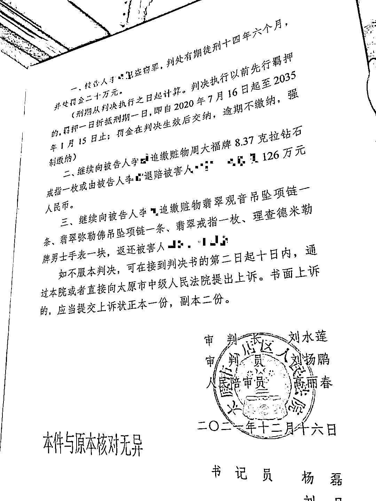
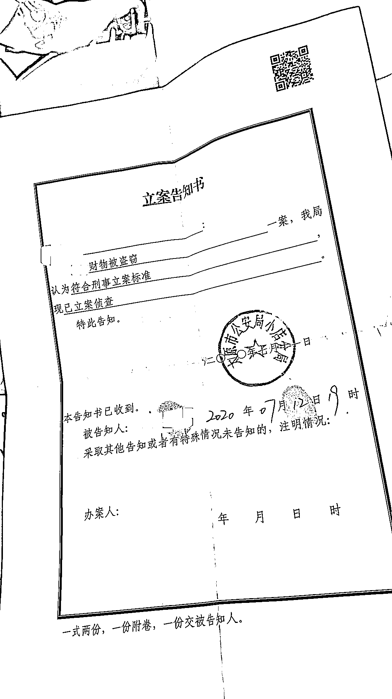
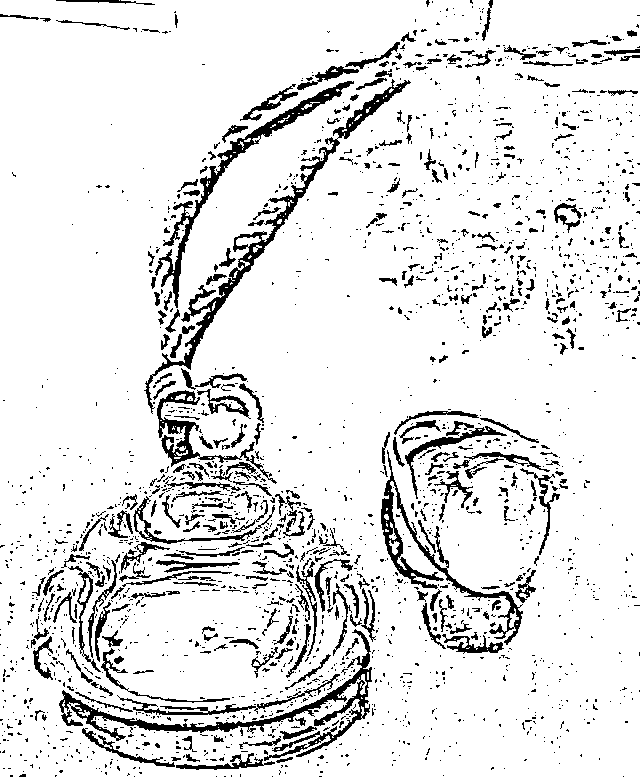
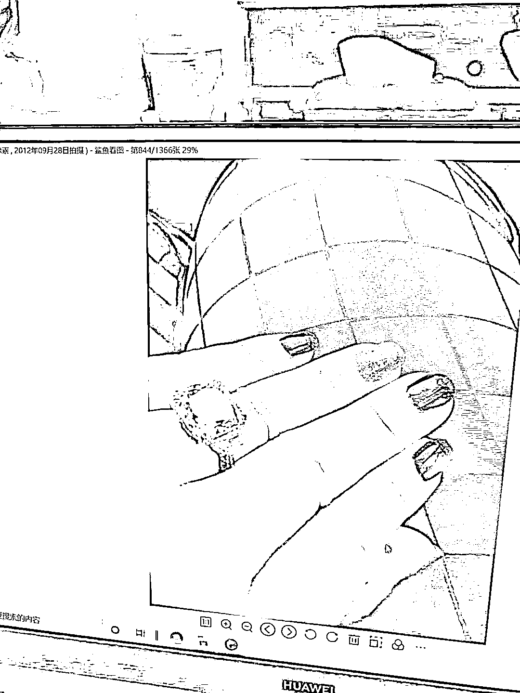

# 民警执行任务时借机盗窃 8 克拉钻石等，“经过事先预谋”

> 原文：[`mp.weixin.qq.com/s?__biz=MzIyMDYwMTk0Mw==&mid=2247526704&idx=6&sn=9594653c67f6d5bf8c463bb1b4acdde1&chksm=97cba208a0bc2b1e61538909ad0c7913d9d09ee64cfdf1be5e63febfadb2769778940bceb0da&scene=27#wechat_redirect`](http://mp.weixin.qq.com/s?__biz=MzIyMDYwMTk0Mw==&mid=2247526704&idx=6&sn=9594653c67f6d5bf8c463bb1b4acdde1&chksm=97cba208a0bc2b1e61538909ad0c7913d9d09ee64cfdf1be5e63febfadb2769778940bceb0da&scene=27#wechat_redirect)

太原一民警李某在协助执行抓捕任务时，关掉了执法记录仪，并借机制造混乱，盗走事主家中 8.37 克拉钻石和翡翠、名表等百万财物。东窗事发后，到案后的李某还拒不交代自己的犯罪行为，隐匿赃物，编造谎言搪塞，刻意隐瞒事实真相。

山西省太原市小店区人民法院近日审理这起盗窃案件，民警李某因犯盗窃罪一审被判处有期徒刑十四年六个月，并处罚金二十万元。

被告人李某犯盗窃罪被判 14 年半，被处罚金 20 万元。受访者提供 

12 月 29 日，案件中的失主郝女士告诉澎湃新闻，12 月 22 日，她收到法院寄来的判决书，法院认为民警李某以非法占有为目的，采用秘密手段窃取他人财物，数额巨大，犯盗窃罪判处有期徒刑十四年六个月。

 郝女士称，目前，被盗饰品等尚未返还给她。

 郝女士向澎湃新闻称，2020 年 7 月 8 日晚，因其丈夫被指涉赌博案，太原市公安局小店分局龙城派出所一行民警配合山西晋中平遥县公安局民警来到她的家中，要求她的丈夫任某协助案件调查，平遥县公安局出示了“搜查证”。与此同时，有民警开始在屋内搜寻。

 郝女士称，约一小时后，龙城派出所的民警离开，平遥县公安局民警继续对她的丈夫询问。她丈夫发现主卧抽屉被打开，感觉情况不对。经警方同意，她让保洁阿姨到房间查看，发现两个翡翠挂件、一枚翡翠戒指、一枚 8.37 克拉的钻戒、一块理查德米勒的手表丢失。郝女士称，5 件饰品共价值 600 多万元。太原市公安局小店分局就郝女士财物被盗一案，予以立案侦查。

 郝女士提供了钻戒和手表的发票及销售单，未提供其他饰品的票据。她称，因搬家丢失，她无法提供翡翠的票据，三件翡翠均价值百万以上，这些丢失的物品是分别于 2010 年、2011 年、2014 年在广州、澳门、香港等地购买。事发后她当即报警，当晚，她的丈夫被平遥县公安局带到警局录口供，次日，她丈夫被取保候审。一直到 2021 年 5 月 21 日，平遥县公安局出具《撤销案件决定书》，认为相关赌博案无犯罪事实，决定撤销此案。

太原市小店分局就郝女士财物被盗一案，事发第三天予以立案侦查。受访者提供

据郝女士提供的刑事判决书显示，被告人李某是太原市公安局小店分局龙城派出所民警。小店区检察院指控称，**2020 年 7 月 8 日 19 时 43 分，被告人李某乘配合平遥县公安局在小店区一小区 702 室实施抓捕任务之机，经过事先预谋，在到达现场后将自已佩戴的执法记录仪关闭，并命令其所带领的一名辅警关闭执法记录仪，再先后两次单独进入报案人郝女士家中主卧室现场踩点、搜寻，伺机作案。19 时 46 分 9 秒至 19 时 56 分 57 秒第二次进入报案人郝女士家主卧室期间，故意大喊“这还藏着个人”，吸引现场多名人员进入中心现场，制造混乱，以便后期行窃。**

被盗的翡翠吊坠。受访者供图

小店区检察院指控，待众人离开中心现场后，李某盗窃报案人郝女士家床头柜内一块手表（品牌：理查德米勒，2014 年 4 月 15 日在澳门欧洲坊购买。购价 736000 港币）、一枚钻戒（8.37 克拉、2011 年 11 月 25 日在香港弥敦道周大福购买，购价 1162545 港币）及三块翡翠饰品，五件被盗物品价值共计约人民币 700 万元。到案后李某拒不交代自己的犯罪行为，隐匿赃物，编造谎言搪塞，刻意隐瞒事实真相。

 值得注意的是，判决书提到经小店价认定字(2020)171 号鉴定：被盗钻戒一枚价值人民币 126 万元，其余被盗物品无法认定其价格。经小店区法院审委会研究认为，被告人李某以非法占有为目的，采用秘密手段窃取他人财物，价值 126 万元人民币，数额特别巨大，其行为构成盗窃罪。公诉机关指控罪名成立。

被盗的钻石。受访者供图

法院审理认为，在案证据可以证明案发当天被害人拥有的案涉物品在案发现场。被告人李某进入 702 室 54 秒即关闭其执法记录仪并要求一名辅警也关闭执法记录仪，具备作案动机。且其两次擅自单独进入被害人主卧室、多次在主卧室独处，具备作案时间。在主卧室期间被告人李某拿出与赃物一同放置的护照并翻找赃物放置的抽屉，系接触并翻找赃物存放地点的唯一人员，结合其事发之后的诸多反常表现，可以认定被告人李某在主观上有非法占有被害人财物的故意，客观上实施了盗窃被害人财物的行为，应当认定其构成盗窃罪。被告人及辩护人关于被告人李某没有实施盗窃的辩护意见，小店区院不予采纳。依照《刑法》第二百六十四条、第五十二条、第五十三条、第六十四条、第六十一条的规定，判决如下:

 一、被告人李某犯盗窃罪，判处有期徒刑十四年六个月，并处罚金二十万元。刑期从判决执行之日起计算。判决执行以前先行羁押的，羁押一日折抵刑期一日，即自 2020 年 7 月 16 日起至 2035 年 1 月 15 日止；罚金在判决生效后交纳，逾期不缴纳，强制缴纳。

 二、继续向被告人李某追缴赃物周大福牌 8.37 克拉钻石戒指一枚或由被告人李某退赔被害人 126 万元人民币。

 三、继续向被告人李某追缴赃物翡翠观音吊坠项链一条、翡翠弥勒佛吊坠项链一条、翡翠戒指一枚、理查德米勒牌男士手表一块，返还被害人。

来源：澎湃新闻

← 向右滑动与灰产圈互动交流 →

