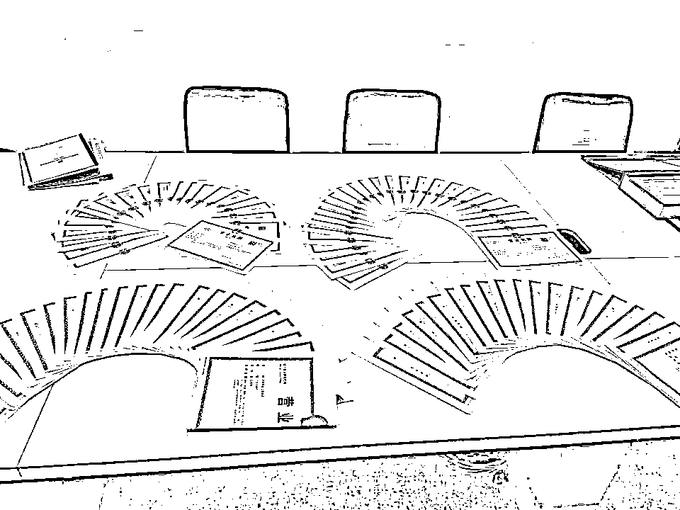
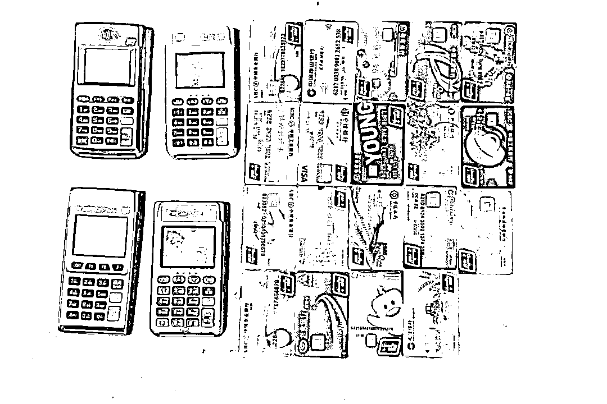
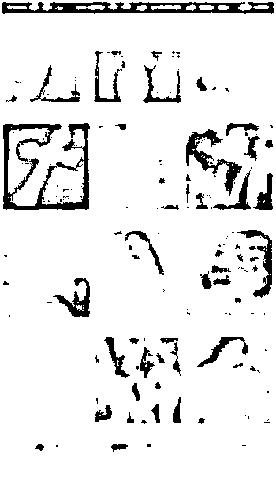
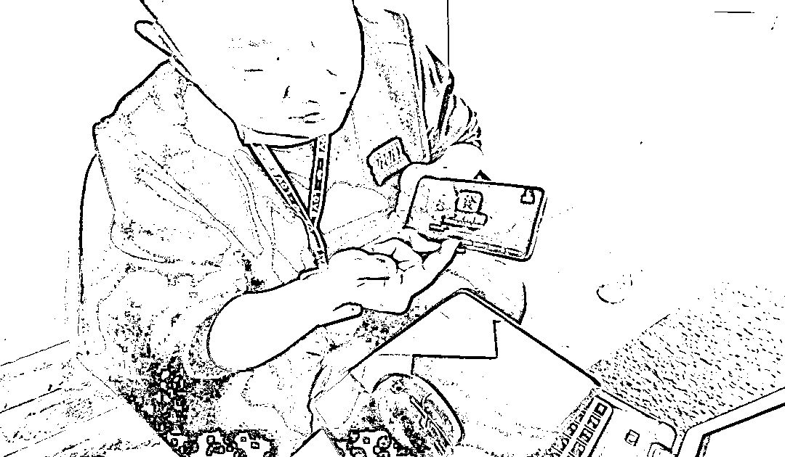
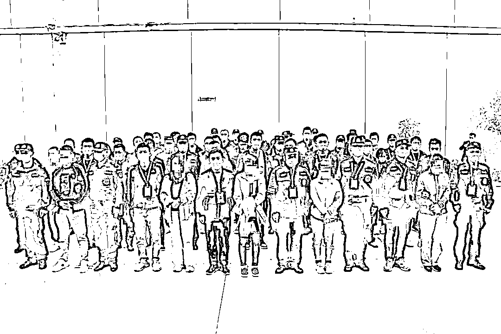

# 涉案 318 亿，全部充了话费！

> 原文：[`mp.weixin.qq.com/s?__biz=MzIyMDYwMTk0Mw==&mid=2247526704&idx=7&sn=8aa1ad9a7ebd23fc00a844b980974525&chksm=97cba208a0bc2b1ef5e41ba4d8f9bec3070e50a877f0a27cff05c0e6220e0d72355955ed11b5&scene=27#wechat_redirect`](http://mp.weixin.qq.com/s?__biz=MzIyMDYwMTk0Mw==&mid=2247526704&idx=7&sn=8aa1ad9a7ebd23fc00a844b980974525&chksm=97cba208a0bc2b1ef5e41ba4d8f9bec3070e50a877f0a27cff05c0e6220e0d72355955ed11b5&scene=27#wechat_redirect)

[`v.qq.com/iframe/preview.html?width=500&height=375&auto=0&vid=wxv_2199306542619983879`](https://v.qq.com/iframe/preview.html?width=500&height=375&auto=0&vid=wxv_2199306542619983879)

利用色情直播

**为网络赌博引流**

再通过调包

普通用户的话费

充值订单

**将赌博资金洗白**

……

↑湖北省公安厅召开新闻发布会通报案件相关情况

在湖北省公安厅的指导、支撑下，孝感市公安局**深度运行“情指勤舆”一体化机制**，调集全省资源及全市多个县市公安局、分局及各警种警力，经过一年多不懈追踪，赴 18 个省市区收网，**成功破获“9·17 新型网络犯罪系列案”，**打掉犯罪团伙**31 个**，抓获犯罪嫌疑人**115 人**，查证涉案赌博、色情、洗钱流水总金额达**318 亿元**，冻结各类涉案黑产资金**近 1 亿元**，**全链条查清并打掉一条为境外赌博、色情、洗钱集团服务的黑色产业链。**

<mpvideosnap class="js_uneditable custom_select_card channels_iframe" data-pluginname="videosnap" data-id="export/UzFfAgtgekIEAQAAAAAA1y0PwGotngAAAAstQy6ubaLX4KHWvLEZgBPE3aJIR28kPJv9zNPgMIuSUf-Ic5nAbx2o4JxESUtE" data-url="https://findermp.video.qq.com/251/20304/stodownload?encfilekey=rjD5jyTuFrIpZ2ibE8T7YmwgiahniaXswqzmp6nI2NDibwEo55FAXM8XUEFdRQYwn88a44WFPFEMia2lxz4CDZ5dh2kmVfVCQibObEWED6libKmuhGMQsjsRlfNUw&amp;adaptivelytrans=0&amp;bizid=1023&amp;dotrans=0&amp;hy=SH&amp;idx=1&amp;m=&amp;scene=0&amp;token=AxricY7RBHdVC5IDsX0eEIyqYkIbEPkAFwia1ibQjhHSicGFSmpoI72rNiazufTjNQOAgO1AREbwxFr4" data-headimgurl="http://wx.qlogo.cn/finderhead/Q3auHgzwzM4nN8LrymE3zkh8TfYdmVNRCCLEZ7pCYGpzMYSXOlgQ6w/0" data-username="v2_060000231003b20faec8c7e08b10c0d1ca04ea32b077d73ff11665decc48df0d790127908490@finder" data-nickname="平安湖北" data-desc="#湖北省公安厅新闻发布会 在湖北省公安厅的指导支撑下，孝感市公安局持续深入、全链条打击网络赌博犯罪活动，成功破获“9·17 新型网络犯罪系列案”" data-nonceid="9406197496818567828" data-type="video"></mpvideosnap>

**一体化打掉跨境网络赌博团伙**

2020 年 7 月，孝感市公安局在查处一涉毒团伙时，发现该团伙成员均利用境外聊天工具沟通，且聊天记录中**存在“跑通道”等大量术语**，同时在现场**查获****54 张已办好的“空壳”企业营业执照**。 

↑“空壳”公司营业执照

获悉这一线索后，孝感市公安局**“情报、指挥、勤务、舆情”一体化实战运行机制**（以下简称“情指勤舆”）迅速运转起来。工作查明，该涉毒团伙使用一个名为“云觅支付”的撮合交易技术平台，帮助境外赌博集团洗钱。

孝感市公安局党委高度重视，于 2020 年 9 月 17 日成立专案组，并指挥组织连续三轮跨省收网行动，成功打掉包括撮合交易技术平台、四方支付代理、洗钱中介在内的相关犯罪团伙，陆续抓获 17 名犯罪嫌疑人。

侦办“9·17”案件的过程中，孝感警方发现，**整个跨境网络赌博已经形成复合型产业链和非法交易“网络黑市”，****涉及网络赌博平台、色情直播平台、四方支付平台、撮合交易平台，大量黑产代理、中介、卡商、话商……**

↑扣押的涉案物品

根据侦查结果，孝感市公安局将相关线索分别指定下辖各县市区公安局管辖，跨多警种、多部门，织就了一张细密的大网—— 

1

2021 年 3 月 24 日，40 余名警力兵分两路前往北京和成都收网，先后抓获嫌疑人 11 名，冻结涉案账户 288 个；

2

2021 年 6 月以来，民警跨 12 省 16 市，成功摧毁一个通过色情直播为网络赌博引流团伙，捣毁涉黄直播窝点 13 个，抓获涉案犯罪嫌疑人 24 人；

3

2021 年 10 月 22 日，孝感警方再次开展集中收网行动，打掉为境外赌博平台洗钱的犯罪团伙 6 个，抓获犯罪嫌疑人 30 人，冻结涉案帐户 1500 个。

**色情直播为网络赌博引流**

孝感警方掌握的线索显示，大量网络赌博平台，都在用色情直播进行引流。而进行直播的 APP，并未在各大商店上架，而是利用社交软件进行推送，通过链接或扫描二维码进行隐秘下载，躲避监管。 

该案中，民警发现一款 APP 直播平台有许多“房间”，绝大部分“房间”都在进行色情直播表演。网友可以通过购买金币礼物给主播进行打赏互动。而打赏多的，就可以获取主播的微信、QQ 等联系方式，继而私下交流。

↑民警展示赌博平台界面

经进一步调查发现，类似的直播平台很多，仅民警掌握的，就多达近十个。这些直播平台的服务器在境外，平时通过“家族长”在国内招揽主播，而直播平台的背后还有一个赌博平台。**在直播平台上挂有赌博平台的链接，以此来为赌博平台引流。**

↑抓获色播案犯罪嫌疑人

网民打赏的礼物，平台抽取两成，剩下的八成由主播和“家族长”继续分成，主播分七成，“家族长”分三成。而通过直播间进入赌博平台，在赌博平台上的充值，主播也可以拿到分成。

这些色情主播为逃避打击、非法牟利，过着暗无天日的生活。**为了用虚假的“颜值”“身材”吸引流量，主播们几乎都做了整容，有的不惜一整再整，对身体造成了极大伤害。**在天津直播的的女子宋某某，不久前刚刚做完丰胸，还没有彻底恢复就继续直播。民警将其抓获时，她的双手还不能正常抬起。为了赚钱而舍弃廉耻，有的主播面临家庭崩溃。河南的主播王某某，躲在出租屋内直播，为了不让丈夫知道，她自称在某大型国企上班。**“每天做梦都是被丈夫发现的情景。”**王某某说，这次被抓后，最不敢面对的就是丈夫和孩子。面对审讯，王某某流下了悔恨的泪水。

**劫持用户话费订单洗白赌资**

在情报主导、大数据支撑下，孝感警方查实，该案涉及到的网络赌博团伙，大多利用话费充值订单进行洗钱。 

办案民警介绍，境外赌博团伙，利用四方支付平台，安排境内人员利用多个话费充值平台，以高于市场话费充值的折扣，从话商手中收购大量的话费充值订单。

↑扣押的涉案工具

随后，犯罪团伙将话费充值订单推送给撮合交易平台，撮合交易平台通过专门技术，将赌博上分订单和话费充值订单自动进行错配，将从运营商官网获取的话费充值支付链接提供给赌博团伙，由赌客扫码支付，赌客充值完成信息被系统自动接收，通知赌博网站该赌客上分成功。于是，赌客的赌资摇身一变，成为了普通用户充值的话费。

而境内的犯罪嫌疑人，则购买多个对公账户，收取话商代收的话费资金，并将话费资金转移到第三方支付公司，再通过支付接口，代付给赌博团伙，经多道洗钱环节后，最终转移至境外“安全账户”。**普通用户的话费，就这样变成了赌客的赌资。**

据介绍，该犯罪体系层级复杂、关系交织、手段隐蔽、分工明确，既有负责接赌博订单的四方支付平台，有负责订单匹配的话费充值平台，有负责代收验证码的接码平台，还有专门负责开发、维护的技术公司。此外，**大量渠道商、代理商、卡商和话商参与其中，为犯罪链条各个环节提供服务。**

↑抓获犯罪嫌疑人

这些提供给赌博人员进行非法资金结算的支付接口，其涉案流水让人瞠目结舌。仅广东某支付平台，就结算了非法资金 240 亿元。

**孝感市公安局相关负责人介绍**

**“9·17”案的成功告破，得益于全省“情指勤舆”一体化实战运行机制在孝感的落地见效。**“像这种区域跨度特别大、链条特别长、团伙特别多的案件，如果没有全省公安机关情指勤舆一体化实战运行机制的强力支撑，很难突破！”

**该案的成功侦破，有力震慑了新型网络犯罪，为打击新型犯罪积累了宝贵经验，是湖北公安机关现代警务机制改革取得积极成效的缩影。**

来源：平安湖北、孝感市公安局、阻击诈骗

← 向右滑动与灰产圈互动交流 →

