# “黄牛”也得来四次！九价 HPV 疫苗太难抢……

> 原文：[`mp.weixin.qq.com/s?__biz=MzIyMDYwMTk0Mw==&mid=2247526704&idx=8&sn=3ce9790006c81f44a622f0f2be209038&chksm=97cba208a0bc2b1e7ec4c1a51ec85855938413ef08649eaa2b4e19ec83bffec9b2cb80ef939f&scene=27#wechat_redirect`](http://mp.weixin.qq.com/s?__biz=MzIyMDYwMTk0Mw==&mid=2247526704&idx=8&sn=3ce9790006c81f44a622f0f2be209038&chksm=97cba208a0bc2b1e7ec4c1a51ec85855938413ef08649eaa2b4e19ec83bffec9b2cb80ef939f&scene=27#wechat_redirect)

预约九价 HPV 疫苗真是太难了，医院说没有苗，让我再等两年！

每次抢线上预约名额都是陪跑！

心态崩了。

预约名额一秒光，就无语。

九价 HPV 疫苗“一苗难求”，HPV 疫苗黄牛“应运而生”。

黄牛有**专业技术和业务团队**，业务范围涉及**代抢、现苗，走私港苗**等。代抢一单就 1500 元左右，现苗则要两三千元，**有黄牛月入过万**。

我国批准上市的九价 HPV 疫苗都是进口的，每年批签发量仅数百万支，而粗略估算，满足注射年龄要求的女性超过一个亿。

供需严重不平衡，预约疫苗的“网络战斗”十分激烈，**往往放苗后，1 秒就抢完了。连黄牛代约都常常“翻车”。**

但有律师表示，黄牛背后的技术团队可能构成**计算机相关犯罪**，黄牛若明知其或涉犯罪，仍为其揽客，则可能构成共同犯罪。

另外，还有骗子冒充黄牛，被骗了几千上万块的女性大有人在。

******九价 HPV 疫苗为啥这么难约******

目前，能接种的 HPV 疫苗分为二价、四价、九价。这个“价”到底是什么意思？为什么都想打九价疫苗？

“价”指的就是所针对病毒型别的数量。

虽说引起宫颈癌的主要是 HPV16 和 18 型病毒，二价、四价 HPV 疫苗都能对其起到预防作用，但是**“价”越高，能预防的病毒种类越多**。

因此，**九价 HPV 疫苗更受欢迎，也因此****“一苗难求”**。

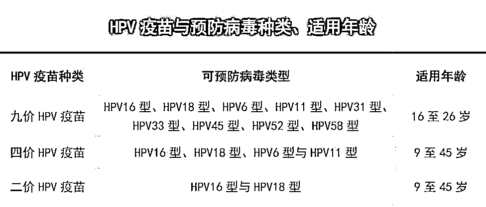

打开“知苗易约”预约疫苗小程序，选择九价 HPV 疫苗，发现**能预约的医院极少**，**就算能预约，开抢都是“秒光”**。

而且，由于注射九价 HPV 疫苗有更严格的年龄限制，很多马上 26 岁、还没约上九价疫苗的女士很着急。 

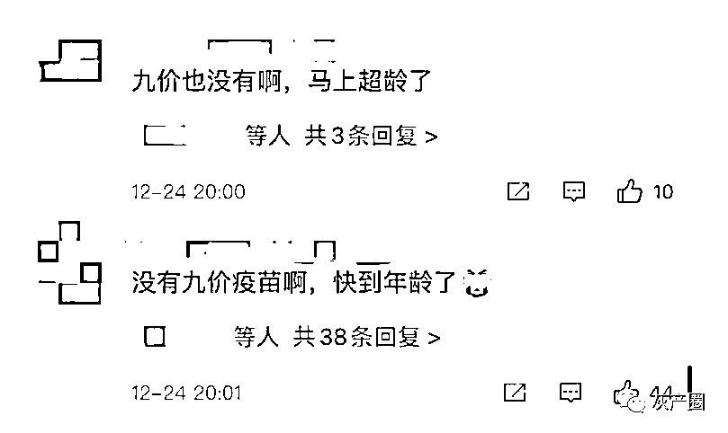

有媒体随机采访了 8 位已接种九价 HPV 疫苗的女士，其中，5 位女士都表示难约。

这 5 位女士中，两位**托了关系**，还等了好几个月才打上疫苗。还有两位去的**私立医院**，多花了一两千元打上的。

剩下的一位女士，花了两周时间，每天下午网上抢号，都没抢上，但幸运的是，当月社区医院通知她到苗了。

**而九价 HPV 疫苗的紧俏状况，催生了一个新“买卖”——代约黄牛。**

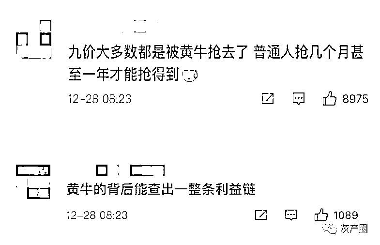

******有黄牛靠抢苗月入几万****** 

有媒体记者通过疑似是“托”的网友，联系上一个自称“冰冰”的 HPV 疫苗黄牛（以下简称冰冰）。

冰冰声称，他们**有专门的技术团队和业务团队，全国很多省份的疫苗都能找他们代约**。

记者还被拉进了他们创建的“九价交流群”，刚进群时，群里有一百多人，不到一个月，已经发展到三百多人。冰冰每隔一两天都会在群里发代抢信息。

黄牛团队需要预约者先在微信“知苗易约”小程序上绑定自己的身份信息，开抢前半个小时至一个小时，**通过微信扫码在黄牛电脑端登录，黄牛通过电脑程序帮忙抢号**。

而且，黄牛还很“贴心”地表示，如果不放心微信里的信息和钱包安全，可以申请微信小号，让他们登录操作。

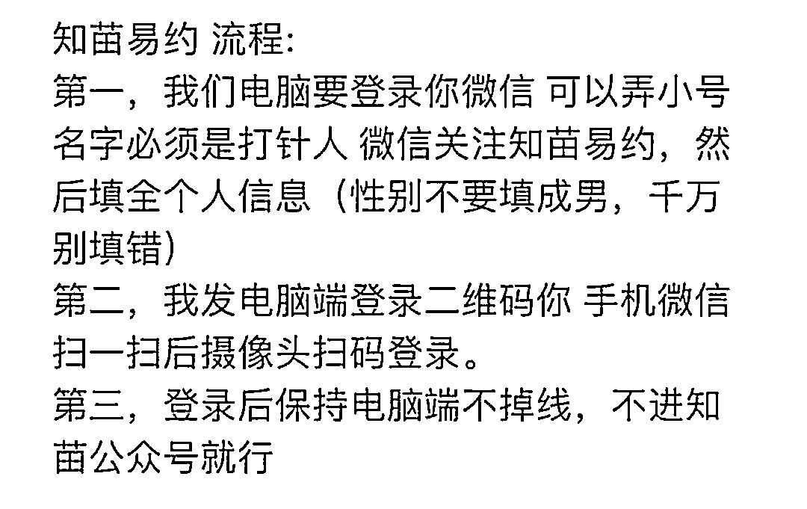

黄牛冰冰团队的“疫苗代抢流程”

抢号成功后顾客进入“知苗易约”小程序查验，确认预约成功后再转账。

通过知苗易约、约苗等小程序预约接种，社区医院一针九价 HPV 疫苗一般 1300 元左右，三针打下来 4000 元左右。

冰冰的黄牛团队**代约四价需要 800 元左右手续费，而九价需 1500 元左右**。

这个价格还不是最高的，**“物以稀为贵”，**在一些“竞争激烈”的城市还要另外加价**。**

一般来讲，三针九价 HPV 疫苗的黄牛费在 1500-1700 元，很少有上 2000 元的。现苗黄牛费要 2600 元左右。

**但是，一些黄牛开价高达 3000 元，甚至还有 5000 的，直接超过了社区医院三针疫苗总价。**

**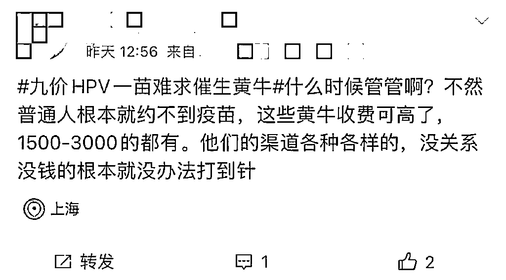**

**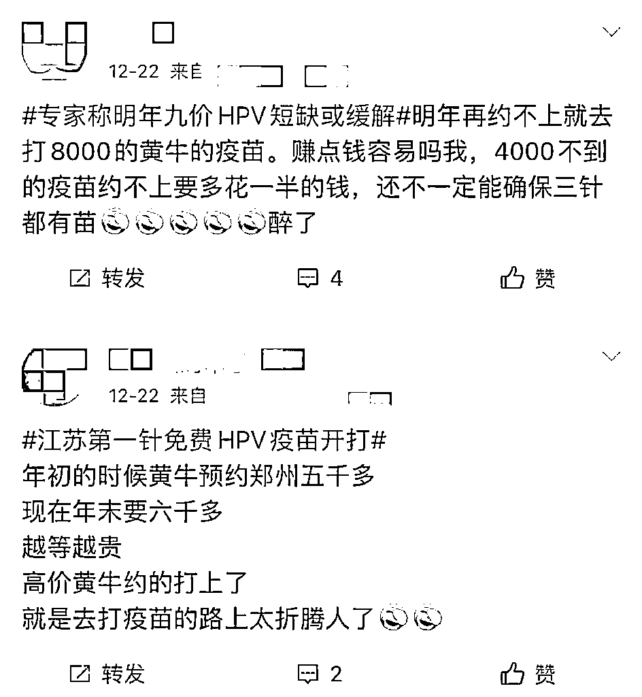** 

**********黄牛代抢四次才成功**********

****为了搞清黄牛团队的代约模式，媒体记者委托朋友小张，联系冰冰代约成都的九价 HPV 疫苗。代抢前，按照黄牛团队的要求，将名字和身份证号发给了冰冰，冰冰会**把预约同一医院同价疫苗的客户专门建群**。****

******不同城市代抢难度不同。**冰冰先给要预约成都九价 HPV 疫苗的客户“打了个预防针”——在成都，正常情况下，**就算通过他们，10 个人也就能约中 1 到 2 人。**11 月 1 日成都某社区卫生服务中心九价 HPV 疫苗预约，冰冰团队约中率仅 10%。****

******“成都每场都是技术之间的较量，找代抢的人多，还有就是不限户籍，人多苗少。”******

****第一次预约，通过冰冰代约的 4 人都没有成功。“今天有点翻车。”冰冰解释称，这是因为**疫苗被内定，医院拿去卖现苗了**。**** 

****“这很正常。通过约苗推送名额，实际可以抢的疫苗根本没那么多。**现苗贵，（黄牛费用）2800 元。**”****

****第二次，小张依然没有约上。小群里 5 名客户，3 名约中。冰冰说名单里有小张，但“知苗易约”上查不到预约信息。最后经过确认，可能是重名。****

****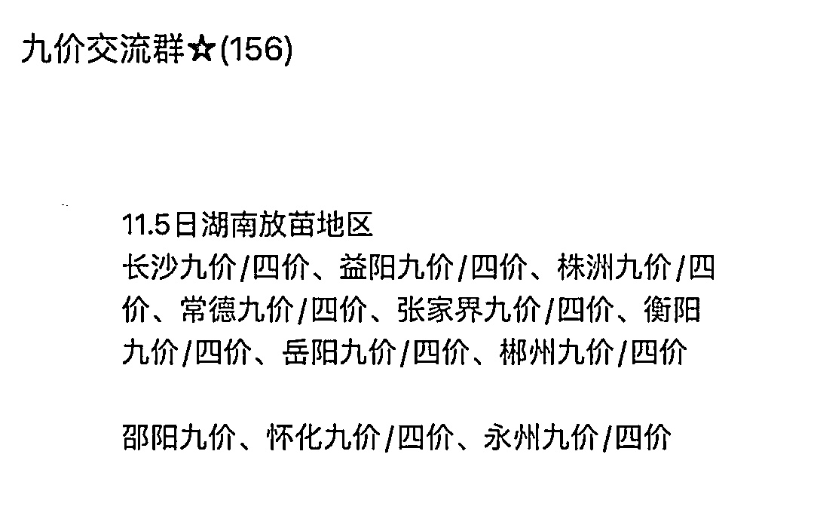****

****黄牛冰冰放出的疫苗预约信息****

****第三次，小张依然没约上。这一场，冰冰的客户全军覆没。冰冰解释说，时间最长的一个客户，用了快一个月，七八次才成功。****

******第四次，小张终于约到了。**成都当地消息显示，此次温江区放苗 1000 支。小张观察到，这一场，冰冰的小群里 6 个客户，4 个都抢到了。****

****这次搞活动，冰冰每人只收了 1350 元，比平时便宜 150 元。****

****12 月初，到医院接种第一针时，小张和排队的 4 位女士沟通后了解到，**只有 1 人是排队预约到的，另外 3 人都是通过黄牛网上代约的**，价格都差不多。**这 3 人里，甚至还有从重庆过来接种。******

****有网友在群里咨询冰冰成都是否有现苗，冰冰称，她可以**转号**，两天内就可以搞定。所谓转号，就是把晚上代抢预约成功后不给钱的客户换掉。****

 ****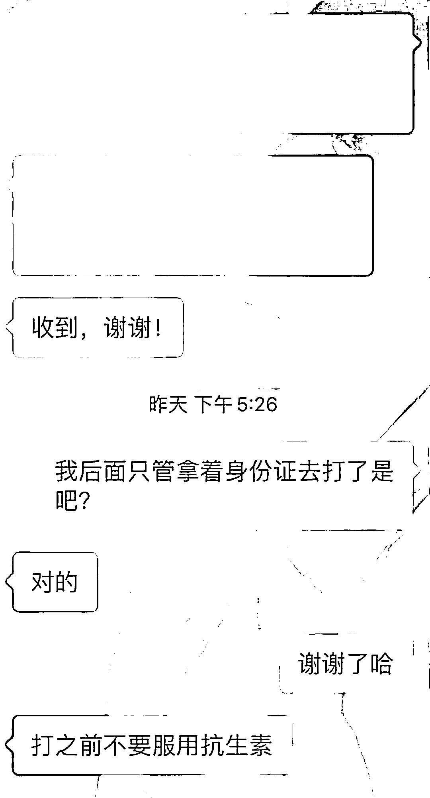****

****客户和冰冰的交易记录****

****部分疫苗被医院工作人员“截胡”，再加上参与抢苗的黄牛团队越来越多，代约成了黄牛团队间的“技术较量”。有一些黄牛团队将**代约服务分了价格等级**，选择越贵的“技术人员”，抢到的概率就越高。**** 

****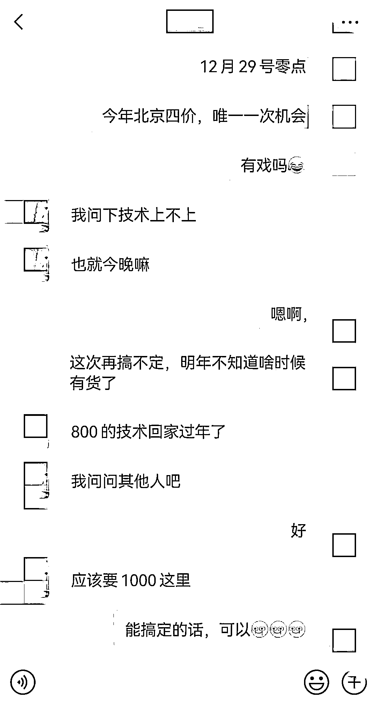****

****甚至还有黄牛因为抢苗难度太大，即使顾客愿意加钱，也不肯接单。**** 

****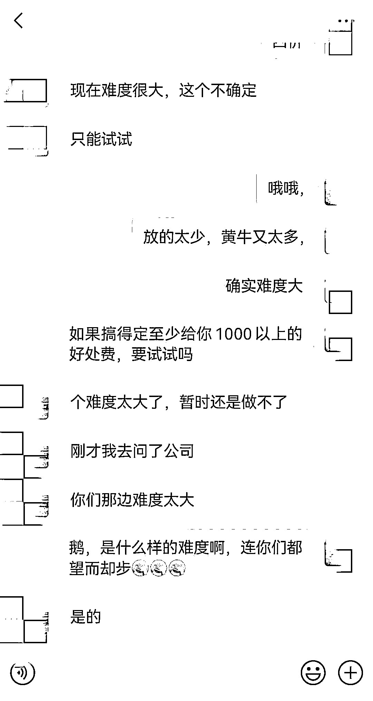****

**********被“******假******黄牛”骗了上万块**********

**九价 HPV 疫苗代约“水很深”，不但有“正规”黄牛，还有“空手套白狼”的骗子。**

骗子会通过女生常用的各种社交平台，发布“代抢”“代预约”九价 HPV 疫苗的虚假消息，自称有医院预约名额，等待受害人主动联系。 

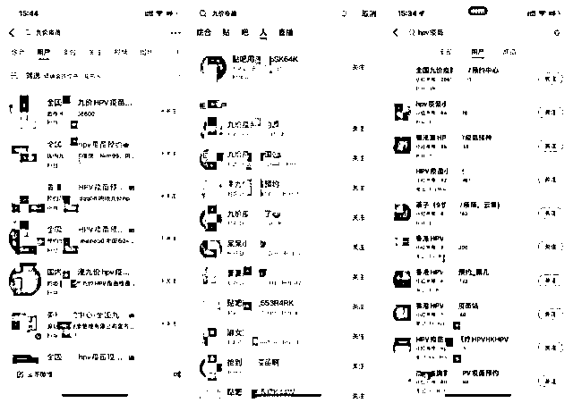

骗子还会作出“预约不成功可退款”的虚假承诺，以此来骗取受害人的信任，并要求受害人提供姓名、身份证、手机号等个人信息，以完成预约。

在收到受害人打来的预约金后，再发送早已准备好的预约成功虚假短信，随后便要求付全款。

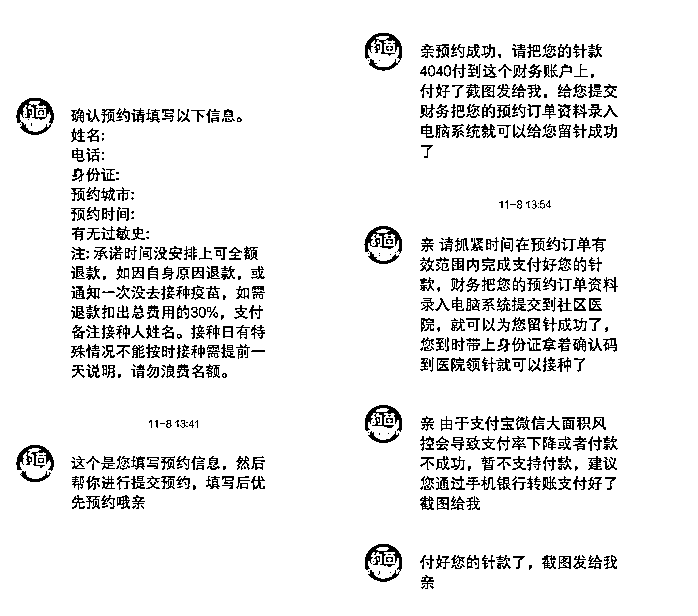

有些骗子还会发一张手持身份证的照片或营业执照，骗取受害人信任。其实，这些照片都是假的。

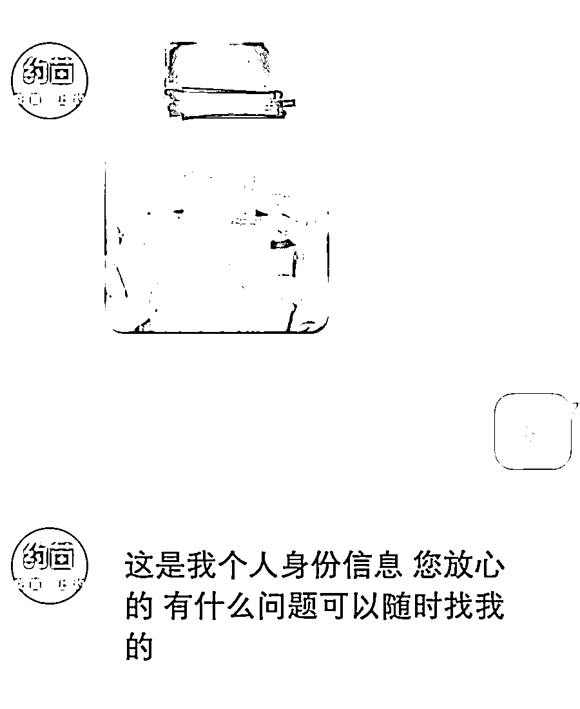

更有甚者，会制作“预约网站”，这种网站进去后，和官方的约苗网页十分相似，如果不细看，很容易上当。

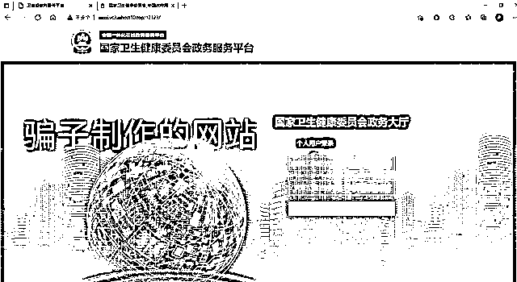

“骗子”在取得受害人一定信任后，还会以“预约订单被冻结”“订单需激活”等各类借口为由，要求再次转账，并且通过一系列催促，不让受害人有多余的时间思考。

收到钱款后，或以类似理由继续蒙骗受害人，或直接将受害人拉黑。

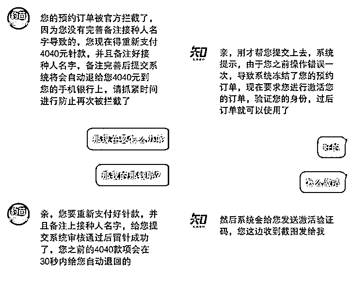

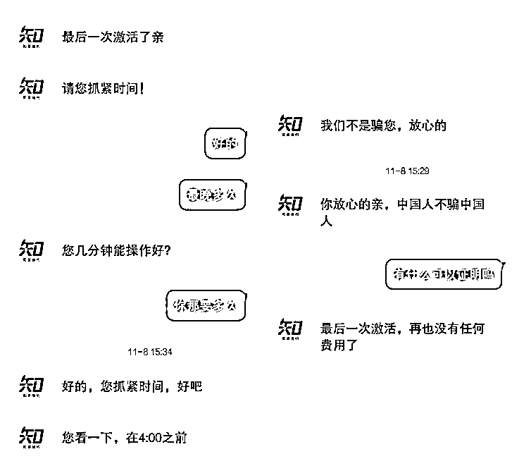

很多女生打疫苗心切，眼看身边有关系的朋友马上要打九价 HPV 疫苗，自己没有关系，不得不找黄牛。却被“假黄牛”骗了几千甚至上万块钱。

******医院工作人员“近水楼台”卖苗******

就像之前黄牛冰冰说的，**暴利之下，确实有社区医院工作人员倒卖九价 HPV 疫苗。**

近期，重庆有不少女士通过江北区大石坝社区医院的工作人员周某婧个人预缴费接种九价 HPV 疫苗，却被安排到五六家其他医院接种，甚至“上门”在车上接种。

有女生反映自己**接种后查询不到接种记录，也没有开具正规发票。**

在今年 7 月，周某婧曾因用二价 HPV 疫苗冒用九价 HPV 疫苗为他人注射，被江北区卫生健康委员会处罚暂停执业 18 个月。案发后，周某婧被刑拘。

**还有骗子用二价 HPV 疫苗冒充九价 HPV 疫苗。**

******黄牛团队可能犯罪！******

冰冰称，自己是做代理（业务员）的，他们的团队重心在成都，但全国各地的业务员都招。

一般，每单业务员能赚 300 元-400 元，具体看代理自己的定价。“比如在成都，（技术团队）给 1000 元的代理价，我们报价基本在 1300 元-1500 元。”

至于现苗，冰冰表示自己是跟医院合作，虽然收费贵些，但打点费用也高，每单差不多也是赚三四百元。

“**反正我一个月赚个几万不是问题。**”冰冰说。

北京市中闻律师事务所律师卢义杰认为，**对黄牛技术团队的法律定性，须考察技术手段的原理。**

一旦技术团队存在**对计算机信息系统功能进行删除、修改、增加、干扰，造成计算机信息系统不能正常运行，且产生严重后果**，比如违法所得 5000 元以上或造成经济损失 1 万元以上等，有可能会被认定为**破坏计算机信息系统罪**。

当技术团队仅使用的是自动化操作的“代抢”手法，实践中的处理略有不同。

一些法律人士认为该手法不涉及数据修改、使用范围不广，不构成犯罪，但随着近年互联网犯罪打击力度的加大，不少法院亦会认为该手法系通过非常规的方式构造网络请求，破坏了公平的交易秩序，损害消费者利益，常见罪名包括**提供侵入、非法控制计算机信息系统程序、工具罪**等。

**如果代理或业务员明知技术团队使用非法方法抢票仍为其揽客，可能构成共同犯罪。**

卢义杰律师表示，如果黄牛所称打点医院工作人员属实，达到规定数额，则其涉嫌**行贿犯罪**，被打点对象则涉嫌受贿罪或非国家工作人员**受贿罪**。

******咋能自己约到苗？******

**为杜绝黄牛，有些地方从预约途径上采取措施。**

如深圳市，不限户籍，身份证年龄为 16 岁至 26 岁 5 个月的女性都可以参加摇号，摇号过程由 IT 系统自动完成，不需要申请者亲自到现场，**全程录像**并接受社会监督。

深圳市疾控中心还在现场**安排市民代表见证摇号全过程**。

2021 年 8 月，广西壮族自治区疾病预防控制中心表示，提供预约服务的科技公司应该通过**技术手段**断绝黄牛现象。

比如通过手动拖拉拼图移动到指定位置阻止黄牛党机器刷票，升级增强人机校验算法，预约成功后预约人不能自行取消预约，需经接种门诊确认后，由接种门诊后台取消预约等。

**黄牛问题的根本原因，还是市场供需失衡。**

国家统计局最新数据显示，九价 HPV 疫苗的**适龄人群（16～26 岁）约 1.2 亿**。而按照智飞生物 2020 年**九价疫苗批签发量 506.6 万**计算，能够接种到该疫苗的人数还不足总数的 1.5%。

在人口基数众多的深圳，九价 HPV 疫苗摇号每一期中签率都不足 3%；记者在双十一期间在某购物平台通过直播抢购私立医院的九价 HPV 疫苗，秒无，三针九价的价格达到了 5104 元。

2020 年 11 月 17 日，世界卫生组织启动加速消除宫颈癌的全球战略，中国等 194 个国家，将会**在 2030 年前为 90%的女孩在 15 岁前接种 HPV 疫苗**。国内多地已开始推动此项工作，不过都是二价 HPV 疫苗。

好消息是，在默沙东垄断全球九价 HPV 疫苗批签发的情况下，国产疫苗开始破局。

前不久，世卫组织表示，中国公司生产的双价人乳头瘤病毒疫苗正式通过认证，可供联合国系统采购。这意味着，**国产疫苗的质量和安全性已获国际认可。**

不过，公开报道显示，**国产九价最早预计 2025 年左右投入市场。**

针对目前九价疫苗接种预约紧张的情况，卫健部门表示，适龄女性**可以考虑先接种二价疫苗，越早接种效果越好，之后仍可接种九价疫苗。**

简言之，不要因为盲目追求九价疫苗而错过最好的接种年龄。

[`mp.weixin.qq.com/mp/readtemplate?t=pages/video_player_tmpl&action=mpvideo&auto=0&vid=wxv_2199326560439107585`](https://mp.weixin.qq.com/mp/readtemplate?t=pages/video_player_tmpl&action=mpvideo&auto=0&vid=wxv_2199326560439107585)

接种疫苗，也要注重适用和实用，不要听信黄牛忽悠，而使自己“被牵着鼻子走”。保障广大女性的身体健康，政府和有关部门一直在努力。

你注射 HPV 疫苗了吗？注射的几价疫苗？

来源：央视网综合澎湃新闻、新闻直播间、人民网

← 向右滑动与灰产圈互动交流 →

