# 前代理起底张庭公司套路！

> 原文：[`mp.weixin.qq.com/s?__biz=MzIyMDYwMTk0Mw==&mid=2247526777&idx=1&sn=2c0e71ca233291e2de7922f46640af44&chksm=97cba241a0bc2b579e2bc6e34f8d46ac4a971c3daf2046267dad662097fc4c1c896779bdeff5&scene=27#wechat_redirect`](http://mp.weixin.qq.com/s?__biz=MzIyMDYwMTk0Mw==&mid=2247526777&idx=1&sn=2c0e71ca233291e2de7922f46640af44&chksm=97cba241a0bc2b579e2bc6e34f8d46ac4a971c3daf2046267dad662097fc4c1c896779bdeff5&scene=27#wechat_redirect)

最近，

由演员林瑞阳、张庭夫妇成立并实际控制的

上海达尔威贸易有限公司，

因涉嫌传销被立案调查，

引发热议。

不少网友表示， 

早就觉得 TST 的营销模式有问题：

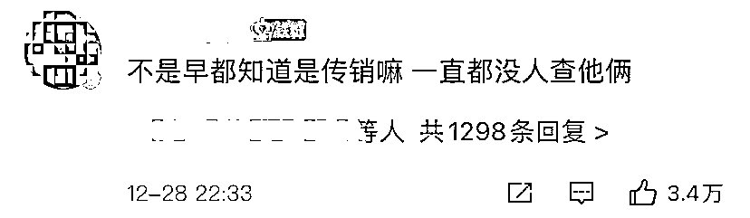

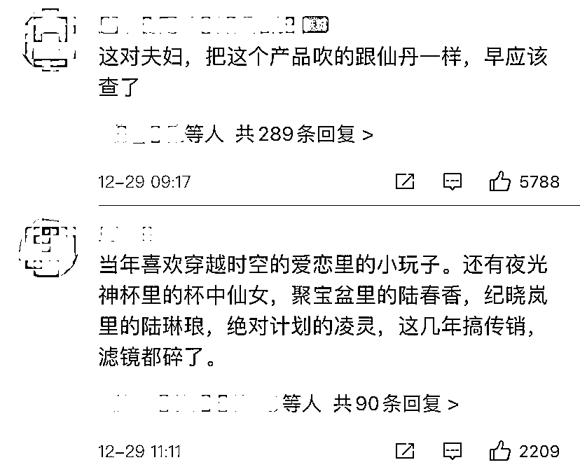

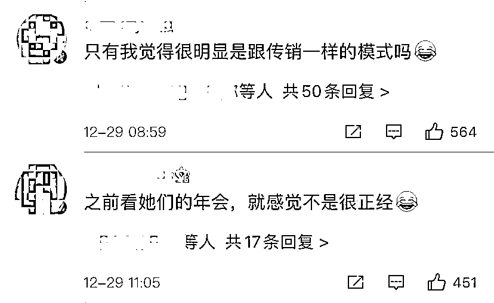

曾经风生水起的 TST， 

到底有啥“魔力”？ 

**TST 的秘密**

12 月 29 日，曾加入 TST4 年、从代理商逐级做到“董事长”的孙琦（化名）向记者讲述 TST 内部销售人员发展模式：

*   **购买 2500 元产品后拉人头才有提成，为赚钱需要不断发展“下线”；**

*   **花 30 万元可成为“董事长”，组建自己的团队及家族，赚“子子孙孙”的钱；**

*   **“董事长”每月 25 万元的销售业绩主要靠让“下线”囤货、裂变，以及自己垫钱囤货完成。**

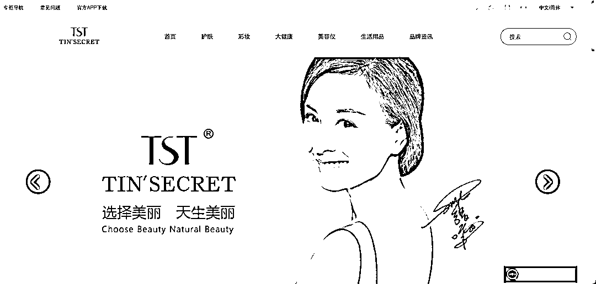TST 官网截图。

**花 30 万可成为“董事长”，组建自己团队赚提成**

2016 年，孙琦经朋友介绍加入 TST。朋友告诉她，在 TST 赚钱特别多，一年能赚十几万、二十几万，而且不用投钱。随后，她被拉入各种 TST 家族微信群。

**TST“招新”有一套完整的运营流程：**

*   **一开始时为了吸粉，微信群中会打出“花 19 块钱运费，拿价值 300 多元礼包”的旗号，拉人进群。**群里还不断有励志案例分享：有人年赚五六百万，有大学老师辞职加入 TST，没有文化的农村宝妈也能挣到钱……

*   **成为代理后的第一步是发朋友圈。**孙琦按照朋友教她的方法，每天复制微信里别人发的文案、图片，照着转发就行。

*   孙琦介绍，TST 将代理分为“蓝卡”和“红卡”。蓝卡代理不具备开卡资格，红卡代理拉人才有提成。发朋友圈只能赚点零售钱，**要想赚更多的钱，得开红卡。****开卡是有条件的，先买 2500 元产品。**

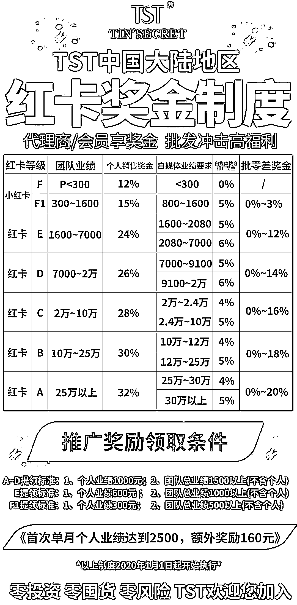

2020 年 TST 内部红卡奖金制度。受访者供图

*   升级为“红卡”不断拉人后，孙琦发现也没挣着啥钱，朋友告诉她，**成为团队长发展 100 个人，靠这 100 个人继续发展下线……这样儿子辈、孙子辈挣钱孙琦也能拿到返利。**孙琦朋友劝她去成立公司，做董事长，成为“TST 创始人”。**成为董事长需要连着三个月，每月买 10 万元产品。**孙琦在三个月内，将信用卡、花呗、借呗等各个平台能贷出来的钱，都贷了一遍，凑钱完成要求。

*   **第四个月，孙琦被允许“裂变”，成立了自己的“家族”，成为董事长，利用原本和朋友合开的公司，与 TST 公对公走账。**

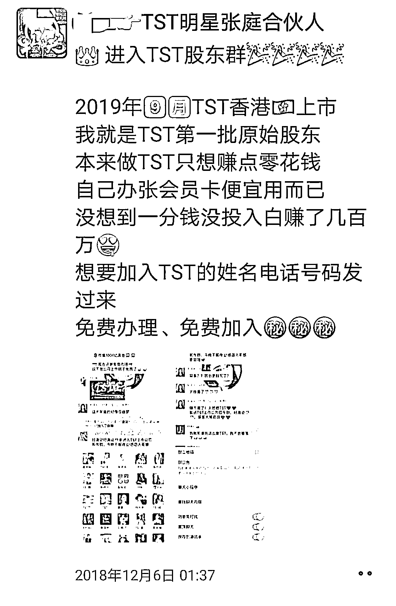

TST“合伙人”在朋友圈称免费加入。受访者供图

**“董事长”团队每月需完成 25 万业绩，主要靠自己垫钱囤货**

**“招新”“留存”之后，便是“促活”“营收”：**

*   成为“董事长”后，**每个月团队业绩要达到 25 万以上，达不到，就拿不到高提成和返利。**然而，代理都知道上级代理有返利，因此谁也不愿意原价买，上级代理只能将产品打折给到下一级，如果价格不够低，人家就去其他人那里买了，自己团队也完不成业绩。

*   **为了完成业绩，孙琦只能不断囤货。**公司虽然声称不允许囤货，但会通过搞特价活动的方式，在群里不断晒单、截图，说谁买了多少多少，再不买没了，刺激代理囤货。

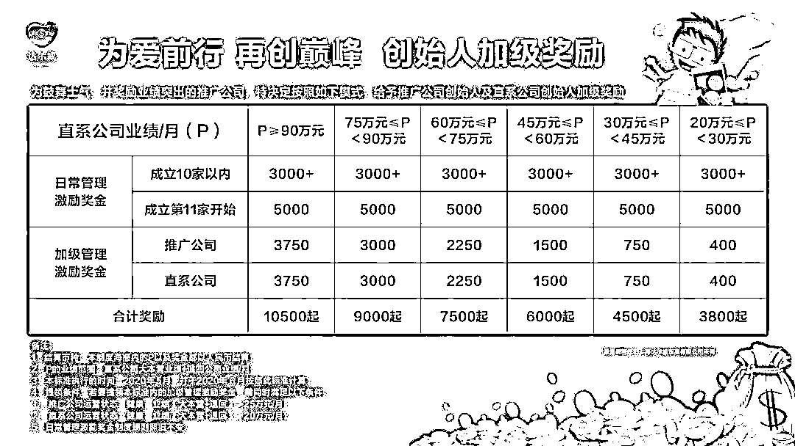

TST 内部创始人加级奖励制度。受访者供图

*   **囤货的分销需要更多人来承担，为此孙琦让下级代理囤货、裂变，**“只有下级代理的业绩高，我才能挣钱。下级代理要想赚钱，只能不断拉人。”

*   **同时，孙琦按照朋友当初拉她入伙的模式，套路别人。**最终，她成功发展两个人成为董事长。

终于，孙琦账面上每个月能收到几万块钱。**TST 公司返给孙琦的钱，以服务费的名义通过对公账户打过来，这其实是她的“子子孙孙”购买产品的提成。**

但她盘算完发现，自己仍然没有挣到钱。**买来的货都打折低价卖出，相当于自己垫钱拿货，**“100 块钱买的东西，60 块钱卖，返利的 40 块钱下个月发给我，就说是我挣的，但发的钱基本都是我自己垫的钱。”

孙琦意识到，自己被“一步一步套路”，2021 年年初，囤的货甩得差不多之后，孙琦彻底决定不再做 TST。而被孙琦发展的两名“董事长”，也因为挣不到钱退出。

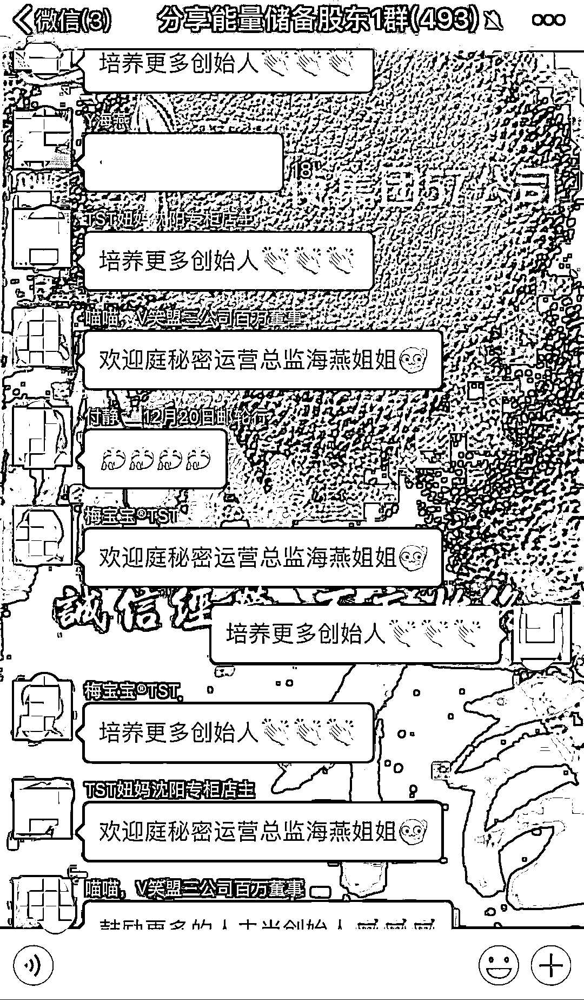

TST 内部群，群成员称“培养更多创始人”。受访者供图

▼

[`v.qq.com/iframe/preview.html?width=500&height=375&auto=0&vid=t33163el5jl`](https://v.qq.com/iframe/preview.html?width=500&height=375&auto=0&vid=t33163el5jl)

▲张庭夫妇公司被查后“董事长级”团队长揭秘：不管怎么拉人都赚不到钱。新京报我们视频出品（ID：wevideo）   

**创始人明星效应加持，涉嫌传销被查**

孙琦称，**TST 产品基本为代工厂加工，**她曾在网上搜索发现，其中一款 TST 面膜的代工厂成本价约为一盒 20 元，而售价高达 148 元，**产品利润巨大。**

**明星创始人也成了品牌宣传、拉人的加持。**代理买够两万元能跟老板合影，加“大哥”林瑞阳微信，进入精英群，而在精英群里老板娘张庭、“大哥”林瑞阳每天早晨给大家开文字早会。

孙琦说：“我后来才知道，那根本不是老板微信，只是挂了老板的图片当头像，助理在运营。”

2020 年，**张庭转战抖音开启直播带货时，还从 TST 家族群中拉人到抖音直播间，让代理们高价购买产品，再返现金券，**“有谁不去买，老板娘说话就非常难听。”

TST 也多次陷入涉嫌传销的争议，据李旭反传防骗团队介绍，近年来，其团队多次收到关于 TST 平台涉嫌传销的举报信息。诸多网友反馈，TST 存在入门费，多层级团队计酬机制。在 TST 平台，很多代理为了赚钱不断拉人，成立新公司，疯狂发展下线，砸钱囤货，其营销模式疑似涉嫌传销。

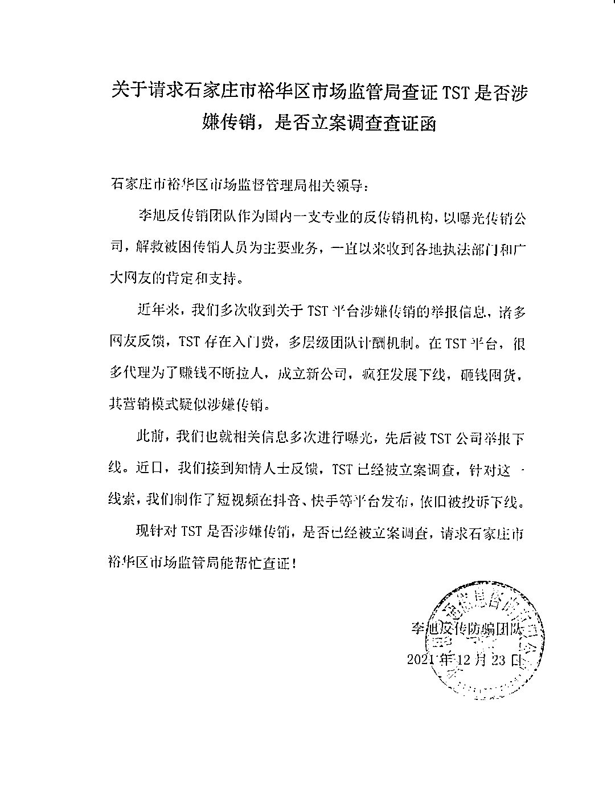

李旭团队将上述情况以《关于请求石家庄裕华区市场监管局查证 TST 是否涉嫌传销，是否立案调查查证函》的形式，反映给有关部门。

李旭表示，根据《禁止传销条例》，传销一般有三个特征：

*   **一是有入门费，需要缴纳一定费用，或者认购一定的产品，取得入门资格，也就是变相的入门费；**

*   **二是拉人头，发展上下线的关系，形成团队；**

*   **三是团队计酬，直接或者间接以发展的人数、销售业绩发钱。**

李旭表示，在这样的模式中，公司、团队长等有返利，但他们一般不会公开奖金模式，这也是非常狡猾的地方，而这种行为模式也触及到法律红线。在该模式下，底层的参与者成了接盘侠。

**事件经过**

**12 月 23 日**

石家庄市裕华区市场监督管理局以查证函回复的形式，通报知名日化品牌“TST 庭秘密”（以下简称“TST”）运营主体上海达尔威贸易有限公司涉嫌利用网络从事传销活动，已于 2021 年 6 月 5 日对其进行立案调查。因上海达尔威贸易有限公司利用金融机构转移或隐匿涉传资金，石家庄市裕华区市场监督管理局已依法申请人民法院采取保全措施，目前案件在进一步调查中。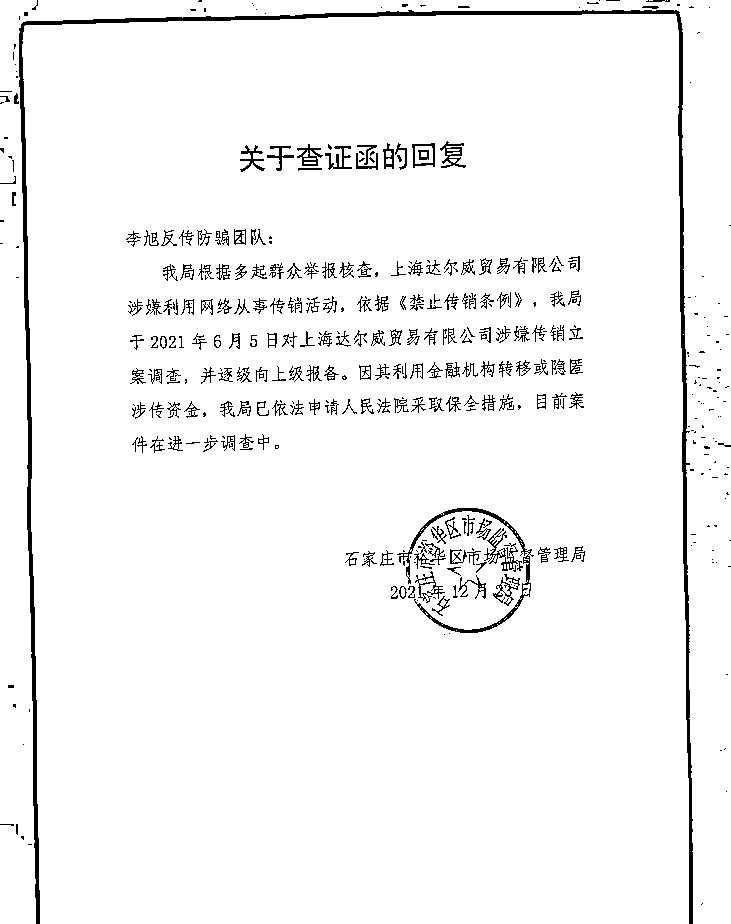石家庄市裕华区市场监督管理局“关于查证函的回复”。图源：李旭反传防骗团队。

**12 月 29 日凌晨**

@TST 庭秘密微博回应涉嫌传销被查一事，称“公司上海达尔威贸易有限公司是一家合法经营的公司，自成立以来始终遵从政府指导，坚持合法经营、依法纳税”。 

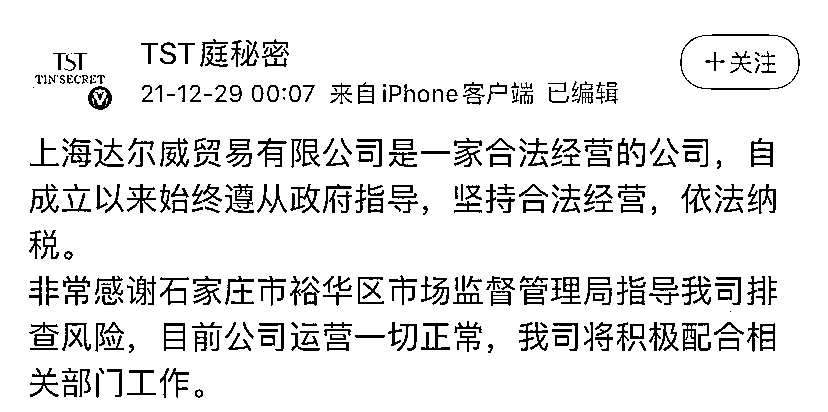

▼

[`v.qq.com/iframe/preview.html?width=500&height=375&auto=0&vid=v33159m7l5w`](https://v.qq.com/iframe/preview.html?width=500&height=375&auto=0&vid=v33159m7l5w)

▲探访“TST 庭秘密”总部大楼：员工称楼内办公正常，见有记者安保人员迅速增多。新京报我们视频出品（ID：wevideo）

随后，张庭本人转发该微博。

**12 月 29 日上午**

石家庄市裕华区市场监督管理局不正当竞争科工作人员回应记者称，此传销组织发展的会员即参与传销的人员在裕华区，这个从 2013 年开始的传销组织具有跨度时间长、涉及人员多、涉案资金大三大特点。

来源：央视网综合新京报、极目新闻

← 向右滑动与灰产圈互动交流 →

