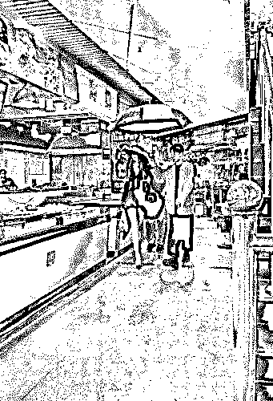
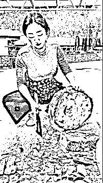

# 这些年，我们看过的那些媛们！

> 原文：[`mp.weixin.qq.com/s?__biz=MzIyMDYwMTk0Mw==&mid=2247526777&idx=2&sn=ad61961811f7dec47d4c38478bbf2b98&chksm=97cba241a0bc2b57e456387b046067126adf66315a8f31a713607dc00e3ba2083f7baddc75ac&scene=27#wechat_redirect`](http://mp.weixin.qq.com/s?__biz=MzIyMDYwMTk0Mw==&mid=2247526777&idx=2&sn=ad61961811f7dec47d4c38478bbf2b98&chksm=97cba241a0bc2b57e456387b046067126adf66315a8f31a713607dc00e3ba2083f7baddc75ac&scene=27#wechat_redirect)

首先要申明，媛这个词很不好，有种物化女性的感觉，但暂时没有更好的词替代。她们掌握了流量的密码媛。 **1\. 佛媛****2.外卖媛****3.菜媛****4.运动媛****5.图书媛****6.劳动媛****7.机车媛****8.伪医媛****9.烹饪媛****10.地铁媛****11.才艺媛****12.工作媛**

# 

其实，只要不违法违规，不踩红线，不影响他人的生活，每个人都可以选择自己的生活方式。

**此前报道：**

[上海“名媛群”被曝光，我又看到了“男版咪蒙”的一篇 10 万+](http://mp.weixin.qq.com/s?__biz=MzIyMDYwMTk0Mw==&mid=2247502971&idx=3&sn=474fbe9627977e9aec1f924fdaa5eee7&chksm=97cb0743a0bc8e5513605e76acd92d9856c9e842c6daf17f3ade7b61eeab39072ec97377cce5&scene=21#wechat_redirect)

[富三代名媛隆胸去世后，我去深挖了整形黑产链](http://mp.weixin.qq.com/s?__biz=MzIyMDYwMTk0Mw==&mid=2247503279&idx=1&sn=d6a18accb68c66b2366f1a4a5e596142&chksm=97cb0697a0bc8f810ace98e1a697c64da1c8b0db55159f91db361cf06bbae7ce3996a5fb2286&scene=21#wechat_redirect)

[上海假“名媛”被抓！住千万豪宅，满墙爱马仕......](http://mp.weixin.qq.com/s?__biz=MzIyMDYwMTk0Mw==&mid=2247505365&idx=3&sn=4598eb46229fec5046674b80361fed40&chksm=97cb1eeda0bc97fbb17c4343715458dcfd9c43fc3c0d78205eea3a77863285776061e512ba64&scene=21#wechat_redirect)

[“佛媛”后再现“病媛”：身患重病，带妆住院](http://mp.weixin.qq.com/s?__biz=MzIyMDYwMTk0Mw==&mid=2247521393&idx=1&sn=4568f2ba6e30bd5d94ae2e8bd5511e39&chksm=97cb5f49a0bcd65f962aeaf04478703020b8c7a0b03663db3e8f5e97829115be2b34eb47706a&scene=21#wechat_redirect)

[继 “佛媛” “病媛” 之后，“幼儿媛” 又上热搜！](http://mp.weixin.qq.com/s?__biz=MzIyMDYwMTk0Mw==&mid=2247522875&idx=1&sn=173e87dbb0c1716f95102b770d19d608&chksm=97cb5103a0bcd815eafec3de56709ca98f8c55ce001a6a9edbcc14a86737ecec5a92bd53aa1b&scene=21#wechat_redirect)

来源：漂移神父

← 向右滑动与灰产圈互动交流 →

