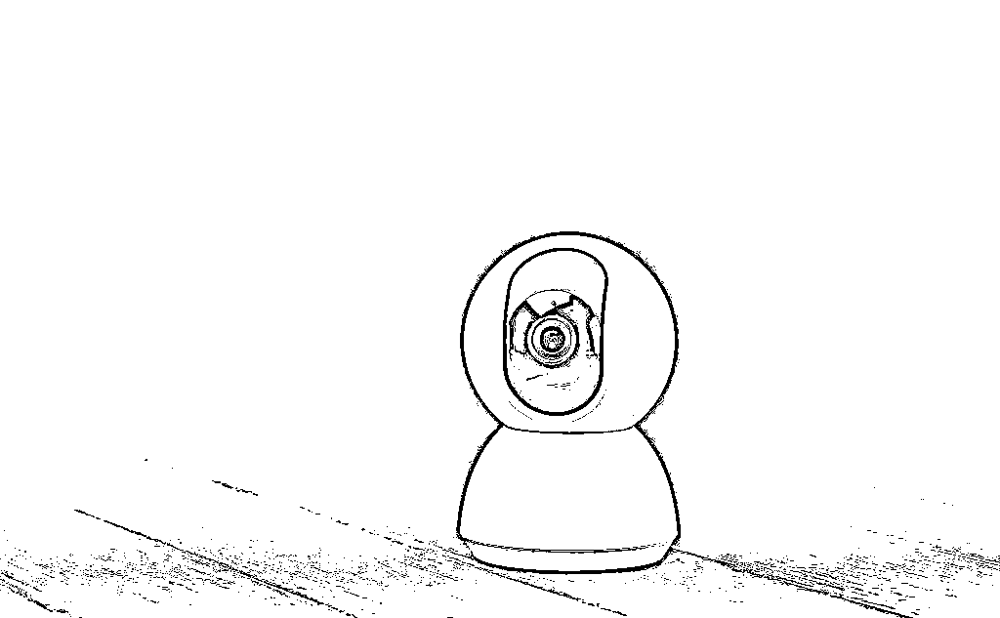
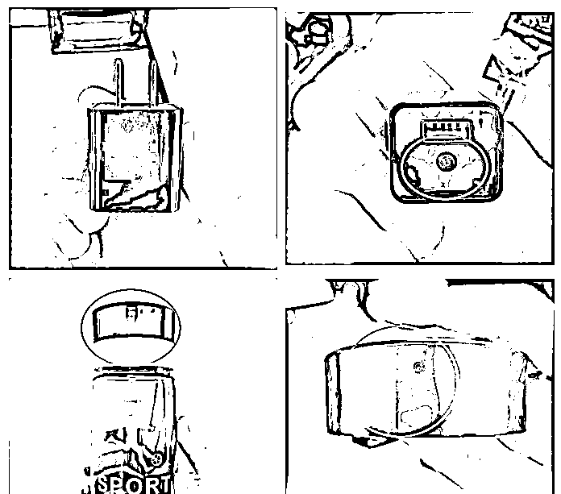
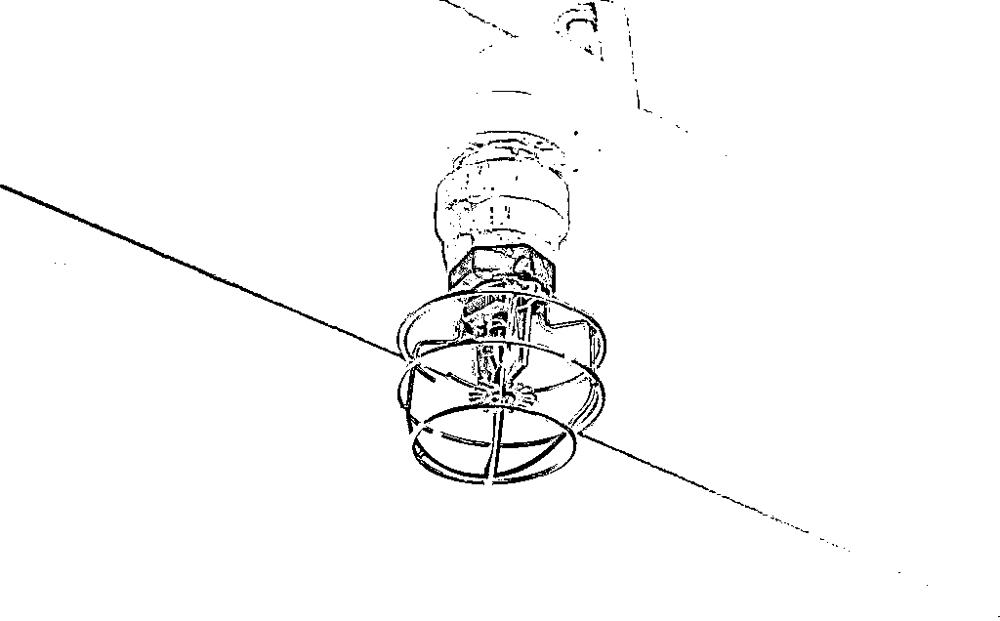
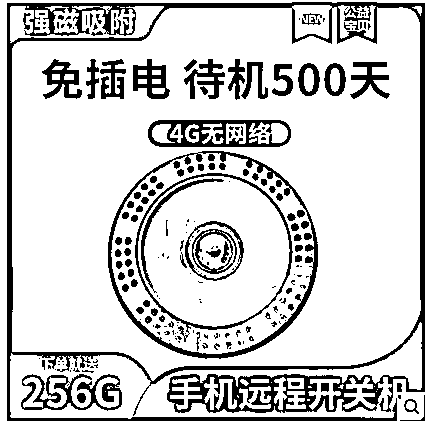
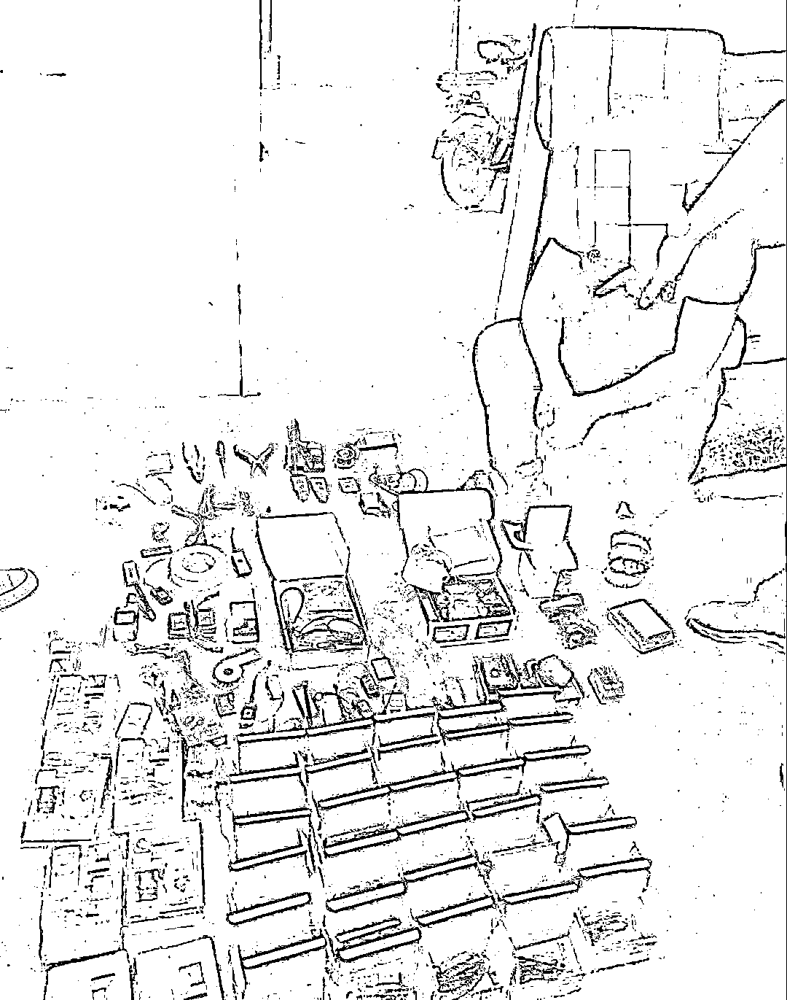
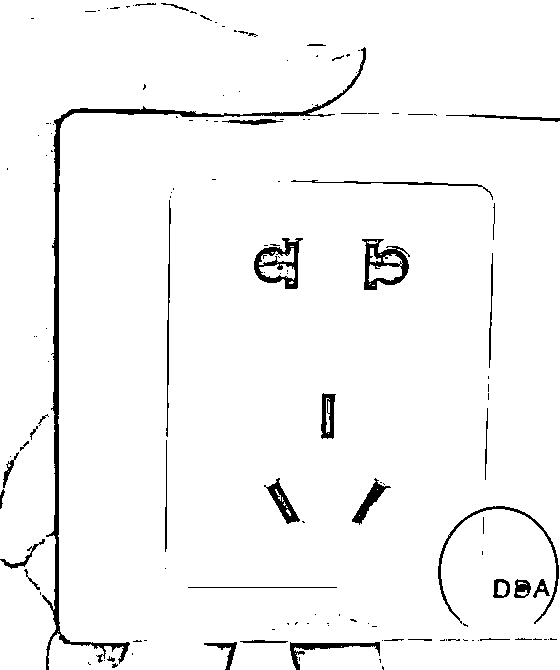
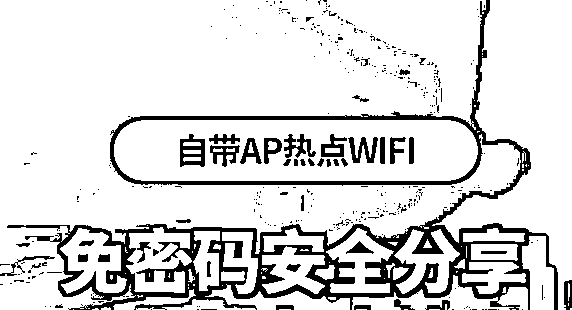
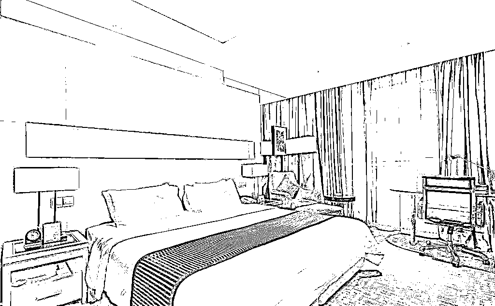

# 让偷拍摄像头销声匿迹，究竟有多难？

> 原文：[`mp.weixin.qq.com/s?__biz=MzIyMDYwMTk0Mw==&mid=2247526777&idx=4&sn=33bc5da00b7c012b6585bb7e39709f11&chksm=97cba241a0bc2b57858a95fe3dfaf526c7fff706bc6e651e533d3624e07f87ba32e122d780fb&scene=27#wechat_redirect`](http://mp.weixin.qq.com/s?__biz=MzIyMDYwMTk0Mw==&mid=2247526777&idx=4&sn=33bc5da00b7c012b6585bb7e39709f11&chksm=97cba241a0bc2b57858a95fe3dfaf526c7fff706bc6e651e533d3624e07f87ba32e122d780fb&scene=27#wechat_redirect)

1000 余个被人破解的摄像头沉默地窥探着人们在隐私空间的一举一动，家庭卧室、酒店客房乃至浴室……这样的摄像头账号就在隐秘的群聊中被互相交换，公开传播。“我要看对床的。”“有没有酒店精品？”类似的对话在偷拍群中比比皆是，没有避讳。

这是江苏省常州市公安局武进分局网安大队副中队长陆叶涛此前经办的一起黑客入侵网络摄像头的偷拍偷录案件，他介绍，在类似的案件中，“破解的摄像头账号没有成本，一个只要几十块钱，但如果是自己架设的针孔摄像头，一个账号密码就可以卖到几百块钱”。更有甚者，会**将摄像头账号按照安装点位的“好坏”明码标价，甚至还会在成交前给“客户”验证。**

（常见的家用摄像头）

世人皆知，偷拍摄像头常常隐匿在酒店、民宿、浴室、卫生间、试衣间的墙插、时钟、灯孔、空调出风口处，殊不知，偷拍摄像头早已化身为充电宝、打火机、纸巾盒、眼镜、手提包、车钥匙、钢笔、鞋子乃至挂钩、可乐瓶等更为不起眼的小物件，还兼具移动性，更加令人防不胜防。**“基本上能想到的东西，都可以按你的定制来生产。”**河南省开封市城乡一体化示范区网安大队大队长王洪禹感叹道。

（嵊州警方查获的窃听、窃照专用器材）

普通人遭长期偷窥的新闻登上热搜，削弱着民众的社会安全感。**如何使令人深恶痛绝的偷拍黑产真正销声匿迹？**

**暗处隐匿**

11 年，反偷拍猎人何志会在隐秘的角落里查探到 3000 余个窃密设备，确切地说，其中有 1000 余个针孔镜头。身为安防企业负责人，他总结了一整套发现偷拍摄像头的方法，还花高价配备了几套专业设备。“酒店房间相对简单一些，空调出风口、烟雾报警器、墙壁四周的装饰品、床边的台灯，再加上各处插孔、电视机下侧，这些地方检查一遍，基本上就可以排除掉了。大不了就还有一个卫生间。”

新搬入的公寓要注意的地方更多。“**长期连接电源的地方一定要注意，**还有天花板的夹层、床的四周、空调线管、长期用不到的墙壁电插板、挂钩等，卫生间的天花板更是隐蔽的布线场所，还有一些很奇怪的螺丝也要格外注意。”

（电商平台上的摄像头广告词）

此外，在公共场合也不能放松警惕。**公共卫生间的马桶出水口和马桶盖连接处也是摄像头藏匿的点位。**何志会总结，在扶梯上或者公共澡堂里**偷拍的人常常会保持静止不动的姿势**，“因为只有静止不动，拍摄的画面才清晰”。这时就要格外提防伸到脚下的鞋面或雨伞。

在网上诸多摄像头检测方法中，陆叶涛推荐红外测温仪：“摄像头在工作的时候电源是肯定会发热的，在一定的距离外就能发现，不用像其他的手段都必须是非常接近的位置，使用简单，检测技术要求也不是很高，所以对我们普通人来说更便捷。”

何志会的客户曾在酒店误将闪烁的烟雾报警器认作偷拍摄像头，“闹了一整夜，最后还把报警器拆坏了，才发现是虚惊一场”。其实，真正的针孔摄像头并不会有灯光闪烁，只需要注意奇怪的小孔中是否有圆形反光点便可以鉴别。

这有些夸张的事例成为如今普通民众心中隐忧的一个注脚。正如中国政法大学刑事司法学院副教授于冲所说：**“我们去住个酒店都不敢脱衣服、不敢洗澡，我们都提心吊胆，要想想这有没有摄像头。这不太可怕了吗？那人的尊严还有没有？”**

**重拳治理**

王洪禹概括：“从偷拍设备生产到下游各个环节有一个共同点，传黄涉黄、侵犯公民隐私、非法生产销售窃听窃照专用器材等，基本上**都是涉及违法犯罪的。**”

2015 年，公安部等三部门联合印发《禁止非法生产销售使用窃听窃照专用器材和“伪基站”设备的规定》，该文件对窃听窃照专用器材作出了界定，并将非法生产销售行为纳入行政处罚的范围。如果情节再严重一些，就可能会涉嫌犯罪。

“完整的偷拍产业链大致可以分为两条。一条是嫌疑人利用自己的非法摄像头来偷拍偷录，比如在酒店安装窃听窃照器材，那就可能涉及非法使用窃听窃照专用器材罪；另一条是嫌疑人入侵他人的合法摄像头偷拍偷录，比如非法控制家用网络摄像头，那就有可能涉及提供侵入、非法控制计算机信息系统程序工具、非法获取计算机信息系统数据、非法控制计算机信息系统等罪名。如果还将偷拍偷录的视频、图片在网上传播贩卖，还有可能涉及传播淫秽物品罪、传播淫秽物品牟利罪等。”陆叶涛总结道。

（电商平台上售卖的摄像头）

“如果是偷窥别人隐私之后再实施敲诈，还可能涉嫌敲诈勒索罪。”王洪禹补充。

2012 年至今，黑龙江、山西、浙江、上海均有嫌疑人因非法使用窃听、窃照专用器材罪而被判处有期徒刑的判例，于冲介绍，最新的一起是在上海浦东新区，嫌疑人将摄像头隐蔽安装在酒店房间偷拍住店顾客隐私，并将多个摄像头账号出售给多人，获利人民币 1 万余元，最终被判处有期徒刑 6 个月。

今年 5 月到 8 月，中央网信办、工业和信息化部、公安部、市场监管总局协力推进摄像头偷窥等黑产集中治理工作，从生产、销售、使用到传播，对偷拍黑产进行了全链条打击。

从事反偷拍业务十余年的安防企业负责人何志会感受到了积极的变化：“这几年，我们慢慢发现**普通的电子市场根本买不到针孔镜头了，**生产销售的、非法使用的都已经入刑了，我们国家在这方面还是做得非常给力的。”

（亳州网警破获非法生产、销售窃听、窃照专用器材案）

**有待完善**

“打击偷拍产业链最难的是**这个行为本身具有灵活性和隐蔽性。嫌疑人可以在任何时间、地点、物体上从事设备改装、偷拍偷录活动，**真的是让人防不胜防。”陆叶涛感叹。嫌疑人到案后其使用的设备器材能否顺利查获并收缴，收缴后能否认定为窃听窃照专用器材，非法获取、非法控制的摄像头账号等电子证据该如何固定，偷拍偷录具体涉及的行为该如何定性和法律适用等问题都在困扰着办案民警。

偷拍设备的生产改装技术门槛都很低，陆叶涛介绍：“单个硬件模块在线上线下都非常容易购买，而且比较常见，**只需要稍加组装调试就可以按照成品来售卖。**”

（隐藏在插座中的摄像头）

偷拍行为实现了人机分离，王洪禹谈道：“即使入住人很警觉，自己发现了隐藏的摄像头，我们到现场也仅局限于把这个设备收缴，要查出具体谁安装的就很难了。”

《刑法》第二百八十四条规定，非法使用窃听、窃照专用器材，造成严重后果的，处二年以下有期徒刑、拘役或者管制。

陆叶涛说：“现在我们的刑法还没有对‘造成严重后果’作出明确解释，我们对**在使用后果上是否追究刑责，在执法办案中也是有疑问的。**”

于冲呼吁明确关于非法使用窃听、窃照专用器材罪的司法解释。他认为，**应该从使用器材的数量、社会危害后果等多方面考量“严重后果”**。“一般只要他们偷录偷拍，绝对不可能只偷拍了一条两条，那可能都是在几万条以上，拍摄条数、存储量都可以作为严重的危害后果，或者造成的严重的社会舆情、社会的重大关注，进行一个综合的认定。”

此外，警方在侦办相关案件时，需要将收缴的器材移交官方机构鉴定。陆叶涛说，如果器材未被认定为窃听窃照专用器材，后续的刑法追责也都无从谈起。

多数时候，对偷拍产业参与者的惩罚止步于治安管理处罚。按照《治安管理处罚法》规定，偷窥、偷拍、窃听、散布他人隐私的，处 5 日以下拘留或者 500 元以下罚款；情节较重的，处 5 日以上 10 日以下拘留，可以并处 500 元以下罚款。

（电商平台上的摄像头广告词）

“买摄像头观看权限的人，因为大多数人都是为了满足自己的偷窥欲，供自己观看使用，控制的数量也不是很多，在现实中大多因为缺乏证据，处罚往往很轻，只能做教育警告处理。”陆叶涛说，“我们在办案中发现**该类犯罪的社会影响度和惩罚力度确实是不成比例的**。对他们的惩罚力度还是稍显轻微的。”

王洪禹总结：“不法分子其实明知是违法的，但是因为投资很小，收益很大，并且犯罪成本低，即使被抓，处罚力度也跟不上。在高额利润的诱惑下，不法分子就会铤而走险。”

**多管齐下**

在于冲看来，摄像头作为中性的工具，就像菜刀一样，极端情况下的杀人凶器，在多数时候其实是做饭的工具。“它本身也不是违法犯罪工具，我们都进行了生产销售环节的管制，对于摄像头这种中性的工具来讲，即使它不是非法器材，它有它的合法用途，但是我们在生产销售环节也应当进行严格的管制。”

除此之外，于冲还想了很多。“首先要进一步明确窃听窃照专用器材的范围，官方和销售平台都要加强对此类器材的监管，其次要提高摄像头的技术标准，避免劣质偷拍设备通过互联网大肆流通，同时防范家用摄像头被非法侵入、非法控制后被偷窥偷拍。此外，**是不是可以设置一个偷拍偷录者的黑名单？**对他们进行相关从业资格、出入特殊场所的限制。”于冲还提出，**要使酒店、民宿经营者，房屋出租者承担起安全保障义务，**“要保证房屋设施不具有侵害居住者隐私的风险，要求这些主体去履行安全保障义务，提高责任成本。一旦无法履行，就要承担严格的赔偿责任，甚至是违法责任”。

何志会的客户分布在各行各业，但酒店的房间检测并不多见。“他们今天做了检查，只能代表今天晚上是安全的，那明天不一定，说不定今天住进来的人就会安装针孔摄像头。”因此，他建议酒店保洁人员在每日的客房打扫中增加摄像头检测环节，“其实酒店的房间检测是非常容易的，在做卫生的时候顺便就可以检查一遍。”

陆叶涛认为，应该把偷拍黑产的源头——摄像头作为治理的重点：“这就要求我们做好两手准备，既要严厉打击非法摄像头的生产窝点，也要建议有关公司改进正规摄像头的安防策略。我相信一旦没有这些摄像头的支撑，任由偷拍偷录手段如何高明，也必将难以为继。”

此前报道： 

[酒店成三级片片场，偷拍视频按刺激程度标价：针孔摄像头，到底有多密集？](http://mp.weixin.qq.com/s?__biz=MzIyMDYwMTk0Mw==&mid=2247513532&idx=1&sn=1f790a42cc502663a2e66b28a010aacc&chksm=97cb7e84a0bcf7925b0650981967fc2088e690b3978b9a703f96c73f4320170f7ecf21a33427&scene=21#wechat_redirect)

[在中国，有一条极其隐秘的偷拍色情产业链，至少有 6 亿女性可能面临或已被侵害](http://mp.weixin.qq.com/s?__biz=MzIyMDYwMTk0Mw==&mid=2247524547&idx=2&sn=1b646b6ce11adc1eb3b1072ba0c4f8df&chksm=97cbabfba0bc22ed6e5f6928e65661b9e7cc81273046fadc236fa8103878b2f15e3727854833&scene=21#wechat_redirect)

[男子扮女装在厕所实施偷拍，被网络大 V 当场抓住，警方：拘留！](http://mp.weixin.qq.com/s?__biz=MzIyMDYwMTk0Mw==&mid=2247524242&idx=3&sn=3147acc5bb1fc318306c4492a7249008&chksm=97cb54aaa0bcddbc56c5a682a07c95e37897f13b38f01b9aedf5f3636216aff2cb63ece98b34&scene=21#wechat_redirect)

[细思极恐！河北一售楼处违法“偷拍”17 万余张人脸！被罚 8 万元](http://mp.weixin.qq.com/s?__biz=MzIyMDYwMTk0Mw==&mid=2247524547&idx=6&sn=681ae00faa98bcfc11cc8ae163571b8d&chksm=97cbabfba0bc22eda32e3ba2762bf710fafd5faddc2acb1351d1f8efb86b0d1839c70526ba3f&scene=21#wechat_redirect)

[40 分钟，搭讪七八位女孩？甚至骚扰、偷拍、直播围观？！专家：可原地报警！](http://mp.weixin.qq.com/s?__biz=MzIyMDYwMTk0Mw==&mid=2247524609&idx=2&sn=0455f6dd0aa7e34d8fec8641d1c45605&chksm=97cbaa39a0bc232fd5fe42a4ca03c473b0bffcf39222354a53f44fc034e71e13514b9f489e45&scene=21#wechat_redirect)

来源：央视网

← 向右滑动与灰产圈互动交流 →

