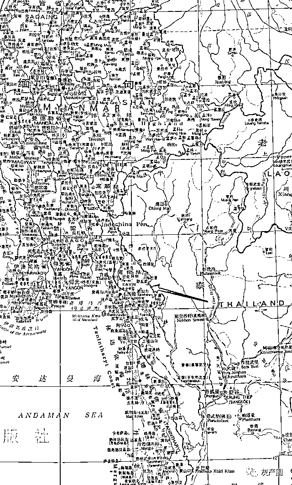
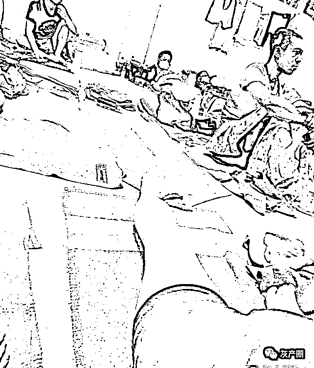
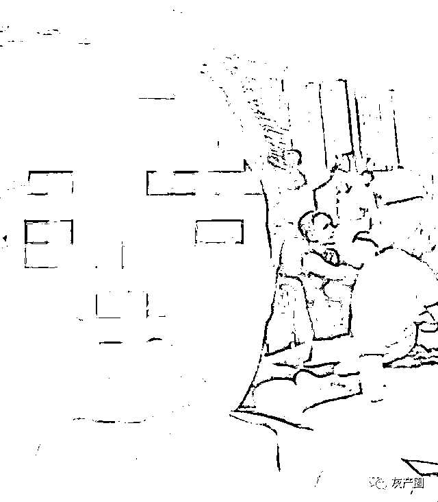
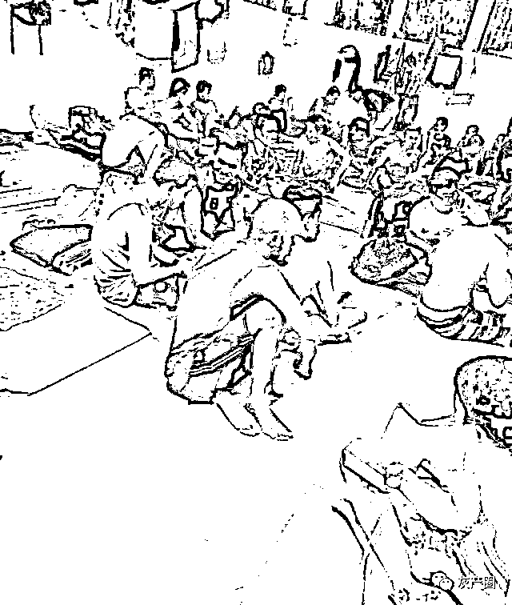
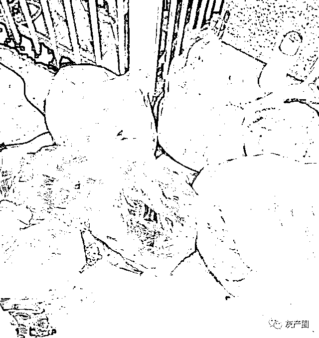
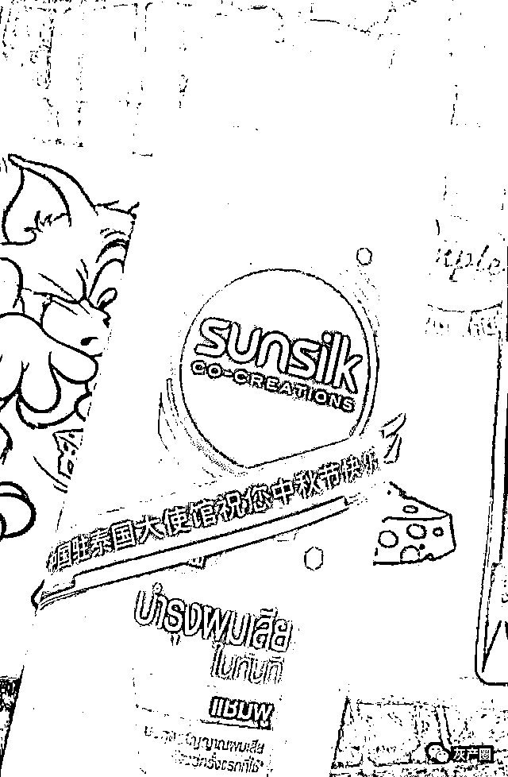
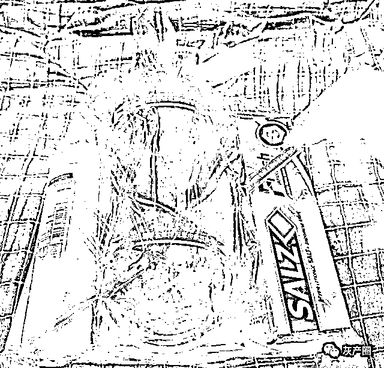

# 我被骗缅北妙瓦底搞诈骗，逃跑到泰国，因非法入境又被泰国囚禁 8 个月

> 原文：[`mp.weixin.qq.com/s?__biz=MzIyMDYwMTk0Mw==&mid=2247526777&idx=6&sn=6f2c42ce5e9a2de51ba1d4c006f219b7&chksm=97cba241a0bc2b57704a6ba285b43c0d6eaaff946a8f105d342172a7b7460139f44fccf2a018&scene=27#wechat_redirect`](http://mp.weixin.qq.com/s?__biz=MzIyMDYwMTk0Mw==&mid=2247526777&idx=6&sn=6f2c42ce5e9a2de51ba1d4c006f219b7&chksm=97cba241a0bc2b57704a6ba285b43c0d6eaaff946a8f105d342172a7b7460139f44fccf2a018&scene=27#wechat_redirect)

一位国内的小伙子被骗到缅北，然后被送到泰国交界的**妙瓦底**，他知道自己从事的工作可能不是正当的，就准备逃跑，于是选择逃到泰国，谁知道，刚入境，就被当地警察控制，在**泰国被囚禁了八个月**。

在缅北的时候其实最好的选择是跑回国内，因为在缅北的时候他们住的平房离边境只有 5 分钟车程，但是这位哥们一个人而且已经在境外，害怕出了什么事情没有个人互相照应 ，他也想过直接报警，又担心在境外，警察不一定能过来，反而打草惊蛇让蛇头知道了。

于是这哥们做通了和他一起来的几个人的思想工作，一起半夜偷偷溜出去，准备跑步回边境，可是刚出去在路上有很多缅甸政府兵巡逻，他们不愿意冒这个险,于是又回去了。

在平房住了几天后，**蛇头有安排一辆车，说是送我们去工作的地方，开车的司机是当兵的，全副武装，电影里雇佣兵的样子，大家应该明白吧，开了几个小时后，把我们手机全收了，**叫我们上一辆大货车后箱，里面装满了啤酒，一箱箱的那种，最底层跟玩堆积木一样，掏了一个洞。

叫我们所有人都钻进去，高度不足以坐起来 只能爬进去侧躺，我们有表现出不愿意再去的情绪的时候，那几个当兵的对我们大吼，没有办法在他们的手上是没有商量的余地的，我们只能上车。

上面说到我被强行被装进了啤酒车，我们的手机都被没收了,上车之前有个讲中文的缅甸人说:这个车是开往渺瓦底，要开 2-3 天才能到，我们进了车厢最底层得那个洞，是爬进去的，上当有个竹筏搭在上面撑住，这里空气污浊，黑漆漆伸手勉强能看见五手，等人都爬进来后，外面有个人递进来七八个空矿泉水瓶，他打手势说是给我们尿尿用的。

这个地方挨着泰国

就这样开车出发了，我们在装了上百件啤酒车的最底层提心吊胆，车身摇摇摆摆，我们都担心竹筏一但断掉，上面的几千斤的啤酒压下来，我们这些人就应该交代了吧，几个小时后，竹筏也不是太撑的住 一点点下压，从一开始的 80 厘米的高度变成了 50 厘米，还在不断下压，我们都怕了 ，然后用力敲打车厢 ，司机不知道是没有听到还是不予理睬，没有任何反应。

本来车厢后门洞口那里是用几箱啤酒箱堵住的，最里面的人已经空气都呼吸不上了，有窒息的感觉。他大声叫靠近外边的人把啤酒用脚顶开，然后我们里面几个人慢慢爬出来，爬车顶躺着，车身是用蛇皮袋子那种尼龙布给蒙起来的，所以外边的人是看不见的 ，我在车顶躺好手刚好可以抓住上面的钢筋铁栏，防止因为车的惯性翻下车去，几个小时后有人大家尿憋不住了，都用开始的空水瓶撒尿，整个车厢里一股子尿骚味。

就这样，我们到了目的地城市:**妙****瓦底**，**我们来到一个工业园，来到这里就是让搞网络诈骗，因为这里和泰国交界，几乎属于三不管地区，所以这里网络诈骗比较猖獗**。

所以大家千万不要相信缅甸高收入招工，这里和中国根本没法比，在中国你都挣不了高工资？在这里更别想了，所以只能是违法的勾当。

**这个公司就是一个做网络诈骗的公司，****投资期货和比特币的假平台**，这边手机没有信号，电话打不通，这里有武装人员看管，这肯定不能干，不过你不能硬要走，那样会挨收拾的，只好假意的配合他们接受培训，在第五天，准备逃跑，于是趁夜色来临，派我去取饭的时候，直接跑，因为我知道穿过 Moei 河就可以入境泰国。

后边的人在追赶着我，于是拼命的跑，拼命的跑，好不容易才发现后边没人的时候，我在知道我已经进入了泰国，这一天是三月八号，也就是妇女节。

在我认为，**因为逃避诈骗集团的追赶，也算是紧急避难吧，等到心情不那么激动的时候，觉得还是应该报警，虽然是外国，我也没有签证，但是我是被迫来到这里的，报警求助后， 军方过来把我送到了美索警局， **当时军方还有个翻译给我说，别着急，我们会送你回家 ，我当时还信了，谁知道，我在这里度过了八个月。

到了警局，因为语言不通，他们警察找了一个华人翻译过来跟我沟通，华人翻译跟我说:非法入境在泰国是一个很小的罪 ，你乖乖认罪就行了。

期间他们把我安排在他们的牢房里，等到下午警察拿手机过来，说是法院审判，因为疫情问题，视频就可以了。

然后对面说了一些话，讲完后翻译拿一些文件让我签字，说是法院审判判我 9 天监禁，或交 4500 泰铢的罚款就不用监禁，我交了罚款后，他们把我送到了美索移民局。

在美索移民局关起来 6 天，然后又交了 15000 泰铢车费，送到曼谷 bang ken idc，这里的警察跟我们说，有护照就可以买机票回国，没有护照只能等中国大使馆办理回国证才可以回国。

没办法，只好致电大使馆问回国证件什么时候可以办好，大使馆回复我最快 3 个月，最慢是半年，我听玩头都是懵的，那就意味着我要在这里被监禁好几个月，天呐，这是什么道理？

**每天跟差不多八九十人人关在一起，不知道啥时候能解脱，身后哪国人都有。**

从三月等到了八月，毫无音讯，在这里，我们现在的状态都是等待遣送，可是为什么证件要那么久才能办理下来？已经半年了，还是没结果。

这个里面是得病没人治的，卫生环境也别差 每个人都是人挤人睡觉，看下图，这么多人关在一起，我们这个房间有好多国家的人，印度 的，韩国的，索马里的，非洲的，还有十多个中国人。

伙食呢，别提了，都是馊的。

九月份中秋节的时候，竟然收到大使馆的礼包,一种想哭的感觉。

9 月 24 号的时候，**泰国警察直接无故殴打中国人，用实木棒，脚踢，膝撞方式，把一个中国人打的口吐鲜血，**第一时间赶紧联系大使馆。

泰国警察有叫人过来拍照，查看伤口情况，应该是大使馆跟警察有交涉过了，被打的两个人其中一个胸口疼，眼睛被踢了一脚，淤青面积比较大，视力受损。

到十一月时候，大使馆人员跟我们直线联系了，可能会安排包机回国，还给我们关押的同胞捐赠了物资生活用品 ，零食等东西 ，也和泰国移民局做了沟通协调关系，事情向好的方向发展了，不过还在等待中。

在这待了八个月，才知道还是国内最好，安定，祥和，太平，回家的心越来越心切，真的想说:祖国，我爱你。

来源：博度内比都

← 向右滑动与灰产圈互动交流 →

