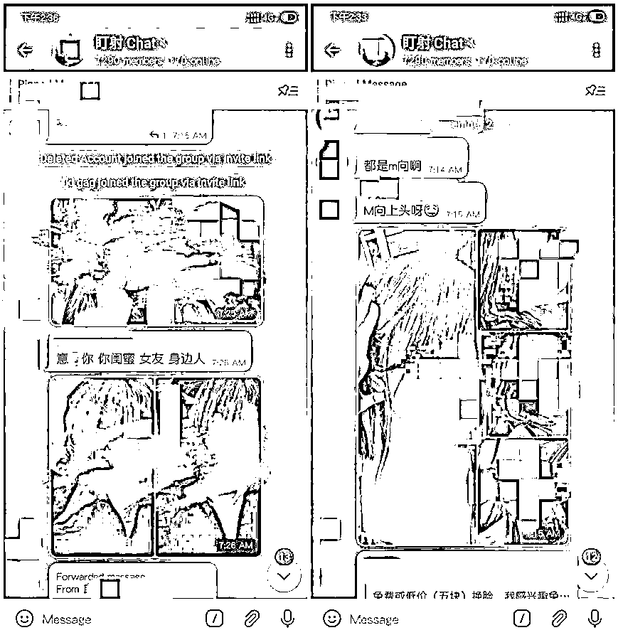
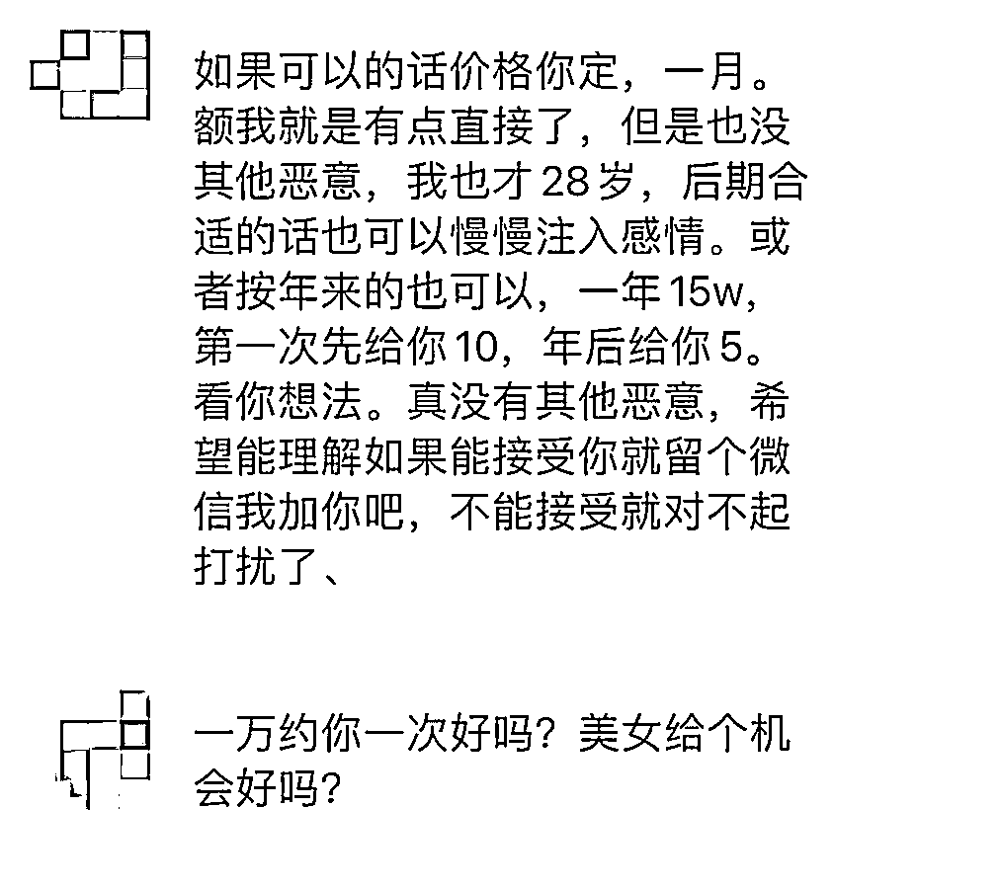

# 女子照片被好友盗发到色情群：七千人"围观"，有人私信骚扰

> 原文：[`mp.weixin.qq.com/s?__biz=MzIyMDYwMTk0Mw==&mid=2247526829&idx=1&sn=4457c6a68c8ffadf3ca75f03f36e17d6&chksm=97cba295a0bc2b83e19f31646f02cdf708d4b6a14a7bc8c6d26b730a31bd72b858cb06dda429&scene=27#wechat_redirect`](http://mp.weixin.qq.com/s?__biz=MzIyMDYwMTk0Mw==&mid=2247526829&idx=1&sn=4457c6a68c8ffadf3ca75f03f36e17d6&chksm=97cba295a0bc2b83e19f31646f02cdf708d4b6a14a7bc8c6d26b730a31bd72b858cb06dda429&scene=27#wechat_redirect)

近日，在福州上大学的小 d 发现，自己平时发布在社交平台上的照片，被盗发在外网一个拥有 7300 多名群友的色情群内供人品头论足，发布者竟是与她相识 6 年的男性好友。小 d 报警后，将自己的经历托好友发布在公众号上，希望以此警示正在受到侵权伤害的女孩。  

律师表示，该行为可能涉嫌以污辱等方式侵害了被害人的名誉权。建议女生平时要注意信息安全保护，尽量不要公开发自己和家人照片和视频到网上。

小 d 照片被发到外网色情群受访者供图

**照片被发外网色情群，“真凶”竟是 6 年好友** 

“小姐姐你好，你的一些照片被人发到一些 YY 群里了，提醒一下你。”

24 日晚，小 d 在微博上收到陌生网友小蓝的私信。根据这名陌生人提供的照片，小 d 发现，她在社交平台发布的部分照片被盗发在外网一个色情群“盯射 chat”里。她让朋友加入该群查看，发现群里有 400 多张关于她的照片和 700 多条关于她的、不堪入目的言辞。

小 d 发现，这些被盗发的照片跨度极大，从 2019 年夏天至今，其中包括一些她曾发布在朋友圈但已不可见的日常照片、微博发布的日常照片以及分享给几位亲友的随手拍。更让她震惊的是，她发现这些照片的侵权发布者是她关系亲密的 6 年好友，一名“家境良好、个人优秀、女友们评价乖巧正直”的大学生小 A。

25 日中午，小 d 前往派出所报警。在小 d 的质问下，小 A 承认了是他所为，表示会删除所有照片。最终，在小 A 承诺消除影响和精神赔偿后，小 d 不再追究小 A 的责任。

小 d 前往派出所报警，警方受理受访者供图

小 d 托朋友小洲将她这段经历发布到公众号。小 d 在自述此事时表示，事情发生后，她开始夜不能寐，“不知道有多少照片被人保存、利用”。她通过百度识图搜索那些被朋友发到网上的图片，搜出的是一条条用词不堪的一夜情、交友等信息。

文章发布后，被转载到各个平台，引起了极高的关注。文章作者小洲收到了很多留言和私信，发现有些女孩和她朋友一样，都不同程度地遭受过身边的人的侵权，“她们之中，有的是因为硬盘坏了送去维修，而后就发现自己的日常照片被维修人员泄露到外网的‘母狗投稿箱’里；有的是发现自己的微博私信，突然在某一天就被各种不知从何而来的‘多少钱一夜’的骚扰信息袭击。”

有女孩因照片被发布到网上，遭到骚扰受访者供图

小 d 和小洲希望，这段经历能够警示更多正在受到侵权伤害的女孩，鼓励已经受到伤害但没有勇气维权的女孩。

**7000 多人色情群里，天天有人“献祭”朋友** 

在今年春节前后，小蓝便开始通过私信提醒那些被侵权者。小 d 是他提醒过的女孩之一。

30 日上午，小蓝告诉极目新闻记者，最初他只是正常网上冲浪，喜欢看网上的漂亮女孩照片，渐渐他发觉事情开始不对劲了，“有些照片是别人盗来的，还总是有人口无遮拦，随意用下流言语侮辱。后来我在外网上也看到了一些，里面的言论更加恐怖。”

小蓝越看越郁闷，在几次和他人为此事争辩遭到了嘲讽后，他决定开始制止这种行为，“于是我就尝试着做，成功过一次就有了成就感，坚持了下来。”

据小蓝统计，不到一年的时间，他提醒了五六十个女孩。被他提醒过的女孩，有的会深究、报警或起诉，有的会警告发布者删除照片，也有人并不理睬。让他印象最深的是第一次揭露成功的经历，“我是在百度贴吧看到的她的照片，照片上有她的水印，所以找到了她。给她看了帖子之后，她说盗图者不仅盗了她的还盗了她闺蜜的，于是她通过聊天和发照片设置对特定人可见功能，找到了照片发布者。盗图者是她的一名很优秀的男生朋友，还是学校的学生会主席，最后女生报警了。”小蓝说，此后女生就很少发照片了，“她说是受到了这件事情的影响。”

小 d 的经历被发到网上后，这个叫“盯射 chat”的群依然存在。该群群友有 7300 多人，群里聊天很活跃。29 日，极目新闻记者加群后发现，群里不断有新人加入，群友也未停止发布自己称作“朋友”“女友”或“闺蜜”的照片，还有群友仍在说“献祭你的女友、女神、姐妹、朋友”。每当有女生的照片被发布，都有群友用下流的语言被评头论足，甚至有人发布侮辱照片的视频。

小洲说，无数鲜活的女性在这里被意淫，“这 7300 多人的群组，不过是冰山一角。”

**涉嫌侵犯肖像权和名誉权，维权可分三步走** 

小 A 的行为是否涉嫌违法？中南财经政法大学法学院副教授肖志远告诉极目新闻记者，就此中个案而言，小 A 作为小 d 的好友，在小 d 的社交媒体上看到照片，未经她允许便并传播到其他社交平台。虽说小 d 曾在社交平台发布照片，但这并不代表放弃自己的肖像权，如果肖像用作商业用途或其他，则首先侵犯了肖像权。此外，因为照片出现在某些淫秽或者特殊的场合，也许会对个人的名誉造成负面影响，这涉嫌侵害被害人的名誉权。

湖北子儒律师事务所王培律师表示，该事件中的具体行为可能涉嫌以污辱等方式侵害了被害人的名誉权。违法行为人的行为使网络受众在被害人作出道德上的负面评价，造成被害人社会评价的降低。如果产生了其他的严重后果，将可能触犯刑法，承担刑事责任。

当受害人遭到此类侵权事件，应该如何处理？肖志远建议：一是可以直接和相关网站联系，要求网站删除服务器内相关照片。因为当照片已被发上去了，即便发照片的人删掉照片，可能也有其他人保存了照片并再次在同一网站或者社交平台发布，所以要发函网站配合删除并屏蔽该照片。二是可以警告照片发布者，限令其尽快拿出解决问题的方案，例如删除照片、尽可能地消除影响，并保证以后不会再出现类似行为。三是要将网站中照片发布者所有侵权内容保存下来，借助公证手段将证据固定，随时准备起诉。在起诉之前，可以向法院申请行为保全，要求网站删除图片、责令发布照片者删除图片等等。

**屡禁不止维权难，律师建议保护信息** 

小 d 的遭遇并非个例，记者在社交媒体上搜索“照片侵权”关键词，有很多人在其中分享照片被侵权的经历，希望能够维权。

肖志远表示，如今社交媒体深刻地改变了大家的生活，人们缺乏自我信息保护意识，将照片、行动轨迹等大量发布在社交媒体上，为他人获取信息提供了极大的便利。此外，部分网友个人素质不高、法律意识淡薄，以炫耀、猎奇等心理参与到这类行为当中，再加上虚拟世界里并非实名，侵权便利、违法成本低，这些导致此类事件频频发生、屡禁不止。

不少有同样经历的受害者遭遇维权难的情况，不得不吃了“哑巴亏”。肖志远认为，维权难是客观存在的现象，首先，这跟东方的文化有关，东方文化是一种典型的耻感文化，受害人遇到这类侵权事件一般都不愿张扬，或者在熟人圈里受朋友劝和选择和解；其次，维权特别是针对外网的维权，牵涉程序复杂且耗时长，赔偿额度并不高，不少受害人嫌麻烦而选择和解；再次，这类侵权行为具有极强的隐蔽性，往往在网上开始传播的时候，当事人并不知情，无法第一时间介入并制止侵权行为。“案例中，小 d 通过报警来解决问题，公安机关网监部门可以帮助固定证据，有利于其后期的侵权起诉。”

“信息安全主要靠自己保护，毕竟我们无法控制他人的行为。”王培律师建议：要谨慎使用公共网络；在社交平台例如朋友圈发布生活相关内容时，建议设置公开时间，尽量不发或者少发自己和家人照片和视频，或者注意拍照的角度；要警惕来源不明小程序、验证码等等。

来源：极目新闻，观察者网

← 向右滑动与灰产圈互动交流 →

