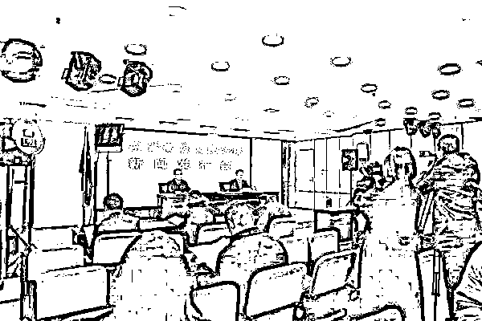

# 编剧都不敢这么写！局长出资 20 万买原料在空办公楼制毒，3 人被执行死刑

> 原文：[`mp.weixin.qq.com/s?__biz=MzIyMDYwMTk0Mw==&mid=2247526829&idx=3&sn=eb0c4945dac220e4e2f6ce70e2960f90&chksm=97cba295a0bc2b8380240eb8b3c7289c460b14861da271d7d4dce42075d5cca93f3843d11d8d&scene=27#wechat_redirect`](http://mp.weixin.qq.com/s?__biz=MzIyMDYwMTk0Mw==&mid=2247526829&idx=3&sn=eb0c4945dac220e4e2f6ce70e2960f90&chksm=97cba295a0bc2b8380240eb8b3c7289c460b14861da271d7d4dce42075d5cca93f3843d11d8d&scene=27#wechat_redirect)

12 月 30 日，湖南高院召开打击毒品犯罪新闻发布会，通报一年来全省法院开展打击毒品犯罪专项审判活动有关工作情况，并发布 5 起毒品犯罪典型案例。

发布会现场

其中一个案例：

国家机关工作人员指使同伙

在单位尚未投入使用的办公大楼内

制造冰毒

……

请看本期案例！

**犯罪事实**

1.2017 年 2 月，时任广东省某市人民政府某分局局长的被告人舒某龙出资 20 万元，由同案被告人陈某河购买制毒原料后，舒某龙指使被告人蔡某、陈某河将购得的制毒原料搬运到某市人民政府某分局尚未投入使用的办公大楼内制造冰毒。4 月 28 日，公安人员在该大楼内抓获陈某河、蔡某，当场查获甲基苯丙胺 1.91 千克、含甲基苯丙胺成分的液体 10.8 千克及大量制毒工具。

2.2015 年 10 月 19 日至 10 月 29 日，被告人成某帅先后 5 次在湖南省郴州市的租住房内将 550 克甲基苯丙胺贩卖给另案被告人王某红。11 月 1 日，公安人员抓获成某帅，当场从成某帅租住房内查获 485 克甲基苯丙胺、125 克甲基苯丙胺片剂。2016 年 1 月 14 日，成某帅因患有严重疾病被公安机关决定监视居住。

3.2017 年 3 月底至 4 月，被告人成某帅在汕尾市、陆丰市等地从另案被告人林某妮处共计购得 12 千克甲基苯丙胺。成某帅单独或伙同同案被告人刘某在湖南省郴州市多次向同案被告人李某斌、彭某美等人共计贩卖甲基苯丙胺 7855 克、甲基苯丙胺片剂 2050 粒。

4.2017 年 4 月 27 日，被告人成某帅电话联系另案被告人林某妮求购 20 千克甲基苯丙胺，林某妮又联系被告人舒某龙购买毒品。舒某龙在广东省陆丰市购得 20 千克甲基苯丙胺后驾车接上同案被告人陈某河返回汕尾市。4 月 28 日凌晨，成某帅和林某妮驾车到汕尾市火车站附近与舒某龙、陈某河完成毒品交易后各自离开。当日 12 时许，公安人员在某高速收费站抓获成某帅，当场从轿车后备厢内查获 19994 克甲基苯丙胺。随后公安人员在汕尾市抓获舒某龙，当场在舒某龙租住的陆丰市某宿舍楼查获 9954 克甲基苯丙胺。

**裁判结果**

本案由衡阳市中级人民法院一审，湖南省高级人民法院二审。最高人民法院对本案进行了死刑复核并依法核准。

人民法院审理认为，被告人舒某龙违反国家毒品管理法规，贩卖、运输毒品甲基苯丙胺，并与被告人蔡某共同制造甲基苯丙胺，舒某龙的行为构成贩卖、运输、制造毒品罪，蔡某的行为构成制造毒品罪。

被告人成某帅违反国家毒品管理法规，贩卖、运输甲基苯丙胺和甲基苯丙胺片剂，其行为构成贩卖、运输毒品罪。

在共同制造毒品犯罪中，舒某龙提出犯意、提供制毒资金和制毒场地，蔡某准备制毒工具、主导并具体实施制造毒品，二人均系罪责最为严重的主犯。

在共同贩卖、运输毒品犯罪中，舒某龙购买毒品，并伙同同案被告人驾车到现场交易毒品，舒某龙系罪责最为严重的主犯；成某帅购进毒品后主导贩卖大部分毒品，并伙同同案被告人轮换驾车运输毒品，系罪责最为严重的主犯。

舒某龙身为国家工作人员、伙同他人贩卖、运输、制造甲基苯丙胺，数量巨大，主观恶性深，犯罪情节恶劣，所犯罪行极其严重，应依法严惩。

成某帅多次向上家约购毒品，将毒品从广东省运至湖南省后向多人贩卖，行为积极主动，对促成毒品交易起更大作用，其贩卖、运输甲基苯丙胺和甲基苯丙胺片剂，数量巨大，所犯罪行极其严重，且在因涉嫌贩卖毒品罪被监视居住期间又实施本案毒品犯罪，主观恶性深，人身危险性大，应依法从重处罚。蔡某主导并具体实施制造甲基苯丙胺的行为，其制造毒品数量巨大，应依法严惩。

人民法院依法分别判处被告人舒某龙、成某帅、蔡某死刑，剥夺政治权利终身，并处没收个人全部财产。本案其他被告人被依法判处相应刑罚。

被告人舒某龙、成某帅、蔡某于 2021 年 12 月 17 日被依法执行死刑。

来源：湖南高院，围脖那些事儿

← 向右滑动与灰产圈互动交流 →

