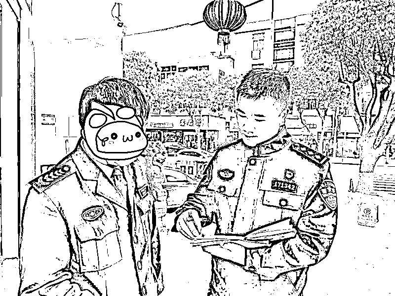
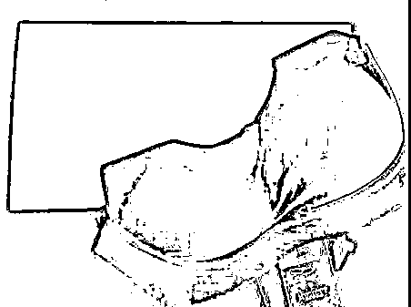

# 一网红直播卖内衣栽了！20 多人被抓，涉案 5000 万元！

> 原文：[`mp.weixin.qq.com/s?__biz=MzIyMDYwMTk0Mw==&mid=2247526829&idx=4&sn=9c8f4adca1e924a3d59036b236e47c68&chksm=97cba295a0bc2b837e3a2422a6f054c40d892fcc2126527340191ef68965c51ecfef8b039f2f&scene=27#wechat_redirect`](http://mp.weixin.qq.com/s?__biz=MzIyMDYwMTk0Mw==&mid=2247526829&idx=4&sn=9c8f4adca1e924a3d59036b236e47c68&chksm=97cba295a0bc2b837e3a2422a6f054c40d892fcc2126527340191ef68965c51ecfef8b039f2f&scene=27#wechat_redirect)

一款原价**380 元**的品牌产品

仿冒品售价竟不到**90 元**

如果你是消费者

你会心动吗？

一些不良商家利欲熏心

仿冒某业内知名品牌

利用网红直播带货

凭借低廉的价格以及网红效应

吸引了大量消费者

致使原品牌蒙受巨大损失……

近日，台州市公安局路桥分局破获一起涉案金额高达**5000 余万元**的制售假冒本地知名内衣品牌案件，捣毁了以犯罪嫌疑人蔡某、欧某、邱某为主要成员的家族式制假售假团伙，一举抓获嫌疑人**23 名**，成功捣毁产供销一条龙犯罪产业链，其中生产工厂 4 家，网络批发商行 5 家、仓储窝点 10 个，现场查扣假冒“密汐皙迪”商标品牌的塑身衣、束腰带、提臀裤、呼吸乳胶内衣等产品**2 万余件**。

[`mp.weixin.qq.com/mp/readtemplate?t=pages/video_player_tmpl&action=mpvideo&auto=0&vid=wxv_2202212662028107781`](https://mp.weixin.qq.com/mp/readtemplate?t=pages/video_player_tmpl&action=mpvideo&auto=0&vid=wxv_2202212662028107781)

12 月 30 日，路桥公安分局召开《台州路桥“2021.6.21”特大侵权假冒品牌案》新闻发布会，通报了相关案情。

网红带货，一犯罪产业链浮出水面

今年 5 月初，路桥公安分局食药环大队民警在开展企业走访中获悉，部分网络平台上出现了网红直播带货出售假冒伪劣的“密汐皙迪”品牌产品的现象，**一款原价 380 元的“密汐皙迪”品牌产品，仿冒品售价不到 90 元。**

企业走访

由于该品牌在业内知名度较高，又有明星代言加持，遂引得一些不良商家争相仿冒，不仅造成“密汐皙迪”品牌客源不断流失，蒙受巨大经济损失，还对品牌的声誉造成了很大影响，严重侵害了“密汐皙迪有限公司”的合法利益。

分局立即成立专案组，主动进驻企业，收集侵权造假线索，全面开展调查取证工作。

进驻企业

经过摸排，专案组梳理出一条假冒“密汐皙迪”品牌商标的产销网络链。位于广东省某市的电商直播孵化基地，是本案中最为关键的“交通枢纽”，这里聚集了多个售假网络批发商行，他们的商品由制假工厂直接提供，向下分销给各级代理，而各级代理再通过多个购物、直播平台进行网络“带货”，形成一张巨大的假货销售网，遍布全国多个省市，**涉案金额高达 5000 余万元。**

生产窝点

精准定位，四大造假工厂尽数捣毁

在掌握网络售假店铺后，民警深入研判、顺藤摸瓜，发现这些网络店铺的货源都集中指向广东省某一地区。该区域以服装制售为支柱产业，当地环境复杂且服装公司众多，难以查实商家的准确信息与具体位置。于是，民警多次远赴广东，采取实地走访、跟踪调查等措施，精准把控造假厂家的具体位置。

抽调精干，深入研判

9 月 8 日，见时机成熟，专案组果断收网，提前部署的各组警力开展统一行动，重拳出击，**一举抓获嫌疑人 23 名**，成功捣毁产供销一条龙的犯罪产业链。

清点货物

押解上车

办案区

利欲熏心，制假售假难逃法网恢恢

犯罪嫌疑人蔡某、欧某、邱某等人，原本经营独立品牌内衣工厂，拥有自主研发生产能力。但近年来，他们经营不善、每况愈下，而“密汐皙迪”品牌产品却在行业内形势一片大好。在利益驱动下，蔡某等人罔顾法律，对正版“密汐皙迪”产品进行仿冒，未经授权就在自家工厂内贴标生产“密汐皙迪”的各类产品，并通过非法途径购买纸盒包装，“摇身一变”，山寨变名牌。

**1**

****2****

******3******

********4********

************************

******目前，犯罪嫌疑人蔡某、欧某等 20 人均已被路桥公安分局依法采取刑事强制措施，案件正在进一步侦查中。******

******来源：台州公安，巴蜀反诈******

************

******← 向右滑动与灰产圈互动交流 →******

************