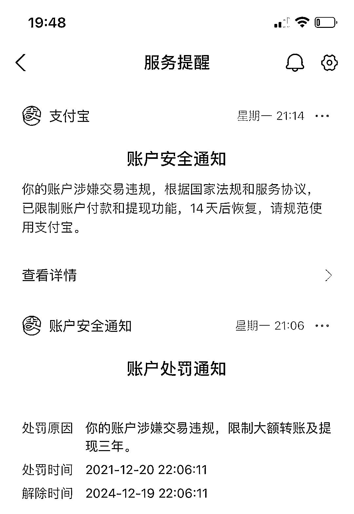
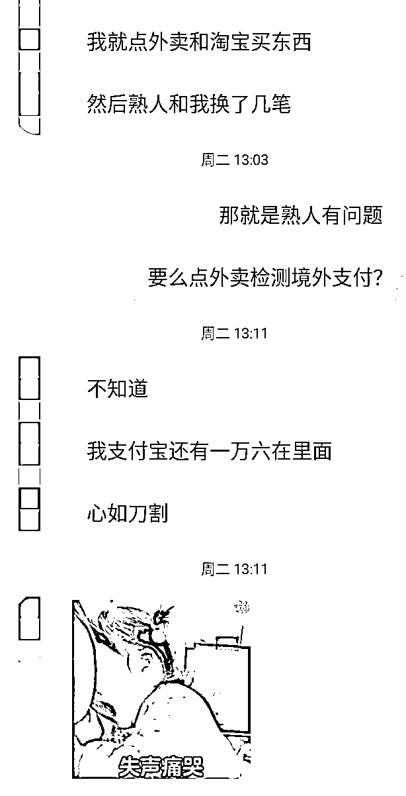
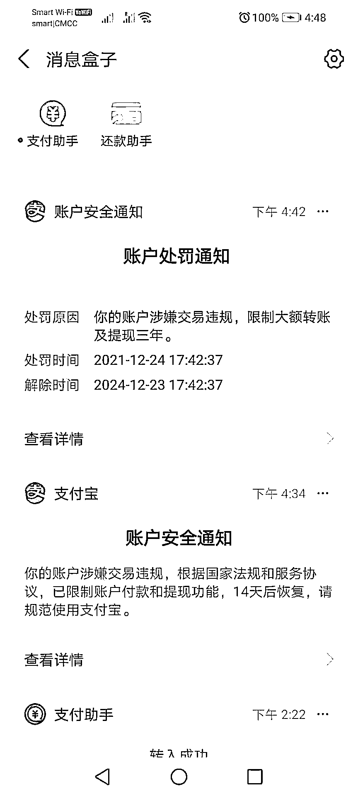
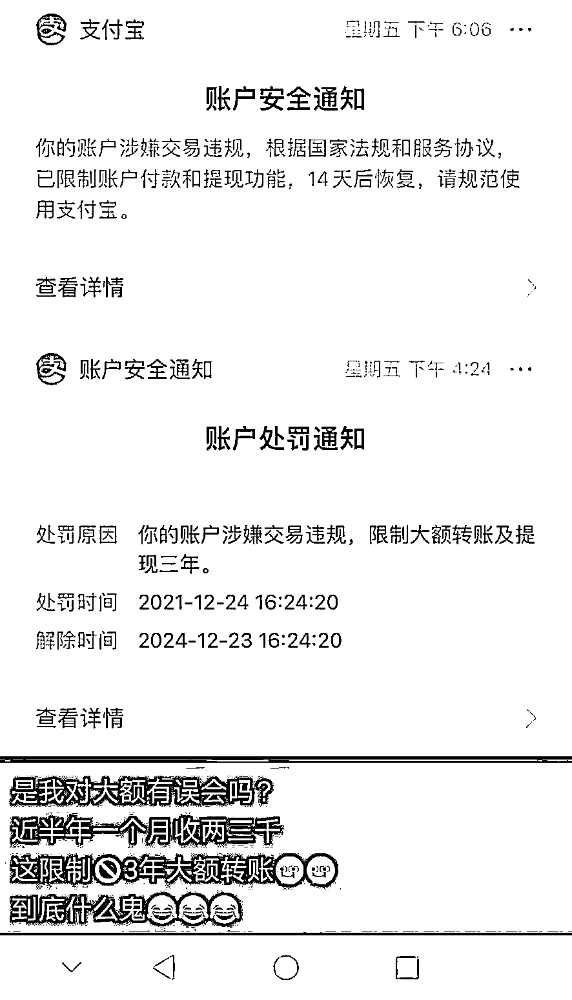
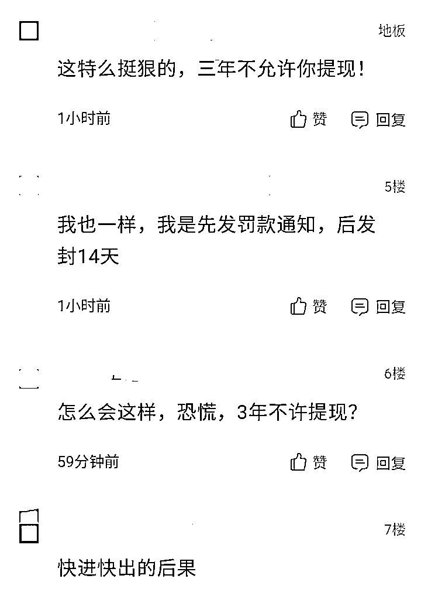
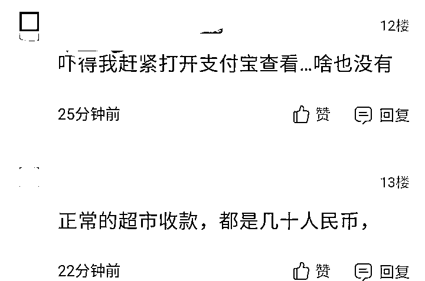
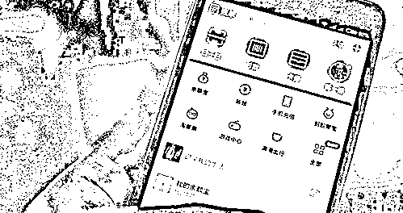

# 在柬埔寨兑换 4000 美元，支付宝被限制大额转账提现 3 年！

> 原文：[`mp.weixin.qq.com/s?__biz=MzIyMDYwMTk0Mw==&mid=2247526829&idx=5&sn=7adbe888e24b81fed95fc5b8a556736c&chksm=97cba295a0bc2b836a7db5804542366ddcb82adf223eab2327c0e87cbf75353e846f0471a77c&scene=27#wechat_redirect`](http://mp.weixin.qq.com/s?__biz=MzIyMDYwMTk0Mw==&mid=2247526829&idx=5&sn=7adbe888e24b81fed95fc5b8a556736c&chksm=97cba295a0bc2b836a7db5804542366ddcb82adf223eab2327c0e87cbf75353e846f0471a77c&scene=27#wechat_redirect)

最近柬埔寨已有多名同胞支付宝转账、提现等功能被限制。

**与群友换 4000 美元后**

**支付宝账户被限制大额转账和提现 3 年**

近日，金边一名中国同胞小陈向**柬埔寨头条**爆料，他与华人微信群里一名群友兑换 4000 美金，支付宝到账后被列为涉嫌交易违规，随后被限制大额转账、提现功能 3 年。

小陈表示，这名群友是一名餐饮店老板，他们两人是相互认识的熟人。老板因资金流水需要，用 20000 多人民币与他兑换 4000 美元，分两笔钱转账操作，万万没想到支付宝到账后，账户竟然遭到处罚通知。

处罚通知显示，小陈支付宝被处罚的原因是账户涉嫌交易违规，限制大额转账及提现三年。

但约 8 分钟后，他又收到一条账户安全通知，被告知账户涉嫌交易违规，已被限制付款和提现功能，14 天后自动恢复。

小陈表示，只有他自己收到支付宝处罚通知，餐饮店老板支付宝账户并没有任何异常。

他称，自己偶尔使用支付宝与熟人进行转账交易或者提现，大部分都是淘宝网购支付宝扣款，账户交易及使用十分正常，部分功能却遭到限制，也不知道哪里出现了问题。

其支付宝里还有 1 万多人民币，支付宝突然被处罚限制转账、提现三年这波操作使他很无奈。

小陈并不是个例，已有多名同胞在使用支付宝过程中收到相同的处罚通知。

**超市老板、网友等**

**多人支付宝收款也遭处罚 3 年**

12 月 26 日，另外一名同胞也在网上发布帖子，称他 12 月 23 日通过支付宝进行交易，随后也收到处罚通知，处罚原因与小陈一样。 

该同胞经营一家超市，经常使用支付宝收款，金额通常是几十块而已，并非大金额交易。

12 月 26 日，他的微信也被封 7 天。

他将支付宝处罚通知截图发布在网上并询问是否有人了解具体情况，有网友评论也遇到了相似情况。

这名网友表示，他对支付宝功能限制通知感到十分困惑，近半年来，他每个月就进行两三千收款交易操作而已，也被列为涉嫌交易违规，被处罚限制大额转账、提现功能 3 年。

另外一名网友也称遭遇一样，但是处罚 3 年通知与封 14 天先后顺序不同。

其他一些网友感到担忧，立即打开支付宝检查，幸好一切正常。对于支付宝账户处罚，尤其是限制提现时间长达三年这一现象，他们用“狠”字来形容，无法给予理解。 

随着支付宝风控系统越来越智能，支付宝账户登录地点、操作习惯、浏览内容，以及按键力度、按键频率等操作，若在监控的范围之内有不符合规律，或很容易触发风控系统，从而导致部分功能受到限制。

上述几名同胞的遭遇从侧面反映出，即便交易金额不大、账户本身干净，身处境外，尤其是东南亚地区，也很容易成为支付宝风控重要对象。

应提的是，支付宝、微信等移动移动支付方式是许多在柬埔寨华人、中国商超、餐厅习惯使用的重要支付方式。许多人薪资结算方式为美元现金，平时汇兑、给家人汇款、购物、用餐支付等通常习惯使用支付宝，它给大家生活带来很大的方便。

但若一不小心触发支付宝风控系统，转账、提现功能遭限制 3 年，将对同胞生活、支付使用方面将会造成巨大的困扰。因此同胞们最好了解支付宝风控系统并加以规避，以免影响支付宝使用。

来源：柬埔寨头条

← 向右滑动与灰产圈互动交流 →

# 

> 原文：[`mp.weixin.qq.com/s?__biz=MzIyMDYwMTk0Mw==&mid=2247526829&idx=6&sn=1e3791076eebb1cf42193ba4bea7d66a&chksm=97cba295a0bc2b83248ac4c1819b137480c3459012abb66e9926cf2d7ceb2e5fd7655c24171a&scene=27#wechat_redirect`](http://mp.weixin.qq.com/s?__biz=MzIyMDYwMTk0Mw==&mid=2247526829&idx=6&sn=1e3791076eebb1cf42193ba4bea7d66a&chksm=97cba295a0bc2b83248ac4c1819b137480c3459012abb66e9926cf2d7ceb2e5fd7655c24171a&scene=27#wechat_redirect)