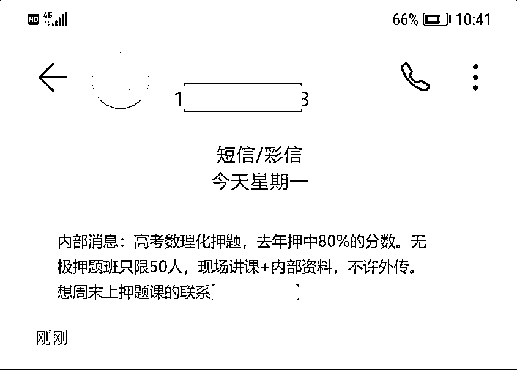

# 年末必看！2021 年电信网络诈骗热点案例盘点，这些“坑”你踩了么~

> 原文：[`mp.weixin.qq.com/s?__biz=MzIyMDYwMTk0Mw==&mid=2247526829&idx=7&sn=4b00752c3553a7acdd295f498e794a21&chksm=97cba295a0bc2b83cd820da22b6bef618ae540a8916e150060b4b1adedaf6962d7dc5e95b21f&scene=27#wechat_redirect`](http://mp.weixin.qq.com/s?__biz=MzIyMDYwMTk0Mw==&mid=2247526829&idx=7&sn=4b00752c3553a7acdd295f498e794a21&chksm=97cba295a0bc2b83cd820da22b6bef618ae540a8916e150060b4b1adedaf6962d7dc5e95b21f&scene=27#wechat_redirect)

“疫苗诈骗”

“春运诈骗”

“网络兼职诈骗”

……

2021 年

不法分子紧跟社会热点翻新诈骗套路

针对不同人群定制“诈骗脚本”

迷惑性极强、套路极深

2021 年都有哪些骗局从你的世界里路过？

一起来看看

**1 月 疫苗防控诈骗突出**

**新冠疫苗预约诈骗**

1 月初，各地陆续组织新冠肺炎疫苗接种工作。不法分子趁机冒充疾控中心发送疫苗接种预约诈骗短信，诱骗受害人点击钓鱼链接，并输入身份证、银行卡、密码等信息，获取这些信息后，盗取受害人银行账户钱财。

**2 月 疫情下的春运诈骗**

**假借疫情炮制**

**“航班取消”“火车停运”诈骗** 

1 月 16 日凌晨，人社部等七部门部署行动，鼓励务工人员就地过年，国家倡导公众减少出行，铁路、民航、公路运输企业相继推出免费退票措施。

不法分子发送“航班取消”、“火车停运”等诈骗消息，以退费、补偿为由诱导受害人在虚假改退签网站中输入银行卡号、密码等信息，进而盗取用户银行卡内余额。

**3 月 假借疫苗诈骗再度升级**

**冒充疾控人员核查** 

**“非法邮寄假疫苗”实施诈骗**

冒充疾控中心工作人员，利用境外号码拨打受害人电话，利用话术对受害人进行资金诈骗。

不法分子利用境外电话与受害人联系，准确说出受害人姓名、身份证信息后，声称受害人邮寄假疫苗，要求受害人主动报警核查。之后假冒的办案民警以资金清查为由套取受害人的银行卡号、密码等信息，迅速盗取卡内资金。

**4 月 冒充公检法诈骗再度升级**

**冒充工商、市场、税务等** 

**监管部门精准诈骗**

冒充公检法的电信诈骗再度升级，利用网络渠道获取国家企业、商铺等负责人、法人联系方式，群发信息进行诈骗。

不法分子发送“法人信息、营业执照或个体注册信息超时”诈骗短信，诱导受害人点击短信中的钓鱼网站并填写身份证、银行卡号、密码等信息，以此盗取受害人银行卡上的钱财。

**5 月 纪念币收藏成热点**

**纪念币收藏诈骗** 

5 月，全国陆续发行“中国共产党成立 100 周年”纪念币，受到消费者的广泛关注，迅速变为热销甚至是脱销产品。

随着纪念币收藏交易的火爆，相关诈骗也层出不穷。不法分子冒充银行或合作机构，通过短信、电话、网络等方式虚假宣传、推销假纪念币，以“藏品稀缺”“保真”“升值空间大”“可货到付款”等话术诱骗受害人联系并高价购买。

**6 月 年度高考诈骗戏码重演**

2021 年高考在即，每年高考前后是涉考诈骗案件的高发期。

**高考前押题诈骗**

高考前，不法分子利用考生和家长焦虑的心理售卖高考“密卷”，夸大其词宣传其“权威性”“押中率”，诱骗考生、家长高价购买。一旦收到钱款不法分子会立马消失,而试题的质量并无保障。

**高考后志愿指导诈骗**

高考结束后，不法分子又打着“志愿咨询指导”的幌子诱导考生或家长添加好友或入群，以大数据精准填报志愿、通过内部关系提前查分或查询录取结果、可协助获取某高校的“内部录取指标”等为由，骗取考生或家长高额的费用。

**招录诈骗** 

高考前后不法分子发布招录相关诈骗信息。一旦考生或家长联系，他们会以“提前录取”“有内部关系”“可降分录取”等为由骗取信任，之后再以学费、关系疏通费、指标费等为由诱导考生或家长转账汇款。

**7 月 毕业季里的诈骗**

高校学生走出校园初入社会，缺少经验和辨识能力，成为骗子的重点目标。

**注销学生网贷账户诈骗** 

不法分子冒充网贷客服联系受害人，谎称受害人在校期间注册的网贷账户不符合国家政策，需配合注销，否则将影响个人征信，再以清空贷款额度为由，诱骗受害人提取授信额度并向其转账。

**冒充单位人事部门诈骗** 

不法分子在网络上获取求职信息后，冒充人事部门向求职者发送“求职简历已通过”短信，诱骗求职者联系。之后以缴纳保证金、押金等理由诱骗求职者转账汇款。

**8 月 网络兼职卷土重来**

**抖音、网站刷单诈骗** 

网络兼职诈骗虽不是什么新套路，但时不时会卷土重来。

不法分子迎合部分人群利用闲暇时间从事兼职工作需求，发布“抖音、短视频点赞、网络刷单”等虚假兼职消息，以“工作简单轻松、高收益”吸引受害人添加微信、QQ 或下载指定的 App 等，先以小额订单任务完成快速返还垫资及酬劳取得受害人信任，再要求转发、邀请好友、付费升级等为由诱骗受害人多次付款。

**9 月 冒充领导诈骗再次频发**

**冒充领导借钱诈骗** 

与“冒充熟人通知换号”“冒充领导叫去办公室”的骗法如出一辙。

不法分子冒充某县、乡领导，要求受害人添加其微信号，受害人回复短信后，不久就收到了该号码发来的借钱短信。

**10 月 十一假日高发诈骗**

十一假期期间，外出旅游、购物、休闲的人数逐渐增多，不法分子趁机发送虚假消息实施诈骗。

**机票车票退改签诈骗**

不法分子冒充航空、高铁工作人员，向受害人发送虚假的“航班、高铁取消”短信，诱骗受害人拨打短信预留的虚假客服号码办理退票或改签。假冒客服人员接到受害人电话后，以收取手续费或工本费为由，要求受害人汇款至指定账户。

**车辆违章诈骗** 

不法分子发送车辆违章查询诈骗信息，诱骗受害人点击安装病毒程序，手机中毒后会被不法分子控制，向通讯录好友发送借钱信息，手机里存储的个人信息也会被不法分子窃取。

**虚假商品促销诈骗** 

不法分子发布虚假名品促销信息，吸引受害人联系购买。一旦收到货款立即将受害人拉黑，或以货到付款方式给受害人邮寄劣质商品。

**11 月 购物狂欢节，诈骗不停歇**

在狂欢购物盛宴的月份，针对消费者的网购诈骗套路不断翻新。

**直播带货诈骗** 

不法分子发送带货推广信息诱骗受害人联系。之后以操作简单、提供货源及运营支撑、高回报等话术迷惑受害人，再以保证金、运营费为由诱导受害人转账汇款。

**下单异常诈骗** 

不法分子通过境外号码发送“下单异常”诈骗短信，短信中含有钓鱼网址链接，不法分子通过该网站诱导受害人向指定账户转账、汇款，并窃取受害人在该网站输入的个人身份等信息。

**快递诈骗** 

假冒的快递公司客服通过电话、或者短彩信与受害人联系，称因疏忽导致受害人的包裹丢失或破损，要为其办理现金赔偿，诱骗受害人添加好友。之后通过微信引导受害人进行“赔偿操作”，诱导受害人在钓鱼网站上输入银行卡、密码等个人信息，并进一步诱骗受害人转账汇款。

**12 月 网络赌博诈骗年底冲业绩**

**网络赌博诈骗** 

临近年底，骗子冲“业绩”的节奏加快，设计网络赌博诈骗，给有娱乐消遣或投机心理的人“挖坑”。

不法分子违规发布网络赌博类诈骗信息，诱导客户登录钓鱼网站注册、投注，用户注册时输入的个人隐私信息均被不法分子获取。同时，不法分子还骗取客户预存定金，或通过人为控制开赌结果等方式赢取用户赌资。

**友情提醒**

**防范电信网络诈骗要做到：**陌生电话、信息勿轻信个人隐私勿泄露涉及钱财需小心遇到事情勿惊慌一旦受骗应及时向公安机关报案

2021 年的最后一期分享到这里啦～ 

如果觉得对你有帮助

记得点击**“在看”**让更多人看到哦！

我们明年再见！

来源：韶关新闻网、韶关政法 、神奇安全事务所

← 向右滑动与灰产圈互动交流 →

