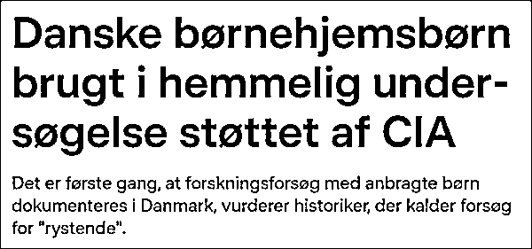
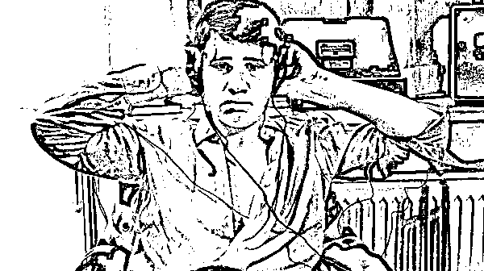
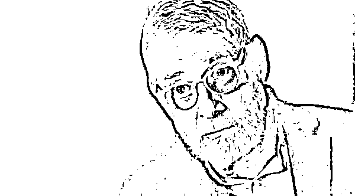

# 涉 311 名儿童！CIA 资助秘密人体实验，细节曝光

> 原文：[`mp.weixin.qq.com/s?__biz=MzIyMDYwMTk0Mw==&mid=2247526940&idx=2&sn=317df1fe8b22ef51fce768317d47cb85&chksm=97cba124a0bc28327eb9587248890d60541ff08518b3c63be5ce4f3da9fe4a1fa2b5d1df24cc&scene=27#wechat_redirect`](http://mp.weixin.qq.com/s?__biz=MzIyMDYwMTk0Mw==&mid=2247526940&idx=2&sn=317df1fe8b22ef51fce768317d47cb85&chksm=97cba124a0bc28327eb9587248890d60541ff08518b3c63be5ce4f3da9fe4a1fa2b5d1df24cc&scene=27#wechat_redirect)

[`mp.weixin.qq.com/mp/readtemplate?t=pages/video_player_tmpl&action=mpvideo&auto=0&vid=wxv_2202222649420857346`](https://mp.weixin.qq.com/mp/readtemplate?t=pages/video_player_tmpl&action=mpvideo&auto=0&vid=wxv_2202222649420857346)

据丹麦广播公司报道，近日播出的一部名叫《寻找自我》的丹麦纪录片，**披露了美国中央情报局（CIA）涉嫌资助上世纪 60 年代对 311 名丹麦儿童进行的一场秘密人体实验。**这些儿童大多是被人领养或来自孤儿院，始终未被告知实验的具体目的。

报道称，这项实验在哥本哈根市立医院的地下室秘密进行，旨在研究精神分裂症与遗传或环境之间的联系。**项目得到了美国医疗机构的资助，仅第一年就获得了相当于今年 460 万丹麦克朗的支持。**CIA 幕后运作的一家基金会也为该项目提供了大量资金。

项目思路来源于一名美国心理学家，但由于在美国寻找合适“样本”的难度较大，因此美国机构把目光投向了丹麦，与一名叫做菲尼·舒尔辛格的丹麦精神病学家合作，在丹麦开展了长达数十年的研究。

丹麦广播公司报道截图

纪录片导演、实验亲历者之一佩尔·温尼克在片中讲述了他儿时在实验室里的遭遇。温尼克说，在他 11 岁的时候，有人问他是否想去哥本哈根市立医院做一些“有趣的事情”。为摆脱孤儿院的无聊生活，温尼克答应了这一要求，他还因此得到了 16 丹麦克朗。

但医院地下所做的实验却超出他的预想。**温尼克回忆说，当时他需要定期接受一系列“测试”，其中最令他记忆深刻的是一项测试儿童是否存在“精神变态”的实验。**在这项实验中，温尼克被要求坐在椅子上，身上绑着电极，被迫聆听响亮刺耳的噪音。

图自纪录片第二集

“这让人非常不舒服。这不仅是我经历过的事，也是许多孩子共同的遭遇。”温尼克说，**“我认为这侵犯了我的公民权利。我觉得很奇怪，有些人对我的了解竟然比我自己还多。”**

这起令人震惊的儿童实验得以披露，则要归功于温尼克鼓起勇气寻找真相。报道称，直到三年多以前，温尼克偶然在一部美国纪录片中看到了研究精神问题与遗传或环境之间联系的实验，这让他回想起了自己的经历，他因此下定决心搞明白小时候到底经历了什么。

佩尔·温尼克 视频截图

在查找了大量旧时公开文件和资料后，温尼克最终“顺藤摸瓜”在丹麦国家档案馆找到了当时的一些资料，**这表明哥本哈根市立医院地下的研究得到了美国医疗机构的资助。**

报道称，仅第一年该项目就获得了大约 30 万至 40 万丹麦克朗的资金支持，这笔钱放在今天相当于 460 万丹麦克朗。温尼克注意到，一个名叫“人类生态基金会”的机构也是该项目的主要资助者，**这个机构正是由美国中央情报局在幕后运作的。**

然而，温尼克对自己“童年阴影”的调查最后还是碰了壁。丹麦广播公司提到，温尼克了解到丹麦维多伏尔的格洛斯楚普精神病学中心存放有部分研究资料，**但在他申请查阅资料的时候，该中心开始销毁相关材料。**

中心负责人梅特·贝特尔森·弗雷德斯嘉德向丹麦广播公司解释称，他们意识到相关文档保存时间已经“超出期限”，因此需要尽快粉碎文件避免违反相关法规。

对此南丹麦大学卫生法副教授肯特·克里斯滕森批评说：“该机构在温尼克申请查阅资料后依然坚持销毁文件并不合理，这剥夺了受害者探寻自己过去经历的机会。”

丹麦斯文堡社会福利博物馆的历史研究人员雅各布·克纳奇·拉斯穆森则表示，他接触过很多孤儿院的记录，**但这还是首次有记录表明丹麦孤儿院的儿童被用于“研究”。**

“无论是在丹麦还是在整个斯堪的纳维亚，我以前从未听说过这样的事。**这一令人震惊的消息显然违背了 1947 年的纽伦堡法典，它对人体试验做出了明确的伦理限制。**该法典要求受试者必须对实验知情且自愿同意，这是当今世界研究的核心原则。”拉斯穆森说。

来源：共青团中央（ID:gqtzy2014）

← 向右滑动与灰产圈互动交流 →

