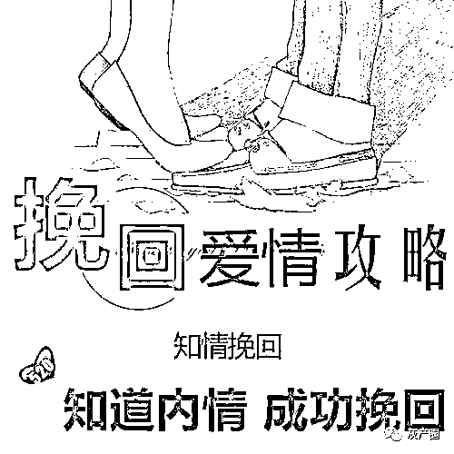
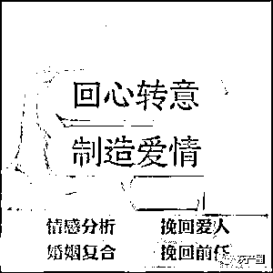

# “支付 2800 元，保证和前任复合”，已有多人中招

> 原文：[`mp.weixin.qq.com/s?__biz=MzIyMDYwMTk0Mw==&mid=2247526940&idx=4&sn=0930998733a297e5b1b35ddc1485caaf&chksm=97cba124a0bc2832cbb76fe65f7c749614c886b810b86c2b17186d7fae15d3f686bd20413b18&scene=27#wechat_redirect`](http://mp.weixin.qq.com/s?__biz=MzIyMDYwMTk0Mw==&mid=2247526940&idx=4&sn=0930998733a297e5b1b35ddc1485caaf&chksm=97cba124a0bc2832cbb76fe65f7c749614c886b810b86c2b17186d7fae15d3f686bd20413b18&scene=27#wechat_redirect)

面对“修补爱情”这类普遍而迫切的需求，部分不法分子打着“情感咨询”的名号，在抖音、微博、知乎等各网络平台大量投放情感咨询广告，以“专业咨询师”、“心理分析师”等身份标榜自己，获取被害人信任，诱骗被害人购买所谓的“情感挽回服务”，诈骗大量钱财。

 而这些寻求帮助的“客人”，有的修补情感不成，反被前任诉至法院；有的还是在校学生，面对无法支付昂贵的服务费，被引导去借贷缴费......

12 月 30 日，上海市首起“情感挽回大师”诈骗案由金山区人民检察院提起公诉，在金山区人民法院宣判，该案涉及 31 名被告人，被告人肖某某以诈骗罪判处有期徒刑 11 年，并处罚金人民币 20 万元，被告人张某某以诈骗罪判处有期徒刑 9 年，并处罚金人民币 15 万元，其他被告人分别获期限不等的有期徒刑，并处罚金。

 **覆盖全国的围猎陷阱**

2020 年 10 月，家住河北的刘女士和男朋友吵架分手，她在网上查找如何挽回恋情，偶然间看到了某咨询公司的广告，“分手后如何与对方聊天”“专属团队帮您挽回另一半”……刘女士随即通过线上客服联系到了“情感导师”徐某。看着对方发来的视频，以及正规公司营业执照、情感分析师专业证书，刘女士打开心扉。

 “综合您初步提供的信息，您和您的恋人目前处于情感剥离状态，是可以挽回的……”这位导师详细了解了刘女士和其男朋友的私人情况、感情经历，刘女士对他专业的口吻、精准的性格分析感到信服。

 “支付 2800 元的咨询费，一对一为你订制挽回方案，保证让您和男朋友复合。”导师的话仿佛雪中送炭，刘女士很快和对方签署了一份电子合同，并转账过去，看到红章黑字写着“一周期内成功挽回，失败全款赔付”，她信以为真。

 添加了新的咨询师郑某后，刘女士经常会向对方请教如何联系前任，而郑某也会定期向刘女士推送一些心灵鸡汤、提升情商语录的文件等等，但刘女士想象中男朋友回心转意的效果并没出现，郑某解释刘女士之前因未按照老师的要求严格执行，导致出现了感情危机，建议刘女士购买情感挽回升级服务，公司会安排一整个团队全力帮助，并可提供位置定位、小三分离等特殊服务，但需要再交一笔 2 万元的费用，犹豫之下，刘女士还是付了这笔钱。

 然而，新加的群、团队、导师逐渐开始不搭理她，发消息也是敷衍回应。

 “我们可以通过技术手段介入，分离你前男友和他的现任，最后回到你身边。”没过多久，导师又推荐她购买服务，但需要再交好几万，刘女士察觉到自己可能被骗，拒绝了，找导师们商量退钱，但无果。

 无独有偶，2021 年 5 月，有类似遭遇的牛先生向金山警方报案。经警方缜密侦查，嫌疑人被悉数抓捕，2021 年 7 月，金山区检察院依法批准逮捕肖某某、吕某某等 31 人。

 “该犯罪团伙利用被害人期待挽回情感的迫切心理，精心设计话术获得信任，以承诺挽回情感为由虚构第三方介入、分离引导、双向指导等服务，环环相扣、相互配合，使被害人产生错误认识。”承办检察官胡蝶说。

 “咨询师让我觉得感情都是自己性格的问题，需要通过他们的专业指导进行个人提升”，为包装自己、变成对方心中的完美情人，高女士多次购买升级服务，一月内交了 16800 元“学费”。

 被害人年龄跨度从“00 后”至“60 后”，不法分子在众多普通人的“情感危机”中挖掘商机。

 **运营有序的“咨询公司”**

****

2018 年 7 月起，被告人肖某某伙同他人成立山东某教育咨询有限公司，并陆续安排葛某、姜某某、王某（均另案处理）任另外三家教育咨询有限公司法人，作为该公司分公司共同经营。2020 年 4 月，被告人张某某任山东某教育咨询有限公司总裁，负责统筹管理该公司与各分公司。该公司设有咨询部、分析部、财务部、后勤部等。分析部是由其他几家“教育”类咨询公司组成。

 上述公司承诺真正帮助挽回失恋情人和出轨爱人，但在与消费者签订合同时却将服务内容都标为“情感咨询”。

 在招收新员工时，涉案公司会组织相应培训，内容是学会如何和客户聊天，掌握话术，通过听取“成功案例”的录音找到“入行窍门”， 比如：开场白、挽回期望评估、印象管理、针对性人格展示等等，共有十几个个步骤，目的便是让被害人下单交钱，员工往往培训不到一星期就能上岗。

 员工先是在百度、抖音、知乎等各大平台发布广告，或看到他人发在网上有关“情感修复”类的留言信息后私聊对方，自称是情感导师，询问对方是否需要专业的情感咨询服务，咨询是免费的，如果对方有意向，就将客户推给分析师，由分析师进行初步服务。

 **步步设套的“订制”服务**

****

而所谓的“订制”服务，也是一步步围猎被害人。

 第一步：情感分析。分析师向客户了解基本信息、诉求、具体感情问题后，会根据话术分类处理，基本上就是要告诉客户其想解决的问题难度不大，保证挽回。

 “老师从事感情咨询这么多年了，处理过很多比你这个严重得多的问题，放心吧，肯定能帮你挽回的。”分析师刘某说。分析师通常会用“专业导师和专门团队负责”“支付费用后基本一个月能解决”等话术让客户“安心”。

 在这过程中，他们继续针对客户自身的问题进行诱导。“就是因为你过于强势所以你丈夫才会出轨，所以你要听从老师的指导”或“就是因为你太犹豫不决，所以对方才要离开你，所以你需要当机立断接受老师的指导”等话术，进一步让客户产生“共鸣”。

随着一步步跟客户交流，了解个人情况、分析情感、给出结论，接着便会有一个“逼单环节”，让客户意识到这个事情很紧迫，只有靠他们才能挽回感情。再之后就是分析师向客户报价的过程，根据前期了解的情况，判断客户能“消费”的水平，如 2880 元、3880 元、4880 元等不同档次。

 第二步：定制服务。在客户交钱、签下合同后，客户也就成了“学员”，分析师便将学员信息发给主管吕某某，由他来分配订单，将咨询师推送给分析师，随后，“团队专属服务”“一对一订制”也就紧跟上线，由分析师组建微信群，群内有学员、分析师、咨询师、分析部和咨询部相关负责人等，并提供所谓量身定做的“情感挽回方案”。

 “我们往往是给客户发送电子书、情感语录，教其发信息、买礼物等，让学员提高信心，主要内容是回复他们的一些情感问题，陪他们聊天。”分析师陈某交代。

 而在客户情感问题没有缓解、好转，进行追问时，咨询师往往表示目前这种情况比较复杂，需要进行双向指导、三方介入等等，让学员继续缴费。

第三步：升级服务。如果客户非常期待和前任复合，咨询师便趁机不断放大客户的感情危机，提升其焦虑，进而介绍其他的服务项目，比如：分离、双向和自我提升。并且在此过程中，咨询师要求客户不得主动联系“挽回对象”，继而伪造与“挽回对象”的聊天记录，谎称对方已有新恋情等虚假信息，诱骗被害人持续转账，升级服务项目。

 “分离”是指咨询师告诉告诉客户，本公司有专业的分离团队可以把客户的复合对象和可能的第三者分开，为挽回前任男（女）朋友做铺垫；“双向”是指咨询师向客户承诺，团队可以做到给客户和他的挽回对象一起进行心理辅导，让挽回对象回心转意；“自我提升”是指告诉客户他只有自己改变了才能挽回对象，通过购买公司的课程进行情商提高、方法改变等，并“建议”：如果提升不了，复合之后感情也会破裂，分手会再出现。升级项目的“服务费”也水涨船高。

 “通过客户的对象发的信息观察第一时间点赞回复的人，还有客户对象关注的人，通过这些线索来判断第三者，再把可能的第三者信息反馈给咨询师。”谢某是涉案公司“双向团队”的一员，他的主要工作是充当第三方，“往返”在不同对象之间。

 第四步：风险规避。随着后期客户付的钱多了，感觉并没有收到协议承诺的服务效果时，涉案公司便会收到各种类型的投诉，一般的处理方式是更换导师、延长服务期，难以处理时再同意，但是在真正履行合同协议进行退款时，对方便根据事先设计好的“霸王条款”逃避责任，仅象征性地退还部分钱款“安抚”客户。

其中 2020 年投诉客户就有 150 余人。此后，为规避风险，肖某某经与张某某等人协商，陆续注销或将上述公司更名，再按照原经营模式，以“情感咨询服务”类公司的名义继续实施诈骗。

**法律买单的情感创伤**

****“本想通过‘情感挽回’服务，拯救自己濒临破碎的家庭，不曾想，半年过去了，花费 1.3 万余元购买的课程丝毫没有效果，而妻子已然拉黑了自己所有的联系方式，甚至起诉到了法院。”受害者李先生说。

 导师们以情感分析师、婚姻家庭咨询师、全能型情感专家、高级情感私人顾问、男女性心理深度解读讲师、实战派社会心理特约老师等身份“包装”自己，辅以专业话术，但他们实际上不具备任何专业知识和相应能力。

 他们通过广告推广吸引被害人关注，先由分析师以承诺可以帮助解决个人情感问题为由，诱骗被害人付费，后将被害人引导至咨询师处，由咨询师推出高价收费项目，诱骗被害人继续付费，归根结底，涉案公司没有能力提供任何实质性的情感复合服务。

 其中，有的被害人是在校学生，面对无法支付昂贵的服务费，咨询师便引导他去借贷，原本情感受到重创的被害人，被分析师的话术成功“洗脑”后，甚至合同都没签署便付钱了。

 检察机关审查认定：被告人肖某某、张某某以非法占有为目的，伙同他人通过电信网络骗取被害人钱款，截止案发，共计骗取被害人钱款 170 余万元，数额特别巨大，犯罪事实清楚，证据确实、充分，应当以诈骗罪追究其刑事责任。被告人肖某某在共同犯罪中起主要作用，系主犯。

 12 月 30 日，这起涉及 31 人的特大电信网络诈骗案第二次开庭审理，法院作出前述判决。

来源：澎湃新闻

← 向右滑动与灰产圈互动交流 →

