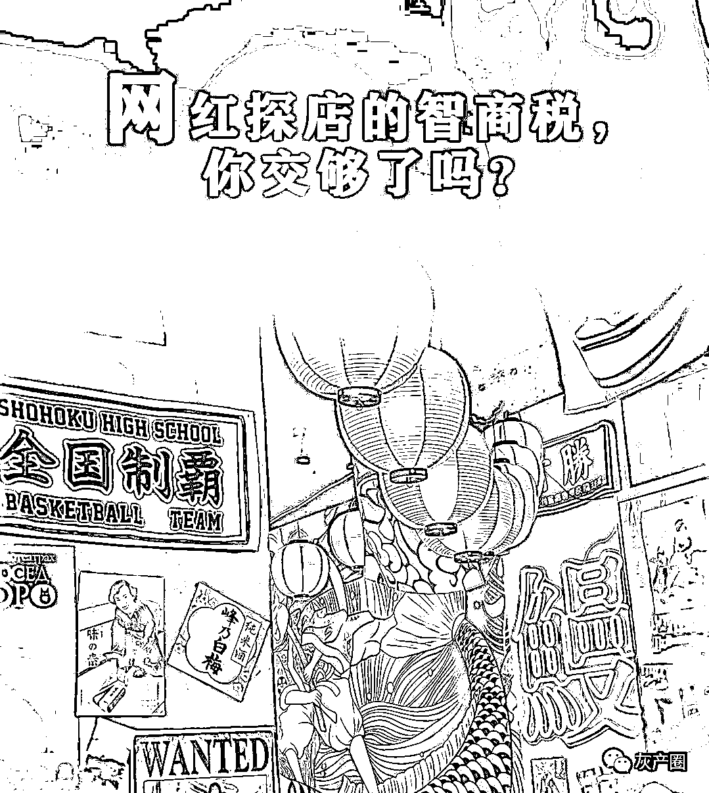

# 被网红探店收智商税后，我回到了大众点评求助

> 原文：[`mp.weixin.qq.com/s?__biz=MzIyMDYwMTk0Mw==&mid=2247526940&idx=6&sn=769517354c630ff6703f14e3f81ce6e9&chksm=97cba124a0bc2832ee83d0fe9ae59370bff59e1ad6e787914b9515acc825be0eed9b379bbb9a&scene=27#wechat_redirect`](http://mp.weixin.qq.com/s?__biz=MzIyMDYwMTk0Mw==&mid=2247526940&idx=6&sn=769517354c630ff6703f14e3f81ce6e9&chksm=97cba124a0bc2832ee83d0fe9ae59370bff59e1ad6e787914b9515acc825be0eed9b379bbb9a&scene=27#wechat_redirect)

作者/薛机智 x  编辑/丽雅  排版/忠瑞

**出门吃饭购物，不少人已经习惯了打开手机寻求决策参考。因短视频的流行，网红探店种草一度影响了大家的就餐选择。** 

**不知不觉间，这已演变成了一门生意。随着各个平台涌入本地生活领域，网红探店逐渐变成了一个成熟的产业，步入畸形化的同时透支着消费者的信任。**

**“网红的嘴就是骗人的鬼，又实实在在地交了一把智商税。”95 后小靳跟着某探店网红打卡了线下餐厅后气愤地说。短视频上的网红探店，正在从少数人的爱好变成一门网红们的流量生意，引发的“民怨”还在各地上演。**

**如果说，种草的底色是真实，那网红探店、网红直播等形式，更类似于种草的壳里裹着营销的种子。不少识别套路的年轻人，选择回到大众点评求助。**

****

****互联网种草流变**** 

**诗人木心曾在《从前慢》中写道：“记得早先少年时，大家诚诚恳恳，说一句，是一句……从前的日色变得慢，车，马，邮件都慢。”**

**可现在日色不慢，车不慢，马不慢，网也不慢，说一句不是一句，转眼却能收获三十二个赞。**

**这或许是对互联网影响下的网红种草模式变迁最鲜明的总结。**

**种草，意思是经人推荐商品而产生购买欲。在一开始，是基于个人真实体验的真诚分享，通过现身说法让他人激发内心需求，产生购买欲。它曾是“朋友不骗朋友、中国人不骗中国人”的典型代表，为许多人的购买决策提供了有价值的参考。**

**种草也曾是无私分享的代表，用到好用的产品、体验了优质的服务，就用互联网把自己的体验分享，以更快、更直接的方式把他们分享给更多人。但不是所有人都能成为意见领袖，他们的分享可能很难能让别人看到，最多也就辐射自己生活圈子里的人。**

**互联网公开平台的发展，给了更多普通用户基于真实体验的为爱发电机会。比如豆瓣、大众点评建立的评价体系，借助大众的力量，为用户消费意愿提供了参考依据。无论好评或是差评，无形当中都在帮助用户进行决策和种草，降低决策成本。**

**随着短视频平台的发展，探店短视频和直播形式的种草模式一时兴起，用户沉浸在刷视频流内容的时候，更容易受到网红景点、网红餐厅、网红菜品等视觉化动态内容的冲击而种草，从而激发出全新的消费欲望。因此，短视频探店团购+直播带货的形式，流变成为当前如抖音、快手等平台进军本地生活的核心依托。**

**乱象正在衍生。**

**起初基于用户真实体验的探店种草模式，在短视频平台的流量算法攻势下，变成网红们低门槛的广告内容模式。此前网红探店肯德基炸酱面大变脸的事情，便是典型。**

**而直播带货这类形式的种草，更是直接消灭了种草的模糊地带，变相成为“电视购物推销”的当代翻版。**

**但种草毕竟不是营销广告，这种模式最终都会有损用户的消费体验。**

****

****短视频种草的“阳谋”**** 

**如今短视频平台大火的网红探店团购、直播带货等模式培养的种草心智，始于营销，终于营销。**

**此类种草形式，目标在于交易，即以高频的内容流量渗透电商或者本地生活市场，实现“线上种草—线下交易”闭环模式。**

**与图文相比，短视频沉浸式种草营销早已证明了价值。单列式的视频流形式和中心化的海量流量推荐模式，可以在短时间内吸引到人们的注意力。当界面上没有同类餐饮可对比，再辅以趣味性或者夸大的精美视频效果，用户更容易冲动上头，直接无缝跳转到下单页面购买套餐。**

****当前，这种种草方式直接被搬运到本地生活领域。****

**小贾是智商税研究中心随机访问到的一位普通消费者，她表示：“我时不时在短视频平台上刷探店视频，看到上面美味的食物和博主探店时的享受画面，价格也挺便宜，真的很难不下单。”**

**对商家来说，通过网红探店卖团购的方式，向消费者“种草”，可以用比较少的价钱为自身店铺吸引一波来自短视频上的增量。**

**对于短视频平台来说，其线上模式注定不缺用户的种草需求。如果还能吸引一批愿意上线供给的本地生活商家，以及闻风而动的网红博主们，算是初步搭建起了种草到消费的大框架。**

**在 2021 上半年，抖音正式推出了“探店团”项目，对探店团购相关内容进行流量扶持和带货分佣。网红们挑选想探的店铺并拍摄相关视频，发布之前选择同城展示，添加标签，加入目标商户的优惠券，这样发布视频后就会获得同城流量。**

**目前打开网红探店视频就可以看到，视频底部必挂着店铺定位和低价促销团单。一般网红在餐饮商家的带货分佣可达 10-20%，整体来说，分佣比例可达到 10%-50%。这种形式类似早期电商网站的分销联盟。**

**在这类模式下，网红们通过探店视频扮演的角色也在发生变化，以前是单纯的内容创作者，现在更类似种草地推官、线上化分销商。产出的探店视频，一切则以流量和变现为核心，不再为真实的种草服务。**

****据智商税研究中心了解到，目前短视频平台的网红探店变现模式主要分三种：****

**一是资源置换，即商家为网红提供免费的服务，网红博主体验后发布店铺相关内容种草，为商家提供流量；**

**二是商家主动推广，即商家通过“雇主”发商单或者自己找到网红博主，给予一定费用支持，网红们对接需求后探店种草；**

**三是抽佣，除了上述推广费用外，在探店视频下方植入团购商家链接，网红们根据链接中的成交量抽取一定佣金。**

**据某短视频平台的 MCN 机构负责人透露，探店是为数不多可以条条接广告的赛道，头部达人一个月可以探 80 家店，如果全勤探店的话，平均每天要至少探 2.5 家店。**

**对于网红来说，无论是单条固定费用结算，还是接单赚佣金的收入模式，背后都无外乎推广营销的“阳谋”。**

****

****让种草回归种草**** 

****短视频平台流量+低价+网红售货员的模式，对于需要精细化运营的本地生活来说，已经反噬消费者的用户体验。****

**此前，两名在校大学生被短视频平台上 19.9 元的唯美古风写真套餐种草吸引，但实际到店拍摄，却被层层“加码”，消费一路升级至 2.6 万元。随后，不少消费者回到大众点评写下了评价，将真实的低价套路告知给更多后来者。**

**这种极端被坑的案例可能不多。对于大部分在短视频平台抢购了线下低价团购的用户来说，商户不接待、货不对板、退货难等问题却是常见现象。**

**网友小蔡表示：“现在短视频平台上，十条有八条都是团购广告，我之前也因为便宜疯狂心动，团购了很多。有一次申请退款等了 11 天，打电话售后说请耐心等待。钱虽不多，但消耗的是心情，以后不会用了。”**

**智商税研究中心在大众点评上搜索发现，确实有不少网友从短视频平台买了团购踩坑后，又回到大众点评评价区求助，甚至发布新评价帮助其他消费者作出理智的消费决策。**

**这个原因还是在于本地生活种草-交易-履约链路的门槛。**

**如上分析可见，短视频平台最有优势的种草环节，目前使用的探店团购和直播带货模式，本质就是营销广告，用营销手段创造需求，再引导用户下单消费盈利。但因为内容以营销为导向，难以避免夸张的消费体验和夸大的美颜滤镜等内容，与真实体验的偏差往往很大。**

**在交易环节，用户确实会被低价优惠种草下单，线上交易的环节只要有一定商家团单供给存在，实际性的门槛并不会特别高。**

**但在本地生活最为关键，也是最特别的基于地理位置的履约服务和反馈评价环节，目前短视频平台对这部分的把控还尚不完善，还是会反噬用户前期的种草体验。**

**也有探店网红在社交媒体上表示，探店时遇到很难吃的商户，但会违背内心的真实想法，称赞东西挺好吃。**

**对于普通用户来说，真实的种草，本就应该属于真实的消费体验和口碑，而不是让渡于营销广告。目前来看，与短视频的营销式种草不同，大众点评的种草模式会更加纯粹。**

**因本地生活种草-交易-履约-服务保障的高门槛与高复杂性的交易链路，要求在前期种草环节，就需要保障足够强的真实性。**

**基于 “LBS+POI+评价评分”的精细化运营，大众点评目前已建构了一套真实种草的底层架构。在更加完善的商户信息、更全面有用的评价体系之上，用户在大众点评浏览-搜索-收藏-下单-体验-评价等种草到交易转化流程已经非常顺畅。同时，通过评价体系、用户商户服务体系、履约保障、平台治理体系等多重内在的保障，实现供需两端的动态平衡，保障更可持续的种草体验。**

****用户评价是本地生活种草体系中的关键一环。****

**某产品经理近期对大众点评的评价机制深度解析发现，大众点评基于用户真实消费、真实体验反馈的评价体系，确保用户真实的体验声音都能通过评价系统得到呈现，给到更多人参考。**

**面对本地生活错综复杂的场景体验，大众点评将多年深耕行业的经验，用于不断优化垂直领域的评价场景，定期迭代和优化算法，结合人工审核监督，多重保障展示的评价能够反映用户真实体验后的感受，也确保了用户上大众点评发现好去处的种草体验会更好。**

**种草的本质，是用户能够为美好的事物买单，可以花钱为想要的生活投票。短视频平台的网红直播、网红探店，目前扮演的仍是流量买办的生意场。**

**而真实的种草，满足用户的真实需求才是王道，本地生活领域也不应该例外。**

****

**← 向右滑动与灰产圈互动交流 →**

****