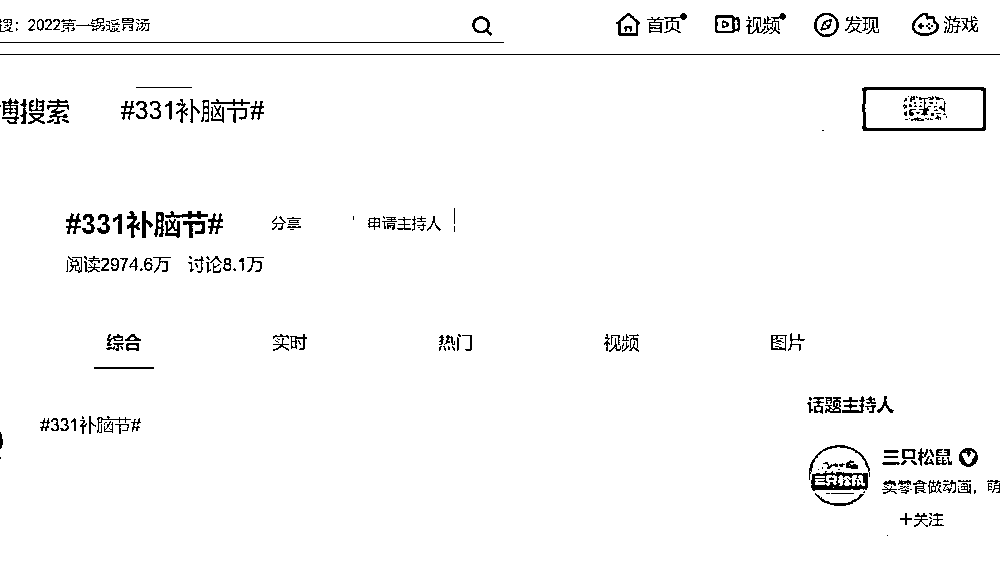

# 三只松鼠又被骂上热搜了，这次碰了红线

> 原文：[`mp.weixin.qq.com/s?__biz=MzIyMDYwMTk0Mw==&mid=2247527004&idx=2&sn=ff3c1acdea404961e0e7ad42131641d3&chksm=97cba164a0bc2872000df8abc61bf24c820ca8f2b3955618421a0a665af759c1b16acb0021a3&scene=27#wechat_redirect`](http://mp.weixin.qq.com/s?__biz=MzIyMDYwMTk0Mw==&mid=2247527004&idx=2&sn=ff3c1acdea404961e0e7ad42131641d3&chksm=97cba164a0bc2872000df8abc61bf24c820ca8f2b3955618421a0a665af759c1b16acb0021a3&scene=27#wechat_redirect)

## 

**三只松鼠广告中出现少先队员红领巾，被指涉嫌违法**

有网友指出，三只松鼠此前发布的“331 补脑节”广告图中，两名佩戴红领巾的少年画面不合规，不能把少先队的相关信息用于广告。有法院官方指出，其在商业广告中使用红领巾，已经涉嫌违法。 也有网友表示按照规定，广告必须要用规范字，规范字就是指的简化字，但文中使用了繁体字。对此，有网友留言“看来三只松鼠真的需要补一补自己的脑子了。”也有网友质疑“19 年的广告都翻出来？当时没发现吗？”2019 年 3 月，三只松鼠主持过“331 补脑节”相关话题，目前内容已无法查看。据了解，全国少工委 2005 年 11 月 28 日发布的《关于中国少年先锋队队旗、队徽和红领巾、队干部标志制作和使用的若干规定》显示：中国少年先锋队队旗、队徽和红领巾、队干部标志及其图案不得用于商标、商业广告以及商业活动。此外，2020 年，团中央办公厅、全国少工委办公室印发《中国少年先锋队红领巾、队旗、队徽、队委（队长）标志和队歌使用管理规定》再次明确：红领巾、队旗、队徽、队委（队长）标志及其图案、名义，队歌名称、歌词、曲谱等不得用于或变相用于企业名称、商标注册、商业广告以及商业、娱乐等活动，不得在私人庆吊、聚会等不适宜的场合使用。

来源：观察者网

← 向右滑动与灰产圈互动交流 →

