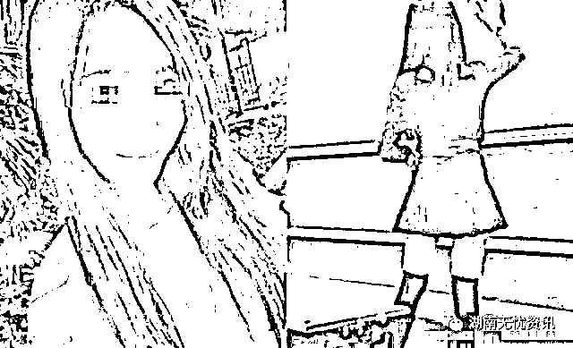
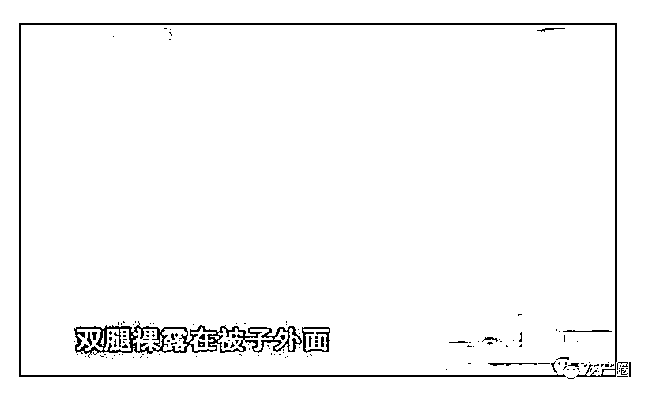
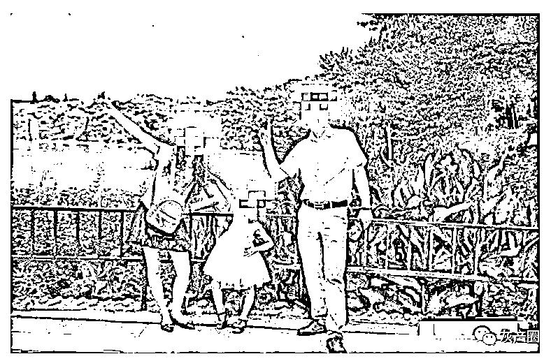
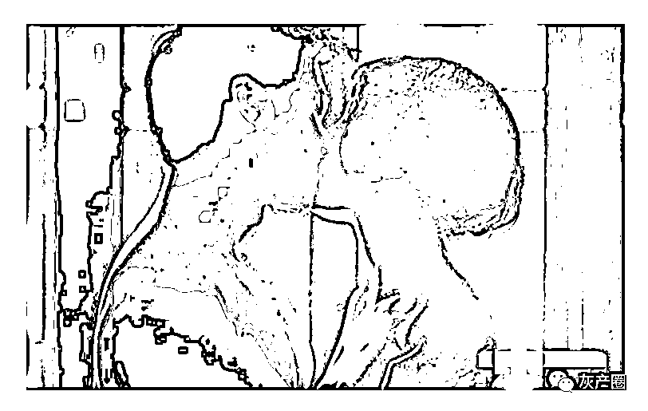
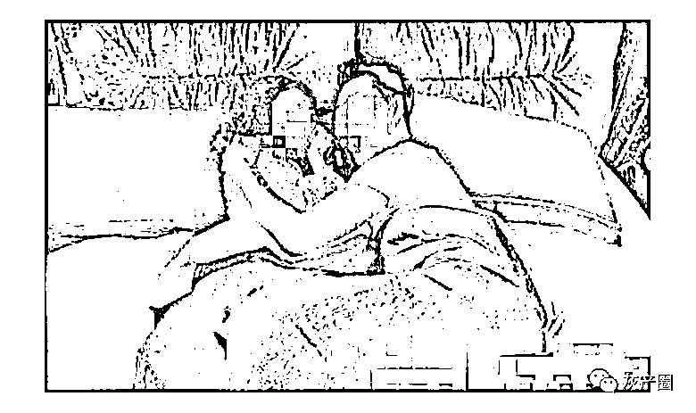
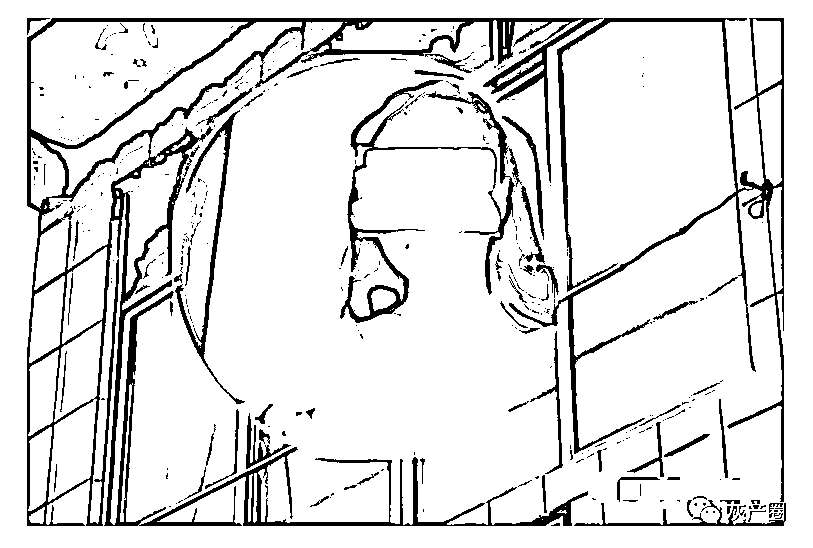
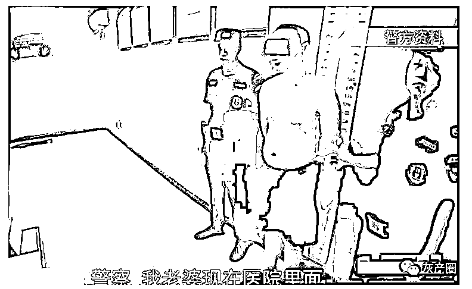
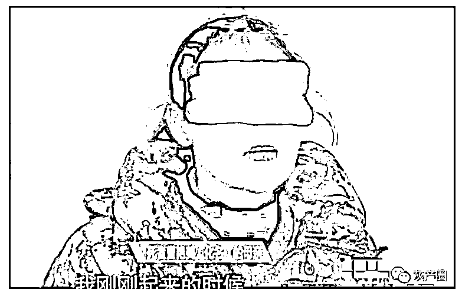
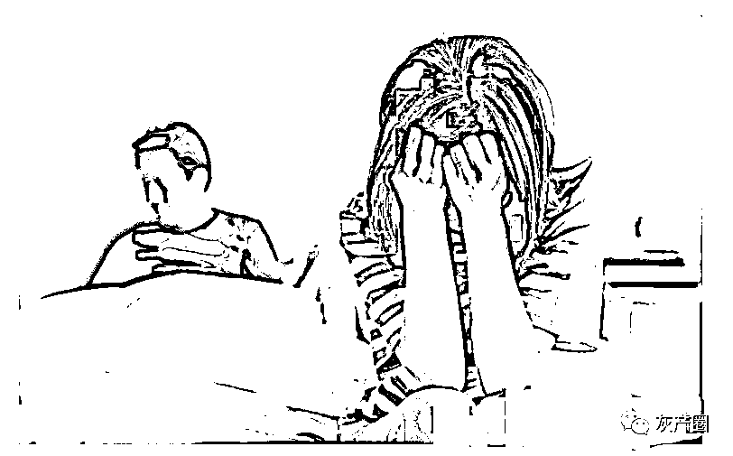
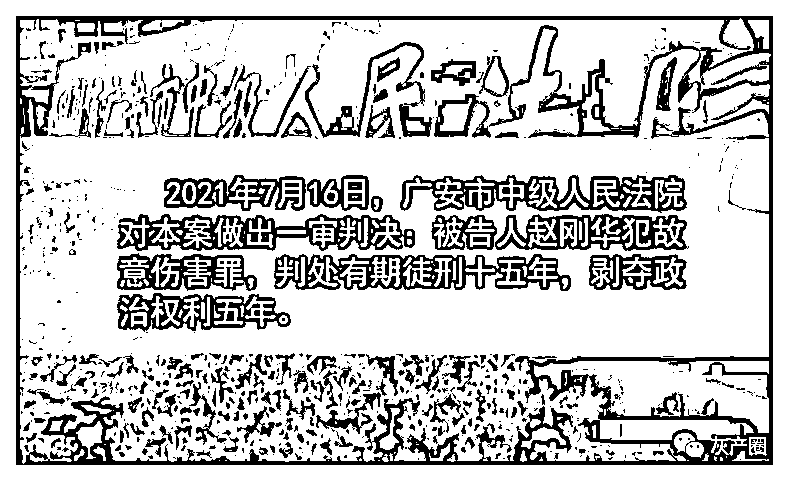

# 惊悚！90 后幼师赤身惨死家中，丈夫：关系发生到一半，被推下床

> 原文：[`mp.weixin.qq.com/s?__biz=MzIyMDYwMTk0Mw==&mid=2247527004&idx=3&sn=0623d08a08c4226cf4d89fdc354c800b&chksm=97cba164a0bc2872a166bfab58b25e59047488abfdd91556b9b00d6198285c9b7c128e5fd73c&scene=27#wechat_redirect`](http://mp.weixin.qq.com/s?__biz=MzIyMDYwMTk0Mw==&mid=2247527004&idx=3&sn=0623d08a08c4226cf4d89fdc354c800b&chksm=97cba164a0bc2872a166bfab58b25e59047488abfdd91556b9b00d6198285c9b7c128e5fd73c&scene=27#wechat_redirect)

**归根结底，出轨是这场悲剧的导火索。如果阿华当初没有出轨，或许这一场悲剧就能够避免。**

俗话说：有缘千里来相会，无缘对面不相逢。

两个人能从茫茫人海中走到一起并不容易，所以更应当珍惜这来之不易的感情。

即使最终确实发现两人在一起并不合适，也应该好聚好散，而不是采取一些过激的做法。

不然最终只能是害人害己。

**四川一 90 后幼师赤身惨死家中**

小美（化名）是四川广安某幼儿园的一名教师，是一名“90 后”。

小美外表出众，但是性格显得有些强势。首次婚姻并不是特别顺利，于是选择了离婚。

离婚后与现任老公阿华（化名）相识，最后两人彼此相恋，一同走进了婚姻的殿堂。

当小美和阿华决定结婚之后，双方好友都送上了诚挚的祝福，也希望两人能够珍惜对方，相爱一生。

结婚后，两人有了一个可爱的女儿，三口之家，其乐融融，让众人羡慕不已。

然而这种和谐却在不知不觉中被打破。

最终结局竟然是小美被发现赤身惨死家中，而凶手就是她的丈夫阿华。

**丈夫：关系发生到一半，被推下床**

阿华出生于 1990 年，大学本科学历的他，大学毕业后便加入了一家国企。

凭借着自己多年来兢兢业业地付出，阿华渐渐成长为一名技术骨干，公司也有意培养他。

阿华的优秀，在同事眼中有目共睹，渐渐地，公司里也有几位女同事对他心生好感，其中有一位女同事更是和他发展成为情人关系。

而这种地下恋情竟然维持了一年多。

不过俗话说得好：常在河边走，哪有不湿鞋。

刚开始阿华隐瞒得很好，以为小美不会发现，但最终小美还是发现了端倪。

一天下班回家，小美便质问阿华是不是出轨了。

听到小美的质问，阿华慌了，他猜测小美应该是从哪儿发现了什么蛛丝马迹，于是便向小美坦白了自己出轨的事实，并向小美认错，保证今后再也不出轨了。

为了表示诚意，阿华还将自己的银行卡主动交给了小美。这才平息了小美的怒火。

然而这件事小美却一直记在心中，始终放不下，也无法接受自己丈夫出轨的事实。

事发当晚，阿华和小美发生了关系，然而当关系发生到一半时，小美将阿华推下床，并再次提起阿华出轨的事情。

而且这一次小美主动向阿华要出轨女生的电话，想要打电话过去质问一番。

然而阿华并没有同意，于是两人便发生了激烈的争吵。

随着双方情绪逐步失控，从最开始的争吵演变成之后的肢体冲突。

失去理智的阿华左手掐住小美的脖子将其按在床头，右手拿着花露水瓶子猛敲小美头部。

当花露水瓶子敲碎之后，阿华还没有收手，又拿起床头的保温杯继续猛敲小美头部。

最终小美不幸离世，而阿华也将面临牢狱之灾。

**丈夫后悔不已，主动自首**

事发之后，阿华逐渐冷静了下来，并主动拨打了报警电话，决定自首。

当时对妻子做出的行为并非是他本意，只是那时他已经失去了控制，清醒之后，他也不知道当初为什么要那样做。

在警察局，阿华上身没穿衣服，看见警察之后，第一时间询问警察自己妻子怎么样了。

最终得知妻子离世的消息后，阿华后悔不已，忍不住哭了起来，这并非是他本意，如今这个局面也并不是他想要的结局。

事发后，阿华将女儿送到了外婆家。直到早上七点多，小美母亲开门才发现外孙女在门外等着，浑身是血。

谁也没想到，之前让人羡慕的“神仙眷侣”，最终女方离世，男方面临着牢狱之灾。

最可怜的还是两人的女儿，不知道她会如何才能淡忘这已经发生的一切，也不知道将来如何向同学解释自己的父亲母亲。

**朋友眼中的他们**

阿华的辩护律师，也是阿华的好友。据他所说，阿华性格老实本分，甚至可以说有点软弱。而小美性格比较强势。

当这两种性格在一起相处久了，就可能导致其他的一些后果，比如说出轨。

在大家眼中，阿华是一个勤奋、努力的人，单位同事评价他，谦逊和善。

大家也以为他的婚姻生活很幸福，毕竟他很听妻子的话，遇到下雨天，还会开车接送妻子上下班。

然而大家并不知道的是，这一切都是表象，而真实的情况却是阿华出轨了。

归根结底，出轨是这场悲剧的导火索，如果阿华当初没有出轨，或许这一切都能够避免。

最终，阿华因为故意伤害罪，被判处 15 年有期徒刑。

来源：上游新闻，阻击诈骗

← 向右滑动与灰产圈互动交流 →

