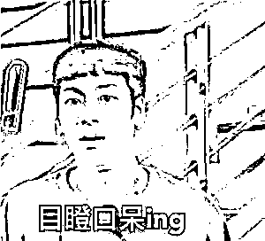
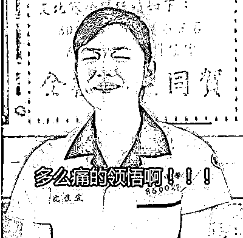

# 事发厦门！声称“介绍线下约炮”！诈骗 200 余万元！

> 原文：[`mp.weixin.qq.com/s?__biz=MzIyMDYwMTk0Mw==&mid=2247527004&idx=5&sn=83f628c74034bf931205d554f9a97121&chksm=97cba164a0bc287263104ba606ff1d98029a59cba49bfc476532aa6f569d9cf7bfc9ac5e9bf4&scene=27#wechat_redirect`](http://mp.weixin.qq.com/s?__biz=MzIyMDYwMTk0Mw==&mid=2247527004&idx=5&sn=83f628c74034bf931205d554f9a97121&chksm=97cba164a0bc287263104ba606ff1d98029a59cba49bfc476532aa6f569d9cf7bfc9ac5e9bf4&scene=27#wechat_redirect)

what？what？what？ 

**一个 App 声称“介绍线下约炮”**

**诈骗 200 余万元！**

一个直播平台诱骗人注册充值

**给“女主播”打赏、刷礼物**

**骗走 60 余万元！**

**近期，厦门集美检察院办理的数起诈骗案件都与直播平台有关。**不法分子通过直播平台，利用新兴消费娱乐模式，冒充女主播身份与他人建立暧昧关系，虚构直播任务，诱骗他人财物，构成诈骗罪。

**到底是怎么被骗的？**

****内情揭晓！！！****

****竟声称“介绍线下约炮”****

******诈骗 200 余万元！******

******犯罪嫌疑人许某等人成立网络科技公司，招募人员，**以“介绍线下约炮”为由，诱导男被害人下载“悦聊”App**，并在该 App 注册充值。******

****2020 年 10 月至 2021 年 2 月，犯罪嫌疑人许某及其同伙通过各种性暗示，诱骗被害人在“悦聊”上刷礼物打赏，最终骗取其财物。目前，该案已进入审查起诉阶段，**犯罪嫌疑人多达 31 人，涉案金额 200 余万元**。****

********

******男性助理冒充女主播******

********骗走 60 余万元！********

******另一起案件中，犯罪嫌疑人葛某和牛某以文化传媒公司名义，**招聘男性助理冒充女主播，通过探探、瞧瞧等社交软件添加男性网友**，保持暧昧关系，诱导被害人前往指定直播平台注册充值，虚构平台 PK、直播转正等任务，最终**诱骗被害人在直播间为主播打赏、刷礼物**。******

****经查，2019 年 1 月至 2020 年 3 月，**犯罪嫌疑人葛某等 8 人共诈骗 5 名被害人 60 余万元**。目前，该案已被集美区人民检察院提起公诉。****

********

****检察官提醒：****

****检察官说，直播娱乐作为消费新形式，受到广大群众喜爱，但是也被一些不法分子视为骗财机会。不法分子抓住男性喜欢观看美女主播的心理，通过添加好友，建立暧昧关系，诱骗其至直播间“刷礼物”，以达到骗取钱财的目的。****

****检察官提醒，当前诈骗形式层出不穷，但究其本质还是以非法占有为目的，骗取他人财物。**只有在日常娱乐消费中，严守个人财物出口，树立正确的交友观和价值观，警惕陌生人添加好友，才能保护个人的合法权益不受侵害。******

******网络交友诈骗******

******这些“套路”你知道几个？******

******网络交友诈骗******

******都有哪些套路和形式？******

******针对不同的套路，******

******又该怎样识别和防范？******

 ******[`mp.weixin.qq.com/mp/readtemplate?t=pages/video_player_tmpl&action=mpvideo&auto=0&vid=wxv_1823462863517057027`](https://mp.weixin.qq.com/mp/readtemplate?t=pages/video_player_tmpl&action=mpvideo&auto=0&vid=wxv_1823462863517057027)****** 

******来源：海峡导报******

************

******← 向右滑动与灰产圈互动交流 →******

************

 ******# 

> 原文：[`mp.weixin.qq.com/s?__biz=MzIyMDYwMTk0Mw==&mid=2247527059&idx=1&sn=7c9e3cbb0a5be5961e345e9975a1be07&chksm=97cba1aba0bc28bdcaaf5c22612064351bbab7adca9ab8f8c4315959afde3aa908e8e474c663&scene=27#wechat_redirect`](http://mp.weixin.qq.com/s?__biz=MzIyMDYwMTk0Mw==&mid=2247527059&idx=1&sn=7c9e3cbb0a5be5961e345e9975a1be07&chksm=97cba1aba0bc28bdcaaf5c22612064351bbab7adca9ab8f8c4315959afde3aa908e8e474c663&scene=27#wechat_redirect)******