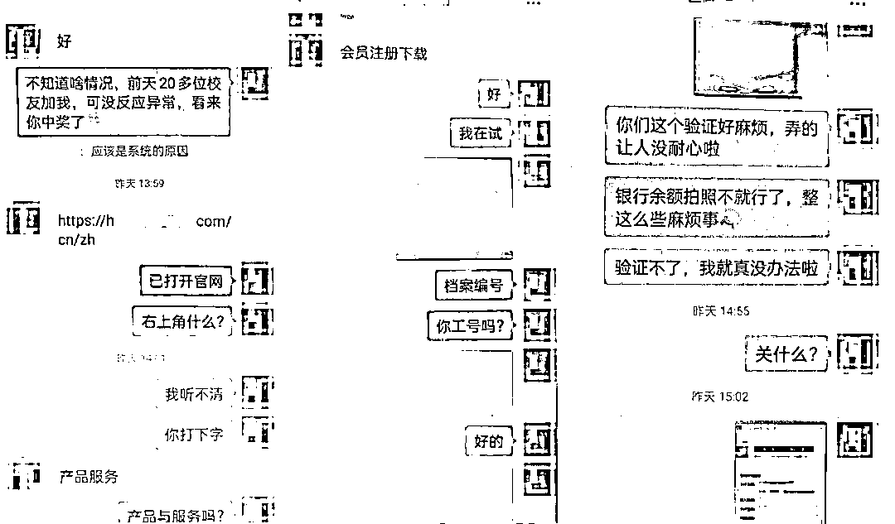
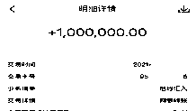

# 一女子帮了这个忙，竟然成了帮凶！

> 原文：[`mp.weixin.qq.com/s?__biz=MzIyMDYwMTk0Mw==&mid=2247527059&idx=5&sn=3021dee2740b0220c387e8b79f9e290c&chksm=97cba1aba0bc28bde88e833d31aa40ed370f5fe49bb6d91842cb7d4786d3a08a2d6b7a65baef&scene=27#wechat_redirect`](http://mp.weixin.qq.com/s?__biz=MzIyMDYwMTk0Mw==&mid=2247527059&idx=5&sn=3021dee2740b0220c387e8b79f9e290c&chksm=97cba1aba0bc28bde88e833d31aa40ed370f5fe49bb6d91842cb7d4786d3a08a2d6b7a65baef&scene=27#wechat_redirect)

单身的你在网络上

认识了一位相谈甚欢的对象

Ta 对你嘘寒问暖、关怀备至

那一刻

像极了爱情

……

先别陶醉

**你很有可能落入圈套了！**

最近

深圳俩女子同时爱上一个“男友”

结果一个被骗

另一个成为了“帮凶”

10 月下旬

杨女士通过交友平台认识了男子陈某

两人聊得很好

很快就确认了交往关系

一天

陈某表示自己需要完成公司“业绩”

*想让杨女士帮个忙*

出于对“男友”的信任

杨女士便在对方提供的

链接里按照指引操作

突然

*杨女士发现自己卡里的*

*100 万元人民币被转走*

她一下子就慌了

报案后

民警着手展开调查

根据杨女士提供的信息

民警发现杨女士的 100 万元

被转到另一账户

且已有 20 万元被转出

在各部门的协助下

最终成功冻结该账户

与此同时

被转入 100 万元的

银行账户户主吴女士

也向当地警方报警了

原来

吴女士也正与陈某网恋中

陈某同样以冲业绩为由

让吴女士提供银行卡号

*当她收到 100 万元后*

*便按照陈某的要求*

*转了 20 万元到指定的账户*

*接着陈某让吴女士继续转账 10 万元*

*这时页面弹出了风险提醒*

吴女士无法再继续转账

当吴女士冷静下来后

觉得事有蹊跷

立即报警求助

目前，案件正在进一步侦办中

接近年底

大家找对象回家过年的心

又变得更迫切了

但可千万别被爱情冲昏了头脑

毕竟网恋被骗已不是第一次发生

**1**

**家住深圳龙华的黄女士在网上认识了阳光帅气的“男朋友”，以为自己这次终于遇到了真爱。**

**虽然还没见面，但黄女士还是在这位“男朋友”的不断劝说下，开通了一个虚拟币投资平台账号。**

**短短时间内，陆续将自己一百多万元积蓄全部充进账户。**

**但“男朋友”消失得无影无踪，黄女士在平台上投资的资金也无法提现。**

****2****

****2021 年 2 月，郭先生在网上认识了一“女子”，两人很快“熟悉”和“信任”，确立了网恋关系。****

****交往一个月后，“女友”以“画廊开业、卖画、生日、生病住院”等理由向郭先生索要微信红包，为了表示自己的爱意，郭先生一一满足了“女友”的要求，先后给对方转账 2.9 万元。****

****直到有一天，“女友”消失了，怎么也联系不上，郭先生才意识到自己可能被骗。****

****报案后，民警通过郭先生提供的线索调查摸排，发现郭先生口中的“女友”并不存在，而是一已婚男子伪装的虚拟身份。**** 

******其实******

******诈骗分子的套路******

******不外乎以下这些******

****通过社交软件、自媒体软件、婚恋网站、交友网站等物色目标。****

******0****1******

******与受害人加为好友后，建立感情交流，对受害人进行无微不至的关怀，取得受害人的信任。******

********0****2********

********熟悉之后，以“自己生病、家人生病、过节礼物、生活费、见面车费、投资赚钱”等为理由，向受害者借钱。********

**********0****3**********

************谨防落入“爱情陷阱”************

************请记住以下几点************

************01 树立正确的婚恋观************

**********网络世界是虚拟的，很难甄别对方是不是真的“白富美”“高富帅”，网络交友要认真核实对方身份，谨防被骗。**********

************02 不要幻想“一夜暴富”************

**********不贪图高额回报，看好自己的钱包，涉及金钱往来时一定要提高警惕。**********

************03 注意保护好自身隐私************

**********不轻易点击不明链接，不轻易向他人透露个人信息。**********

************04 如若被骗及时报警************

**********坚决做到“不轻信、不透露、不转账”，一旦发现被骗不要慌乱，要及时报警。**********

**********来源：深圳公安，阻击诈骗**********

********************

**********← 向右滑动与灰产圈互动交流 →**********

********************