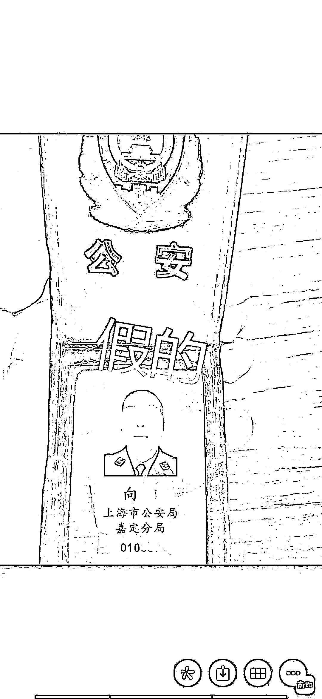

# 警惕！94 万巨款差点被骗走，只因一个电话

> 原文：[`mp.weixin.qq.com/s?__biz=MzIyMDYwMTk0Mw==&mid=2247527059&idx=6&sn=d077b526d3b58fb9fecf8f5d9714d60e&chksm=97cba1aba0bc28bd76a94927efa82dae70621984348781dc1fc02d7265cb07b5a855f95a76d9&scene=27#wechat_redirect`](http://mp.weixin.qq.com/s?__biz=MzIyMDYwMTk0Mw==&mid=2247527059&idx=6&sn=d077b526d3b58fb9fecf8f5d9714d60e&chksm=97cba1aba0bc28bd76a94927efa82dae70621984348781dc1fc02d7265cb07b5a855f95a76d9&scene=27#wechat_redirect)

近日，广东佛山一女子接到诈骗电话称其涉嫌一起洗钱案件，为了证明清白，该女子到其居住小区附近一钓虾场准备给骗子转账，还好民警及时制止，为其挽回了 94 万元的损失。

**为证清白，她带着 94 万巨款躲了起来**

据了解，12 月 23 日下午 3 时许，家住佛山市南海辖区松岗某小区的**李女士**（化名）外出时突然接到一通陌生来电，对方自称是湛江市公安局的民警，能够准确说出李女士的身份信息，并表示李女士名下某开户于上海的工商银行卡内存有大量违法犯罪所得，其行为已涉嫌洗钱，要求李女士配合调查。

挂断电话后，就在李女士一头雾水之时，她又接到了“上海市公安局”的电话，对方在表明身份后，见李女士半信半疑，便主动添加李女士微信进一步沟通。

很快，李女士便接到“向警官”的微信视频。视频中，“向警官”身着警服，端坐在带有公安标识的办公室，身旁其他“民警”工作繁忙，不断穿行奔走。

聊天开始后，“向警官”先是向李女士出示警官证以示身份，后又向她发送案件“协查通知”。在成功骗取李女士信任后，“向警官”要求李女士下载“XX 会议”软件，还要求她开通获取识别 IP 等权限。

为了进一步“办理案件”，“向警官”在视频通话中声色俱厉，要求李女士立即前往上海市公安局配合调查，否则将会遭受牢狱之灾；如不便前来，则需通过网络办案来“自证清白”。

随后，李女士添加了另外一名“警官”微信配合网络办案。对方要求李女士全程保密，不得向任何人透露此事，并将全部资金转移至自己名下的单一账户中，方便后续实施冻结，而后找到一处无人的地方等候下一步指令。

害怕遭受牢狱之灾的李女士，最终丧失判断落入了骗子的陷阱。她匆匆回到家中，给家人留下纸条后，便拿上自己的银行卡赶去银行，将全部资金 94 万元转入自己的建设银行账户中，然后又躲到小区附近一钓虾场等待“警方”指示。为扰乱李女士思维，对方还自列提纲，勒令李女士书写“自白书”。

**关键时刻，民警寻回女子保住钱财**

“我嫂子应该是被骗了，现在电话打不通，人也找不到，请你们帮帮我！”

当天下午 5 时许，李女士的小叔史先生回到家中，见到她留下的纸条和家中不见的银行卡，猜测李女士遭遇了诈骗，便立即到松岗派出所报案求助。了解情况后，民警立即致电李女士。谁知电话却被骗子拦截，并谎称其是在三水某处拾到该手机的路人。随后，李女士的电话便再无法接通了。

就当民警在三水、松岗等处四处寻找李女士之际，李女士却再次收到“上海警方”的指令，对方以冻结资金为由，要求李女士提供银行密码。这一次，因款项巨大，李女士纠结之中将自己的位置信息发给了多次联系自己的史先生，后又马上撤回。

一直与民警在一起的史先生，收到信息后立即告诉了民警。很快，民警赶到李女士躲避处，火速制止了她的行为。令人后怕的是，骗子也发现了李女士发出的定位信息，正指引其转移躲避地点，幸亏民警及时赶到，94 万的存款才得以保全。

事后，李女士在民警的带领下，前往银行冻结了涉事账户，经过这次经历，她深深地接受了一次反诈骗教育。

 警方提醒：

**公安机关**

**不会通过网上办案的方式**

**要求任何人提供银行账户及密码！**

**更不会要求**

**任何人转移资金到安全账户！**

来源：南方都市报，利箭在行动

← 向右滑动与灰产圈互动交流 →

