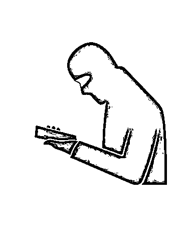
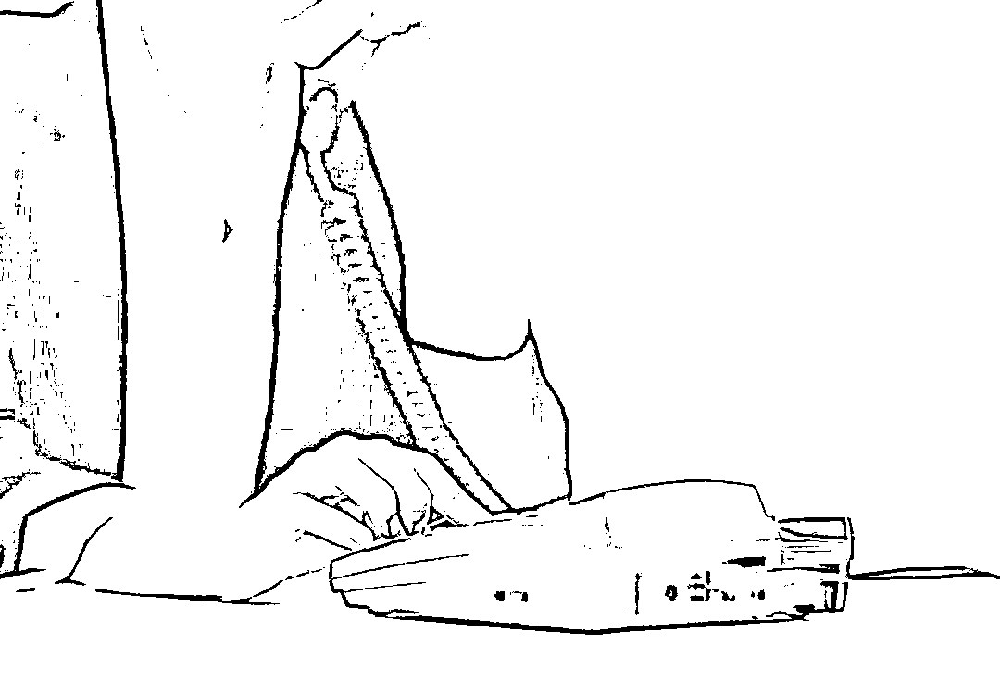

# 湖南女主持人接诈骗电话秒变知心姐姐，骗子把心里话都说了

> 原文：[`mp.weixin.qq.com/s?__biz=MzIyMDYwMTk0Mw==&mid=2247527059&idx=7&sn=85a6c85fc6f967dc6d0a9a7b1450bfda&chksm=97cba1aba0bc28bd2905c2e021ebafb473c3fbb0c48d681ee48c88de094a25ebe45279588bfc&scene=27#wechat_redirect`](http://mp.weixin.qq.com/s?__biz=MzIyMDYwMTk0Mw==&mid=2247527059&idx=7&sn=85a6c85fc6f967dc6d0a9a7b1450bfda&chksm=97cba1aba0bc28bd2905c2e021ebafb473c3fbb0c48d681ee48c88de094a25ebe45279588bfc&scene=27#wechat_redirect)

你接到过诈骗电话吗？面对电话那头的诈骗分子，你会与对方斗智斗勇吗？除了愤怒，你还会怎样看待这些骗子？近日，湖南郴州的黄女士在接到诈骗电话后，让这通电话秒变知心姐姐“热线”：她在电话中劝骗子“快回国”，称“能劝回来一个是一个”。

身为一名电台主持人的黄女士，其实也是一名警察家属，她所掌握的反诈知识，很大一部分都来源于她在公安系统工作的哥哥。在这通 2 分钟的电话里，骗子没有像往常一样表现出气急败坏，而是对电话这头的知心姐姐吐露出心声：“我早就想回国了，没办法啊。”

**图源视觉中国，图文无关。** 

**碰到“知心姐姐”，诈骗分子说出心里话：早就想回来**

 2021 年 12 月 28 日下午，郴州临武县的黄女士接到了一个诈骗电话。一名男性诈骗分子在电话中开口就称自己是郴州市公安局户籍科民警，并多次强调让黄女士带上身份证和户口本来公安局。

黄女士在广东清远工作，是一名电台主持人。刚开始看到这个被标注为“诈骗”的号码时，她本来是不想接的，但犹豫思考了一下，她还是接听了电话。于是，在骗子说完开场白后，黄女士直接问对方：“你还不回来吗？还不回国吗？”

电话那头沉默了几秒，就连骗子也没料到会碰到这种情况。

随后，骗子说道：“回不了啊，都试过了，是骗人的。”黄女士没有放弃，依然在劝对方：“你可以回来呀！我看很多政策都对你们挺优待的，不要在外面啦，你们在那里也挺危险的呀！”黄女士还说，来电号码一看就是诈骗电话，“国家现在都有反诈 App，诈骗电话打来，手机一下就能识别。”

黄女士还说：“我一开始本来不想接你电话的，但是我想了一下，觉得能劝回来一个是一个，你要相信国家的政策，不管怎么样，回来总比在外面好吧，至少人身安全可以得到保障，就算以后有什么样的惩罚也好，等你出来后又可以重新开始了，活在阳光下也挺好的呀，回来吧！”

或许是被电话那头的知心姐姐感化，骗子说出了自己的心里话：“每天都担惊受怕的，但是没有办法，哪有你们想的那么简单？我早就想回来呢！”他婉拒了黄女士帮其报警的需求，随后挂断了电话。

**图源视觉中国，图文无关。**

**知心姐姐也是警察家属，平时有反诈知识储备**

 为什么面对诈骗电话，黄女士显得如此敏感？原来，她还有一个身份——警察家属，他的表哥骆警官在郴州临武县公安局从事反诈宣传工作。因为工作原因，骆警官经常为表妹“灌输”反诈知识，“这可能是她对诈骗电话如此敏感的原因之一吧。”骆警官说。

骆警官介绍，他表妹此前也接到过相应的诈骗电话，“除了这次的冒充公检法类诈骗，之前她还接到过冒充领导和客服的诈骗电话，所幸都没有上当受骗。”除此之外，骆警官还会为表妹说一些相关政策，比如“现在还是有一些中国居民滞留在境外，公安机关一直在敦促他们尽快主动回国，争取宽大处理”。

除此之外，骆警官还会为表妹“以案说法”。“之前劝回来一些滞留在境外的人，他们都说在那边报警几乎没什么用，最好的方法就是不要轻信境外的高薪工作。”因此，现在的黄女士不仅能及时分辨哪些是诈骗电话，还了解了相应的政策，所以才会在电话中全力劝那名骗子回国，而她脱口而出的“能劝回来一个是一个”，则体现出发自内心的善良。

警方建议广大市民，及时在手机安装“国家反诈中心”App 并打开来电预警功能，从而及时识别诈骗电话，守住“钱袋子”；同时，也建议市民在空闲之余多关注一些公安类公众号，多看一些反诈的宣传案例，了解反诈知识，在电信网络诈骗向自己袭来时，做到心中有数。

来源:潇湘晨报

← 向右滑动与灰产圈互动交流 →

