# 42 岁罗志祥复出首秀，台上高呼“我回来了”！新年第一天正式洗白？

> 原文：[`mp.weixin.qq.com/s?__biz=MzIyMDYwMTk0Mw==&mid=2247527108&idx=1&sn=270793e4714527ad2f763c4af0bed05f&chksm=97cba1fca0bc28eabe82601c1576fb7f2f1b0764ab0324f0a707754d82ff216d72befad4774f&scene=27#wechat_redirect`](http://mp.weixin.qq.com/s?__biz=MzIyMDYwMTk0Mw==&mid=2247527108&idx=1&sn=270793e4714527ad2f763c4af0bed05f&chksm=97cba1fca0bc28eabe82601c1576fb7f2f1b0764ab0324f0a707754d82ff216d72befad4774f&scene=27#wechat_redirect)

随着 2022 年的到来，到处都充斥着浓烈的节日气息。在新年到来之际，一共有七台「跨年晚会」同时进行，然而最具争议的还要属「花莲跨年晚会」莫属。

自打被前女友周扬青爆料私生活混乱后，罗志祥的演艺生涯遭受重创，**但在 2022 年元旦期间，他在台湾地区的花莲跨年演唱会进行了表演，宣告复出。**

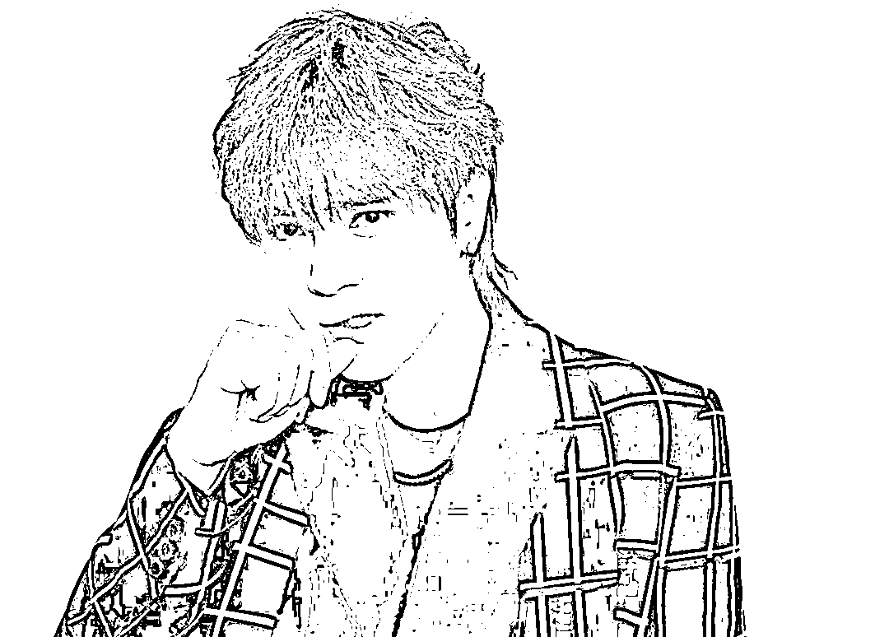

**这次复出宣布时，当时也遭到了很多学生家长的反对，但最终罗志祥还是登上跨年舞台一口气唱了六首歌，还戴着墨镜，穿着时尚劲装在舞台上高呼：“我回来了！”**

在演出结束后罗志祥本人心情极佳，第一时间在个人 Instagram 发动态表示：心情非常忐忑，不知道大家会如何看待他，但当看见台下有人落泪时非常激动......

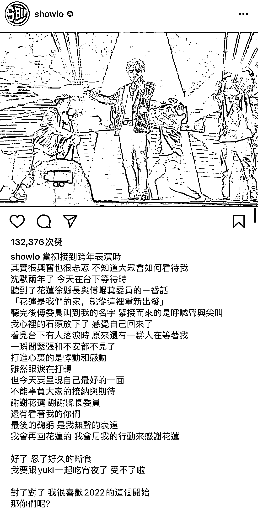

场下他还在个人社交平台发文透露，自己早就开始减肥，一个月就瘦了近 10 公斤，几乎把这次跨年舞台当成是个人演唱会在准备，相当重视这场复出舞台。

他还晒出自己吃面的照片，称“我心里的石头放下了，感觉自己回来了。”大概是开始补偿自己此前的“断食”。

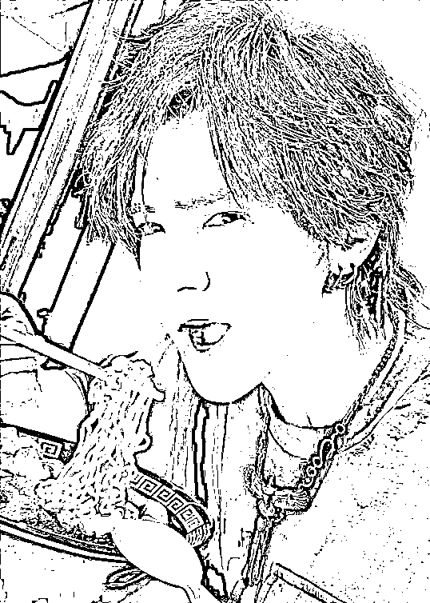

**据了解， 2022 年花莲跨年晚会之所以邀请罗志祥并放在 C 位压轴出场，是官方希望给他重新复出的机会，因此花莲当地议员还大吵了一架......**

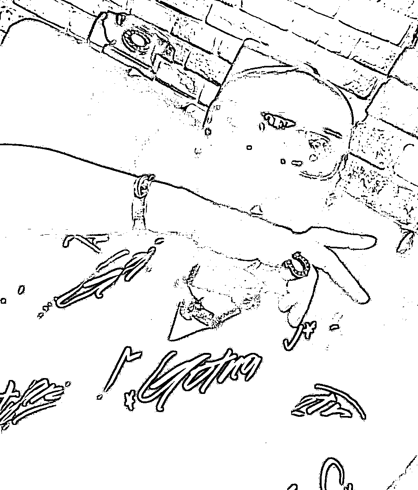

然而群众的眼睛是雪亮的，**据台媒报道许多家长纷纷投诉官方对于此次演唱会的安排，对于罗志祥之前的负面行为表示担忧，怕会影响青少年的价值观。**

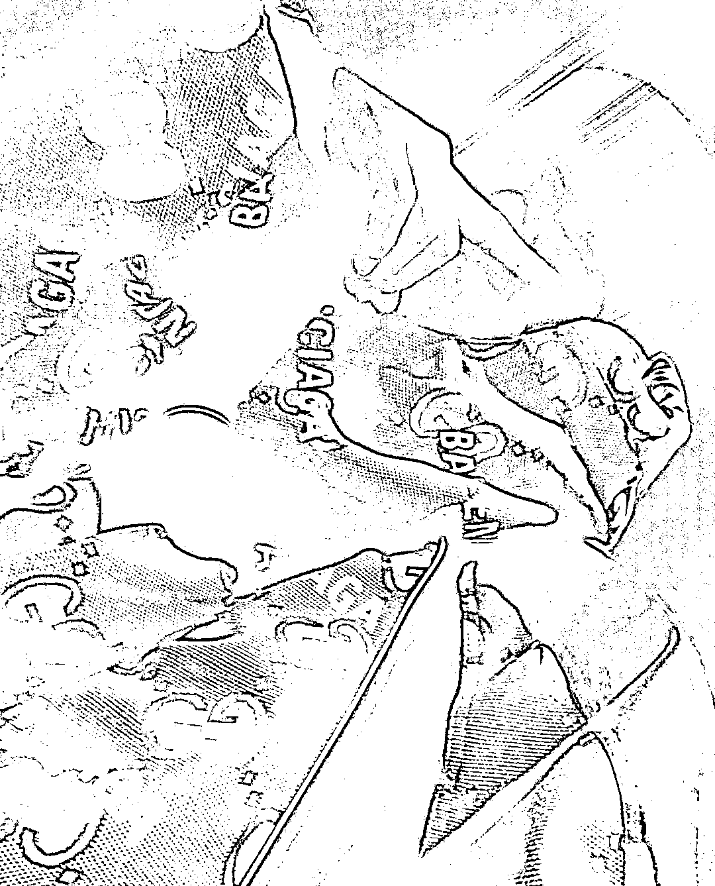

但并不是所有人都能像他一样心情放松，被卷入罗志祥丑闻时间的“蝴蝶姐姐”简恺乐就被曝出复出无望，只能吃老本了。

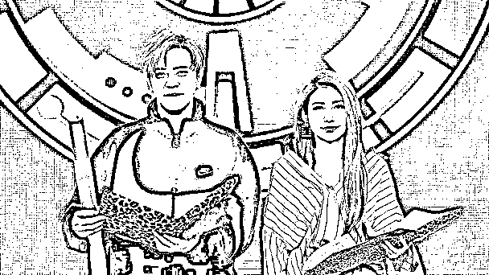

此前有消息称简恺乐已经销声匿迹退出娱乐圈，嫁给了一位医生已经结婚了。

但近日曾经与她交往过 6 年的一位嘻哈歌手出来爆料，透露简恺乐“只想平平安安这样过了，不想被打扰，也不想回娱乐圈”。他认为简恺乐太过在意外界的眼光，或许平静生活才是最好的安排。

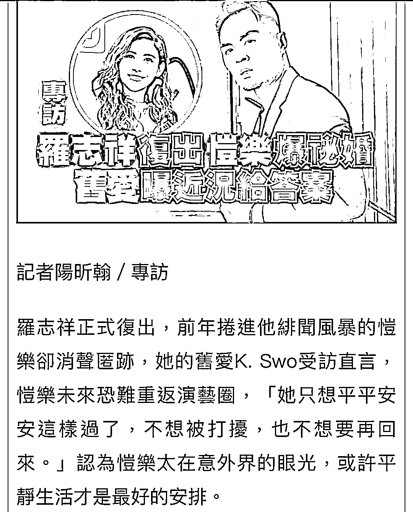

**这位前男友还说，简恺乐告诉他现在过得很好。他说，简恺乐之前做过投资，储蓄了一些老本，所以生活还算过得去。**

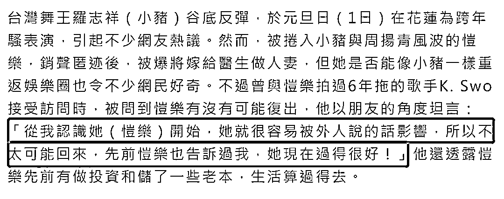

但是网传简恺乐已经嫁给医生的传闻，这位前男友却是否认了，他说给简恺乐传讯问过这个话题，但简恺乐无奈回应说：“怎么可能”。所以说她已婚的消息为不实报道。

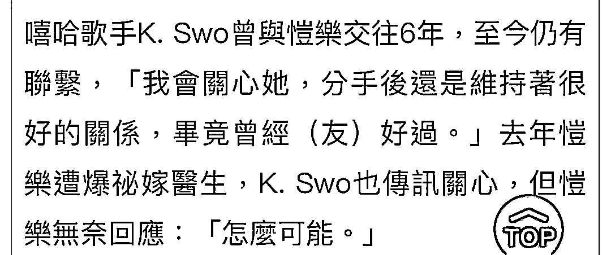

之前也有爆料称简恺乐现在不想复出，主动推掉了一些工作。

简恺乐曾经也是台湾知名的主持人，更是罗志祥旗下的女艺人，两人曾经在《娱乐百分百》中搭档主持过。

简恺乐还主持过儿童节目，叫做“蝴蝶姐姐”，因为形象甜美被观众喜爱。

但周扬青手撕罗志祥时也顺便曝出他劈腿了“蝴蝶姐姐”，还霸气点名，让简恺乐去医院查查是否有隐疾，简直是明说了。

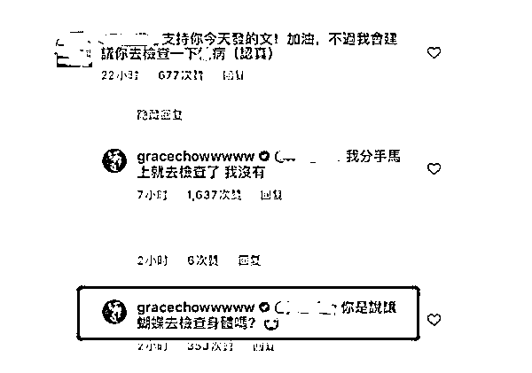

网友也扒出简恺乐和罗志祥的确存在很多绯闻，例如女方透露每年都会收到男方送的一个包包做生日礼物；2011 年简恺乐爸爸还曾在节目里公开问罗志祥，“什么时候下聘？”

**2017 年，简恺乐受访时还嘴滑把罗志祥直接说成为“男朋友”；此外更多次被拍到同行旅游或回家，态度暧昧。**

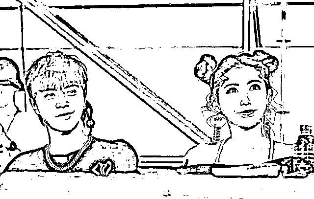

之后扛不住压力的简恺乐终于在社交平台发文向周扬青道歉，无疑是承认了自己“小三”的事实，此后她也和罗志祥做了切割，退出娱乐圈。

不过现在罗志祥都成功复出了，但蝴蝶姐姐却复出无望，所以也有网友替她感觉不公平。

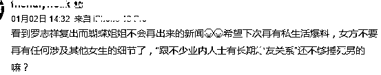

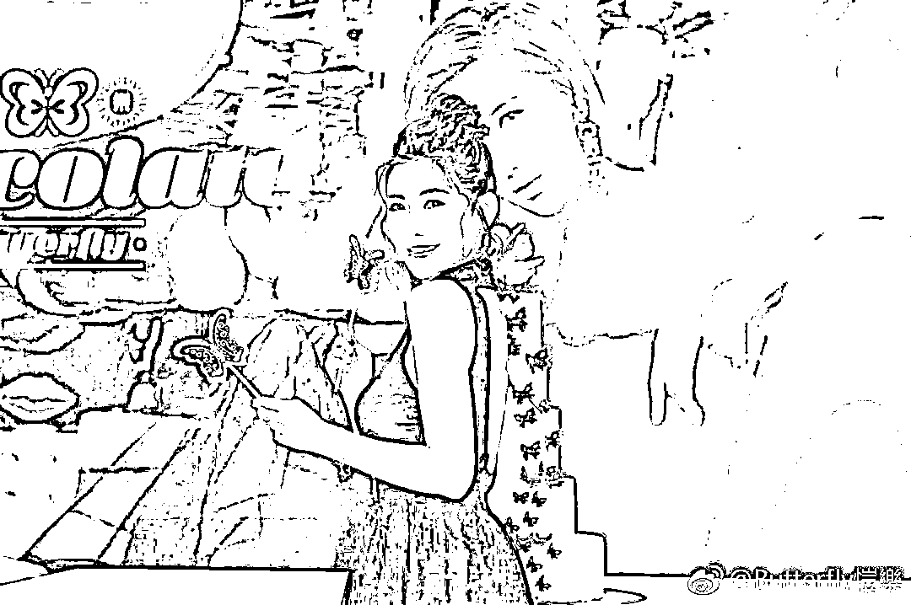

不过即使“蝴蝶姐姐”能够复出，罗志祥也不见得会再扶持她，没有好的资源，简恺乐在娱乐圈也不会有什么发展，所以还不如就这样平静过生活算了。

但娱乐圈有个不成文规定，只要不是违法乱纪损害大众利益，因为个人私生活的事情人设崩塌的艺人，要不了多久都会有可能会复出。

比如 2014 年的文章、2016 年的陈赫、2021 年的宋冬野等等……

当王力宏的粉丝还在心疼偶像事业中断，没办法出现在舞台上时，罗志祥已经悄悄复出了。

不知大家能否接受这位时间管理达人“卷土重来”呢？

来源：昌南大队长综合萌神木木、IMAX 潮流志、网络等，图源网络

← 向右滑动与灰产圈互动交流 →

