# “土狗变水狗”？900 亿玻尿酸大王华熙生物被怼侮辱女性！

> 原文：[`mp.weixin.qq.com/s?__biz=MzIyMDYwMTk0Mw==&mid=2247527108&idx=3&sn=6d69dd7255fc819ad624e2a34f085844&chksm=97cba1fca0bc28eaec1fefb99414fe1528d08d6a791d68237804b1eb62c4815f43f8c739003c&scene=27#wechat_redirect`](http://mp.weixin.qq.com/s?__biz=MzIyMDYwMTk0Mw==&mid=2247527108&idx=3&sn=6d69dd7255fc819ad624e2a34f085844&chksm=97cba1fca0bc28eaec1fefb99414fe1528d08d6a791d68237804b1eb62c4815f43f8c739003c&scene=27#wechat_redirect)

近日，又有上市公司请网红代言翻车了。

10 月 17 日上午，900 亿市值 A 股上市公司、玻尿酸龙头——华熙生物旗下品牌润百颜道歉话题冲上微博热搜。

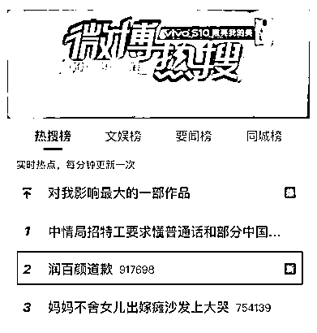

**请网红推广称能让土狗变“水狗”** **被怼不尊重女性**

10 月 15 日，润百颜发布一条微博，文案表示，小颜带着 8 盒能让土狗变“水狗”的某精华突然出现，并将在转评赞的评论里抽奖。 

同时，该条微博还转发了网红带带大师兄的微博，在这名网红发布的微博里，带带大师兄探访了润百颜公司的透明质酸博物馆，并制作了一条近 15 分钟的视频。

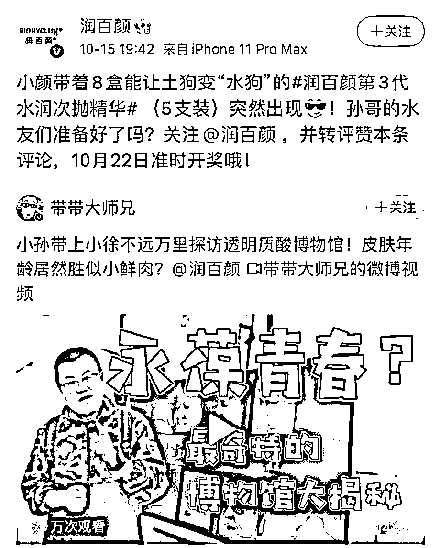

没想到微博发出后，引来了大量网友的差评。

有网友表示，马上就要开启双十一第一波预售了，不知道这种广告词是怎么通过的。

另有网友发出质疑，什么叫“土狗变水狗”？买了你家东西就不是人了？

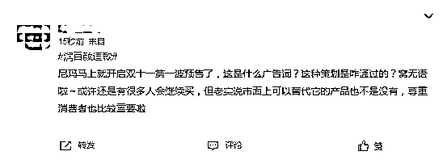

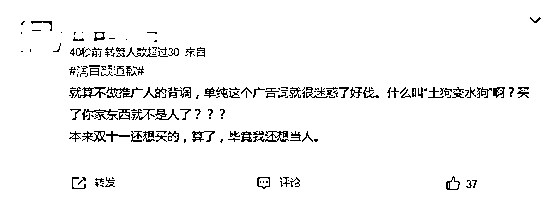

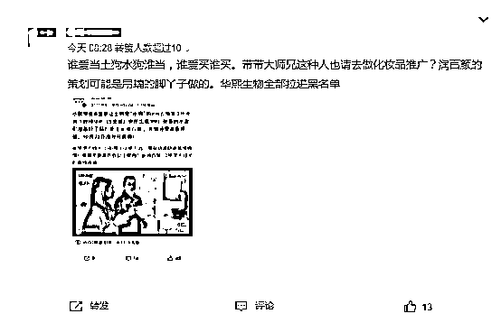

除了令消费者不适的广告词，最让广大网友反感的，还是润百颜请的推广人带带大师兄，疑似曾在网络发布厌女辱女言论。

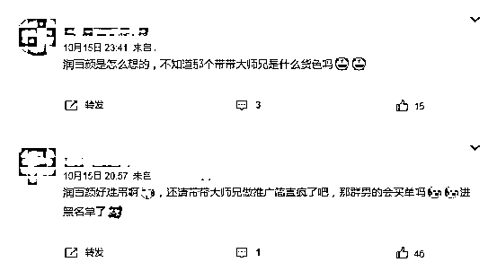

据了解，带带大师兄简介为知名游戏博主，目前新浪微博有 391.7 万粉丝。其在微博发布的内容大多与游戏相关。但据部分网友整理，该网红和粉丝疑似极端厌女，发明了一些辱女词汇。且粉丝也曾多次在微博评论下发布疑似仇女的不当言论。

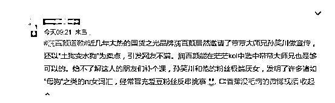

据网友反映，带带大师兄粉丝还曾疑似发布侮辱女航天员言论，目前这些言论疑似已被删除，均已无法找到。

甚至有网友发现了更多涉嫌违法行为，如粉丝偷拍女性，制成动图在微博评论区传播，还会交换前女友的私密照片等等。

在诸多几乎实锤的黑料下，网友纷纷对润百颜的这次推广表示了抗议。

有网友表示，润百颜非得找侮辱女性的某位恶臭男 up 主来代言，文案还带上某种动物，是要提醒大家这位 up 主是怎么侮辱女性的吗？找女性代言人有那么难吗？尊重女性有那么难吗？

也有网友直接表示，华熙生物是觉得钱赚够了，不需要双十一的噱头，也不需要女性消费者了。

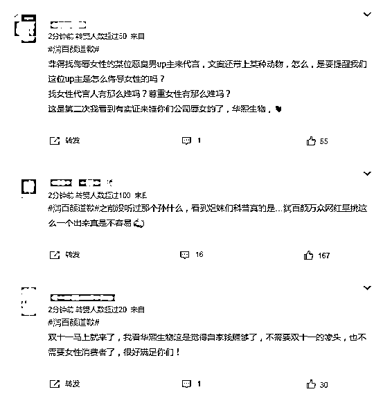

**冲上热搜第二，润百颜道歉****网友不买账** 

10 月 16 日，润百颜在官方微博发布了道歉声明，全文如下：

针对昨天（15 日）某位博主发布的视频带给大家的情感伤害，是我们工作不严谨导致的，我们怀着愧疚向大家郑重道歉！

润百颜第一时间要求博主删除了视频，也同步暂停其他微博达人的商务合作。我们也对内部责任部门做了严厉批评和处罚，今后要强化营销合作监管流程。

润百颜珍视每一位消费者的感受，真诚地感谢大家的及时提醒、批评与指正。再次诚挚致歉！

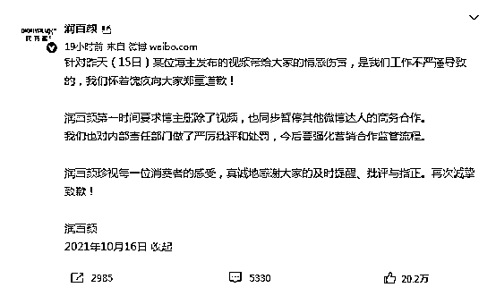

10 月 17 日上午，“润百颜道歉”话题冲上热搜第二位。

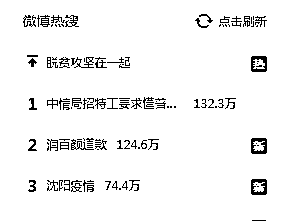

但对于润百颜的道歉，网友似乎并不买账，并质疑公司的这次推广是故意的，道歉也不真诚。

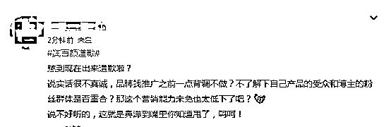

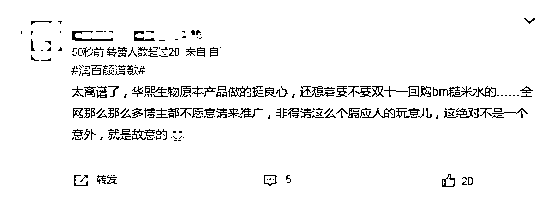

有网友认为，公司想着扩大市场占有率，拓展男性市场，却不尊重已有的消费群体。道歉也毫无诚意，赚了那么多钱，格局和眼界离国际品牌差太多，甚至不如带货主播的品牌设定。

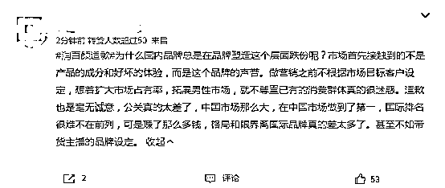

有网友直言，不接受道歉，工作人员在寻找推广人的时候不会做功课吗，就是故意的没什么可洗的，舆论太大才出来道歉根本没用。

另有网友表示，从开始接触到拍摄再到最后审核成品投放，这么多环节没有人提出过异议？一句不严谨就轻飘飘带过了？身为一个女性品牌请了这么一个以辱女闻名于互联网世界的人来做推广，这是对所有消费者的侮辱。

　　把“土狗变水狗”这种博“出圈”的话术，被品牌方转发，显然是各个环节的监管不严格导致。品牌口碑是一个不断积累的过程，而这不仅仅依靠产品质量，谨慎选择代言“网红”既是对消费者负责也是对产品本身负责，失去消费者的支持，一个简单的道歉恐怕“于事无补”。

**对此你怎么看？**

       来源：江西共青团，捉销师

← 向右滑动与灰产圈互动交流 →

